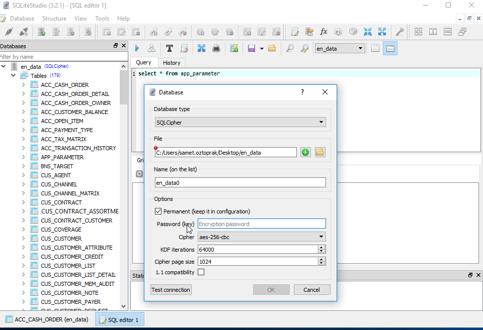

# SQLcipher Guide

SQLCipher is based on SQLite, and thus, the majority of the accessible API is identical to the C/C++ interface for SQLite 3. However, SQLCipher does add a number of security specific extensions in the form of PRAGMAs, SQL Functions and C Functions.
<!--more-->

## Building SQLCipher from Source

1. Clone the SQLCipher repository by running the following command:

   ````shell
   $ git clone https://github.com/sqlcipher/sqlcipher.git
   ````

2. Navigate to the cloned repository:

   ````shell
   $ cd sqlcipher
   ````

3. Configure the build with the following command:

   ````shell
   $ ./configure --enable-tempstore=yes CFLAGS="-DSQLITE_HAS_CODEC -DSQLITE_TEMP_STORE=2" LDFLAGS="-lcrypto"
   ````

4. Build SQLCipher by running the make command:

   ````shell
   $ make
   ````

5. Optional: If you want to perform a system-wide installation of SQLCipher, run the following command:

   ````shell
   $ make install
   ````

Take note of the output of the `make install` command, specifically the following lines:

* `libtool: install: /usr/bin/install -c .libs/libsqlcipher.a /usr/local/lib/libsqlcipher.a`
* `/usr/bin/install -c -m 0644 sqlite3.h /usr/local/include/sqlcipher`

These lines indicate the folders where the SQLCipher headers and library are installed, which are necessary when building a C project.

## Building a Minimal C Project Example

Create a file named `SQLite_example.c` and add the following lines:

```c
#include "sqlite3.h" // We want to use the SQLCipher extension instead of the system-wide SQLite header

int main() {
    sqlite3 *db;
    int rc;

    rc = sqlite3_open("test.db", &db); // Open the SQLite database test.db
    rc = sqlite3_key(db, "1q2w3e4r", 8); // Apply encryption to the previously opened database

    // Perform database operations...

    return 0;
}
```

Build the example by running the following command in the terminal:

```shell
$ gcc SQLite_example.c -o SQLtest -I /path/to/local/folder/with/sqlcipher/header/files/ -L /path/to/local/folder/with/sqlcipher/library.a -l sqlcipher
```

For example, if you extracted the paths from the output of the `make install` command:

```shell
$ gcc SQLite_example.c -o SQLtest -I /usr/local/include/sqlcipher -L /usr/local/lib/libsqlcipher.a -lsqlcipher
```

Make sure that the SQLCipher library is in the system-wide library path. For example, on (Arch)Linux, you can set the `LD_LIBRARY_PATH` environment variable:

```shell
$ export LD_LIBRARY_PATH=/usr/local/lib/
```

Finally, run your test code:

```shell
$ ./SQLtest
```

## Decrypt the database to a plaintext database

Use command to decrypt the database:

```shell
$ cd ~/;
$ ./sqlcipher encrypted.db 
sqlite> PRAGMA key = '1q2w3e4r'; 
sqlite> ATTACH DATABASE 'test.db' AS plaintext KEY '';  -- empty key will disable encryption
sqlite> SELECT sqlcipher_export('plaintext'); 
sqlite> DETACH DATABASE plaintext; 
```

Or, use SQliteStudio:



That's it! You have successfully built SQLCipher from source and created a minimal C project example using SQLCipher.

