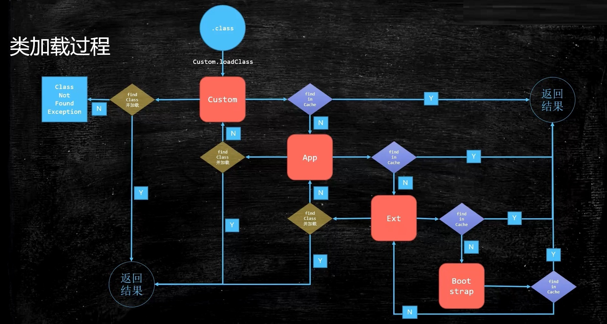
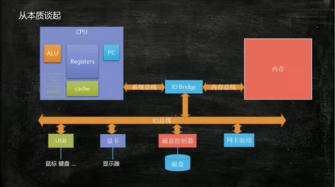
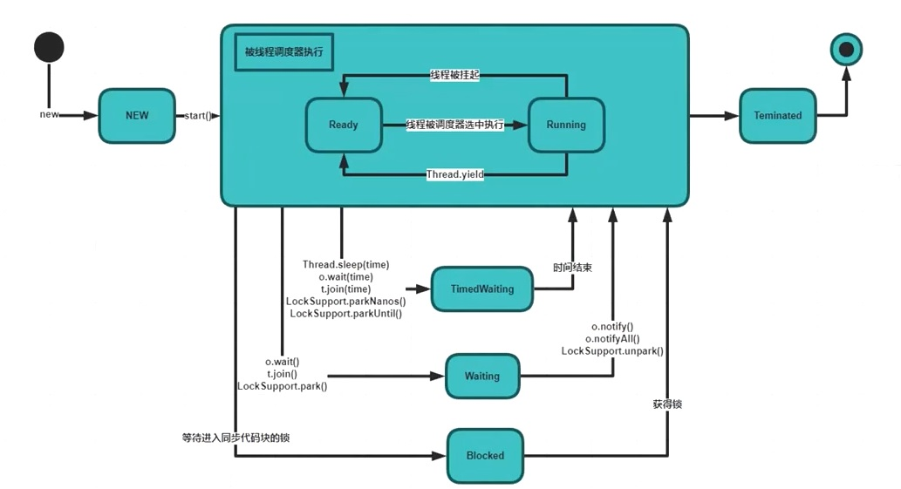

# Java: Popular and Versatile Features, History, and Examples

JVM, Garbage Collection, Multi - thread, Redis
<!--more-->

## JVM

**Java从编码到执行**

> 1. javac 将 x.java(任何语言) 文件编码成 x.class 文件
> 2. JVM 中的 ClassLoader 将 x.class 文件装载到内存里，通常也会把 java类库也装载到内存里  
> 3. JVM 调用 字节码解释器 或 JIT即时编译器(常用的代码使用即时编译，第二次编译的时候直接调用) 来进行解释或编译 *jvm是解释执行也是编译执行的，也可以混合执行
> 4. JVM 执行引擎开始执行

**JVM**

> 1. jvm 是一种规范
> 2. 它是虚构出来的一台计算机

**ClassFileFormat**

> + 二进制字节流
> + CLASS文件结构
>   1. 前4个字节：magic
>   2. 两个字节：minor version
>   3. 两个字节：major version
>   4. 两个字节：constant pool count 常量池个数 ，2个字节，最多65535个
>   5. 常量池结构：
>      1. constant_utf8_info: **tag**:1,占用空间一个字节。**length**: utf-8字符串占用的字节数。**bytes**: 长度位length的字符串
>      2. constant_integer_info: **tag**:3,占用空间一个字节。**bytes**: 4个字节，big-endian（高位在前）存储的int值
>      3. constant_methodref_info: **tag**:10 **index**:2字节，指向声明方法的类或者接口描述符constant_class_info的索引项 **index**: 2字节，指向字段描述符constant_nameAndType的索引项
>   6. class/this_class/super_class
>   7. interfaces
>   8. fields
>   9. methods

**Class Loading Linking Initializing**

**class文件load到内存的过程**

>1. loading: class文件放到内存
>  1. 双亲委派，安全
>  2. lazyLoading 五中情况
>  3. classLoader：findInCache -> parent.loadClass -> findClass()
>  4. 自定义类加载器
>     1. extends ClassLoader
>     2. overwrite findClass() -> defineClass(byte[] -> Class clazz)
>  5. 混合执行
>2. linking
>    1. verification：文件符合jvm规定：0xCAFEBABE...
>    2. preparation：静态成员变量赋默认值，int = 0...
>    3. resolution：类、方法、属性符号应用解析为直接引用，常量池中的各个符号引用解析为指针、偏移量等内存地址的直接引用
>8. initializing：静态变量这时才赋为初始值
>    1. load 静态成员变量 -> 默认值 -> 初始值
>    2. new Object -> 申请内存 -> 默认值 -> 初始值：单例模式中，volatile 确保指令执行顺序，先初始化后再把内存给 t ，否则有可能先指向内存再初始化

**类加载器**

```
JVM 是按需动态加载，采用双亲委派机制	
（自顶向下，进行实际查找和加载child方向）

Bootstrap   -----> 加载lib/rt.jar charset.jar 等核心类，C++实现
    |
Extension   -----> 加载扩展jar包(jre/lib/ext/*.jar)，或由 Djava.ext.dirs指定
    |
Application -----> 加载classpath指定内容
    |
Custom ClassLoader -----> 自定义 classLoader

（自底向上检查该类是否已经加载parent方向）
```

双亲委派

>+ 父加载器
>
>  -父加载器不是"类加载器的加载器"，！！也不是"类加载器的父类加载器"
>
>+ 双亲委派是一个孩子向父亲方向，然后父亲向孩子方向的双亲委派过程



为什么要做双亲委派

> 安全
>
> 双亲委派机制能够保证类加载器加载某个类时，最终都是由一个加载器加载，确保最终加载结果相同
>
> 比如 java.long.object, 从 custom classLoader 从下向上开始，到Bootstrap 发现已经加载过了，就不再加载了

补充

>+ class load到内存中有**两块**东西，一是class二进制文件，二是class对象。其他自己写的对象访问内存中的class对象，通过class对象访问内存中的二进制文件
>
>+ method Area ：
>
>  class对象是存储在 method Area 中，method Area 在内存是存储在 metaspace中，也就是 permanent generation。1.8之前叫 permanent generation， 1.8之后叫 metaspace
>
>+ 什么时候需要调用loadclass函数？
>
>  1. spring 里有动态代理，spring 就调用 loadclass 把 class 加载到缓存里
>  2. tomcat，load自定义的class
>  3. 热部署，热启动

**类编译**

>+ 解释器
>
>  -bytecode intepreter
>
>+ JIT
>
>  -Just In Time compiler
>
>+ 混合模式： 
>
>  -混合使用解释器 + 热点代码编译
>
>  -起始阶段采用解释执行
>
>  -热点代码检测
>
>  + 多次被调用的方法（方法计数器：监测方法执行频率）
>  + 多次被调用的方法（循环计数器：检测循环执行频率）
>  + 进行编译
>
>> + Xmixed: 默认为混合模式，开始解释执行，启动速度较快，对热点代码实行检测和编译
>> + Xint: 解释模式，启动很快执行稍慢
>> + Xcomp: 纯编译模式，执行很快，启动很慢

**懒加载**

>+ new/ get static / put static / invoke static 指令，访问 final 变量除外
>+ java.lang.reflect 对类进行反射调用时
>+ 初始化子类的时候，父类首先初始化
>+ jvm启动时，被执行的主类必须初始化
>+ 动态语言支持REF_putstatic/REF_getstatic/REF_invokestatic的方法句柄时，该类必须初始化

**Initializing**

```java
//例：求 T.count
main(){
    System.out.println(T.count);
}
class T {
    public static T t = new T();
    public static int count = 2;
    
    private T(){
        count ++;
    }
}
//T.class load，然后linking，
//到preparation，静态成员变量赋值默认值。t为null，count为0
//然后到initializing，t先执行构造方法，count赋值为2, count为2

class T {
    public static int count = 2;
    public static T t = new T();
    
    private T(){
        count ++;
    }
}
//initializing，count赋值为2，t再执行构造方法 count = 2++ = 3
```

## GC

> 熟悉GC常用算法，熟悉常见垃圾收集器，具有实际JVM调优实战经验

> 

程序的栈和堆

> 栈：
>
> + 每个线程一个栈，栈中照先进先出，存放方法
>
> 堆：
>
> + 动态内存块，比如 new 对象

什么是垃圾

> 没有引用指向他了就是垃圾

回收垃圾的方法

> 1. 引用计数法（reference count）
>    + 当引用指向为0，回收
>    + 缺点：当三个内存垃圾互相指向，无法回收
>    + Python
> 2. 根可达算法（root searching）
>    + GC roots: 线程栈变量，静态变量，常量池，JNI指针

GC 的演化

> 随着内存大小的不断增长而演进

堆内存逻辑分区

> 分代模型：
>
> 刚刚诞生的对象优先放在新生代内存区，
>
> 随着GC器的扫描新生代，新生代内存若多次没被回收(在Surviver两个区反复横跳多次)会变成老年代(gc正常不管这片区域)

GC 算法

> + Mark - Sweep (标记清除)
>   + 标记分为：存货对象，未使用内存区，可回收内存区
>   + 缺点：碎片化严重，分大块内存时不便
> + Copying
>   + 基于标记，整齐拷贝到新区域，原内存整体性回收
>   + 缺点：浪费内存
> + Mark - Compact (标记压缩)
>   + 基于copying，回收时直接整理内存
>   + 缺点：效率最低

GC 器

> Serial GC: 
>
> + 优点：单线程精简的GC实现，无需维护复杂的数据结构，初始化简单，是client模式下JVM默认选项。最古老的GC。
> + 缺点：会进入"Stop-The World"状态。
>
> ParNew GC：
>
> + 新生代GC实现，是SerialGC的多线程版本，最常见的应用场景是配合老年代的CMS GC 工作
>
> CMS（**Concurrent** Mark Sweep）GC :
>
> + 初始标记 (STW) -> 并发标记 -> 重新标记 (STW) (三色标记)-> 并发清理
> + 三色标记算法：
>   + 黑色：自己已经标记，子节点都标记完成。下次扫描不扫描
>   + 灰色：自己已经标记，子节点还没标记。下次扫描只扫描子节点
>   + 白色：没有遍历到的节点。
>   + Incremental update
> + 优点： 基于标记-清除（Mark-Sweep）算法，尽量减少停顿时间。
> + 缺点： Incremental update天然bug，会有漏标的问题，所以CMS的remark阶段，必须重头扫描一遍，STW是所有时间最长的。存在碎片化问题，在长时间运行的情况下会发生full GC，导致恶劣停顿。会占用更多的CPU资源，和用户争抢线程。在JDK 9中被标记为废弃。
>
> **Parrallel GC（parallel Scavenge + parallel old）**：
>
> + 在**JDK8**等版本中，是server模式JVM的默认GC选择，也被称为吞吐量优先的GC，算法和Serial GC相似，特点是老生代和新生代GC并行进行，更加高效。
>
> G1 GC：
>
> + 兼顾了吞吐量和停顿时间的GC实现，是Oracle JDK 9后默认的GC
> +  可以直观的设值停顿时间，相对于CMS GC ，G1未必能做到CMS最好情况下的延时停顿，但比最差情况要好得多
> + G1 仍存在年代的概念，**G1物理上不分代，逻辑分代**，使用了Region棋盘算法，实际上是标记-整理（Mark-Compact）算法，可以避免内存碎片，尤其是堆非常大的时候，G1优势更明显。
> + G1 吞吐量和停顿表现都非常不错。
>
> ZGC：
>
> + colored Pointer + Load Barrier
> + 不再分代
>
> shenandoah：
>
> + 和 ZGC 类似

GC 调优

> ```shell
> java -Xms200M -Xmx200m -XX:+PrintGC com.jvm
> ```
>
> + -Xms200M -Xmx200m : 防止内存抖动，消耗资源

cpu 占用率居高不下如何调试 jvm

> 项目中，产生内存泄露的问题， 频繁GC但是回收不到内存，通过定位发现泄露是因为一个类创建了海量的对象

> ```shell
> top 			#查看哪个进程占CPU比较高
> top -Hp PID		#查看进程里哪个线程占CPU
> jstack/PrintGC 	#找到进程，看是 VM GC 进程还是业务进程
> 				#若是 GC 则一定是频繁的 full GC，使用 PrintGC 查看GC每次回收是否正常
> 				#java -printgc -heapDumpOnOutOfMemoryError, OOM会下载dump文件
> jmap			#查看堆中对象占用内存的情况；查看堆转储文件
> MAT/jhat/jvisualbm	#进行dump文件分析
> ```

> jmap 为了把里面的对象全输出出来，会 STW，让整个JVM卡死
>
> 1. jmap 命令在压测环境上观察的
> 2. 机器做了负载均衡，发现问题后把有问题的机器从负载环境摘出来，再把堆转储文件导出来
> 3. 使用tcpcopy复制两份，一份到生产环境，一份到测试环境

> arthas：
>
> ```shell
> java -jar arthas-boot.jar
> # 运行后会自动找机器中java的进程
> # 性能上有所降低，但不会stw
> 
> dashboard
> # 展示线程占用、年代堆栈内存
> 
> heapdump
> # 替代jmap命令
> 
> thread -b
> # 查找线程中死锁，代替 jstack
> 
> jvm
> 
> jad
> # 在线反编译，在线定位一些问题
> 
> redefine
> # 在线修改class，临时解决版本bug。多台服务器写个脚本批量修改
> 
> trace
> # 查看方法所用时间
> ```
>
> 

## Multi Thread

启动线程的三种方式:

> 1. extends Thread
> 2. implements Runnable
> 3. Executors.newCachedThread

线程的状态：

> 

**JVM内存模型**

存储器的层次结构

```
l0:寄存器
l1:高速缓存
l2:高速缓存--------------cpu内部
--------------------------------
l3:高速缓存
l4:主存
l5:硬盘
l6:远程文件存储-----------cpu共享
--------------------------------
```

cache line 的概念 / 缓存行对其 / 伪共享

缓存行：

> 缓存行越大，局部性空间效率越高，但读取时间慢
>
> 缓存行越小，局部性空间效率越低，但读取时间快
>
> 目前用：64字节

```
缓存对其，在cpu内部的L2高速缓存处理时多线程，属于硬件问题：

[x  y        main memory]
[x  y           L3 cache]
[x  y    L2][x  y     L2]
[x  y    L1][x  y     L1]
[计算单元与寄存器][计寄存器]
```

高速缓存数据一致性解决方法

> 老的CPU：**总线锁** 大大降低了性能
>
> 新的CPU：**MESI** Cache 数据一致性协议等(intel 用 MESI) + 总线锁
>
> + Modified
> + Exclusive
> + Shared
> + Invalid
>
> 有些无法被缓存的数据，或者跨越多个缓存行的数据，依然必须使用总线锁

缓存行对其 / 伪共享

> 位于同一缓存行的两个不同数据，被两个不同CPU锁定，产生互相影响的伪共享问题
>
> 解决方法：
>
> + 缓存行对其：扩大字节数，使其不在统一缓存行
>
> ```java
> private static class Padding {
>     public long p1, p2, p3, p4, p5, p6, p7; //cache line padding
>     private volatile long cursor = INITIAL_CURSOR_VALUE;
>     public long p8, p9, p10, p11, p12, p13, p14; //cache line padding
> }
> ```

乱序问题

>cpu为了提高指令执行效率，去同时执行另一条指令（前提两条指令没有依赖关系:int a = 0; a++;）这样的cpu的执行就是乱序的。
>
>而且
>
>必须使用Memory Barrier来做好指令排序
>
>volatile的底层就是这么实现的(windows 是 lock 指令)

如何保证特定情况下不乱序

> volatile 有序：
>
> + 使用 **CPU 内存屏障**， 原理：
> + sfence指令前的写操作必须在sfence指令后的写操作前完成
> + Ifence指令前的读操作必须在Ifence指令后的读操作前完成
> + mfence指令前的读写操作必须在mfence指令后的读写操作前完成
>
> 实际使用的是 Intel lock 汇编指令

volatile

> 作用：
>
> 1. 保持线程间的可见性
> 2. 禁止指令重排序（通过内存屏障）

关于 Object o = new Object()
1. 解释对象的创建过程（半初始化）

   > T t = new T() jvm 编译成 class 汇编码5条指令:
   >
   > ```java
   > new	#2 <T>		//申请内存空间, 成员变量是默认值
   > dup
   > invokespecial #3 <T.<init>>	//调用初始化方法，成员变量初始化
   > astore			//t 和 new 出的对象进行关联
   > return
   > ```
   >
   > 由于指令重排的存在
   >
   > ```java
   > invokespecial #3 <T.<init>>	
   > astore
   > //有可能乱序执行,先指向内存再初始化变量
   > ```
   >
   > 

2. DCL与volatile问题（指令重排）

> 1.Double Check Lock
>
> ```java
> public static volatile T INSTANCE;
> 
> public static T getInstance(){
>  if (INSTANCE == null){
>      synchronized(T.class){
>          if(INSTANCE == null){
>              try{
>                  Thread.sleep(1);
>              }catch(InterruptedException e) {
>                  e.printStackTrace();
>              }
>              INSTANCE = new T();
>          }
>      }
>  }
> }
> ```
>
> 2.DCL单例必须要加volatile
>
> > 指令重排，对象初始化时先指向内存，再初始化赋值
> >
> > 若此时线程2进入，则直接拿到未初始化赋值的对象

3. 对象在内存中的存储布局（对象与数组的存储不同）
4. 对象头具体包括什么（markword klasspointer）
5. synchronized锁信息
6. 对象怎么定位（直接 间接）
7. 对象怎么分配（栈上 线程本地 Eden Old）
8. Object o = new Object()在内存中占用多少字节

## Redis

项目中Redis的应用场景

> 1. 五大value类型
> 2. 基本上就是缓存
> 3. 为的是服务**无状态**，（延伸：看项目中有哪些数据结构，如分布式锁，抽出来放到Redis）
> 4. 无锁化

Redis是单线程还是多线程

> 1. 无论哪个版本，工作线程就是一个
> 2. 6.x 高版本出现了IO多线程


------



问法：做过什么优化？ 解决过什么问题？遇到哪些问题？

1. 说明业务场景；
2. 遇到了什么问题 --> 往往通过监控工具结合报警系统；
3. 排查问题；
4. 解决手段；
5. 问题被解决。



