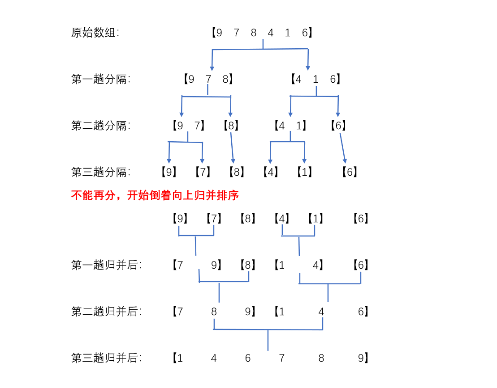
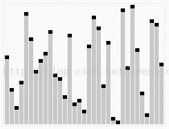
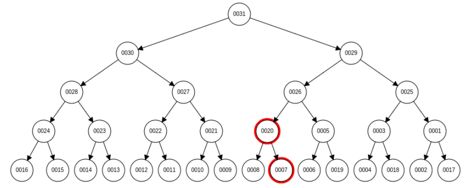

# Leetcode


Algorithms are used in every part of computer science. They form the field's backbone. In computer science, an algorithm gives the computer a specific set of instructions, which allows the computer to do everything, be it running a calculator or running a rocket.
<!--more-->
**异或运算**

> 特点：
>
> 1. 与自己异或等于0，与0异或等于自己
> 2. 遵循交换律和结合律
>
> 例：
>
> ```java
> //1.两数交换：
> arr[i] = arr[i] ^ arr[j]; // a = a ^ b
> arr[j] = arr[i] ^ arr[j]; // b = (a ^ b) ^ b = a
> arr[i] = arr[i] ^ arr[j]; // a = (a ^ b) ^ a = b
> ```
>
> ```java
> //2.数组中有一个出现奇数次的数
> int eor = 0;
> for(int cur : arr){
>     eor ^= cur; //[a,a,b,b,c,c,c]  => a^a^b^b^c^c^c = c
> }
> System.out.println(eor);
> 
> //3.数组中有两个出现奇数次的数
> int eor = 0;
> for(int cur : arr){
>     eor ^= cur; //[a,a,b,b,b,c,c,c]  => a^a^b^b^b^c^c^c = b^c
> }
> //eor = b ^ c
> //eor != 0
> //eor必然有个一位置上是1, 说明这个位置上b和c不同
> int rightOne = eor & (~eor + 1);  //（取反 + 1） & 自己 = 提取出只保留最右侧的1
> 
> int result1 = 0;
> for(int cur : arr){
>     if((cur & rightOne) == 0){ //已知在rightOne这个位置上b和c不同，通过(& rightOne)把b和c区分开,别的数是偶数个，异或起来是0不同管
>         result1 ^= cur; //这样result1是b或者c
>     }
> }
> int result2 = eor ^ result1;
> ```

## 排序

冒泡排序


选择排序


### 插入排序

+ 
+ 概念： 将后部分的数据(从第二开始)按照一定的顺序一个一个的插入到前部分有序的表中

+ 时间复杂度：O(N^2)
+ 额外空间复杂度：O(1)

> 数据状况不同，时间复杂度不同:
>
> + 时间复杂度是按照**最差情况**考虑

```java
public static void insertionSort(int[] arr) {
    if (arr == null || arr.length < 2){
        return;
    }
    for (int i = 1; i < arr.length; i++){
        for(int j = i - 1; j >= 0 && arr[j] > arr[j+1]; j--){
            swap(arr, j, j+1);
        }
    }
}
public static void swap(int[] arr, int i, int j){
    arr[i] = arr[i] ^ arr[j]; 
	arr[j] = arr[i] ^ arr[j]; 
	arr[i] = arr[i] ^ arr[j];
}
```

**递归**

```java
public static int getMax(int[] arr){
    return process(arr, 0, arr.length - 1);
}

public static int process(int[] arr, int L, int R){
    if(L == R){
        return arr[L];
    }
    int mid = L + ((R - L) >> 1);
    int leftMax = process(arr, L, mid);
    int rightMax = process(arr, mid + 1, R);
    return Math.max(leftMax, rightMax);
}
```

**递归时间复杂度估算**

+ Master公式： T(N) = a * T (N / b) + 0 (N ^ d)
  1. log(b, a) > d,	则复杂度为O(N ^ log(b, a))
  2. log(b, a) = d,	则复杂度为O(N ^ d * logN)
  3. log(b, a) < d,	则复杂度为O(N ^ d)

### 归并排序

> + 
> + 概念：将n个元素分成个含n/2个元素的子序列，用合并排序法对两个子序列递归的排序，合并两个已排序的子序列已得到排序结果。
> + 时间复杂度：使用Master公式： T(N) = NlogN
> + 代码实现：
>
> ```java
> public static void process(int[] arr, int L, int R){
>     if(L == R){
>         return;
>     }
>     int mid = L + ((R - L) >> 1);
>     process(arr, L, mid);
>     process(arr, mid + 1, R);
>     merge(arr, L, mid, R);
> }
> 
> public static void merge(int[] arr, int L, int M, int R){
>     int[] extra = new int[R - L + 1];
>     int i = 0;
>     int p1 = L;
>     int p2 = M + 1;
>     while(p1 <= M && p2 <= R){
>         extra[i++] = arr[p1] <= arr[p2] ? arr[p1++]: arr[p2++];
>     }
>     while(p1 <= M){
>         extra[i++] = arr[p1++];
>     }
>     while(p2 <= R){
>         extra[i++] = arr[p2++];
>     }
>     for(i = 0; i < extra.length; i++){
>         arr[L + i] = extra[i];
>     }
> }
> ```
>
> 小和问题、逆序对问题
>
> > [1, 3, 4, 2, 5] 的小和是 0 + 1 + 4 + 1 +10 = 16（ 在一个数组中,每一个数左边比当前数小的数累加起来,叫做这个数组的小和。）
> >
> > 归并排序思路，目的就是减少对比次数。增加一个外部空间，记录在一次merge中的小和。
> >
> > ```java
> > public static int process(int[] arr, int l, int r){
> > if (l == r){
> >   return 0;
> > }
> > int mid = 1 + ((r - l) >> 1);
> > return process(arr, 1 , mid) 
> >         + process(arr, mid + 1 , r)
> >         + merge(arr, 1 , mid, r);    
> > }
> > 
> > public static void merge(int[] arr, int L, int mid, int R){
> >     int[] extr = new int[R - L + 1];
> >     int i = 0;
> >     int p1 = L;1
> >     int p2 = M + 1;
> >     int res = 0;
> >     while(p1 <= M && p2 <= R){
> >         res += arr[p1] < arr[p2] ? (r - p2 + 1) * arr[p1] : 0
> >         extr[i++] = arr[p1] < arr[p2] ? arr[p1++]: arr[p2++];
> >     }
> >     while(p1 <= M){
> >         extr[i++] = arr[p1++];
> >     }
> >     while(p2 <= R){
> >         extr[i++] = arr[p2++];
> >     }
> >     for(i = 0; i < extra.length; i++){
> >         arr[L + i] = extra[i];
> >     }
> >     return res;
> > }
> > ```

### 快速排序

> 
>
> 时间复杂度：O(NlogN)，因为有**随机概率**行为，所以时间复杂度为期望值。
>
> 空间复杂度：O(logN)
>
> 荷兰国旗问题
>
> > 问题1：给一个 arr 和 num，要求把小于等num的数放左，大于num放右，时间复杂度为O(N)，空间为O(1)
> >
> > 问题2：给一个 arr 和 num，要求把小于等num的数放左，等于放中间，大于num放右，时间复杂度为O(N)，空间为O(1)
>
> ```java
> public static void quickSort(int[] arr, int L, int R){
>     if(L < R){
>         swap(arr, L + (int)(Math.random() * (R - L + 1)), R);//随机选一个数和最后位置交换
>         int[] p = partition(arr, L, R);//=区域的左右边界
>         quickSort(arr, L, p[0] - 1);
>         quickSort(arr, p[1] + 1, R);
>     }
> }
> public static int[] partition(int[] arr, int L, int R){
>     int less = L - 1;// <区域的右边界
>     int more = R; //>区的左边界
>     while(L < more){ // L表示当前数的位置
>         if(arr[L] < arr[R]){
>             swap(arr, ++less, L++);
>         }else if(arr[L] > arr[R]){
>             swap(arr, --more, L);
>         }else{
>             L++;
>         }
>     }
>     swap(arr, more, R);
>     return new int[]{ less + 1, more };
> }
> 
> private static void swap(int[] arr, int i, int j) {
>     if(i != j){
>         arr[i] = arr[i] ^ arr[j];
>         arr[j] = arr[i] ^ arr[j];
>         arr[i] = arr[i] ^ arr[j];
>     }
> }
> ```

### 堆排序

> 
>
> 时间复杂度：O(NlogN)
>
> **大根堆**：在完全二叉树（最后一层的结点都连续集中在最左边，其余层满节点）的前提下，每一棵子树的最大值是头结点的数。
>
> **小根堆**：在完全二叉树（最后一层的结点都连续集中在最左边，其余层满节点）的前提下，每一棵子树的最小值是头结点的数。
>
> 优先级队列结构，就是堆结构
>
> ```java
> //处在index位置上的数，往上继续移动
> public static void heapInsert(int[] arr, int index){
> 	while(arr[index] > arr[(index - 1) / 2]) {
> 		swap(arr, index, (index - 1) / 2);
> 		index = (index - 1) / 2;
> 	}
> }
> ```
>
> 返回最大值（arr[0]上的数），并删除最大值：
>
> > 1. 返回根节点。
> > 2. 把 arr[heapSize] 的数放到根节点。
> > 3. heapSize--，最后一个节点即与堆断连。
> > 4. while 循环，与子节点比较，小则替换，直到满足大根堆。
> >
> > ```java
> > // 处在index位置上的数，往下继续移动
> > public static void heapify(int[] arr, int index, int heapSize){
> >     int left = index * 2 + 1; //节点左孩子下标
> >     while(left < heapSize){ //判断下方是否有孩子
> >         //两个孩子中，谁的值大，把下标给最大的
> >         int largest = left + 1 < heapSize && arr[left + 1] > arr[left] ? left + 1 : left;
> >         //节点与孩子比较，谁的值大，把下标给最大的
> >         largest = arr[largest] > arr[index] ? largest : index;
> >         if(largest == index){
> >             break;
> >         }
> >         swap(arr, largest, index);
> >         index = largest;
> >         left = index * 2 + 1;
> >     }
> > }
> > ```
>
> HeapSort
>
> ```java
> public static void heapSort(int[] arr){
>     if(arr == null || arr.length < 2){
>         return;
>     }
>     for(int i = 0; i < arr.length; i++){
>         heapInsert(arr, i);//数组整体范围变成大根堆
>     }
>     int heapSize = arr.length;
>     swap(arr, 0, --heapSize);//大根堆的root(最大值)放到arr最后
>     while(heapSize > 0){
>         heapify(arr, 0, heapSize);
>         swap(arr, 0, --heapSize);
>     }
> }
> ```
>
> 一个数组如果把它排好序的话，每个元素移动的距离不超过k，k相对于数组长度比较小，选择一个合适的排序算法排序
>
> + 方法：
>
>   最小堆排方法，先取出前k个数字组成最小堆，根位置为0位置上的数；添加一个数，堆化，根位置为第二个位置上的数。以此类推
>
>   ```java
>   PriorityQueue<Integer> heap = new PriorityQueue<>();//优先级队列结构，就是堆结构
>   ```
>
>   扩容方式：双倍扩容
>
>   ```java
>   public void sortedArrDistanceLessK(int[] arr, int k){
>       PriorityQueue<Integer> heap = new PriorityQueue<>();//默认小根堆
>       int index = 0;
>       for(; index <= Math.min(arr.length, k); index++){//生成前k个数的最小堆
>           heap.add(arr[index]);
>       }
>       int i = 0;
>       for(;index < arr.length; i++, index++){//弹一个，放入一个
>           heap.add(arr[index]);
>           arr[i] = heap.poll();
>       }
>       while(!heap.isEmpty()){
>           arr[i++] = heap.poll();
>       }
>   }
>   ```

### 桶排序

> 计数排序：
>
> 基数排序：
>
> 
>
> ```java
> public static void radixSort(int[] arr, int L, int R, int digit){//digit: 最大数的位数
> final int radix = 10;
> int i = 0, j = 0;
> int[] bucket = new int[R - L + 1];//有多少个数准备多少个辅助空间
> for(int d = 1; d <= digit; d++){//最大位数有多少位就进出桶多少次
> int[] count = new int[radix]; //count[0..9]
> //count[0] 当前(d)位是0的数字有多少个
> //count[1] 当前(d)位小于等于1的数字有多少个
> //count[2] 当前(d)位小于等于2的数字有多少个
> //count[i] 当前(d)位小于等于i的数字有多少个
> for(i = L; i <= R; i++){
>    count[getDigit(arr[i], d)]++;//先统计每个数字(num)出现了几次(times)，先记录在count[num] = times
> }
> for(i = 1; i < radix; i++){
>    count[i] = count[i] + count[i - 1];//再统计小于等于出现的次数
> }
> for(i = R; i >= L; i--){//从右向左
>    j = getDigit(arr[i], d);
>    bucket[count[j] - 1] = arr[i];
> }
> for(i = L, j = 0; i <= R; i++, j++){
>    arr[i] = bucket[j];//将桶中数据倒回数组
> }
> }
> }
> ```

小结

|      | 时间复杂度       | 空间复杂度 | 稳定性 |
| ---- | ---------------- | ---------- | ------ |
| 选择 | O(N<sup>2</sup>) | O(1)       | x      |
| 冒泡 | O(N<sup>2</sup>) | O(1)       | √      |
| 插入 | O(N<sup>2</sup>) | O(1)       | √      |
| 归并 | O(NlogN)         | O(N)       | √      |
| 快排 | O(NlogN)         | O(logN)    | x      |
| 堆排 | O(NlogN)         | O(1)       | x      |

+ 一般优先选择 **快速排序**，快排的复杂度在常数项是最低的。
+ 对空间有要求选择 **堆排序**。
+ 对稳定性有要求选择 **归并排序**。

## Leetcode 题解 - 排序

### 快速选择

用于求解 **Kth Element** 问题，也就是第 K 个元素的问题。

可以使用快速排序的 partition() 进行实现。需要先打乱数组，否则最坏情况下时间复杂度为 O(N2)。

### 堆

用于求解 **TopK Elements** 问题，也就是 K 个最小元素的问题。使用最小堆来实现 Top 问题，最小堆使用大顶堆来实现，大顶堆的堆顶元素为当前的最大元素。

实现过程：不断地往大顶堆中插入新元素，当堆中元素的数量大于 k 时，移除堆顶元素，也就是当前堆中最大的元素，剩下的元素都为当前添加过的元素中最小的K个元素。插入和移除堆顶元素的时间复杂度都为 log<sub>2</sub>N

快速选择也可以求解 TopK Elements 问题，因为找到了 Kth Element 之后，所有小于等于 Kth Element 的元素都是 TopK Elements。

快速选择和堆排序都可以求解 Kth Element 和 TopK Elements 问题。

### 题目一：Kth Element  Kth Largest Element in an Array (Medium)

```
Input: [3,2,1,5,6,4] and k = 2
Output: 5
```

题目描述：找到倒数第 k 个的元素。

> 解题：
>
> 方法一：**排序**：时间复杂度 O(NlogN)，空间复杂度 O(1)
>
> > sort() 方法：元素少于NSERTION_SORT_THRESHOLD⽤插⼊排序，大于NSERTION_SORT_THRESHOLD，使用快排。
>
> ```java
> public int findKthLargest(int[] nums, int k) {
>     Arrays.sort(nums); 
>     return nums[nums.length - k];
> }
> ```
>
> 方法二：**堆**：时间复杂度 O(NlogK)，空间复杂度 O(K)。
>
> ```java
> public int findKthLargest(int[] nums, int k) {
>     PriorityQueue<Integer> pq = new PriorityQueue<>(); //小项堆
>     for(int val : nums){
>         pq.add(val);
>         if(pq.size() > k)
>             pq.poll(); //维护堆的大小为K，弹出最小项，留下的 k 项为数组中最大的。
>     }
>     return pq.peek();
> }
> ```
>
> 方法三：**快速选择** ：时间复杂度 O(N)，空间复杂度 O(1)
>
> > ```java
> > public int findKthLargest(int[] nums, int k) {
> >     k = nums.length - k;
> >     int l = 0, h = nums.length - 1;
> >     while (l < h) {
> >         int j = partition(nums, l, h);
> >         if (j == k) {
> >             break;
> >         } else if (j < k) {
> >             l = j + 1;
> >         } else {
> >             h = j - 1;
> >         }
> >     }
> >     return nums[k];
> > }
> > 
> > private int partition(int[] a, int l, int h) {
> >     int i = l, j = h + 1;
> >     while (true) {
> >         while (a[++i] < a[l] && i < h) ;
> >         while (a[--j] > a[l] && j > l) ;
> >         if (i >= j) {
> >             break;
> >         }
> >         swap(a, i, j);
> >     }
> >     swap(a, l, j);
> >     return j;
> > }
> > 
> > private void swap(int[] a, int i, int j) {
> >     int t = a[i];
> >     a[i] = a[j];
> >     a[j] = t;
> > }
> > ```

### 桶排序

### 题目二：出现频率最多的 k 个元素  Top K Frequent Elements (Medium)

```
Given [1,1,1,2,2,3] and k = 2, return [1,2].
```

> 解题：
>
> 设置若干个桶，每个桶存储出现频率相同的数。桶的下标表示数出现的频率，即第 i 个桶中存储的数出现的频率为 i。
>
> 把数都放到桶之后，从后向前遍历桶，最先得到的 k 个数就是出现频率最多的的 k 个数。
>
> ```java
> public int[] topKFrequent(int[] nums, int k) {
>     Map<Integer, Integer> frequencyForNum = new HashMap<>();
>     for(int num : nums){
>         frequencyForNum.put(num, frequencyForNum.getOrDefault(num, 0) + 1);
>     }
>     List<Integer>[] buckets = new ArrayList[nums.length + 1];
>     for(int key : frequencyForNum.keySet()){
>         int frequency = frequencyForNum.get(key);
>         if (buckets[frequency] == null){
>             buckets[frequency] = new ArrayList<>();
>         }
>         buckets[frequency].add(key);
>     }
>     List<Integer> topK = new ArrayList<>();//res
>     for(int i = buckets.length - 1; i >= 0 && topK.size() < k; i--){
>         if(buckets[i] == null){
>             continue;
>         }
>         if(buckets[i].size() <= (k - topK.size())){
>             topK.addAll(buckets[i]);
>         }else{
>             topK.addAll(buckets[i].subList(0, k - topK.size()));
>         }
>     }
>     int[] res = new int[k];
> 	for (int i = 0; i < k; i++) {
>         res[i] = topK.get(i);
>     }
>     return res;
> }
> ```
>

### 题目三：按照字符出现次数对字符串排序 Sort Characters By Frequency (Medium)

```
Input:
"tree"

Output:
"eert"

Explanation:
'e' appears twice while 'r' and 't' both appear once.
So 'e' must appear before both 'r' and 't'. Therefore "eetr" is also a valid answer.
```

> 解题：
>
> ```java
> public String frequencySort(String s) {
>     Map<Character, Integer> frequencyForNum = new HashMap<>();
>     for (char c : s.toCharArray())
>         frequencyForNum.put(c, frequencyForNum.getOrDefault(c, 0) + 1);
> 
>     List<Character>[] frequencyBucket = new ArrayList[s.length() + 1];
>     for (char c : frequencyForNum.keySet()) {
>         int f = frequencyForNum.get(c);
>         if (frequencyBucket[f] == null) {
>             frequencyBucket[f] = new ArrayList<>();
>         }
>         frequencyBucket[f].add(c);
>     }
>     StringBuilder str = new StringBuilder();
>     for (int i = frequencyBucket.length - 1; i >= 0; i--) {
>         if (frequencyBucket[i] == null) {
>             continue;
>         }
>         for (char c : frequencyBucket[i]) {
>             for (int j = 0; j < i; j++) {
>                 str.append(c);
>             }
>         }
>     }
>     return str.toString();
> }
> ```

### 荷兰国旗问题：快排 partition

```
Input: [2,0,2,1,1,0]
Output: [0,0,1,1,2,2]
```

> 解题：
>
> ```java
> public void sortColors(int[] nums) {
>     int zero = -1, one = 0, two = nums.length;
>     while (one < two) {
>         if (nums[one] == 0) {
>             swap(nums, ++zero, one++);
>         } else if (nums[one] == 2) {
>             swap(nums, --two, one);
>         } else {
>             ++one;
>         }
>     }
> }
> 
> private void swap(int[] nums, int i, int j) {
>     int t = nums[i];
>     nums[i] = nums[j];
>     nums[j] = t;
> }
> ```

## Leetcode 题解 - 二分查找

+ 时间复杂度：O(logN)  (logN默认指log以2为底)

### 求中间数

```java
mid = (L + R) / 2 			// L + R 可能会越界65535，这时mid算出负数
mid = L + (R - L) / 2		//不会越界
mid = L + (R - L) >> 1		//右移一位比除2快
```

### binarySearch

```java
public int binarySearch(int[] nums, int key) {
    int l = 0, h = nums.length;
    while (l < h) {
        //int m = l + (h - l) / 2;
        int m = l + (h - l) > 2;
        if (nums[m] >= key) {
            h = m;
        } else {
            l = m + 1;
        }
    }
    return l;
}
```

### 题目一：求开方 Sqrt(x) (Easy)

```
Input: 4
Output: 2

Input: 8
Output: 2
Explanation: The square root of 8 is 2.82842..., and since we want to return an integer, the decimal part will be truncated.
```

> 解题：
>
> 一个数 x 的开方 sqrt 一定在 0 ~ x 之间，并且满足 sqrt == x / sqrt。可以利用二分查找在 0 ~ x 之间查找 sqrt。
>
> 对于 x = 8，它的开方是 2.82842...，最后应该返回 2 而不是 3。在循环条件为 l <= h 并且循环退出时，h 总是比 l 小 1，也就是说 h = 2，l = 3，因此最后的返回值应该为 h 而不是 l。
>
> ```java
> public int mySqrt(int x){
>     if(x <= 1){
>         return x;
>     }
>     int l = 1, h = x;
>     while(l <= h){
>         int mid = l + (h - l) >> 2;
>         int sqrt = x / mid;
>         if (sqrt == mid){
>             return mid;
>         } else if (mid > sqrt){
>             h = mid - 1;
>         } else {
>             l = mid + 1;
>         }
>     }
>     return h;
> }
> ```

### 题目二：大于给定元素的最小元素 Find Smallest Letter Greater Than Target (Easy)

```
Input:
letters = ["c", "f", "j"]
target = "d"
Output: "f"

Input:
letters = ["c", "f", "j"]
target = "k"
Output: "c"
```

> 解题：
>
> ```java
> public char nextGreatestLetter(char[] letters, char target) {
>     int n = letters.length;
>     int l = 0, h = n - 1;
>     while (l <= h) {
>         int m = l + (h - l) / 2;
>         if (letters[m] <= target) {
>             l = m + 1;
>         } else {
>             h = m - 1;
>         }
>     }
>     return l < n ? letters[l] : letters[0];
> }
> ```

### 题目三：有序数组的 Single Element in a Sorted Array (Medium)

```
Input: [1, 1, 2, 3, 3, 4, 4, 8, 8]
Output: 2
```

题目描述：一个有序数组只有一个数不出现两次，找出这个数。要求以 O(logN) 时间复杂度求解，因此不能遍历数组并进行异或操作来求解，这么做的时间复杂度为O(N)

> 解题：
>
> 令 index 为 Single Element 在数组中的位置。在 index 之后，数组中原来存在的成对状态被改变。如果 m 为偶数，并且 m + 1 < index，那么 nums[m] == nums[m + 1]；m + 1 >= index，那么 nums[m] != nums[m + 1]。
>
> ```java
> public int singleNonDuplicate(int[] nums) {
>     int l = 0, h = nums.length - 1;
>     while (l < h) {
>         int m = l + (h - l) / 2;
>         if (m % 2 == 1) {
>             m--;   // 保证 l/h/m 都在偶数位，使得查找区间大小一直都是奇数
>         }
>         if (nums[m] == nums[m + 1]) {
>             l = m + 2;
>         } else {
>             h = m;
>         }
>     }
>     return nums[l];
> }
> ```

### 题目：找一个局部最小（i-1 < i < i+1）的数，复杂度小于 O(N)

> 例题：
>
> 1. 在一个有序数组中，找某个数是否存在
>
> 2. 在一个有序数组中，找 >= 某个数最左侧的位置：二分查找直到左侧没有数
>
> 3. 无序，相邻数一定不相等，找一个局部最小(i-1 < i < i+1)的数，复杂度能否好于O(N)
>
>    ```
>    先判断首尾项是否满足要求，若首尾项不满足要求，一定是\进/出，中间一定有低谷拐点。
>    然后判断中间点是否满足要求，若不满足，分为两种情况：
>    1. 斜坡，则一方可与起点或终点组成\进/出。
>    2. 顶峰，则两方向都满足\进/出条件，两个方向都可继续进行二分法
>    直到判断出某个二分法中点满足要求。
>    ```

## Leetcode 题解 - 哈希表 - 有序表

哈希表介绍

> 1. 哈希表使用层面上可以理解为一种集合结构。
> 2. 有无伴随数据，是HashMap和HashSet唯一的区别，底层的数据结构一样。
> 3. 使用哈希表 put，remove，put，get 的操作，可以认为时间复杂度为O(1)，但常数时间比较大。

> 哈希表使用 O(N) 空间复杂度存储数据，并且以 O(1) 时间复杂度求解问题。
>
> Java 中的 HashSet 用于存储一个集合，可以查找元素是否在集合中。如果元素有穷，并且范围不大，那么可以用一个布尔数组来存储一个元素是否存在。例如对于只有小写字符的元素，就可以用一个长度为 26 的布尔数组来存储一个字符集合，使得空间复杂度降低为 O(1)。
>
> Java 中的 HashMap 主要用于映射关系，从而把两个元素联系起来。HashMap 也可以用来对元素进行计数统计。在对一个内容进行压缩或者其他转换时，利用 HashMap 可以把原始内容和转换后的内容联系起来。例如在一个简化 url 的系统中。
>
> 利用 HashMap 就可以存储精简后的 url 到原始 url 的映射，使得不仅可以显示简化的 url，也可以根据简化的 url 得到原始 url 从而定位到正确的资源。

有序表介绍

> 1. 有序表在使用层面上可以理解为一种集合结构。
> 2. 有无伴随数据，是TreeSet和TreeMap唯一的区别，底层的数据结构一样。
> 3. 有序表和哈希表的区别是，有序表把key按照顺序组织起来，而哈希表完全不组织。
> 4. 红黑树、AVL树、size-balance-tree和跳表都属于有序表结构，只是底层具体实现不同。

### 1. 数组中两个数的和为给定值 Two Sum (Easy)

> 解题：
>
> 可以先对数组进行排序，然后使用双指针方法或者二分查找方法。这样做的时间复杂度为 O(NlogN)，空间复杂度为O(1)。
>
> 用 HashMap 存储数组元素和索引的映射，在访问到 nums[i] 时，判断 HashMap 中是否存在 target - nums[i]，如果存在说明 target - nums[i] 所在的索引和 i 就是要找的两个数。该方法的时间复杂度为 O(N)，空间复杂度为O(N)，使用空间来换取时间。
>
> ```java
> public int[] twoSum(int[] nums, int target){
>     HashMap<Intger, Intger> indexForNum = new HashMap<>();
>     for(int i = 0; i < nums.length; i++){
>         if(indexForNum.containsKey(target - nums[i])){
>             return new int[]{indexForNum.get(target - nums[i]), i};
>         } else {
>             indexForNum.put(nums[i], i);
>         }
>     }
>     return null;
> }
> ```

### 2. 判断数组是否含有重复元素 Contains Duplicate (Easy)

```java
public boolean containsDuplicate(int[] nums){
    Set<Integer> set = new HashSet<>();
    for (int num : nums){
        set.add(num);
    }
    return set.size() < nums.length;
}
```

### 3. 最长和谐序列 Longest Harmonious Subsequence (Easy)

和谐序列中最大数和最小数之差正好为 1，应该注意的是序列的元素不一定是数组的连续元素。

```
Input: [1,3,2,2,5,2,3,7]
Output: 5
Explanation: The longest harmonious subsequence is [3,2,2,2,3].
```

```java
public int findLHS(int[] nums){
    Map<Integer, Integer> countForNum = new HashMap<>();
    for(int num : nums){
        countForNum.put(num, countForNum.getOrDefault(nums, 0) + 1);
    }
    int longest = 0;
    for(int num : countForNum.keySet()){
        if(countForNum.containsKey(num + 1)){
            longest = Math.max(longest, countForNum.get(num + 1) + countForNum.get(num));
        }
    }
    return longest;
}
```

### 4. 最长连续序列 Longest Consecutive Sequence (Hard)


## 链表

+ 笔试 面试区分，面试时需考虑空间复杂度。

> **题目一：判断一个链表是否回文**
>
> 方法一：笔试用：进栈出栈
>
> ```java
> public static boolean isPalindrome1(Node head) {
> Stack<Node> stack = new Stack<Node>();
> Node cur = head;
> while (cur != null) {
>   stack.push(cur);
>   cur = cur.next;
> }
> while (head != null) {
>   if (head.value != stack.pop().value) {
>       return false;
>   }
>   head = head.next;
> }
> return true;
> }
> ```
>
> 方法2：快慢指针：空间复杂度O(1)，使用了有限几个变量
>
> ```java
> public static boolean isPalindrome3(Node head) {
> if (head == null || head.next == null) {
>   return true;
> }
> Node n1 = head;
> Node n2 = head;
> while (n2.next != null && n2.next.next != null) {
>   n1 = n1.next; //n1 -> mid
>   n2 = n1.next.next; //n2 -> end
> }
> n2 = n1.next; //n2 -> right part first node
> Node n3 = null;
> while (n2 != null) { //right part convert
>   n3 = n2.next; // save next node
>   n2.next = n1; // right direct to left direct
>   n1 = n2;
>   n2 = n3;
> }
> n3 = n1; // last node
> n2 = head; // fist node
> boolean res = true;
> while (n1 != null && n2 != null) {
>   if (n1.value != n2.value) {
>       res = false;
>       break;
>   }
>   n1 = n1.next;
>   n2 = n2.next;
> }
> n1 = n3.next; // recover list
> n3.next = null;
> while (n1 != null) {
>   n2 = n1.next;
>   n1.next = n3;
>   n3 = n1;
>   n1 = n2;
> }
> return res;
> }
> ```
>
> **题目二：单链表按某值划分成左边小，中间相等，右边大**
>
> 方法一：（笔试）放到数组里，在数组里partition
>
> 方法二：（面试）创建6个空节点，每两个一组，作为三个区域的首尾节点。遍历原链表，放到不同的区域并调整各组首尾节点，最后三个拼装。
>
> **题目三：复制含有随机指针节点的链表**
>
> ```java
> class Node {
> int value;
> Node next;
> Node rand;
> 
> Node(int val) {
>   value = val;
> }
> }
> ```
>
> 方法一：hashmap
>
> ```java
> public static Node copyListWithRand1(Node head) {
> HashMap<Node, Node> map = new HashMap<Node, Node>();
> Node cur = head;
> while (cur != null) {
>   map.put(cur, new Node(cur.value));
>   cur = cur.next;
> }
> cur = head;
> while (cur != null) {
>   map.get(cur).next = map.get(cur.next);
>   map.get(cur).rand = map.get(cur.rand);
>   cur = cur.next;
> }
> return map.get(head);
> }
> ```
>
> 方法二：利用位置关系省去哈希表。
>
> > 1. 当前节点的下一个就放克隆节点。
> >
> > 2. ```java
> >    curCopy = cur.next;
> >    curCopy.rand = cur.rand != null ? cur.rand.next:null;
> >    ```
> >
> > 3. 跳过旧链表。
>
> **题目四：两个单链表相交的一系列问题**
>
> **先判断有无环**：
>
> > 方法一：Hashset。get一个，看之前是否加入过，否则put进set。
> >
> > 方法二：快慢指针。不会走到空节点，快慢指针一定会相遇，而且快指针在环中不会超过两圈。相遇后快指针回到开头，然后两个指针都走一步，一定会在入环节点相遇。
>
> **情况一：两链表都无环**
>
> > 1. 判断链表长度
> > 2. 判断end节点是否是一个，不同则不相交。
> > 3. 长链表先走差值步，然后两链表一起走，一定会一起走到第一个相交点。
>
> **情况二：两链表都有环**
>
> > 情况二之一：链表无交集
> >
> > 情况二之二：入环节点是同一个节点。
> >
> > 情况二之三：入环节点不同。
> >
> > ```java
> > public static Node bothLoop(Node head1, Node head2, Node loop1, Node loop2) {//两链表头节点，入环节点
> > Node cur1 = null;
> > Node cur2 = null;
> > if (loop1 == loop2) { //情况二之二：入环节点是同一个节点。
> >     cur1 = head1;
> >     cur2 = head2;
> >     int n = 0;
> >     while (cur1 != loop1) { //判断到达入环节点的长度
> >          n++;
> >          cur1 = cur1.next;
> >     }
> >     while (cur2 != loop2) { //判断是1链表头结点到入环节点长度和2链表到入环节点长度的差值
> >          n--;
> >          cur2 = cur2.next;
> >     }
> >     cur1 = n > 0 ? head1 : head2;
> >     cur2 = cur1 == head1 ? head2 : head1;
> >     n = Math.abs(n);
> >     while (n != 0) {// 使两个链表到入环点长度一样
> >          n--;
> >          cur1 = cur1.next;
> >     }
> >     while (cur1 != cur2) {
> >          cur1 = cur1.next;
> >          cur2 = cur2.next;
> >     }
> >     return cur1;
> > } else { // 情况二之三：入环节点不同 或 情况二之一：链表无交集
> >     cur1 = loop1.next;
> >     while (cur1 != loop1) { // 限定只转一圈，碰不到loop2就是无交集
> >          if (cur1 == loop2) {
> >              return loop1;
> >          }
> >          cur1 = cur1.next;
> >     }
> >     return null;
> > }
> > }
> > ```

## Leetcode 题解 双指针

### 题目一：有序数组的 Two Sum Two Sum II - Input array is sorted (Easy)

```
Input: numbers={2, 7, 11, 15}, target=9
Output: index1=1, index2=2
```

题目描述：在有序数组中找出两个数，使它们的和为 target。

> 解题：
>
> 使用双指针，一个指针指向最小的元素，一个指针指向最大的元素，两指针向中间遍历
>
> + 如果两指针的和 sum == garget，return 结果；
> + 如果 sum > target，移动较大的元素，使 sum 变小一些；
> + 如果 sum < target，移动较小的元素，使 sum 变小一些。
>
> 最多遍历一遍，时间复杂度为 O(N)。只是用两个额外的变量，空间按复杂度为 O(1)
>
> ```java
> public int[] twoSum(int[] numbers, int target){
>     if (numbers == null) return null;
>     int i = 0,j = numbers.length - 1;
>     while(i < j){
>         int sum = numbers[i] + numbers[j];
>         if (sum == target) {
>             return new int[]{i + 1, j + 1};
>         } else if (sum < target) {
>             i++;
>         } else {
>             j--;
>         }
>     }
>     return null;
> }
> ```

### 题目二：两数平方和 Sum of Square Numbers (Easy)

题目描述：判断一个非负整数是否为两个整数的平方和。

> 解题：
>
> 可以看成是在元素为 0 ~ target 的有序数组中查找两个数，使得这两个数的平方和为 target。
>
> + 与 题一 逻辑一致，不同的是：左指针从 0位置上的0开始，右指针从 sqrt(target) 位置开始；
>
> 时间复杂度 O(sqrt(target))，时间复杂度 O(1)

### 题目三：反转字符串中的元音字符 Reverse Vowels of a String (Easy)

```
Given s = "leetcode", return "leotcede".
```

> 解题：
>
> 使用双指针，一个指针从头遍历，一个指针从尾遍历，当两个指针都遇到元音时，交换这两个元音字符。
>
> + 为了快速判断字符是不是元音字符，将元音字符添加到集合 HashSet 中，从而以 O(1) 的时间复杂度进行该操作
>
> + ```java
>   private final static HashSet<Character> vowels = new HashSet<>(
>           Arrays.asList('a', 'e', 'i', 'o', 'u', 'A', 'E', 'I', 'O', 'U'));
>   ```
>
> 时间复杂度 O(N)，空间复杂度 O(1)

### 题目四：回文字符串 Valid Palindrome II (Easy)

```
Input: "abca"
Output: True
Explanation: You could delete the character 'c'.
```

题目描述：可以删除一个字符，判断是否能构成回文字符串。

> 使用 双指针（stack进栈出栈、快慢指针（空间复杂度为O(1)））容易判断一个字符串是否是回文字符串。
>
> 本题的关键是处理删除一个字符。在使用双指针遍历字符串时，如果出现两个指针指向的字符不相等的情况，我们就试着删除一个字符，再判断删除完之后的字符串是否是回文字符串。
>
> 在判断是否为回文字符串时，我们不需要判断整个字符串，因为左指针左边和右指针右边的字符之前已经判断过具有对称性质，所以只需要判断中间的子字符串即可。
>
> 在试着删除字符时，我们既可以删除左指针指向的字符，也可以删除右指针指向的字符。
>
> ```java
> public boolean validPalindrome(String s){
>  for(int i = 0, j = s.length() - 1; i < j; i++,j--){
>      if(s.charAt(i) != s.charAt(j)){
>          return isPalindrome(s, i, j - 1) || isPalindrome(s, i + 1, j);
>      } 
>  }
>  return true;
> }
> 
> private bool isPalindrome(String s, int i, int j) {
>  while (i < j){
>      if(s.charAt(i++) != s.charAt(j--)){
>          return false;
>      }
>  }
>  return ture;
> }
> ```

### 题目五：归并两个有序数组 Merge Sorted Array (Easy)

题目描述：把归并结果存到第一个数组上。

```
Input:
nums1 = [1,2,3,0,0,0], m = 3
nums2 = [2,5,6],       n = 3

Output: [1,2,2,3,5,6]
```

> 解题：
>
> 类似归并排序合并字符串。
>
> ```java
> public void merge(int[] nums1, int m, int[] nums2, int n) {
>  int index1 = m - 1, index2 = n - 1;
>  int indexMerge = m + n - 1;
>  while (index2 >= 0) {
>      if (index1 < 0) {
>          nums1[indexMerge--] = nums2[index2--];
>      } else if (index2 < 0) {
>          nums1[indexMerge--] = nums1[index1--];
>      } else if (nums1[index1] > nums2[index2]) {
>          nums1[indexMerge--] = nums1[index1--];
>      } else {
>          nums1[indexMerge--] = nums2[index2--];
>      }
>  }
> }
> 
> //归并排序merge方法
> public static void merge(int[] arr, int L, int M, int R){
>  int[] extra = new int[R - L + 1];
>  int i = 0;
>  int p1 = L;
>  int p2 = M + 1;
>  while(p1 <= M && p2 <= R){
>      extra[i++] = arr[p1] <= arr[p2] ? arr[p1++]: arr[p2++];
>  }
>  while(p1 <= M){
>      extra[i++] = arr[p1++];
>  }
>  while(p2 <= R){
>      extra[i++] = arr[p2++];
>  }
>  for(i = 0; i < extra.length; i++){
>      arr[L + i] = extra[i];
>  }
> }
> ```

### 题目六：判断链表是否存在环 Linked List Cycle (Easy)

> 解题：
>
> 使用快慢指针。如果存在环，那么这两个指针一定会相遇。

### 题目七：最长子序列 Longest Word in Dictionary through Deleting (Medium)

```
Input:
s = "abpcplea", d = ["ale","apple","monkey","plea"]

Output:
"apple"
```

题目描述：删除 s 中的一些字符，使得它构成字符串列表 d 中的一个字符串，找出能构成的最长字符串。如果有多个相同长度的结果，返回字典序的最小字符串。

> 解题：
>
> 通过删除字符串 s 中的一个字符能得到字符串 t，可以认为 t 是 s 的子序列，我们可以使用双指针来判断一个字符串是否为另一个字符串的子序列。
>
> ```java
> public String findLongestWord(String s, List<String> d) {
>     String longestWord = "";
>     for(String target: d){
>         int l1 = longestWord.length(), l2 = target.length();
>         if(l1 > l2 || (l1 == l2 && longestWord.compareTo(target) < 0)){
>             continue;
>         }
>         if(isSubstr(s,target)){
>             
>         }
>     }
>     return longestWord;
> }
> 
> private boolean isSubstr(String s,String target){
>     int i = 0,j = 0;
>     while(i < s.length() && j < target.length()){
>         if(s.charAt(i) == target.charAt(j)){
>             j++;
>         }
>         i++;
>     }
>     return j == target.length();
> }
> ```
>
> 

## Leetcode 题解 - 树

> 递归遍历：
>
> ```java
> public static void orderRecur(Node head){
> if(head == null){
> return;
> }
> //operation(...) //先序遍历
> orderRecur(head.left);
> //operation(...) //中序遍历
> orderRecur(head.right);
> //operation(...) //后序遍历
> }
> ```
>
> 深度优先遍历：中序遍历
>
> 宽度优先遍历并求最大宽度：队列 LinkedList
>
> ```java
> public static void weight(Node head) {
> if (head == null) {
>   return;
> }
> Queue<Node> queue = new LinkedList<>();
> queue.add(head);
> HashMap<Node, Integer> levelMap = new HashMap<>();//记录行数
> levelMap.put(head, 1);
> int curLevel = 1;
> int curLevelNodes = 0;
> int max = Integer.MIN_VALUE;
> while (!queue.isEmpty()) {
>   Node cur = queue.poll();
>   int curNodeLevel = levelMap.get(cur);
>   if (curNodeLevel == curLevel) {
>       curLevelNodes++;
>   } else {
>       max = Math.max(max, curLevelNodes);
>       curLevel++;
>       curLevelNodes = 0;
>   }
>   System.out.println(cur.value);
>   if (cur.left != null) {
>       levelMap.put(cur.left, curNodeLevel + 1);
>       queue.add(cur.left);
>   }
>   if (cur.right != null) {
>       levelMap.put(cur.right, curNodeLevel + 1);
>       queue.add(cur.right);
>   }
> }
> }
> ```
>
> 判断是否是搜索二叉树：左孩子小于父节点，右孩子大于父节点。
>
> > 中序遍历：中间打印节点值的地方改成和前节点值比较。
>
> 判断是否是完全二叉树：每一层是满的，或者最后一层节点都在左边。
>
> > 非递归方法：
> >
> > 同时满足
> >
> > 1. 任一节点有右无左 --> false
> > 2. 遇到一个左右子树不全的节点，后续皆是叶节点。
> >
> > ```java
> > public static boolean isCBT(Node head){
> >     if(head == null){
> >         return true;
> >     }
> >     LinkedList<Node> queue = new LinkedList<>();
> >     //是否遇到过左右两个孩子不双全的节点
> >     boolean leaf = false;
> >     Node l = null;
> >     node r = null;
> >     queue.add(head);
> >     while(!queue.isEmpty()){
> >         head = queue.poll();
> >         l = head.left;
> >         r = head.right;
> >         if(
> >         //节点不双全，又发现有孩子
> >             (leaf && (l ！= null || r ！= null))
> >             ||
> >             (l == null && r != null)
> >         ){
> >             return false;
> >         }
> >         if (l != null){
> >             queue.add(l);
> >         }
> >         if (r != null){
> >             queue.add(r);
> >         }
> >         if (l == null || r == null){
> >             leaf = true;
> >         }
> >         return true;
> >     }
> > }
> > ```
>
> 判断满二叉树：
>
> > **二叉树DP题目固定套路：递归**
> >
> > 二叉树DP题目: 可以通过从左右树要信息解决问题可以使用这个固定方法。
> >
> > ```java
> > public static class Info {
> >  public int height;
> >  public int nodes;
> > 
> >  public Info(int h, int n) {
> >      height = h;
> >      nodes = n;
> >  }
> > }
> > 
> > public static Info f(Node x) {
> >  if (x == null) {
> >      return new Info(0, 0);
> >  }
> >  Info leftData = f(x.left);
> >  Info rightData = f(x.right);
> >  int height = Math.max(leftData.height, rightData.height) + 1;
> >  int nodes = leftData.nodes + rightData.nodes + 1;
> >  return new Info(height, nodes);
> > }
> > ```
> >
> > 
>
> 判断平衡二叉树：左树高度和右树高度的差都不超过1
>
> > 同时满足：
> >
> > 1. 左子树是平衡二叉树
> > 2. 右子树是平衡二叉树
> > 3. 左树高度和右树高度的差不超过1
> >
> > ```java
> > public static class ReturnType{
> >     public boolean isBalanced;
> >     public int height;
> >     public ReturnType(boolean isB, int hei){
> >         isBalanced = isB;
> >         height = hei;
> >     }
> > }
> > public static ReturnType Process(Node x){
> >     if(x = null){
> >         return new ReturnType(true, 0);
> >     }
> >     ReturnType leftData = process(x.left);
> >     ReturnType rightData = process(x.right);
> >     int height = Math.max(leftData.height, rightData.height) + 1;
> >     boolean isBalanced = leftData.isBalanced && rightData.isBalanced && Math.abs(leftData.height - rightData.height) < 2;
> >     return new ReturnType(isBalanced, height);
> > }
> > ```

### 递归

#### 1. 树的高度 Maximum Depth of Binary Tree (Easy)

```java
public int maxDepth(TreeNode root){
    if(root == null) return 0;
    return Math.max(maxDepth(root.left), maxDepth(root.right)) + 1;
}
```

#### 2. 平衡树 Balanced Binary Tree (Easy)

平衡树左右子树高度差都小于等于 1

```java
private boolean result = true;

public boolean isBalanced(TreeNode root){
    maxDepth(root);
    return result;
}

public int maxDepth(TreeNode root){
    if(root == null) return 0;
    int l = maxDepth(root.left);
    int r = maxDepth(root.right);
    if(Math.abs(l - r) > 1) result = false;
    return Math.max(l, r) + 1;
}
```

#### 3. 两节点的最长路径 Diameter of Binary Tree (Easy)

```
Input:

         1
        / \
       2  3
      / \
     4   5

Return 3, which is the length of the path [4,2,1,3] or [5,2,1,3].
```

```java
private int max = 0;
public int diameterOfBinaryTree(TreeNode root){
    depth(root);
    return max;
}

private int depth(TreeNode root){
    if(root == null) return 0;
    int l = depth(root.left);
    int r = depth(root.right);
    max = Math.max(max, l + r);
    return Math.max(l, r) + 1;
}
```

### BFS层次遍历

使用 BFS 时，不需要使用两个队列来分别存储当前层的节点和下一层的节点，因为在开始遍历一层的节点时，当前队列的节点数就是当前层的节点数，只要控制遍历这么多节点数，就能保证这次遍历的都是当前层的节点。

#### 1. 一棵树每层节点的平均数 Average of Levels in Binary Tree (Easy)

```java
public List<Double> averageOfLevels (TreeNode root){
    List<Double> ret = new ArrayList<>();
    if (root == null) return ret;
    Queue<TreeNode> queue = new LinkedList<>();
    queue.add(root);
    while (!queue.isEmpty()){
        int cnt = queue.size();
        double sum = 0;
        for(int i = 0; i < cnt; i++){
            TreeNode node = queue.poll();
            sum += node.val;
            if (node.left != null) queue.add(node.left);
            if (node.right != null) queue.add(node.right);
        }
        ret.add(sum / cnt);
    }
    return ret;
}
```

#### 2. 得到左下角的节点 Find Bottom Left Tree Value (Easy)

```
Input:

        1
       / \
      2   3
     /   / \
    4   5   6
       /
      7

Output:
7
```

> 解题：
>
> 宽度优先遍历 BFS，每一行从左至右改成从右至左，然后最后一个数
>
> ```java
> public int findBottomLeftValue(TreeNode root) {
>     Queue<TreeNode> queue = new LinkedList<>();
>     queue.add(root);
>     while(!queue.isEmpty()){
>         root = queue.poll();
>         if (root.right != null) queue.add(root.right);
>         if (root.left != null) queue.add(root.left);
>     }
>     return root.val;
> }
> ```

### 前中后序遍历

#### 非递归实现前中后序遍历

前序遍历、后续遍历

```java
public List<Integer> preOrderTraversal(TreeNode root){
    List<Integer> ret = new ArrayList<>();
    Stack<TreeNode> stack = new Stack<>();
    stack.push(root);
    while(!stack.isEmpty()){
        TreeNode node = stack.pop();
        if (node == null) continue;
        ret.add(node.val);
        stack.push(node.right); //先右后左，保证左子树先遍历。先左后右即为后续遍历。
        stack.push(node.left);
    }
    return ret;
}
```

中序遍历

```java
public List<Integer> inorderTraversal(TreeNode root) {
    List<Integer> ret = new ArrayList<>();
    if (root == null) return ret;
    Stack<TreeNode> stack = new Stack<>();
    TreeNode cur = root;
    while(cur != null || !stack.isEmpty()){
        while(cur != null){
            stack.push(cur);
            cur = cur.left;
        }
        TreeNode node = stack.pop();
        ret.add(node.val);
        cur = node.right;
    }
    return ret;
}    
```

### BST二叉查找树

> 二叉查找树（BST）：根节点大于等于左子树所有节点，小于等于右子树所有节点。
>
> **二叉查找树中序遍历有序。**

#### 1. 修剪二叉查找树 Trim a Binary Search Tree

```
Input:

    3
   / \
  0   4
   \
    2
   /
  1

  L = 1
  R = 3

Output:

      3
     /
   2
  /
 1
```

题目描述：只保留值在 L ~ R 之间的节点

> 解题：
>
> ```java
> public TreeNode trimBST(TreeNode root, int L, int R){
>     if(root == null) return null;
>     if(root.val > R) return trimBST(root.left, L, R);
>     if(root.val < L) return trimBST(root.right, L, R);
>     root.left = trimBST(root.left, L, R);
>     root.right = trimBST(root.right, L, R);
>     return root;
> }
> ```

#### 2.寻找二叉查找树第K个元素 Kth Smallest Element in a BST (Medium)

中序遍历解法：

```java
private int cnt = 0;
private int val;

public int kthSmallest(TreeNode root, int k){
    if(node == null) return;
    inOrder(node.left, k); //中序遍历查找树有序，左子树走到底为最小数
    cnt++;
    if(cnt == k){
        val = node.val;
        return;
    }
    inOrder(node.right, k); //中序遍历向右子树
}
```

#### 3. 把二叉查找树每个节点的值都加上比它大的节点的值 Convert BST to Greater Tree (Easy)

```
Input: The root of a Binary Search Tree like this:

              5
            /   \
           2     13

Output: The root of a Greater Tree like this:

             18
            /   \
          20     13
```

> 解题：
>
> 先遍历右子树。反向中序遍历即从大到小.
>
> ```java
> private int sum = 0;
> 
> public TreeNode convertBST(TreeNode root){
>     traver(root);
>     return root;
> }
> 
> private void traver(TreeNode node){
>     if(node == null) return;
>     traver(node.right);  //到最大的节点
>     sum += node.val;
>     node.val = sum;
>     traver(node.left);
> }
> ```

#### 4. 二叉查找树的最近公共祖先 Lowest Common Ancestor of a Binary Search Tree (Easy)

```
        _______6______
      /                \
  ___2__             ___8__
 /      \           /      \
0        4         7        9
        /  \
       3   5

For example, the lowest common ancestor (LCA) of nodes 2 and 8 is 6. Another example is LCA of nodes 2 and 4 is 2, since a node can be a descendant of itself according to the LCA definition.
```

> 解题：
>
> 前序遍历，第一个满足区间中的数即为最近根。

```java
public TreeNode lowestCommonAncestor(TreeNode root, TreeNode p, TreeNode q){
    if(root.val > p.val && root.val > q.val) return lowestCommonAncestor(root.left, p, q);
    if(root.val < p.val && root.val < q.val) return lowestCommonAncestor(root.right, p, q);
}
```

#### 6. 从有序数组中构造二叉查找树 Convert Sorted Array to Binary Search Tree (Easy)

```java
public TreeNode sortedArrayToBST(int[] nums){
    return toBST(nums, 0, nums.length - 1);
}

private TreeNode toBST(int[] nums, int sIdx, int eIdx){
    if(sIdx > eIdx) return null;
    int mIdx = (sIdx + eIdx) / 2;
    TreeNode root = new TreeNode(nums[mIdex]);
    root.left = toBST(nums, sIdx, mIdx - 1);
    root.right = toBST(nums, mIdx + 1, eIdx);
    return root;
}
```

#### 7. 根据有序链表构造平衡的二叉查找树 Convert Sorted List to Binary Search Tree (Medium)

#### 8. 在二叉查找树中寻找两个节点，使它们的和为一个给定值 Two Sum IV - Input is a BST (Easy)

```
Input:

    5
   / \
  3   6
 / \   \
2   4   7

Target = 9

Output: True
```

> 解题：
>
> 使用中序遍历得到有序数组之后，再利用双指针对数组进行查找。
>
> 应该注意到，这一题不能用分别在左右子树两部分来处理这种思想，因为两个待求的节点可能分别在左右子树中。
>
> ```java
> public boolean findTarget(TreeNode root, int k) {
>     List<Integer> nums = new ArrayList<>();
>     inOrder(root, nums);
>     int i = 0, j = nums.size() - 1;
>     while (i < j) {
>         int sum = nums.get(i) + nums.get(j);
>         if (sum == k) return true;
>         if (sum < k) i++;
>         else j--;
>     }
>     return false;
> }
> 
> private void inOrder(TreeNode root, List<Integer> nums) {
>     if (root == null) return;
>     inOrder(root.left, nums);
>     nums.add(root.val);
>     inOrder(root.right, nums);
> }
> ```

#### 9. 在二叉查找树中查找两个节点之差的最小绝对值 Minimum Absolute Difference in BST (Easy)

```
Input:

   1
    \
     3
    /
   2

Output:

1
```

> 解题：
>
> 利用二叉查找树的中序遍历有序的性质，计算中序遍历中临近的两个节点之差的绝对值，取最小值。
>
> ```java
> private int minDiff = Integer.MAX_VALUE;
> private TreeNode preNode = null;
> public int getMinimumDifference(TreeNode root){
>     inOrder(root);
>     return minDiff;
> }
> private void inOrder(TreeNode node){
>     if (node == null) return;
>     inOrder(node.left);
>     if (preNode != null) minDiff = Math.min(minDiff, node.val - preNode.val);
>     preNode = node;
>     inOrder(node.right);
> }
> ```

#### 10. 寻找二叉查找树中出现次数最多的值 Find Mode in Binary Search Tree (Easy)

```java
private int curCnt = 1;
private int maxCnt = 1;
private TreeNode preNode = null;
public int[] findMode(TreeNode root){
    List<Integer> maxCntNums = new ArrayList<>();
    inOrder(root, maxCntNums);
    int[] ret = new int[maxCntNums.size()];
    int idx = 0;
    for(int num : maxCntNums){
        ret[idx++] = num;
    }
    return ret;
}
private void inOrder(TreeNode node, List<Integer> nums){
    if(node == null) return;
    inOrder(node.left, nums);
    if(preNode != null){
        if (preNode.val == node.val) curCnt++;
        else curCnt = 1;
    }
    if(curCnt > maxCnt){
        maxCnt = curCnt;
        nums.clear;
        nums.add(node.val);
    } else if (curCnt == maxCnt){
        nums.add(node.val);
    }
    preNode = node;
    inOrder(node.right, nums);
}
```

### Trie 前缀树

> **Trie 概念**：单词集合生成由字母组成的树。又称前缀树或字典树，用于判断字符串是否存在或者是否具有某种字符串前缀。
>
> 

#### 1.实现一个 Trie Implement Trie (Prefix Tree) (Medium)

```java
class Trie{
    private class Node{
        Node[] childs = new Node[26];
        boolean isLeaf;
    }
    private Node root = new Node();
    public Trie(){
    }
    public void insert(String word, Node node){
        insert(word, root);
    }
    private void insert(String word, Node node){
        if(node == null) return;
        if(word.length() == 0){
            node.isLeaf = true;
            return;
        }
        int index = indexForChar(word.charAt(0));
        if(node.childs[index] == null){
            node.childs[index] = new Node();
        }
        insert(word.substring(1), node.childs[index]);
    }
    public boolean search(String word){
        return search(word, root);
    }
    private boolean search(String word, Node node){
        if(node == null) return false;
        if(word.length() == 0) node.isLeaf;
        int index = indexForChar(word.charAt(0));
        return search(word.substring(1), node.childs[index]);
    }
    
    public boolean startsWith(String prefix){
        return startWith(prefix, root);
    }
    private boolean startWith(String prefix, Node node){
        if(node == null) return false;
        if(prefix.length() == 0) return true;
        int index = indexForChar(prefix.charAt(0));
        return startWith(prefix.substring(1), node.childs[index]);
    }
    
    private int indexForChar(char c) {
        return c - 'a';
    }
    
}
```

## Leetcode 题解 - 栈和队列

### 1. 用栈实现队列 Implement Queue using Stacks (Easy)

> 解题：
>
> 栈的顺序为后进先出，而队列的顺序为先进先出。使用两个栈实现队列，一个元素需要经过两个栈才能出队列，在经过第一个栈时元素顺序被反转，经过第二个栈时再次被反转。
>
> ```java
> class MyQueue{
>     private Stack<Integer> in = new Stack<>();
>     private Stack<Integer> out = new Stack<>();
>     public void push(int x){
>         in.push(x);
>     }
>     public int pop(){
>         in2out();
>         return out.pop();
>     }
>     public int peek(){
>         in2out();
>         return out.peek();
>     }
>     private void in2out(){
>         if(out.isEmpty()){
>             while(!in.isEmpty()){
>                 out.push(in.pop());
>             }
>         }
>     }
>     public boolean empty(){
>         return in.isEmpty() && out.isEmpty();
>     }
> }
> ```

### 2. 用队列实现栈 Stack using Queues (Easy)

> 解题：
>
> 在将一个元素x插入队列时，为了维护原来的后进先出顺序，需要让x插入队列首部。而队列默认插入顺序是队列尾部，因此在将x插入队列尾部之后，需要让除了x之外的所有元素出队列，再入队列。

### 3. 最小值栈 Min Stack (Easy)

```java
class MinStack {

    private Stack<Integer> dataStack;
    private Stack<Integer> minStack;
    private int min;

    public MinStack() {
        dataStack = new Stack<>();
        minStack = new Stack<>();
        min = Integer.MAX_VALUE;
    }

    public void push(int x) {
        dataStack.add(x);
        min = Math.min(min, x);
        minStack.add(min);
    }

    public void pop() {
        dataStack.pop();
        minStack.pop();
        min = minStack.isEmpty() ? Integer.MAX_VALUE : minStack.peek();
    }

    public int top() {
        return dataStack.peek();
    }

    public int getMin() {
        return minStack.peek();
    }
}
```

对于实现最小值队列问题，可以先将队列使用栈来实现，然后就将问题转换为最小值栈。

### 4. 用栈实现括号匹配 Valid Parentheses (Easy)

```
"()[]{}"

Output : true
```

```java
public boolean isValid(String s){
    Stack<Character> stack = new Stack<>();
    for(char c : s.toCharArray()){
        if(c == '(' || c == '{' || c == '['){
            stack.push(c);
        } else {
            if(stack.isEmpty()){
                return false;
            }
            char cStack = stack.pop();
            boolean b1 = c == ')' && cStack != '(';
            boolean b2 = c == ']' && cStack != '[';
            boolean b3 = c == '}' && cStack != '{';
            if(b1 || b2 || b3){
                return false;
            }
        }
    }
    return stack.isEmpty();
}
```

### 5. 数组中元素与下一个比它大的元素之间的距离 Daily Temperatures (Medium)

```
Input: [73, 74, 75, 71, 69, 72, 76, 73]
Output: [1, 1, 4, 2, 1, 1, 0, 0]
```

> 解题：
>
> 在遍历数组时用栈把数组中的数存起来，如果当前遍历的数比栈顶元素来的大，说明栈顶元素的下一个比它大的数就是当前元素。
>
> ```java
> public int[] dailyTemperatures(int[] temperatures){
>     int n = temperatures.length;
>     int[] dist = new int[n];
>     Stack<Integer> indexs = new Stack<>();
>     for(int curIndex = 0; curIndex < n; curIndex ++){
>         while(!indexs.isEmpty() && temperatures[curIndex] > temperatures[indexs.peek()]){
>             int preIndex = indexs.pop();
>             dist[preIndex] = curIndex - preIndex;
>         }
>         indexs.add(curIndex);
>     }
>     return dist;
> }
> ```

### 6. 循环数组中比当前元素大的下一个元素 Next Greater Element II (Medium)

```
Input: [1,2,1]
Output: [2,-1,2]
Explanation: The first 1's next greater number is 2;
The number 2 can't find next greater number;
The second 1's next greater number needs to search circularly, which is also 2.
```

> 解题：
>
> 与 Daily Temperatures (Medium) 不同的是，数组是循环数组，并且最后要求的不是距离而是下一个元素。
>
> ```java
> public int[] nextGreaterElements(int[] nums){
>     int n = nums.length;
>     int[] next = new int[n];
>     Stack<Integer> pre = new Stack<>();
>     for(int i = 0; i < n * 2; i++){
>         int num = nums[i % n];
>         while(!pre.isEmpty() && nums[pre.peek()] < num){
>             next[pre.pop()] = num;
>         }
>         if(i < n){
>             pre.push(i);
>         }
>     }
>     return next;
> }
> ```

## Leetcode 题解 - 分治

### 题目一：给表达式加括号 Different Ways to Add Parentheses (Medium)

```
Input: "2-1-1".

((2-1)-1) = 0
(2-(1-1)) = 2

Output : [0, 2]
```

> 解题：
>
> 利用分治算法，在顺序扫描表达式的时候，当遇到一个运算符，该运算符将整个表达式分成了两部分，表达式左右均是完整的表达式，可以对两边的表达式分开处理，分别得到两个表达式的结果数组，然后根据该运算符对两边的结果数组做相应的处理，再对整体表达式的下一个运算符做上述处理，直到所有运算符。
>
> ```java
> public List<Integer> diffWaysToCompute(String input) {
>     List<Integer> ways = new ArrayList<>();
>     for (int i = 0; i < input.length(); i++) {
>         char c = input.charAt(i);
>         if (c == '+' || c == '-' || c == '*') {
>             List<Integer> left = diffWaysToCompute(input.substring(0, i));
>             List<Integer> right = diffWaysToCompute(input.substring(i + 1));
>             for (int l : left) {
>                 for (int r : right) {
>                     switch (c) {
>                         case '+':
>                             ways.add(l + r);
>                             break;
>                         case '-':
>                             ways.add(l - r);
>                             break;
>                         case '*':
>                             ways.add(l * r);
>                             break;
>                     }
>                 }
>             }
>         }
>     }
>     if (ways.size() == 0) {
>         ways.add(Integer.valueOf(input));
>     }
>     return ways;
> }
> ```

### 题目二：不同的二叉搜索树 Unique Binary Search Trees II (Medium)

给定一个数字 n，要求生成所有值为 1...n 的二叉搜索树。

> 二叉搜索树：对于树中每个节点：
>
> - 若其左子树存在，则其左子树中每个节点的值都不大于该节点值；
> - 若其右子树存在，则其右子树中每个节点的值都不小于该节点值。

```
Input: 3
Output:
[
  [1,null,3,2],
  [3,2,null,1],
  [3,1,null,null,2],
  [2,1,3],
  [1,null,2,null,3]
]
Explanation:
The above output corresponds to the 5 unique BST's shown below:

   1         3     3      2      1
    \       /     /      / \      \
     3     2     1      1   3      2
    /     /       \                 \
   2     1         2                 3
```

> 解题：
>
> ```java
> public List<TreeNode> generateTrees(int n) {
>     if (n < 1) {
>         return new LinkedList<TreeNode>();
>     }
>     return generateSubtrees(1, n);
> }
> 
> private List<TreeNode> generateSubtrees(int s, int e) {
>     List<TreeNode> res = new LinkedList<TreeNode>();
>     if (s > e) {
>         res.add(null);
>         return res;
>     }
>     for (int i = s; i <= e; ++i) {
>         List<TreeNode> leftSubtrees = generateSubtrees(s, i - 1);
>         List<TreeNode> rightSubtrees = generateSubtrees(i + 1, e);
>         for (TreeNode left : leftSubtrees) {
>             for (TreeNode right : rightSubtrees) {
>                 TreeNode root = new TreeNode(i);
>                 root.left = left;
>                 root.right = right;
>                 res.add(root);
>             }
>         }
>     }
>     return res;
> }
> ```

## Leetcode 题解 - 动态规划

> **递归和动态规划的区别**
>
> 都是将原问题拆成多个子问题然后求解，他们之间最本质的区别是，动态规划保存了子问题的解，避免重复计算。

### 斐波那契数列

#### 题目一：爬楼梯 Climbing Stairs (Easy)

题目描述：有 N 阶楼梯，每次可以上一阶或者两阶，求有多少种上楼梯的方法。

> 解题：
>
> 定义一个数组 dp 存储上楼梯的方法数（为了方便讨论，数组下标从 1 开始），dp[i] 表示走到第 i 个楼梯的方法数目。
>
> 第 i 个楼梯可以从第 i-1 和 i-2 个楼梯再走一步到达，走到第 i 个楼梯的方法数为走到第 i-1 和第 i-2 个楼梯的方法数之和。
>
> > dp[i] = dp[i - 1] + dp[i - 2]
>
> 考虑到 dp[i] 只与 dp[i - 1] 和 dp[i - 2] 有关，因此可以只用两个变量来存储 dp[i - 1] 和 dp[i - 2]，使得原来的 O(N) 空间复杂度优化为 O(1) 复杂度。
>
> ```java
> public int climbStairs(int n){
>     if(n <= 2){
>         return n;
>     }
>     int pre2 = 1, pre1 = 2;
>     for(int i = 2;i < n;i++){
>         int cur = pre1 + pre2;
>         pre2 = pre1;
>         pre1 = cur;
>     }
>     return pre1;
> }
> ```

#### 题目二：强盗抢劫 House Robber (Easy)

题目描述：抢劫一排住户，但是不能抢邻近的住户，求最大抢劫量。

> 解题：
>
> 


## 图

> 图的描述方式:
>
> ```java
> public class Node {
>  public int value; //点的编号
>  public int in; //入度的个数
>  public int out; //出度的个数
>  public ArrayList<Node> nexts; //邻居点
>  public ArrayList<Edge> edges; //邻居边
> 
>  public Node(int =value) {
>      this.value = value;
>      in = 0;
>      out = 0;
>      nexts = new ArrayList<>();
>      edges = new ArrayList<>();
>  }
> }
> 
> public class Edge {
>  public int weight;
>  public Node from;
>  public Node to;
> 
>  public Edge(int weight, Node from, Node to) {
>      this.weight = weight;
>      this.from = from;
>      this.to = to;
>  }
> }
> 
> public class Graph {
>  public HashMap<Integer, Node> nodes; //点集
>  public HashSet<Edge> edges; //边集
> 
>  public Graph() {
>      nodes = new HashMap<>();
>      edges = new HashSet<>();
>  }
> }
> ```
>
> 图的宽度优先遍历：
>
> > 1. 利用队列实现
> > 2. 从源节点开始依次按照宽度进队列，然后弹出
> > 3. 每弹出一个点，把该节点所有没有进过队列的邻接点放入队列
> > 4. 直到队列变空
> >
> > ```java
> > public static void bfs(Node node){
> >     if (node == null){
> >         return;
> >     }
> >     Queue<Node> queue = new LinkedList<>();
> >     HashSet<Node> set = new HashSet<>(); //放入已处理的节点，检查点是否重复。
> >     queue.add(node);
> >     set.add(node);
> >     while(!queue.isEmpty()){
> >         Node cur = queue.poll();
> >         System.out.println(cur.value);
> >         for(Node next : cur.nexts){
> >             if(!set.contains(nexts)){
> >                 set.add(next);
> >                 queue.add(next);
> >             }
> >         }
> >     }
> > }
> > ```
> >
> > 
>
> 图的广度优先遍历：
>
> > 1. 利用栈实现
> > 2. 从源节点开始依次按照深度进队列，然后弹出
> > 3. 每弹出一个点，把该节点所有没有进过队列的邻接点放入队列
> > 4. 直到队列变空
> >
> > ```java
> > public static void dfs(Node node){
> >     if (node == null){
> >         return;
> >     }
> >     Stack<Node> stack = new Stack<>();
> >     HashSet<Node> set = new HashSet<>();
> >     stack.add(node);
> >     set.add(node);
> >     System.out.println(node.value);
> >     while(!stack.isEmpty()){
> >         Node cur = stack.pop();
> >         for(Node next : cur.nexts){
> >             if(!set.contains(next)){
> >                 stack.push(cur);
> >                 stack.push(next);
> >                 set.add(next);
> >                 System.out.println(next.value);
> >                 break;
> >             }
> >         }
> >     }
> > }
> > ```
>
> 拓扑排序问题：
>
> > **实际问题**：编译依赖是个有向无环图。如何决定编译顺序。
> >
> > **方法**：找到入度为0的点输出，然后擦掉该节点和该节点边，再找到入度为0点输出。以此往复。
> >
> > ```java
> > public static List<Node> sortedTopoloty(Graph graph){
> > HashMap<Node, Integer> inMap = new HashMap<>(); // key: 某一个Node； value：剩余的入度
> > Queue<Node> zeroInQueue = new LinkedList<>(); // 入度为0放入这个队列。
> > for(Node node: graph.nodes.values()){
> > inMap.put(node, node.in);
> > if(node.in == 0){
> >    zeroInQueue.add(node);
> > }
> > }
> > // 拓扑排序结果，依次加入result
> > List<Node> result = new ArrayList<>();
> > while(!zeroInQueue.isEmpty()){
> > Node cur = zeroInQueue.poll();
> > result.add(cur);
> > for(Node next : cur.nexts){
> >    inMap.put(next, inMap.get(next) - 1);
> >    if(inMap.get(next) == 0){
> >        zeroInQueue.add(next);
> >    }
> > }
> > }
> > return result;
> > }
> > ```
>
> kruskal算法：适用范围要求无向图
>
> prim算法：适用范围要求无向图
>
> Dijkstra算法：适用范围没有权值为负数的边

## 暴力递归

> 

## 哈希函数

**问题**：2的32次方个由 0 - 2 的32次方组成的随机数，用1G内存，返回出现次数最多的数

> 如果直接使用哈希表 {key ：次数}，会占用8 * 2 <sup>32</sup> 个字节（32G）。
>
> 可以将每个数算出哈希值后%100 后存入哈希表，这样 2 <sup>32</sup> 个 key：value 变成了一百个key：value。
>
> 再将次数最多的 key 进行统计。

## 布隆过滤器

解决问题：

> + 黑名单系统（100亿 URL 组成的黑名单，每次访问要判断是否在黑名单中，用 HashSet 则占用 640G 内存）
> + 爬虫去重问题等 （使用1000个线程爬虫，不希望爬已经爬过的网站，需要把已经爬过的网站做成集合）

功能：

> + 只有添加和搜索功能，没有删除功能
> + 使用很少的内存，**允许有一定的失误** 

位图代码：

```java
int [] arr = new int[10];  //每个 int 4个字节32位，10个int数组可以表示 32bit * 10 -> 320bit
//例：想拿到第178位的状态
int numIndex = 178 / 32;
int bitIndex = 178 % 32;
//拿到178位的状态
int s = ((arr[numIndex] >> (bitIndex)) & 1);
//把178位的状态改成1
arr[numIndex] = arr[numIndex] | (1 << (bitIndex));
//把178位的状态改成0
arr[numIndex] = arr[numIndex] & (~ (1 << (bitIndex)));
```

布隆过滤器逻辑：

```java
生成布隆过滤器：
//1. 生成 m 长度的位图
//2. 加入黑名单：URL1 通过k个 hash 函数算出k个 hash 值 %m ，确立k个位数值位 1 。更新到位图上
//3. 此时位图已记录 URL1 。以此重复, 已经为1继续为1，直到写入 100亿 URL
    
查询：
// URL 通过k个 hash 函数算出k个 hash 值 %m，在位图上验证，都为 1 则满足
    
m和k值如何确定：
// m 越大越好，k 过大过小都不好。有计算公式
```

## 一致性哈希

解决问题：

> 数据服务器如何组织，解决分布式数据库负载均衡，高低频查询。

传统分布式存储：

> 海量数据分布式存储：数据通过key值算出哈希值 % 机器数量 决定数据存放服务器节点。
>
> 当服务器硬盘大小不够，需要增加服务器。这时需要数据全量迁移，而且重新将hash值 % 新的服务器数量

通过**一致性哈希**存储保证不 % ，并减少迁移代价：

> 如有 3 台机器分布式存储数据。通过 MD5 作哈希值。
>
> 将1 ~ 2<sup>64</sup>-1 想象成一个环，将 [0 , 2<sup>64</sup> / 3] 分给节点1，[2<sup>64</sup> / 3 , 2<sup>64</sup> / 3 * 2] 分给节点2，[2<sup>64</sup> / 3 * 2 , 2<sup>64</sup>] 分给节点3。
>
> 当增加节点时，比如节点放在节点2和节点3正中间。只用从节点2上移动 2<sup>64</sup> / 3 / 2 个数据到新节点上。

问题1：开始如何均分数据

问题2：增加减少节点导致负载不均衡

> **虚拟节点技术** ：按比例去抢环，增加节点时，按比例从每个节点拿数据放到新节点。删除节点也按比例分配到别的节点。
>
> 一致性哈希按比例同时可以解决：性能强的机器数据量大，性能弱的机器数据少。

【题目】: 岛问题

> 【题目】矩阵中只有0和1两种值，每个位置都可以和自己的上下左右四个位置相连，相邻的一片1叫做一个岛，求一个矩阵中有多少个岛？
>
> ```markdown
> 001010
> 111010
> 100100
> 000000
> > 这个矩阵中有三个岛
> ```
>
> 【解题】顺序遍历节点，遇到1则进入感染函数，将与该1一起的岛改成2，岛数++。
>
> 感染函数：
>
> ```java
> public static void infect (int[][]m, int i, int j, int N, int M){ //(i,j)位置 N,M矩形长宽
>     if(i < 0 || i >= N || j < 0 || j >= M || m[i][j] != 1){ //i,j没越界，并且当前位置是1
>         return;
>     }
>     m[i][j] = 2;
>     infect(m, i + 1, j, N, M);
>     infect(m, i - 1, j, N, M);
>     infect(m, i, j + 1, N, M);
>     infect(m, i, j - 1, N, M);
> }
> ```
>
> 时间复杂度：O(N * M)
>
> 【进阶】如何设计一个并行算法解决这个问题
>
> **并查集**：
>
> > 解决两个集合**查重**与**合并**。使用 **链表** 和 **hashSet** 效率都不高。链表 合并的复杂度是 O(1)，查重是 O(n<sup>2</sup>)。使用 hashSet 查重 复杂度是 O(n)，合并 复杂度是 O(n)。
> >
> > ```java
> > //找到头结点函数：判断集合是否是一个集合只用判断头结点是否相同。
> > //找头结点时同时优化：将该节点到头节点路径上的节点拍平，直接插到头结点上。当调用 findHead 函数次数越多，时间复杂度越接近 O(1)
> > private Element<V> findHead(Element<V> element){
> >  Stack<Element<V>> path = new Stack<>();
> >  while (element != fatherMap.get(element)){
> >      path.push(element);
> >      element = fatherMap.get(element);
> >  }
> >  while (!path.isEmpty()){
> >      fatherMap.put(path.pop(), element);
> >  }
> >  return element;
> > }
> > 
> > //判断是否为同一集合函数
> > public boolean isSameSet(V a, V b){
> >  if (elementMap.containsKey(a) && elementMap.containsKey(b)){
> >      return findHead(elementMap.get(a)) == findHead(elementMap.get(b));
> >  }
> >  return false;
> > }
> > 
> > 
> > //合并集合函数, 小集合插到大集合尾部
> > public void union(V a, V b){
> >  if (elementMap.containsKey(a) && elementMap.containsKey(b)){
> >      ...
> >  }
> > }
> > 
> > ```
>
> 并行解决方案：
>
> 如有两个线程，将岛图切分成 2 块，分别进行顺序遍历感染。这样统计出分散的岛视为不同的集合，将这些集合进行并查集合并操作，算出合并后的岛数。

## Leetcode 题解 - 贪心思想  笔试面试都很少出现

> **概念**：保证每次操作都是局部最优的，并且最后得到的结果是全局最优的。
>
> 因为变化太多，笔试面试都很少出现。

题目一：分配饼干  Assign Cookies (Easy)

```
Input: grid[1,3], size[1,2,4]
Output: 2
```

题目描述：每个孩子都有一个满足度 grid，每个饼干都有一个大小 size，只有饼干的大小大于等于一个孩子的满足度，该孩子才会获得满足。求解最多可以获得满足的孩子数量。

> 解题：
>
> ```java
> public int findContentChildren(int[] grid, int[] size) {
>  if (grid == null || size == null) return 0;
>  Arrays.sort(grid);
>  Arrays.sort(size);
>  int gi = 0, si = 0;
>  while (gi < grid.length && si < size.length) {
>      if (grid[gi] <= size[si]) {
>          gi++;
>      }
>      si++;
>  }
>  return gi;
> }
> ```
>

## SQL

题目一：登录日志，计算每个人连续登录的最大天数(断一天也算连续)

```scala
val tx_sql = spark.createDataFrame(Seq(
      ("1002","2021-08-01"),
      ("1002","2021-08-02"),
      ("1002","2021-08-04"),
      ("1002","2021-08-05"),
      ("1002","2021-08-06"),
      ("1003","2021-08-01"),
      ("1003","2021-08-04"),
      ("1003","2021-08-05")
    )).toDF("id","time")

tx_sql.createOrReplaceTempView("tx_sql")
```

> 思路一：等差数列
>
> 1. 开窗函数，按照id分组同时按照时间排序，求rank
>
>    ```sql
>    select id,time,rank() over(partition by id order by time) rk from tx_sql
>    ```
>
> 2. 将每行日期减去rk值，如果之前是连续的日期，则相减之后为相同日期
>
>    ```sql
>    select if,time,data_sub(time, rk) flag from (select id,time,rank() over(partition by id order by time) rk from tx_sql) t1
>    ```
>
> 3. 计算绝对连续的天数，相同的日期个数即为连续天数
>
>    ```sql
>    select id,flag,count(*) days from (select id,time,date_sub(time, rk) flag from (select id,time,rank() over(partition by id order by time) rk from tx_sql)t1)t2 group by id,flag
>    ```
>
> 4. 再计算连续问题，使用相同方法再计算一次
>
>    ```sql
>    select id,flag,days,rank() over(partition by id order by flag) newFlag from ()t3
>    ```
>
> 5. 日期差1则可以相加
>
>    ```sql
>    select id,flag,sum(days)+count(*)-1 days from t5 group by id,flag
>    ```
>
> 6. 取最大值

> 思路二：数据 lag 下移做差值
>
> 1. 将每行数据下移
>
>    ```sql
>    select id,time,lag(1,time,'1970-01-01') over(partition by id order by time) lagDt from tx
>    ```
>
> 2. 做差值
>
>    ```sql
>    select id,time,datediff(time,lagDt) dtDiff from t1
>    ```
>
> 3. 差值为 1或2 都视为连续，大于2则为断开，分到另一组
>
>    ```sql
>    select id,time,sum(if(dtDiff > 2, 1, 0)) over(partition by id order by time) flag from t2
>    ```
>
> 4. 计算每一组的最大最小值差加一
>
>    ```sql
>    select id,flag,datediff(max(dt),min(dt)) + 1 from t3 group by id,flag
>    ```
>
> 5. 求连续天数的最大值

> TIPS
>
> HiveOnSpark bug:
>
> + Datediff over 子查询	=>	Nullpoint
> + 解决方案：
>   + 换 MR 引擎
>   + 将时间字段由 String 类型改为 Date 类型

