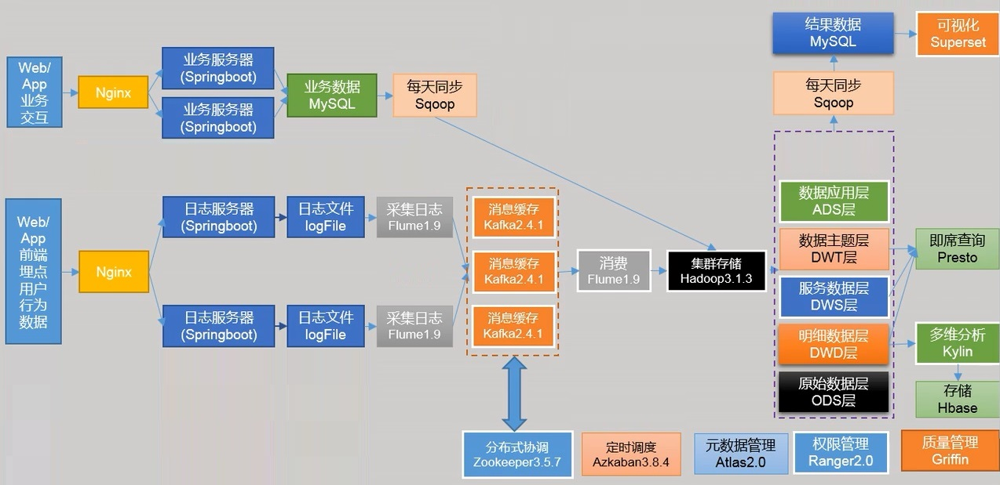
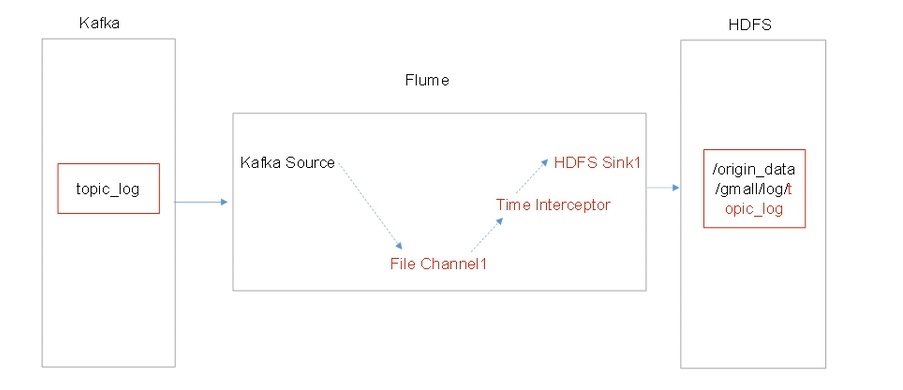
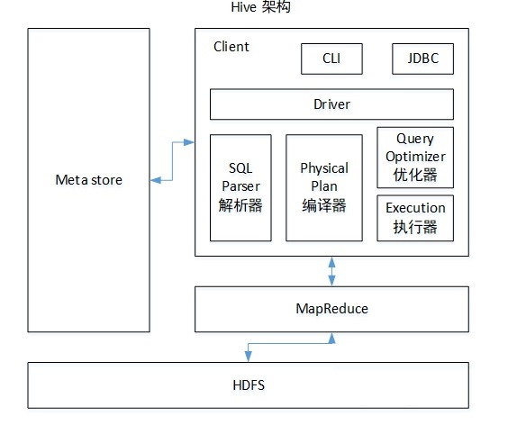

# Data Warehouse: Offline, Optimization


Data warehouse is a system that pulls together data derived from operational systems and external data sources within an organization for reporting and analysis. A data warehouse is a central repository of information that provides users with current and historical decision support information.

<!--more-->

## 数据仓库

### 概念


> 数仓是对数据进行 **备份、清洗、聚合、统计** 等操作。
>
> ODS原始数据层；DWD明细数据层；DWS服务数据层；DWT数据主题层；ADS数据应用层

### 技术组件

+ 数据采集传输：`Flume，Kafka，DataX`，Sqoop，Logstash
+ 数据存储：`MySQL，HDFS，HBASE`，Redis，MongoDB
+ 数据计算：`Hive，Spark`，Flink，Tez，Storm
+ 数据查询：`Presto，Kylin`，Impala，Druid
+ 数据可视化：Echarts、`Superset`、QuickBI、DataV
+ 任务调度：Azkaban、Oozie
+ 集群监控：Zabbix
+ 元数据管理：Atlas
+ 权限管理：Ranger

### 系统流程图



+ `业务数据 / 前端 js 埋点行为数据：`持久化或不持久化写入数据库。

+ `Nginx：`负载均衡，使每个节点数据量保持合理。

+ `Flume：`采集日志。可以直接采集到 Hadoop，但 hadoop 可能处理很慢，如双11。可以先写到 Kafka 里。

  Flume 组成，Put 事务，Take 事务

  Flume 三个器：拦截器，选择器，监控器

  Flume 优化：内存，台数

+ `Kafka：`23 件事

  1.kafka基本信息 2.挂了 3.丢失 4.重复 5.积压 6.优化 7.高效读写的原因

+ `Zookeeper：`分布式协调

  1.部署多少台 2.选举机制，Paxos算法

+ `Flume：` 消费传到 Hadoop

+ `Hive：` 1.Hive内部表、外部表区别 2.4个by 3.系统函数 4.UDF、UDTF函数 5.窗口函数 6.Hive优化 7.数据倾斜 8.Hive引擎 9.元数据备份

### 集群配置

配置原则:

1. 消耗内存的组件要分开：HDFS 的 NameNode、Yarn 的 ResourceManager 分开配置
2. kafka、zk、flume 传输数据比较紧密的放在一起
3. 客户端放在一到两台服务器上，方便外部访问

## 数据采集模块

### Hadoop

>优化：
>
>1. 数据均衡：节点与节点间，磁盘与磁盘间，都可以使用命令使数据均衡，threshold 设置差值。
>
>2. LZO 压缩：hadoop 额外支持 gzip、Snappy、Lzo、Lzop(分片) 压缩方式。LZO创建索引后可以实现分片。
>
>   需要压缩的三个地方：
>
>|                                                    | Map  |        | Reduce |                                                              |
>| -------------------------------------------------- | ---- | ------ | ------ | ------------------------------------------------------------ |
>| 输入端                                             |      | 快     |        | 输出端                                                       |
>| 先考虑数据量<br>1.小 => 快                         |      | snappy |        | 看需求<br>1.永久保存：压缩越小越好                           |
>| 2.数据量大 => 切片<br>bzip2<br>lzo => 需要创建索引 |      | lzo    |        | 2.下一个mapreduce输入端<br>数据量小 => 快<br>数据量大 => 切片 压缩 |
>
>3. HDFS参数调优：
>   1. 对于大集群或者大量客户端的集群来说，通常需要调大 dfs.namenode.handler.count 的个数，默认值为10个。建议调整为 20 * loge<sup>cluster size</sup>
>4. Yarn参数调优 yarn-site.xml：
>   1. 情景描述：总共7台机器，每天几亿条数据，数据源 -> Flume -> Kafka -> HDFS -> Hive
>   2. 问题：数据统计主要用 HiveSQL，没有数据倾斜，小文件已经做了合并处理，开启了 JVM 重用，而且IO 没有阻塞，**内存用了不到 50%**，但还是跑的非常慢，而且数据量洪峰时，整个集群都会宕掉，基于这种情况的优化方案是什么。
>   3. 解决办法：典型的内存利用率不够，一般是 Yarn 的2个配置造成的，**单个任务可以申请的最大内存大小**，和 **Hadoop 单个节点可用内存大小**。调节这两个参数能提高系统内存的利用率。 （NodeManager 默认内存大小 8g，单个任务默认内存大小 8g，maptask默认内存大小 1g，reducetask默认内存大小 1g。）NodeManager内存改为节点 80% 左右的内存大小。单个任务内存大小根据每 128M 数据分配1g内存。maptask 和 reducetask 内存若不支持压缩也需要调大。

### Zookeeper

### Kafka

> kafka 机器数量计算：
>
> 机器数量（经验公式）= 2 *（峰值生产速度 * 副本数 / 100) + 1
>
> 先通过压测拿到峰值生产速度，比如峰值生产速度是 50M/s。副本数默认是1个，生产环境可以设置为2。Kafka 机器数量 = 2 * （50 * 2 / 100）+ 1 = 3 台。

> kafka producer 生产者压力测试：
>
> ```shell
> bin/kafka-producer-perf-test.sh --topic test --record-size 100 --num-records 100000 --throughput -1 --producer-props bootstrap.servers=hadoop102:9092,hadoop103:9092
> ```
>
> 参数说明：
>
> --record-size：是一条信息有多大，单位是字节。
>
> --num-records：是总共发送多少条信息。
>
> --throughput：是每秒多少条信息，设成-1表示不限流，可测出生产者最大吞吐量。

> kafka consumer 消费者压力测试：
>
> 如果 IO、CPU、内存、网络 这四个指标都不能改变，考虑增加分区数来提升性能。
>
> 参数说明：
>
> --broker-list：指定 kafka 集群地址
>
> --topic：指定 topic 的名称
>
> --fetch-size：指定每次 fetch 的数据大小
>
> --messages：总共要消费的消息个数

> kafka 分区数计算：
>
> 1. 创建一个只有一个分区的topic
> 2. 测试这个 topic 的 producer 吞吐量和 consumer 吞吐量。
> 3. 假设他们的值是 Tp 和 Tc，单位是 MB/s。
> 4. 然后假设总的目标吞吐量是 Tt，那么分区数 = Tt/min( Tp，Tc)
> 5. 分区数一般设置为：3 - 10个

### Flume

> Flume 组件选型
>
> 1. Source：
>
>    1. Taildir Source：支持断点续传、多目录。但可能有数据重复（重复数据在下一级解决：在 hive 的 dwd 层、spark streaming 使用 group by、开窗取窗口第一条数据）
>
> 2. Channel：
>
>    1. kafka channel：数据存放在 kafka 里面。kafka 数据存在磁盘里。
>
>       **基于磁盘，可靠性高** 
>
>       kafka channel > memory channel + kafka sink
>
>       如果下一级是 kafka，优先选择 kafka channel
>
>       如果下一级不是 kafka，对可靠性要求比较高，金融领域，优先选择 file channel
>
>       如果下一级不是 kafka，对可靠性要求不高，选择 memory channel，追求效率
>
>       kafka channel 1.6版本产生，但有 bug 产生的数据是 header + 内容，1.7 版本解决

> Flume 拦截器
>
> Flume 消费 Kafka 里面的数据时，可能已经是第二天，数据有可能发往第二天的 HDFS 路径。
>
> 解决思路：拦截 json 日志，通过 fastjson 解析 json，获取实际时间 ts。将获取的 ts 时间写入拦截器 header 头，header 的 key 必须是 **timestamp，因为 Flume 框架会根据这个 key 的值识别为时间，写入到 HDFS。**
>
> 1. 创建 Maven 工程 flume-interceptor
> 2. 创建包名：com.whatever.flume.interceptor
> 3. 在 pom.xml 文件中添加配置
> 4. 在 com.whatever.flume.interceptor 包下创建 JSONUtils 类
> 5. 在 com.whatever.flume.interceptor 包下创建 ETLInterceptor 类，重写方法，判断是否符合 JSON 格式
> 6. 打包，分发到 Flume 节点

> 

> Flume优化：
>
> 1. 内存参数设置优化：
>    1. JVM heap 一般设置为 4G 或更高
>    2. -Xmx（启动内存） 与 -Xms（运行内存） 最好设置一致，减少内存抖动带来的性能影响，如果不一致容易倒置 fullgc

### DataX

> 同步策略：
>
> | 同步策略 | 优点                           | 缺点     |
> | -------- | ------------------------------ | -------- |
> | 全量同步 | 逻辑简单                       | 效率低   |
> | 增量同步 | 效率高，无需同步和存储重复数据 | 逻辑复杂 |
>

> DadaX 相比 Sqoop 功能更强大：
>
> | 功能     | DataX                          | Sqoop                |
> | -------- | ------------------------------ | -------------------- |
> | 运行模式 | 单进程多线程                   | MR                   |
> | 分布式   | 不支持<br>可以通过调度系统规避 | 支持                 |
> | 流控     | 有                             | 需定制               |
> | 统计信息 | 有                             | 分布式数据收集不方便 |
> | 数据校验 | 有                             | 需定制               |
> | 监控     | 需定制                         | 需定制               |

> DataX 调度决策思路：
>
> 举例，用户提交了一个 DataX 作业，并且配置了总的并发数为 20，目的是对一个有 100 张分表的 MySQL 进行同步。调度决策思路是：
>
> 1. dataX job 根据分库分表切分策略，将同步工作分成 100 个 Task。
> 2. 根据配置的总的并发度 20，以及每个 TaskGroup 的并发度 5，dataX共需要 4 个 TaskGroup。
> 3. 4 个 TaskGroup 分 100 个 Task，每个 TaskGroup 负责 25个 Task。

> 同步 HDFS 数据到 MySQL 案例：
>
> 选用 HDFSReader 和 MySQLWriter，分别设置 json 配置文件。

> DataX优化：
>
> 提升 DataX job 内 channel 并发数，内存的占用显著增加，每个 channel 会有一个 Buffer，作为临时数据交换的缓冲区，而在 reader 和 writer 中，也会有 buffer，为了防止 OOM，需要调大 JVM 的堆内存。
>
> 调整 JVM xms xmx 参数的两种方式：一种是直接更改 datax.py 脚本；另一种是在启动的时候，加上参数：
>
> `python datax/bin/datax.py --jvm="-Xms8G -Xmx8G" /path/to/your/job.json`

### Maxwell

> MySQL 变更数据抓取软件，实时监控 MySQL 的 insert、update、delete。并将变更数据发送给 Kafka 等流数据处理平台。

> 原理：
>
> 读取 MySQL 的二进制日志（Binlog），从中获取变更数据。

## 数据采集模块总结

### Linux

```shell
# 命令
top
ps -ef
df -h	#磁盘空间
netstat	#查看端口号

# 4个工具
awk sed sort cut

# 写过什么脚本
1. 同步分发
2. 启动停止
```

### Sqoop

> 导入数据的方式：
>
> + 全量：where 1=1
> + 增量：where 创建时间 = 当天
> + 新增及变化：where 创建时间 = 当天 or 操作时间 = 当天
> + 特殊：只导入一次

### Hadoop

> 常用端口号：
>
> + 2.x：50070/8020：HDFS   8088：任务情况   19888：Job history
> + 3.x：9870/8020：HDFS   8088：任务情况   19888：Job history

> 配置文件：
>
> + /etc/profile
> + 2.x：core-site.xml    hdfs-site.xml    yarn-site.xml    mapred-site.xml    slaves
> + 3.x：core-site.xml    hdfs-site.xml    yarn-site.xml    mapred-site.xml    workers

### HDFS

> HDFS 的读写流程，笔试：
>
> 写详细步骤：
>
> 1. 客户端向NameNode发出写文件请求。
> 2. 检查是否已存在文件、检查权限。若通过检查，直接先将操作写入EditLog，并返回输出流对象。 
>    （注：WAL，write ahead log，先写Log，再写内存，因为EditLog记录的是最新的HDFS客户端执行所有的写操作。如果后续真实写操作失败了，由于在真实写操作之前，操作就被写入EditLog中了，故EditLog中仍会有记录，我们不用担心后续client读不到相应的数据块，因为在第5步中DataNode收到块后会有一返回确认信息，若没写成功，发送端没收到确认信息，会一直重试，直到成功）
> 3. client端按128MB的块切分文件。
> 4. client将NameNode返回的分配的可写的DataNode列表和Data数据一同发送给最近的第一个DataNode节点，此后client端和NameNode分配的多个DataNode构成pipeline管道，client端向输出流对象中写数据。client每向第一个DataNode写入一个packet，这个packet便会直接在pipeline里传给第二个、第三个…DataNode。 
>    （注：并不是写好一个块或一整个文件后才向后分发）
> 5. 每个DataNode写完一个块后，会返回确认信息。 
>    （注：并不是每写完一个packet后就返回确认信息，因为packet中的每个chunk都携带校验信息，没必要每写一个就汇报一下，这样效率太慢。正确的做法是写完一个block块后，对校验信息进行汇总分析，就能得出是否有块写错的情况发生）
> 6. 写完数据，关闭输输出流。
> 7. 发送完成信号给NameNode。 
>    （注：发送完成信号的时机取决于集群是强一致性还是最终一致性，强一致性则需要所有DataNode写完后才向NameNode汇报。最终一致性则其中任意一个DataNode写完后就能单独向NameNode汇报，HDFS一般情况下都是强调强一致性）
>
> 读详细步骤：
>
> 1. client访问NameNode，查询元数据信息，获得这个文件的数据块位置列表，返回输入流对象。
> 2. 就近挑选一台datanode服务器，请求建立输入流 。
> 3. DataNode向输入流中中写数据，以packet为单位来校验。
> 4. 关闭输入流

> 小文件危害：
>
> 1. 存储时间：小文件会占用 namenode 一整个区块，一个文件块150字节。128g内存的 namenode 能存储 9亿个文件块。
> 2. 计算时间：1个文件块开启1个maptask，一个maptask就是1g内存。
>
> 如何解决：
>
> 1. 合并：CombineTextinputformat => 减少 maptask
> 2. har归档
> 3. JVM重用

> HDFS 有几个副本：
>
> 3

> HDFS 块大小：
>
> 2.x 3.x：128M

### Mapreduce

> shuffle 及其优化：
>
> shuffle 定义：map 方法之后，reduce方法之前混洗的过程。
>
> map 阶段之后：
>
> 1. 先调用 getpartition 方法，标记数据是哪一个分区。
> 2. 进入环形缓冲区（缓冲区大小100M ），到达 80% 进行溢写（排序手段：对 **key** 的索引按照 **字典序** 进行 **快排**）
> 3. 对溢写文件进行归并，写到指定磁盘，持久化到磁盘。
>
> reduce 阶段之前：
>
> 1. 拉取磁盘上指定的数据，放到内存中（内存不够在磁盘中）
> 2. reduce 操作
>
> 优化：
>
> 1. getpartition 方法时：自定义分区：解决数据倾斜问题。
>
> 2. 调整缓冲区大小和溢写阈值，缓冲区大小由100M调整到200M，溢写阈值由80%调整到90%。产生大量的溢写文件，使用combiner聚类文件（前提是不影响最终业务逻辑）。这样减少了写文件的个数，合并会快一些。
>
> 3. 溢写文件归并到磁盘：减少磁盘IO压缩，使用快的压缩算法：snappy/lzo
>
> 4. 
>
> 5. |                                                    | Map  |        | Reduce |                                                              |
>    | -------------------------------------------------- | ---- | ------ | ------ | ------------------------------------------------------------ |
>    | 输入端                                             |      | 快     |        | 输出端                                                       |
>    | 先考虑数据量<br>1.小 => 快                         |      | snappy |        | 看需求<br>1.永久保存：压缩越小越好                           |
>    | 2.数据量大 => 切片<br>bzip2<br>lzo => 需要创建索引 |      | lzo    |        | 2.下一个mapreduce输入端<br>数据量小 => 快<br>数据量大 => 切片 压缩 |
>
> 6. reduce 拉取磁盘指定的数据，默认拉取5个，可以改成10 - 20个
>
> 7. yarn 和 hadoop内存大小调整：**单个任务可以申请的最大内存大小**，和 **Hadoop 单个节点可用内存大小**。调节这两个参数能提高系统内存的利用率。 （NodeManager 默认内存大小 8g，单个任务默认内存大小 8g，maptask默认内存大小 1g，reducetask默认内存大小 1g。）NodeManager内存改为节点 80% 左右的内存大小。单个任务内存大小根据每 128M 数据分配1g内存。maptask 和 reducetask 内存若不支持压缩也需要调大。

> 进行了几次排序：
>
> map后进行一次快排，一次归并。
>
> reduce时进行一次归并，一次分组。

### Yarn

>yarn 的工作机制：
>
>1. 用户使用客户端向 RM 提交一个任务，同时指定提交到哪个队列和需要多少资源。用户可以通过每个计算引擎的对应参数设置，如果没有特别指定，则使用默认设置。
>
>2. RM 在收到任务提交的请求后，先根据资源和队列是否满足要求选择一个 NM，通知它启动一个特殊的 container，称为 ApplicationMaster（AM），后续流程由它发起。
>
>3. AM 向 RM 注册后根据自己任务的需要，向 RM 申请 container，包括数量、所需资源量、所在位置等因素。
>
>4. 如果队列有足够资源，RM 会将 container 分配给有足够剩余资源的 NM，由 AM 通知 NM 启动 container。
>
>5. container 启动后执行具体的任务，处理分给自己的数据。NM 除了负责启动 container，还负责监控它的资源使用状况以及是否失败退出等工作，如果 container 实际使用的内存超过申请时指定的内存，会将其杀死，保证其他 container 能正常运行。
>
>6. 各个 container 向 AM 汇报自己的进度，都完成后，AM 向 RM 注销任务并退出，RM 通知 NM 杀死对应的 container，任务结束。

> hadoop 调度器：
>
> 1. 三种调度器：FIFO、容量调度器、公平调度器
> 2. Apache默认调度器：容量调度器（apache默认资源很小）
> 3. CDH默认调度器：公平调度器
> 4. 特点：
>    1. FIFO调度器特点：支持单队列，任务先进先出，企业中几乎不用。
>    2. 容量调度器：底层是FIFO调度器。支持多队列，可以借用其他队列资源。先进入的任务优先执行。
>    3. 公平调度器：支持多队列(并发度比容量调度高)，可以借用其他队列资源。队列中所有任务公平享有队列资源。
> 5. 容器调度器配置多队列：
>    1. 按照分析引擎创建队列：mr、spark、flink、hive
>    2. 按照业务：登录、注册、购物车、下单、支付

### Zookeeper

> 选举机制：
>
> 1. 半数机制：3台服务器，2台投谁谁就是老大

> 常用命令：
>
> `delete create`

> 安装台数：
>
> 根据集群机器数量，3-11台。zk台数多了，增加可靠性，但降低选举效率。

### Flume

> 组成：（source、channel、sink、put事务、take事务）
>
> 1. source：（Taildirsource）
>    1. 优点：断点续传、多目录，实时监控。缺点：文件名更名(如log4j就是更名的日志框架)之后重新读取该文件造成重复。注意：让Taildirsource判断文件时只看iNode值
>    2. Apache 1.7、CDH1.6版本产生的
>    3. 没有断点续传怎么办：自定义 source，读取的位置始终持久到磁盘上
>    4. 挂了：不会丢数据，但有可能重复数据
>    5. 如何处理重复数据：不处理或下一级处理，采用事务方式效率太低
>    6. 不支持递归遍历文件夹：自定义递归
> 2. channel：（KafkaChannel）
>    1. 优点：将数据写入Kafka，省了一层sink
>    1. file channel 磁盘|可靠性高|性能低
>    2. memory channel 内存|可靠性低|性能高
>    3. kafka channel 存kafka里，kafka存在磁盘|可靠性高|性能优于 memory channel + kafka sink
> 3. sink：（HDFS sink）
>    1. 用来解决小文件问题
>    2. 设置大小128M、时间（1-2小时）、event个数禁止0

> KafkaChannel：在kafka中既可以生产者也可以作为消费者
> 用法：
>
> 1. source - kafkachannel - sink
> 2. source - kafkachannel（作为消费者）
> 3. kafkachannel - sink（作为生产者）

> 三个器：（拦截器、选择器、监控器）
>
> 1. 拦截器：时间戳拦截器 或者 自定义拦截器
> 2. 选择器：默认是replicating，把数据发往下一级所有通道
> 3. 监控器：g, 监控 put、take 事务尝试提交的次数远远大于最终提交成功的次数，说明 flume 异常。自身：增加内存，其他：增加 flume 台数

> 优化：
>
> 1. file channel 能配置多目录就配置多目录（不同磁盘）
> 2. 使用 HDFS sink 用来解决小文件问题
> 3. 通过监控器找寻原因，增加内存和台数

> 挂了恢复：
>
> 1. channel 挂了：memory channel 100个event 数据丢失。（file channel 100万个event，没有丢失风险）
> 2. taildir source 挂了：不会丢数，可能重复数据

### Kafka

> 基本信息：
>
> 1. 组成：
>    1. producer：
>       1. ACK：0   1   -1
>       2. 拦截器，序列化器，分区器
>       3. 发送流程
>       4. 幂等性，事务
>       5. 分区规则： 有指定分区则发往指定分区 ；没有指定分区，则根据key值Hash；没有指定分区也没有key的时候，轮询（粘性）
>    2. broker：
>       1. Topic：副本（高可靠）
>          1. ISR：LEO、HW
>       2. 分区（高并发，负载均衡，防止热点）
>    3. consumer
>       1. 分区分配规则
>       2. offset保存：
>          1. 默认：__consumer\_offsets主题。
>          2. 其他：手动维护Offset（MySQL）
>          3. 保存数据&保存Offset写到一个事物
>          4. 精准一次消费
>          5. 先保存数据后保存Offset   重复数据+幂等性（精准一次消费）
>          6. 先保存Offset后保存数据   丢失数据
>    4. zk：存放 broker（id, topic），consumer（相应的 offset），没有生产者信息
> 2. 安装台数：`2 * (生产者峰值生产速率(压测) * 副本 / 100) + 1`, 
>    1. 先使用3台机器压测
> 3. 副本数：通常2个副本，默认1个副本。多：可靠性高，传输性能差
> 4. 数据量：100万日活 一人100条 一条1k。 1M/s
> 5. 数据保存多久：3天
> 6. 磁盘预留：100g(一天数据) * 2个副本 * 3天 / 0.7
> 7. 监控：kafka egale：开源框架
> 8. 分区：提高并发度：先设置1个，通过压测生产者峰值生产速率tp、消费者峰值消费速率tc
>    1. 期望吞吐量t 100m/s
>    2. 分区数 = t / min (tp, tc)
> 9. 分区分配策略：
>    1. range 默认
>    2. roundrobin 采用 roundrobin 所有数据采用 hash 方式大散，再采用轮询的方式执行
> 10. isr：主要解决leader挂了谁当老大，在 isr 队列的都有机会当老大。
> 11. 多少个 topic：满足下一级消费者即可。

> 挂了:
>
> 1. 短期：flume channel 缓冲数据
> 2. 长期：日志服务器保留30天日志

> 丢：ack 配置参数
>
> + 0：发送数据，不需要应答。可靠性最差，传输性能最好。
> + 1：发送数据，leader 应答。可靠性一般，传输性能一般。
> + -1：发送数据，leader 和 follower 共同应答。可靠性最高，传输性能最差。
> + 企业中：0几乎不用，不太重要1，重要-1

> 重复：
>
> 1. 采用 事务、幂等性、ack = -1
>    1. 幂等性：单分区单会话内数据不重复
>    2. 事务：每条数据比较，可以比较多个分区
>    3. 事务：
> 2. 在下一级处理：

> 积压：kafka 保存数据的时间是有限的，没有及时消费完
>
> 1. 增加分区，同时增加消费者对应的CPU核数
> 2. 增加消费者 batchsize

> 优化：
>
> 1. 日志保存3天
> 2. 增加网络通信延迟时间

> 1. 高效读写原因：
>    1. 集群，分区
>    2. 顺序读写600m/s(vip)，随机读写100m/s
>    3. 零拷贝
> 2. 传输一条2m日志文件，现象：卡住。调整两个参数大小
> 3. 数据过期：删除 或者 压缩，通常删除，副本备份30天数据

### Hive

> 组成：

> 内部表和外部表区别：
>
> 1. 内部表删除数据：元数据、原始数据 删掉
> 2. 外表删数据：元数据删掉，原始数据保留
> 3. 只有自己临时使用表，创建内部表。绝大部分场景都是外部表

> 4个by：
>
> order by：全局排序 （只有一个reduce task，数据倾斜，资源分配不足）不使用
>
> sort by：局部排序，只保证每个 reducer task 输出有序
>
> distribute by：分桶，取余分组，没有排序
>
> cluster by： distribute by + sort by

> 自定义函数：
>
> 1. 自定义udf函数步骤： 1进1出，一行，定义类 继承udf，重写 evaluate 方法
> 2. 自定义udtf函数步骤：多进多出，继承 udtf，重写三个方法（初始化（定义名称、校验返回值类型）、close、process）。打包+上传hdfs+在hive客户端创建

> 窗口函数：rank、over、topn

> 优化：
>
> 1. 行列过滤：join -> where => where -> join
> 2. 分区
> 3. 小文件：combineHiveInputformat 或者 JVM重用 或者 merge
> 4. 压缩

## 数据仓库

### 数据分层

> + ODS（Operation Data Store）原始数据层：存放原始数据，起到备份的作用
> + DWD（Data Warehouse Detail）明细数据层：清洗，去空，去脏数据，维度退化
> + DWS（DW service）按天进行轻度汇总
> + DWT（DW Topic）按主题进行汇总
> + ADS（Application Data Store）为各种统计报表提供数据

### 数仓建模

> ODS层：
>
> + 创建支持LZO压缩的表：减少存储空间，100g -> 10g - 5g(取决于文件格式，比如JSON的嵌套方式，CSV的列数量)
> + 创建分区表：防止全表扫描（导数据：全量、增量、新增和变化）
> + 保持数据原貌不做任何修改，起到备份数据的作用

> DWD层：🔶
>
> + 选择业务过程 -> 声明粒度 -> 确认维度 -> 确认事实
> + 业务过程：哪些协议需要做处理
> + 声明粒度：粒度可以是天、一人、区域
> + 确认维度：时间维度、地区维度、用户维度
> + 确认事实：业务中的度量值（次数、个数、件数、金额、可以进行累加）

> DWS层：
>
> + 对各个主题对象进行统计：天、月、年、地区、用户

> DWT层：
>
> + 统计累计行为：从开始到结束，总结表

### 数据处理

> 数据处理大致分为两大类：
>
> + OLTP（on-line transaction processing）联机事务处理
> + OLAP（on-line Analytical Processing）联机分析处理

