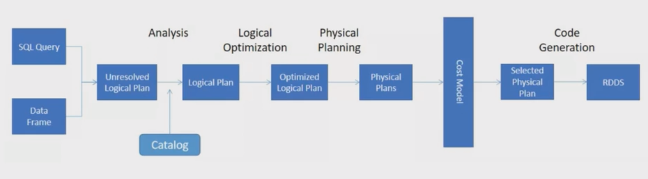
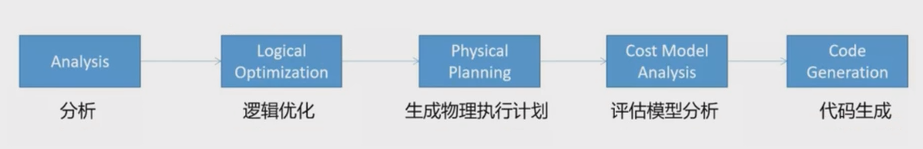
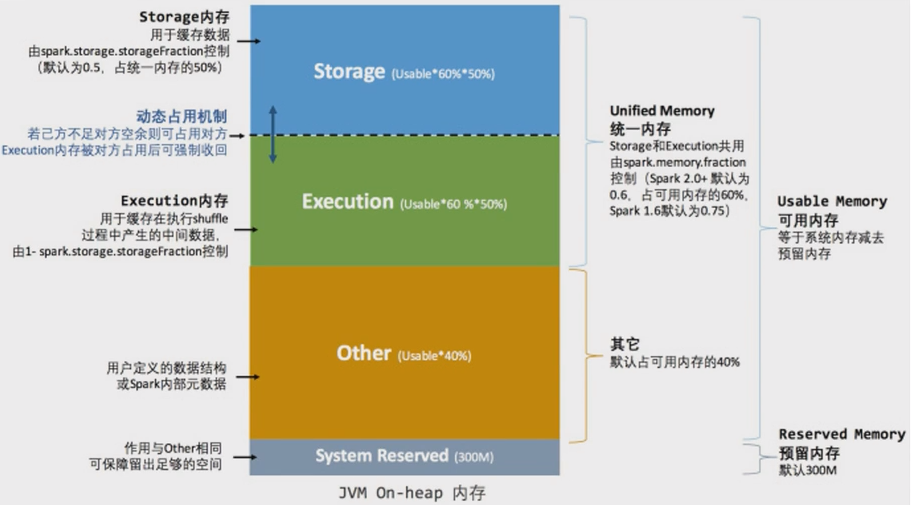

# Spark Performance Optimization


Spark SQL is the top active component in latest spark release. 46% of the resolved tickets are for Spark SQL. These enhancements benefit all the higher-level libraries, including structured streaming and MLlib, and higher level APIs, including SQL and DataFrames. Various related optimizations are added in latest release.

<!--more-->

## Explain 查看执行计划

### 语法

```scala
.explain(mode="xxx")
```

+ `explain(mode="simple")`: 只展示物理执行计划
+ `explain(mode="extended")`: 展示物理计划和逻辑执行计划
+ `"codegen"`: 展示 codegen 生成的可执行 Java 代码
+ `"cost"`: 展示优化后的逻辑执行计划以及相关的统计
+ `"formatted"`: 分隔输出，输出更易读的物理执行计划并展示每个节点的详细信息

### 执行计划处理流程





**🔴Unresolved 逻辑执行计划：== Parsed Logical Plan ==**

+ Parser 组件检查 SQL 语法是否有问题，然后生成 Unresolved 的逻辑计划，不检查表名、不检查列明

**🟠Resolved 逻辑执行计划：==Analyzed Logical Plan ==**

+ Spark 中的 Catalog 存储库来解析验证语义、列名、类型、表名等

🟡**优化后的逻辑执行计划：== Optimized Logical Plan ==**

+ Catalyst 优化器根据各种规则进行优化

**🟢物理执行计划：== Physical Plan ==**

1. `HashAggregate` 运算符表示数据聚合，一般 HashAggregate 是成对出现，第一个 HashAggregate 是将执行节点本地的数据进行局部聚合，另一个 HashAggregate 是将各个分区的数据进行聚合计算
2. `Exchange` 运算符其实就是 shuffle，表示需要在集群上移动数据。很多时候 HashAggregate 会以 Exchange 分隔开
3. `Project`运算符是 SQL 中的选择列，select name, age
4. `BroadcastHashJoin`表示通过基于广播方式进行 HashJoin
5. `LocalTableScan` 表示全表扫描本地的表

## 资源调优

### 资源规划

#### 资源设定考虑

##### 总体原则

单台服务器 128G 内存，32线程。

先设定单个 Executor 核数，根据 Yarn 配置得出每个节点最多的 Executor 数量，(Yarn 总核数 / 每个executor核数(通常为4)) = 单个节点的executor数量；

28 / 4 = 7 单个节点的executor数量；

总的 executor 数 = 单节点executor数量 * nm节点数。

##### 具体提交参数

1. executor-cores

   每个 executor 的最大核数。3 ~ 6 之间比较合理，通常为4

2. num-executors

   num-executors = 每个节点的 executor 数 * work 节点数；

   每个 node 的 executor 数 = 单节点 yarn 总核数 / 每个 executor 的最大 cpu 核数；

   32线程有28线程用在 Yarn 上；

   那么每个 node 的 executor 数 = 28 / 4 = 7；

   假设集群节点为10；

   那么 num-executors = 7 * 10 = 70。

3. executor-memory⭐

   executor-memory = Yarn 内存 / 单个节点的executor数量；

   100G(总128G, 100G 给 Yarn) / 7 = 14G; 

#### 内存设置

**一个 executor 内部**



🟢估算 Other 内存 = 自定义数据结构 * 每个 Executor 核数

🔵估算 Storage 内存 = 广播变量 + cache/Executor 数量

🟣估算 Executor 内存 = 每个 Executor 核数 * (数据集大小/并行度)

* Sparksql 并行度默认为 200，并行度即为 Task 数量

### 持久化和序列化

#### RDD

##### Kryo 序列化缓存

使用：

1. sparkConf 指定 kryo 序列化器
2. sparkConf 注册样例类

```scala
new SparkConf()
...
.set("spark.serializer","...kryoSerializer")
.registerKryoClasses(Array(classOf[...]))

result.persist(StorageLevel.MEMORY_ONLY_SER)
```

测试：

> 2G 的 HIVE 元数据，使用 RDD 缓存，完成 100% Fraction Cached 需要 7 G左右内存，使 partition 很容易挂掉。使用 Kryo 序列器完成 Cached 需要 1 G内存。

#### DF、DS

cache 默认使用 `MEMORY_AND_DISK`缓存



1. 序列化器(Java, Kryo)是针对 RDD 而言的；而 DF、DS 是由 encoder 选择的。
2. encoder 由 SparkSql 自己实现的，也有可能使用 kryo 的方式。
3. 对 DF、DS使用序列化差别不大。



###  CPU优化

#### CPU 低效原因

##### 并行度

并行度就是 Task 数量。

🟠RDD 并行度参数：

+ `spark.default.parallelism`

+ 不设置时，默认由 join、reduceByKey 和 parallelize 等转换决定。

🟡SparkSQL 并行度参数：与 RDD 并行度互不影响

+ `spark.sql.shuffle.partitions`

+ 默认是 200，只能控制 SparkSQL、DataFrame、Dataset 分区个数。

##### 并发度

并发度：同时执行的 Task 数量。

##### CPU 低效原因

1. 并行度较低、数据分片较大容易导致 CPU 线程挂起；
2. 并行度过高、数据过于分散会让调度开销更多；

#### CPU 资源调整

`spark-submit --master yarn --deploy-mode client --driver-memory 1g --num-executors 3 --executor-cores 4 --executor-memory 6g --class com.jar`

🟣官方推荐并行度（Task 数）设置成并发度（vcore 数）的 2 倍到 3 倍。

例：如果以目前的资源（3 个 executor）去提交，每个 executor 有两个核，总共 6 个核，则并行度设置为 12 ~ 18。

```scala
SparkConf()
...
.set("spark.sql.shuffle.partitions", "18")
```

## SparkSQL 语法优化

### 基于 RBO 优化

#### 谓词下推

```scala
//=============Inner on 左表=============
spark.sqlContext.sql(
  """
    |select
    | l.id,
    | l.name,
    | r.id,
    | r.name
    |from course l join student r
    | on l.id=r.id and l.dt=r.dt and l.dn=r.dn
    |on l.id<2
    |""".stripMargin)
//=============Inner where 左表=============
spark.sqlContext.sql(
  """
    |select
    | l.id,
    | l.name,
    | r.id,
    | r.name
    |from course l join student r
    | on l.id=r.id and l.dt=r.dt and l.dn=r.dn
    |where l.id<2
    |""".stripMargin)
```

**inner join**

+ 无论是 ON 还是 WHERE，无论条件是右表还是左表。从 logic plan -> Analyzed logical plan 到 **optimized logical plan**，sparkSQL 都会优化**先过滤数据再进行 join** 连接，而且其中一表过滤，**另一表也优化提前过滤**（最终要过滤数据，另一表也没有存在的必要）

**left join**

+ |                 | 条件在 左表 | 条件在 右表 |
  | --------------- | ----------- | ----------- |
  | 条件在 on 后    | 只下推右表  | 只下推右表  |
  | 条件在 where 后 | 两表都下推  | 两表都下推  |

+ 注意：外关联时，过滤条件在 on 与 where，语义是不同的，结果也是不同的。

#### 列裁剪

扫描数据源的时候，只读取那些与查询相关的字段。

#### 常量替换

Catalyst 会使用 constantFolding 规则，自动用表达式的结果进行替换。

### 基于 CBO 优化

#### Statistics 收集

需要先执行特定的 SQL 语句来收集所需的表和列的统计信息。

🔵 生成表级别统计信息（扫表）：

`ANALYZE TABLE 表明 COMPUTE STATISTICS`

#### 使用 CBO

通过 `spark.sql.cbo.enabled` 来开启，默认是 false。CBO 优化器可以基于表和列的统计信息，选择出最优的查询计划。比如：Build 侧选择、优化 Join 类型、优化多表 Join 顺序。

### 广播 Join

#### 通过参数指定自动广播

广播 join 默认值为 10MB，由 `spark.sql.autoBroadcastJoinThreshold`参数控制。

#### 指定广播

1. sparkSQL 加 HINT 方式
2. 使用 function._ broadcast API 

### SMB Join

大表 JOIN 大表，进行 SMB（sort merge bucket）操作：

需要进行分桶，首先会进行排序，然后根据 key 值合并，把相同 key 的数据放到同一个 bucket 中（按照 key 进行 hash）。分桶的目的就是把大表化成小表。相同的 key 的数据都在同一个桶中，再进行 join 操作，那么在联合的时候就会大幅度的减小无关项的扫描。

## 数据倾斜

### 现象

绝大多数 Task 任务运行速度很快，但几个 Task 任务运行速度极其缓慢，慢慢的可能接着报内存溢出的问题。


### 原因

数据倾斜发生在 shuffle 类的算子，比如 distinct、groupByKey、reduceByKey、aggregateByKey、join、cogroup 等，涉及到数据重分区，如果其中某一个 key 数量特别大，就发生了数据倾斜。需要先对大 Key 进行定位。

### 数据倾斜大 key 定位

使用抽取采样方法

```scala
val top10key = df
.select(keyColumn).sample(false, 0.1).rdd //抽取 10%
.map(k => (k, 1)).reduceByKey(_+_)
.map(k => (k._2, k._1)).sortByKey(false) //按统计的key进行排序
.take(10)
```

### 单表数据倾斜优化

#### 单表优化

为了减少 shuffle 以及 reduce 端的压力，SparkSQL 会在 map 端会做一个 partial aggregate（预聚合或者偏聚合），即在 shuffle 前将同一分区内所属同 key 的记录先进行一个预结算，再将结果进行 shuffle，发送到 reduce 端做一个汇总，类似 MR 的提前 Combiner，所以执行计划中 Hashaggregate 通常成对出现。

#### 二次聚合

```hive
select 
	id,
	sum(course) total
from
(
	select 
		remove_random_prefix(random_courseid) courseid,
		course
	from
	(
    	select 
        	random_id,
        	sum(sellmoney) course
        from
        (
        	select
            	random_prefix(id, 6) random_id,
            	sellmoney
            from
            	doubleAggre
        )t1
        group by random_id
    )t2
)t3
group by id
```

```scala
def randomPrefixUDF(value, num):String = {
    new Random().nextInt(num).toString + "_" + value
}

def removeRandomPrefixUDF(value):String = {
    value.toString.split("_")(1)
}
```

### Join数据倾斜优化

#### 广播Join

##### 通过参数指定自动广播

广播 join 默认值为 10MB，由 `spark.sql.autoBroadcastJoinThreshold`参数控制。

##### 指定广播

1. sparkSQL 加 HINT 方式
2. 使用 function._ broadcast API 

#### 拆分大 key 打散大表 扩容小表

> 与单表数据倾斜优化的二次聚合不同，join 数据倾斜调优要对两表都进行调整。
>
> 因为大表为了分区加入了前缀，为了和小表匹配上，小表也应建立对应的前缀与之匹配。如：（假设有3个 task，把大key重新打散到所有task上）

|                                                              |      |                 |                                                  |                                                              |       |                                     |
| ------------------------------------------------------------ | ---- | --------------- | ------------------------------------------------ | ------------------------------------------------------------ | ----- | ----------------------------------- |
| 1<br />1<br />1<br />1<br />1<br />1<br />1<br />1<br />2<br />3 | Join | 1<br />2<br />3 | 拆分大 key<br />打散大表<br />扩容小表<br />---> | 0_1<br />1_1<br />2_1<br />0_1<br />1_1<br />2_1<br />0_1<br />1_1 | Join  | 0_1<br />1_1<br />2_1<br />2<br />3 |
|                                                              |      |                 |                                                  |                                                              | Union |                                     |
|                                                              |      |                 |                                                  | 2<br />3                                                     | Join  | 1<br />2<br />3                     |


1. 拆分倾斜的 key：根据 key 过滤出倾斜的数据和除倾斜外的其他数据；
2. 将切斜的 key 打散：打散成 task 数量的份数(比如有36个task)，key 值前加(0 ~ 36)随机数；
3. 小表进行扩容：扩大成 task 数量的份数，key 值用 flatmap 生成 36 份，`i + "_" + key`
4. 倾斜的大 key 与扩容后的表进行join；
5. 没有倾斜的 key与原来的表进行join；
6. 将倾斜 key join 后的结果与普通 key join 后的结果，union起来。

------

👋未完待续👋

