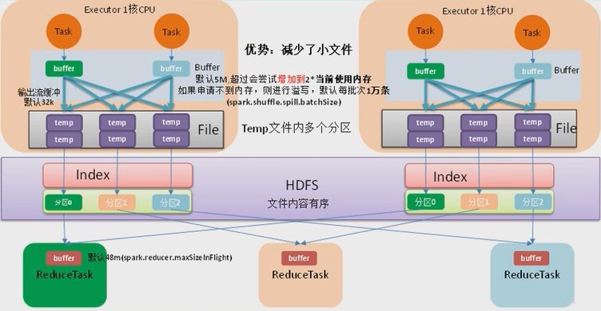
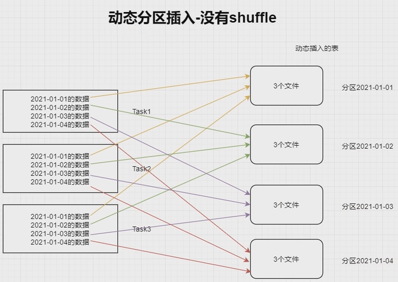
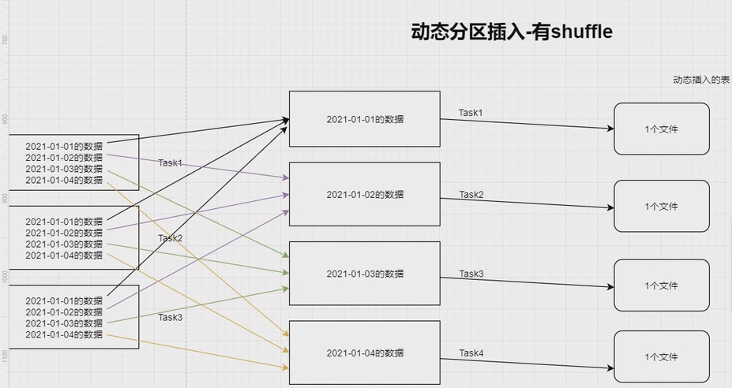

# Spark Performance Optimization


Spark SQL is the top active component in spark 3.0 release. Most of the resolved tickets are for Spark SQL. These enhancements benefit all the higher-level libraries, including structured streaming and MLlib, and higher level APIs, including SQL and DataFrames. Various related optimizations are added in latest release.

<!--more-->

## Explain 查看执行计划

### 语法

```scala
.explain(mode="xxx")
```

+ `explain(mode="simple")`: 只展示物理执行计划
+ `explain(mode="extended")`: 展示物理计划和逻辑执行计划
+ `"codegen"`: 展示 codegen 生成的可执行 Java 代码
+ `"cost"`: 展示优化后的逻辑执行计划以及相关的统计
+ `"formatted"`: 分隔输出，输出更易读的物理执行计划并展示每个节点的详细信息

### 执行计划处理流程


**🔴Unresolved 逻辑执行计划：== Parsed Logical Plan ==**

+ Parser 组件检查 SQL 语法是否有问题，然后生成 Unresolved 的逻辑计划，不检查表名、不检查列明

**🟠Resolved 逻辑执行计划：==Analyzed Logical Plan ==**

+ Spark 中的 Catalog 存储库来解析验证语义、列名、类型、表名等

🟡**优化后的逻辑执行计划：== Optimized Logical Plan ==**

+ Catalyst 优化器根据各种规则进行优化

**🟢物理执行计划：== Physical Plan ==**

1. `HashAggregate` 运算符表示数据聚合，一般 HashAggregate 是成对出现，第一个 HashAggregate 是将执行节点本地的数据进行局部聚合，另一个 HashAggregate 是将各个分区的数据进行聚合计算
2. `Exchange` 运算符其实就是 shuffle，表示需要在集群上移动数据。很多时候 HashAggregate 会以 Exchange 分隔开
3. `Project`运算符是 SQL 中的选择列，select name, age
4. `BroadcastHashJoin`表示通过基于广播方式进行 HashJoin
5. `LocalTableScan` 表示全表扫描本地的表

## 资源调优

### 资源规划

#### 资源设定考虑

##### 总体原则

单台服务器 128G 内存，32线程。

先设定单个 Executor 核数，根据 Yarn 配置得出每个节点最多的 Executor 数量，(Yarn 总核数 / 每个executor核数(通常为4)) = 单个节点的executor数量；

28 / 4 = 7 单个节点的executor数量；

总的 executor 数 = 单节点executor数量 * nm节点数。

##### 具体提交参数

1. executor-cores

   每个 executor 的最大核数。3 ~ 6 之间比较合理，通常为4

2. num-executors

   num-executors = 每个节点的 executor 数 * work 节点数；

   每个 node 的 executor 数 = 单节点 yarn 总核数 / 每个 executor 的最大 cpu 核数；

   32线程有28线程用在 Yarn 上；

   那么每个 node 的 executor 数 = 28 / 4 = 7；

   假设集群节点为10；

   那么 num-executors = 7 * 10 = 70。

3. executor-memory⭐

   executor-memory = Yarn 内存 / 单个节点的executor数量；

   100G(总128G, 100G 给 Yarn) / 7 = 14G; 

#### 内存设置

**一个 executor 内部**


🟢估算 Other 内存 = 自定义数据结构 * 每个 Executor 核数

🔵估算 Storage 内存 = 广播变量 + cache/Executor 数量

🟣估算 Executor 内存 = 每个 Executor 核数 * (数据集大小/并行度)

* Sparksql 并行度默认为 200，并行度即为 Task 数量

### 持久化和序列化

#### RDD

##### Kryo 序列化缓存

使用：

1. sparkConf 指定 kryo 序列化器
2. sparkConf 注册样例类

```scala
new SparkConf()
...
.set("spark.serializer","...kryoSerializer")
.registerKryoClasses(Array(classOf[...]))

result.persist(StorageLevel.MEMORY_ONLY_SER)
```

测试：

> 2G 的 HIVE 元数据，使用 RDD 缓存，完成 100% Fraction Cached 需要 7 G左右内存，使 partition 很容易挂掉。使用 Kryo 序列器完成 Cached 需要 1 G内存。

#### DF、DS

cache 默认使用 `MEMORY_AND_DISK`缓存



1. 序列化器(Java, Kryo)是针对 RDD 而言的；而 DF、DS 是由 encoder 选择的。
2. encoder 由 SparkSql 自己实现的，也有可能使用 kryo 的方式。
3. 对 DF、DS使用序列化差别不大。



###  CPU优化

#### CPU 低效原因

##### 并行度

并行度就是 Task 数量。

🟠RDD 并行度参数：

+ `spark.default.parallelism`

+ 不设置时，默认由 join、reduceByKey 和 parallelize 等转换决定。

🟡SparkSQL 并行度参数：与 RDD 并行度互不影响

+ `spark.sql.shuffle.partitions`

+ 默认是 200，只能控制 SparkSQL、DataFrame、Dataset 分区个数。

##### 并发度

并发度：同时执行的 Task 数量。

##### CPU 低效原因

1. 并行度较低、数据分片较大容易导致 CPU 线程挂起；
2. 并行度过高、数据过于分散会让调度开销更多；

#### CPU 资源调整

`spark-submit --master yarn --deploy-mode client --driver-memory 1g --num-executors 3 --executor-cores 4 --executor-memory 6g --class com.jar`

🟣官方推荐并行度（Task 数）设置成并发度（vcore 数）的 2 倍到 3 倍。

例：如果以目前的资源（3 个 executor）去提交，每个 executor 有两个核，总共 6 个核，则并行度设置为 12 ~ 18。

```scala
SparkConf()
...
.set("spark.sql.shuffle.partitions", "18")
```

## SparkSQL 语法优化

### 基于 RBO 优化

#### 谓词下推

```scala
//=============Inner on 左表=============
spark.sqlContext.sql(
  """
    |select
    | l.id,
    | l.name,
    | r.id,
    | r.name
    |from course l join student r
    | on l.id=r.id and l.dt=r.dt and l.dn=r.dn
    |on l.id<2
    |""".stripMargin)
//=============Inner where 左表=============
spark.sqlContext.sql(
  """
    |select
    | l.id,
    | l.name,
    | r.id,
    | r.name
    |from course l join student r
    | on l.id=r.id and l.dt=r.dt and l.dn=r.dn
    |where l.id<2
    |""".stripMargin)
```

**inner join**

+ 无论是 ON 还是 WHERE，无论条件是右表还是左表。从 logic plan -> Analyzed logical plan 到 **optimized logical plan**，sparkSQL 都会优化**先过滤数据再进行 join** 连接，而且其中一表过滤，**另一表也优化提前过滤**（最终要过滤数据，另一表也没有存在的必要）

**left join**

+ |                 | 条件在 左表 | 条件在 右表 |
  | --------------- | ----------- | ----------- |
  | 条件在 on 后    | 只下推右表  | 只下推右表  |
  | 条件在 where 后 | 两表都下推  | 两表都下推  |

+ 注意：外关联时，过滤条件在 on 与 where，语义是不同的，结果也是不同的。

#### 列裁剪

扫描数据源的时候，只读取那些与查询相关的字段。

#### 常量替换

Catalyst 会使用 constantFolding 规则，自动用表达式的结果进行替换。

### 基于 CBO 优化

#### Statistics 收集

需要先执行特定的 SQL 语句来收集所需的表和列的统计信息。

🔵 生成表级别统计信息（扫表）：

`ANALYZE TABLE 表明 COMPUTE STATISTICS`

#### 使用 CBO

通过 `spark.sql.cbo.enabled` 来开启，默认是 false。CBO 优化器可以基于表和列的统计信息，选择出最优的查询计划。比如：Build 侧选择、优化 Join 类型、优化多表 Join 顺序。

### 广播 Join

#### 通过参数指定自动广播

广播 join 默认值为 10MB，由 `spark.sql.autoBroadcastJoinThreshold`参数控制。

#### 指定广播

1. sparkSQL 加 HINT 方式
2. 使用 function._ broadcast API 

### SMB Join

大表 JOIN 大表，进行 SMB（sort merge bucket）操作：

需要进行分桶，首先会进行排序，然后根据 key 值合并，把相同 key 的数据放到同一个 bucket 中（按照 key 进行 hash）。分桶的目的就是把大表化成小表。相同的 key 的数据都在同一个桶中，再进行 join 操作，那么在联合的时候就会大幅度的减小无关项的扫描。

## 数据倾斜

### 现象

绝大多数 Task 任务运行速度很快，但几个 Task 任务运行速度极其缓慢，慢慢的可能接着报内存溢出的问题。


### 原因

数据倾斜发生在 shuffle 类的算子，比如 distinct、groupByKey、reduceByKey、aggregateByKey、join、cogroup 等，涉及到数据重分区，如果其中某一个 key 数量特别大，就发生了数据倾斜。需要先对大 Key 进行定位。

### 数据倾斜大 key 定位

使用抽取采样方法

```scala
val top10key = df
.select(keyColumn).sample(false, 0.1).rdd //抽取 10%
.map(k => (k, 1)).reduceByKey(_+_)
.map(k => (k._2, k._1)).sortByKey(false) //按统计的key进行排序
.take(10)
```

### 单表数据倾斜优化

#### 单表优化

为了减少 shuffle 以及 reduce 端的压力，SparkSQL 会在 map 端会做一个 partial aggregate（预聚合或者偏聚合），即在 shuffle 前将同一分区内所属同 key 的记录先进行一个预结算，再将结果进行 shuffle，发送到 reduce 端做一个汇总，类似 MR 的提前 Combiner，所以执行计划中 Hashaggregate 通常成对出现。

#### 二次聚合

```hive
select 
	id,
	sum(course) total
from
(
	select 
		remove_random_prefix(random_courseid) courseid,
		course
	from
	(
    	select 
        	random_id,
        	sum(sellmoney) course
        from
        (
        	select
            	random_prefix(id, 6) random_id,
            	sellmoney
            from
            	doubleAggre
        )t1
        group by random_id
    )t2
)t3
group by id
```

```scala
def randomPrefixUDF(value, num):String = {
    new Random().nextInt(num).toString + "_" + value
}

def removeRandomPrefixUDF(value):String = {
    value.toString.split("_")(1)
}
```

### Join数据倾斜优化

#### 广播Join

##### 通过参数指定自动广播

广播 join 默认值为 10MB，由 `spark.sql.autoBroadcastJoinThreshold`参数控制。

##### 指定广播

1. sparkSQL 加 HINT 方式
2. 使用 function._ broadcast API 

#### 拆分大 key 打散大表 扩容小表

> 与单表数据倾斜优化的二次聚合不同，join 数据倾斜调优要对两表都进行调整。
>
> 因为大表为了分区加入了前缀，为了和小表匹配上，小表也应建立对应的前缀与之匹配。如：（假设有3个 task，把大key重新打散到所有task上）

|                                                              |      |                 |                                                  |                                                              |       |                                     |
| :----------------------------------------------------------: | :--: | :-------------: | :----------------------------------------------: | :----------------------------------------------------------: | :---: | :---------------------------------: |
| 1<br />1<br />1<br />1<br />1<br />1<br />1<br />1<br />2<br />3 | Join | 1<br />2<br />3 | 拆分大 key<br />打散大表<br />扩容小表<br />---> | 0_1<br />1_1<br />2_1<br />0_1<br />1_1<br />2_1<br />0_1<br />1_1 | Join  | 0_1<br />1_1<br />2_1<br />2<br />3 |
|                                                              |      |                 |                                                  |                                                              | Union |                                     |
|                                                              |      |                 |                                                  |                           2<br />3                           | Join  |           1<br />2<br />3           |


1. 拆分倾斜的 key：根据 key 过滤出倾斜的数据和除倾斜外的其他数据；
2. 将切斜的 key 打散：打散成 task 数量的份数(比如有36个task)，key 值前加(0 ~ 36)随机数；
3. 小表进行扩容：扩大成 task 数量的份数，key 值用 flatmap 生成 36 份，`i + "_" + key`
4. 倾斜的大 key 与扩容后的表进行join；
5. 没有倾斜的 key与原来的表进行join；
6. 将倾斜 key join 后的结果与普通 key join 后的结果，union起来。

代价：shuffle 次数增多了，但是每次 shuffle 数据更均匀了。

## Job 优化

### Map 端优化

#### Map 端聚合

parkSQL 会在 map 端会做一个 partial aggregate（预聚合或者偏聚合），即在 shuffle 前将同一分区内所属同 key 的记录先进行一个预结算，再将结果进行 shuffle，发送到 reduce 端做一个汇总，类似 MR 的提前 Combiner，所以执行计划中 Hashaggregate 通常成对出现。

SparkSQL 本身的 Hashaggregate 就会实现本地预聚合 + 全局聚合。

#### 读取小文件的优化

HIVE 的 `CombineHiveInputformat` 输入格式会将小文件读到同一个 Map 端里面去。

SparkSQL 中也会自动合并，参数如下：

```shell
spark.sql.files.maxPartitionBytes=128MB #默认 128m
spark.files.openCostInBytes=4194304 #默认 4m
```

+ 切片大小 = Math.min(defaultMaxSplitBytes, Math.max(openCostInBytes, bytesPerCore))

+ bytesPerCore = totalBytes / defaultParallelism

+ 计算 totalBytes 时，每个文件都要加上一个 open 开销：

  当 (文件1大小 + openCostInBytes) + (文件2大小 + openCostInBytes)+...  <= maxPartitionBytes 时，n个文件可以读入同一分区。

#### 增大 map 溢写时输出流 buffer



源码理解：

```scala
/**
 * Spills the current in-memory collection to disk if needed. Attempts to acquire more
 * memory before spilling.
 *
 * @param collection collection to spill to disk
 * @param currentMemory estimated size of the collection in bytes
 * @return true if `collection` was spilled to disk; false otherwise
 */
protected def maybeSpill(collection: C, currentMemory: Long): Boolean = {
  var shouldSpill = false
  if (elementsRead % 32 == 0 && currentMemory >= myMemoryThreshold) {
    // Claim up to double our current memory from the shuffle memory pool
    val amountToRequest = 2 * currentMemory - myMemoryThreshold
    val granted = acquireMemory(amountToRequest)
    myMemoryThreshold += granted
    // If we were granted too little memory to grow further (either tryToAcquire returned 0,
    // or we already had more memory than myMemoryThreshold), spill the current collection
    shouldSpill = currentMemory >= myMemoryThreshold
  }
  shouldSpill = shouldSpill || _elementsRead > numElementsForceSpillThreshold
  // Actually spill
  if (shouldSpill) {
    _spillCount += 1
    logSpillage(currentMemory)
    spill(collection)
    _elementsRead = 0
    _memoryBytesSpilled += currentMemory
    releaseMemory()
  }
  shouldSpill
}
```

1. map 端 Shuffle Write 有一个缓冲区，初始阈值 5m，超过阈值尝试增加到 2*当前使用内存，自动扩容。如果申请不到内存，则进行溢写。这个参数是 internal，指定无效。

2. 溢写时使用输出流缓冲区默认 32k，这些缓冲区减少了磁盘搜索和系统调用次数，**适当提高可以提升溢写效率。**

   | Property Name               | Default | Meaning                                                      |
   | --------------------------- | ------- | ------------------------------------------------------------ |
   | `spark.shuffle.file.buffer` | 32k     | Size of the in-memory buffer for each shuffle file output stream, in KiB unless otherwise specified. These buffers reduce the number of disk seeks and system calls made in creating intermediate shuffle files. |

   

3. Shuffle 文件涉及到序列化，是采用批的方式读写，默认没批次 1 万条去读写，设置得太低会导致在序列化时过度复制。

### Reduce 端优化

#### 合理设置 Reduce 数量 

`Reduce 的数量 = shuffle 后的分区数 = 也就是 Task 数量 = 也就是并行度 = spark.sql.shuffle.partitions 默认的200。`

`并发度是整个集群 spark 的核数，如并发度是12，并行度为并发度的 3~6 倍，设置为 36`

过多的 CPU 资源出现空转浪费，过少影响任务性能。

#### 输出产生小文件优化

##### Join后的结果插入新表

join 结果插入新表，生成的文件数等于 shuffle 并行度，默认就是 200 份插入到 hdfs 上。

解决方式一：在插入表数据前进行缩小分区操作来解决小文件过多问题，如 coalesce、repartition 算子。

解决方式二：调整并行度。

##### 动态分区插入数据

1. 没有 shuffle 的情况下。最差的情况。每个 Task 中都有各个分区的记录，那最终文件数达到 Task 数量 * 表分区数。这种情况极易产生小文件。

   ```hive
   INSERT overwrite table A partition (aa)
   SELECT * FROM B;
   ```



2. 有 shuffle 的情况下。上面的 Task 数量就变成了 200。那么最差情况就会有 200 * 表分区数。

   当 `shuffle.partitions` 设置大了小文件问题就产生了，设置小了，任务的并行度就下降了，性能随之受到影响。

   最理想的情况是根据分区字段进行 shuffle，在上面的 SQL 中加入 distribute by aa。把同一分区的记录都哈希到同一分区中去，由一个 Spark 的 Task 进行写入，这样只会产生 N 个文件，但这种情况也容易出现数据倾斜的问题。



数据倾斜解决思路：

结合之前解决数据倾斜的思路，在确定哪个分区键倾斜的情况下，将倾斜的分区键单独拿出：

将入库的 SQL 拆成（where 分区 != 倾斜分区键）和（where 分区 = 倾斜分区键）两个部分，非倾斜分区键的部分正常 distribute by 分区字段，倾斜分区键的部分 distribute by 随机数：

```hive
#1.非倾斜部分
INSERT overwrite table A partition (aa)
SELECT *
FROM B where aa != 大key
distribute by aa; #主动产生 shuffle，将同一个分区的数据放到一个 task 中，再执行写入

#2.倾斜键部分
INSERT overwrite table A partition (aa)
SELECT *
FROM B where aa = 大key
distribute by cast(rand() * 5 as int); #打散成5份，5个task，写入5个文件
```

#### 增大 reduce 缓冲区，减少拉去次数

一般不会调整，ShuffleReader.scala，默认值 reduce 一次读取 48M。

#### 调节 reduce 端拉取数据重试次数

一般不会调整，默认为 3 次。

#### 调节 reduce 端拉取数据等待间隔

一般不会调整，默认为 5 秒。

#### 合理利用 bypass

| Property Name                             | Default | Meaning                                                      |
| ----------------------------------------- | ------- | ------------------------------------------------------------ |
| `spark.shuffle.sort.bypassMergeThreshold` | 200     | (Advanced) In the sort-based shuffle manager, avoid merge-sorting data if there is no map-side aggregation and there are at most this many reduce partitions. |

当 shuffleManager 为 SortShuffleManager 时，如果 shuffle read task 的数量小于这个阈值（默认200）且不需要 map 端进行合并操作（使用 groupby、sum 聚合算子会预聚合，从执行计划可以得知有一个 hashaggregate -> exchange -> hashaggregate），则shuffle write 过程不会进行排序，使用 `BypassMergeSortShuffleWriter` 去写数据，但最后会将每个 task 产生的所有临时磁盘文件都合并成一个文件，并会创建单独的索引文件。

当使用 shuffleManager 时，如果确实不需要排序操作，那么建议将这个参数调大一些，大于 shuffle read task 的数量。那么此时就会自动启动 bypass 机制，map-side 就不会进行排序了，减少了排序的性能开销。但这种方式下，依然会产生大量的磁盘文件，因此 shuffle write 性能有待提高。

```scala
  /**
   * Register a shuffle with the manager and obtain a handle for it to pass to tasks.
   */
  override def registerShuffle[K, V, C](
      shuffleId: Int,
      numMaps: Int,
      dependency: ShuffleDependency[K, V, C]): ShuffleHandle = {
    if (SortShuffleWriter.shouldBypassMergeSort(SparkEnv.get.conf, dependency)) {
      // If there are fewer than spark.shuffle.sort.bypassMergeThreshold partitions and we don't
      // need map-side aggregation, then write numPartitions files directly and just concatenate
      // them at the end. This avoids doing serialization and deserialization twice to merge
      // together the spilled files, which would happen with the normal code path. The downside is
      // having multiple files open at a time and thus more memory allocated to buffers.
      new BypassMergeSortShuffleHandle[K, V](
        shuffleId, numMaps, dependency.asInstanceOf[ShuffleDependency[K, V, V]])
    } else if (SortShuffleManager.canUseSerializedShuffle(dependency)) {
      // Otherwise, try to buffer map outputs in a serialized form, since this is more efficient:
      new SerializedShuffleHandle[K, V](
        shuffleId, numMaps, dependency.asInstanceOf[ShuffleDependency[K, V, V]])
    } else {
      // Otherwise, buffer map outputs in a deserialized form:
      new BaseShuffleHandle(shuffleId, numMaps, dependency)
    }
  }
```

### 整体优化

#### 调节数据本地化等待时长

在 Spark 项目开发阶段，可以使用 client 模式对程序进行测试，此时可以看到比较全的日志信息，日志信息中有明确的 task 数据本地化的级别，如果大部分都是 Process_LOCAL(进程本地化: 数据和计算是在同一个JVM进程里面)、NODE_LOCAL(节点本地化: 数据和计算是在同一个服务器上)，那么就无需进行调节，但如果很多是 RACK_LOCAL(机架本地化: 数据和计算是在同一个机架上)、ANY，那么需要对本地化的等待时长进行调节，慢慢调整大一些，应该是反复调节，每次调节后观察运行日志，看看大部分的 task 的本地化级别有没有提升，观察整个 spark 作业的运行时间有没有缩短。

#### 使用堆外内存

堆外内存可以减轻垃圾回收的工作，也加快了复制的速度。

当需要缓存非常大的数据量时，虚拟机将承受非常大的 GC 压力，因为虚拟接必须检查每个对象是否可以手机并必须访问所有内存也，本地缓存是最快的，但会给虚拟机带来 GC 压力，所以当需要处理非常多的数据量时可以考虑使用堆外内存来进行优化，因为这不会给 Java GC 带来任何压力，让 Java GC 为引用程序完成工作，缓存操作交给堆外。

`result.persist(StorageLevel.OFF_HEAP)`

#### 调节连接等待时长

## 故障排除

### 控制 reduce 端缓冲大小以避免 OOM

reduce 缓冲区默认 48 m，调大是以性能换执行。

### JVM GC 导致的 shuffle 文件拉取失败

GC 导致连接停滞，连接停滞导致 timeout。提高重试次数和等待时长。

### 各种序列化导致的报错

不可以在 RDD 的元素类型、算子函数里使用第三方不支持序列化的类型，例如 connection。

