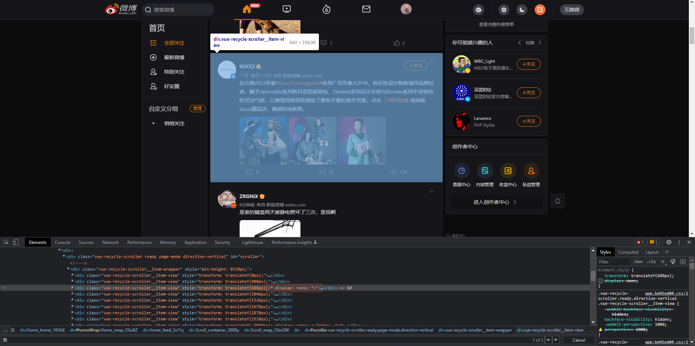
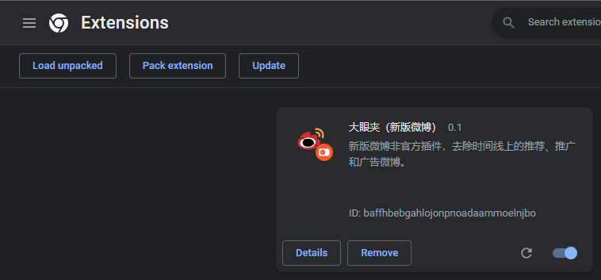

# Chrome Extension Project: Weibo Advertising Filter


A Chrome extension is a small software program that is designed to add functionality to the Google Chrome web browser. Extensions can be developed using web technologies such as HTML, CSS, and JavaScript. Therefore, JavaScript is often used in the development of Chrome extensions to add interactivity and to implement the logic of the extension.

<!--more-->

## Introduction

> **Github Project**
>
> https://github.com/Jerrysmd/weibo-content-filter

This is a Chrome extension that serves as a new version of the Weibo plugin. 

It removes recommended, promoted, and advertisement Weibo from the timeline. 

With this extension, users can enjoy a cleaner and more streamlined Weibo experience. 

The extension is designed to improve the user's browsing experience by removing unnecessary content and focusing on the content that the user wants to see.

 It is a simple and easy-to-use tool that can greatly enhance the way users interact with Weibo.

## Requirements analysis

In order to develop a Chrome extension that effectively removes recommended, promoted, and advertisement Weibo from the timeline, we conducted a thorough requirements analysis to identify the needs and expectations of the target audience. 

This included gathering feedback from potential users, researching similar extensions on the market, and analyzing the technical requirements for implementing the desired functionality.

Based on this analysis, we identified the following functional requirements for the extension:

- The extension should be able to identify and remove recommended, promoted, and advertisement Weibo from the timeline.
- The extension should allow the user to customize which types of Weibo they want to remove (e.g. recommended only, promoted only, both recommended and promoted).
- The extension should have a user-friendly interface that allows the user to easily enable or disable the extension.

In addition to these functional requirements, we also identified the following non-functional requirements:

- The extension should be lightweight and not significantly impact the performance of the browser.
- The extension should be compatible with the latest version of Google Chrome.
- The extension should be easy to install and use for the average user.

By considering these requirements, we were able to create a clear vision for the extension and develop a plan for its development.

## Design

In order to meet the requirements and deliver a high-quality Chrome extension, we have developed the following design for the extension:

1. User interface: The extension will have a simple and intuitive user interface that allows the user to easily enable or disable the extension, as well as customize the types of Weibo that they want to remove. The interface will consist of a toggle button and a drop-down menu, both of which can be accessed from the extension icon in the Chrome toolbar.
2. Weibo identification: To identify recommended, promoted, and advertisement Weibo, the extension will use a combination of CSS selectors and JavaScript code. The selectors will be used to locate the relevant elements on the page, and the JavaScript code will be used to determine whether the elements should be removed based on the user's preferences.
3. Performance optimization: To ensure that the extension does not significantly impact the performance of the browser, we will optimize the code for efficiency and minimize the number of DOM manipulations. We will also implement caching and other performance-enhancing techniques as necessary.

Overall, our design aims to create a simple and effective tool that improves the user's experience on Weibo by removing unwanted content from the timeline.

## Implementation

manifest.json：Chrome extension settings

```json
{
	"name": "大眼夹（新版微博）",
	"short_name": "大眼夹",
	"version": "0.1",
	"manifest_version": 3,
	"description": "新版微博非官方插件，去除时间线上的推荐、推广和广告微博。",
	"icons": {
		"48": "weiboFilter.png",
		"128": "weiboFilter.large.png"
	},
	"content_scripts": [
		{
			"matches": [
				"https://weibo.com/*",
				"https://www.weibo.com/*",
				"https://d.weibo.com/*",
				"http://d.weibo.com/*",
				"http://weibo.com/*",
				"http://www.weibo.com/*"
			],
			"js": ["main.js"],
			"run_at": "document_end"
		}
	],
	"web_accessible_resources": [{
		"resources": ["weiboClean.js"],
		"matches": ["<all_urls>"]
	}],	
	"permissions": [
		"storage"
	]
}
```

main.js

```javascript
// 借助自定义事件实现page script（注入页面的主程序）与content script（运行在沙箱中）
//   之间的异步通讯，使前者可以间接调用chrome.* API和GM_* API
console.log('I am in weiboFilter.js');
document.addEventListener('wbpGet', function (event) {
	event.stopPropagation();
	var name = event.detail.name;
	var post = function (value) {
		// 注意：不能在此处直接调用callback，否则回调函数将在本程序所在的沙箱环境中运行，在Chrome 27及更高版本下会出错
		// 在Greasemonkey（Firefox扩展）环境下也不能通过detail直接传对象，只能送string或array
		// 详见https://developer.mozilla.org/en-US/docs/Web/API/CustomEvent#Specification
		document.dispatchEvent(new CustomEvent('wbpPost', { detail: event.detail.id + '=' + (value || '') }));
	};
	if (event.detail.sync) {
		// 一次性读取所有设置
		chrome.storage.sync.get(null, function (items) {
			var i = 0, value = '';
			while ((name + '_' + i) in items) {
				value += items[name + '_' + (i++)];
			}
			post(i ? value : event.detail.defVal);
		});
	} else {
		// 注意：使用chrome.storage.StorageArea.get()时，如果通过{name:defVal}的形式传送默认值，
		//   且defVal为null或undefined，即使name存在也会返回空对象{}，详见crbug.com/145081
		chrome.storage.local.get(name, function (items) {
			post(name in items ? items[name] : event.detail.defVal);
		});
	}
});
document.addEventListener('wbpSet', function (event) {
	event.stopPropagation();
	var data = {}, name = event.detail.name, value = event.detail.value;
	data[name] = value;
	if (event.detail.sync) { // 将设置保存到同步存储
		// 一次性读取所有设置
		chrome.storage.sync.get(null, function (items) {
			var data = {}, i = 0, errorHandler = function () {
				if (chrome.runtime && chrome.runtime.lastError) {
					console.error('Error writing to storage.sync: ' + chrome.runtime.lastError.message);
				}
			}, partLength = Math.round(chrome.storage.sync.QUOTA_BYTES_PER_ITEM * 0.8);
			// chrome.storage.sync的存储条数（MAX_ITEMS=512）与单条长度（QUOTA_BYTES_PER_ITEM=4,096）
			// 均受限制，当设置过长时需要拆分；chrome.storage.storageArea.set()会对输入项
			// 做一次JSON.stringify()，且Unicode字符将被转换为\uXXXX的转义形式，都会导致字符串膨胀
			// 因此拆分时需要事先留出一定裕度（此处保留20%），并将字符串转为Unicode转义格式
			for (var j = 0, l = 0, s = '', u; j < value.length; ++j) {
				if (value.charCodeAt(j) < 0x80) { // ASCII字符
					s += value.charAt(j);
					++l;
				} else { // Unicode字符
					u = value.charCodeAt(j).toString(16);
					s += '\\u' + (u.length === 2 ? '00' + u : u.length === 3 ? '0' + u : u);
					l += 6;
				}
				if (l >= partLength) { data[name + '_' + (i++)] = s; l = 0; s = ''; }
			}
			if (l > 0) { data[name + '_' + (i++)] = s; }
			// 保存新的设置
			chrome.storage.sync.set(data, errorHandler);
			// 清除多余的旧设置块
			var keys = [];
			while ((name + '_' + i) in items) {
				keys.push(name + '_' + (i++));
			}
			chrome.storage.sync.remove(keys, errorHandler);
		});
	} else { // 将设置保存到本地存储
		chrome.storage.local.set(data);
	}
});
//#endif
// 将脚本注入页面环境
var script = document.createElement('script');
script.setAttribute('type', 'text/javascript');
script.src = chrome.runtime.getURL("/weiboClean.js");
document.head.appendChild(script);
```

weiboClean.js

```javascript
document.addEventListener('DOMNodeInserted', function (event) {
    var node = event.target;
    if (node.tagName !== 'DIV') { return; }
    document.querySelectorAll('#scroller > div.vue-recycle-scroller__item-wrapper > div').forEach(function (div) {
        //console.log(div);
        if(div.querySelectorAll('i[title="负反馈"').length > 0){
            div.style.display = 'none';
        }else{
            div.style.display = '';
        }
    });

});
```


## Testing

Detecting the GUCCI advertising，add the attribute of `display: none`



## Deployment




