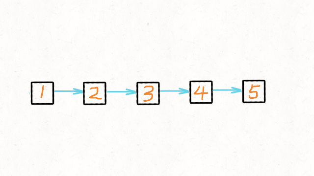

# Unveiling the Top Frequency Leetcode and Crafting Effective Solutions


<!--more-->

## [F1 - 🟨146. LRU缓存机制](https://leetcode.cn/problems/lru-cache)


### 关键字

| 关键字                        | 对应信息                                    |
| ----------------------------- | ------------------------------------------- |
| 键值对                        |                                             |
| put 和 get 的时间复杂度为O(1) | 哈希表，而且可以通过 O(1) 时间通过键找到值  |
| 有出入顺序                    | 首先想到 栈，队列 和 链表。哈希表无固定顺序 |

### 补充

哈希链表 `LinkedHashMap` 直接满足要求

### 解题

+ 哈希表可以满足 O(1) 查找；

+ 链表有顺序之分，插入删除快，但是查找慢。

于是就有了哈希链表数据结构：


> **为什么使用双链表而不使用单链表？**
>
> 删除操作也可能发生在链表的中间位置。如果使用单链表，删除节点时需要额外找到被删除节点的前驱节点，这会增加时间复杂度。

> 哈希表中已经存了 `key`，为什么链表中还要存 `key` 和 `val` 呢，只存 `val` 不就行了？

```java
public class LRUCache {
    class Node{
        int key;
        int val;
        Node preNode;
        Node nextNode;
        Node(int key, int val){
            this.key = key;
            this.val = val;
        }
    }
    Map<Integer, Node> map = new HashMap<Integer, Node>();
    int size;
    int capasity;
    Node head, tail;
    
    public LRUCache(int capasity){
        this.capasity = capasity;
        size = 0;
        head = new Node(0, 0);
        tial = new Node(0, 0);
        head.nextNode = tail;
        tail.preNode = head;
    }
    
    public int get(int key){
        Node node = map.get(key);
        if(node == null){
            return -1;
        }
        move2first(node);
        return node.val;
    }
    
    public void put(int key, int val){
        Node node = map.get(key);
        if(node != null){
            node.val = val;
            move2first(node);
        } else {
            Node newNode = new Node(key, val);
            map.put(key,newNode);
            addNode(newNode);
            size++;
            if(size > capasity){
                Node deleted = deleteLastNode();
                map.remove(deleted.key);
                size--;
            }
        }
    }
    
    private void move2first(Node node){
        deleteNode(node);
        addNode(node);
    }
    
    private void deleteNode(Node node){
        node.preNode.nextNode = node.nextNode;
        node.nextNode.preNode = node.preNode;
    }
    
    private void addNode(Node node){
        node.nextNode = head.nextNode;
        head.nextNode.preNode = node;
        head.nextNode = node;
        node.preNode = head;
    }
    
    private Node deleteLastNode(){
        Node res = tail.preNode;
        deleteNode(res);
        return res;
    }
}
```


## [F2 - 🟩206. 反转链表](https://leetcode.cn/problems/reverse-linked-list)

### 解题

+ 方法一：双指针/三指针迭代


1. 初始化节点
   + pre 用来指向 cur 指针前一个节点。初始是 null，因为链表尾节点的下一节点是 null
   + cur 指向当前节点。初始是 head
   + tmp 用来指向 cur 节点的下一个节点。初始是 null
2. `while(cur!=null)`, tmp 指向 cur 节点的下一个节点；修改 cur.next = pre; pre 指向 cur 相当于后移一位；cur 指向 tmp 相当于后移一位

```java
class Solution {
	public ListNode reverseList(ListNode head) {
		ListNode pre = null;
		ListNode cur = head;
		ListNode tmp = null;
		while(cur!=null) {
			tmp = cur.next;
			cur.next = pre;
			pre = cur;
			cur = tmp;
		}
		return pre;
	}
}
```

+ 方法二：递归



```java
class Solution {
	public ListNode reverseList(ListNode head) {
		if(head==null || head.next==null) {
			return head;
		}
        //这里的cur就是最后一个节点
		ListNode cur = reverseList(head.next);
		head.next.next = head;
		head.next = null;
		return cur;
	}
}
```

+ 方法三：利用外部空间

先申请一个动态扩容的数组或者容器，比如 ArrayList 这样的。 然后不断遍历链表，将链表中的元素添加到这个容器中。 再利用容器自身的 API，反转整个容器，这样就达到反转的效果了。 最后同时遍历容器和链表，将链表中的值改为容器中的值。


## [F3 - 🟨3. 无重复字符的最长子串](https://leetcode.cn/problems/longest-substring-without-repeating-characters)

### 关键字

| 关键字                           | 模式识别                                                     |
| -------------------------------- | ------------------------------------------------------------ |
| 重复字符（或者说`出现一次以上`） | 一旦涉及出现次数，需要用到 **散列表**<br />构造子串，散列表存下标 |
| 子串                             | 涉及子串，考虑**滑动窗口**，滑动窗口就是队列<br />- 滑动窗口就是窗口扩张和窗口收缩 |

### 解题

```java
class Solution{
    public int lengthOfLongestSubstring(String s){
        int left = 0;
        int max = 0;
        HashMap<Character, Integer> map = new HashMap<Character, Integer>();
        for(int right = 0; right < s.length(); right++){
            if(map,containsKey(s.charAt(right))){
                //碰到了重复字符，使窗口左窗向移动到后面遇到的这个重复字符后面
                left = Math.max(left, map.get(s.charAt(right)) + 1);
            }
            //在碰到重复字符之前，右窗口一直向右移动，并记录最大长度
            map.put(s.charAt(right), right);
            max = Math.max(max, right - left + 1);
        }
        return max;
    }
}
```


## [F4 - 🟥25. K 个一组翻转链表](https://leetcode.cn/problems/reverse-nodes-in-k-group)

### 解题


```java
class Solution{
    public Node reverseKGroup(Node head, int k){
        Node dummy = new Node();
        dummy.next = head;
        
        Node pre = dummy;
        Node end = dummy;
        while(end.next != null){
            for(int i = 0;i<k && end!=null; i++) end = end.next;
            if(end==null) break;
            Node start = pre.next;
            Node nextStart = end.next;
            end.next = null;
            
            pre.next = reverse(start);
            
            start.next = nextStart;
            pre = start;
            end = pre;
        }
        return dummy.next;
    }
    // 反转链表，固定方法
    public Node reverse(Node head){
        Node pre = null;
        Node cur = head;
        while(cur!=null){
            Node next = cur.next;
            cur.next = pre;
            pre = cur;
            cur = next;
        }
        return pre;
    }
}
```


## [F5 - 🟨215. 数组中的第K个最大元素](https://leetcode.cn/problems/kth-largest-element-in-an-array)

### 关键字

| 关键字  | 模式识别                                                     |
| ------- | ------------------------------------------------------------ |
| 第 K 个 | 维护动态数据的最大最小值，可以考虑堆<br />建立容量为 k 的最小值堆 |
| 第 K 个 | 确定数量的情况下寻找第 K 大的数，可以利用快速选择算法<br />快速排序算法中的轴值计算 |

### 解题

`PriorityQueue` 可以看做是一个最大堆或最小堆

+ `new PriorityQueue<Integer>()` 可以看做最小堆
+ `new PriorityQueue<Integer>(Comparator.reverseOrder())`可以看做最大堆

```java
class Solution {
    public int findKthLargest(int[] nums, int k) {
        // 使用 PriorityQueue 来作为最小堆，大小为 k
        PriorityQueue<Integer> minHeap = new PriorityQueue<Integer>(k);
        for (int num : nums) {
            if (minHeap.size() < k) {
                // 当优先队列不满时，直接插入
                minHeap.add(num);
            } else if (num > minHeap.peek()) {
                // 如果当前元素大于堆顶(也就是最小)元素，替换堆顶元素
                minHeap.poll();
                minHeap.add(num);
            }
        }
        return minHeap.peek();
    }
}

```


## [F6 - 🟨15. 三数之和](https://leetcode.cn/problems/3sum)

### 解题

排序 + 双指针
本题的难点在于如何去除重复解

```java
class Solution {
    public List<List<Integer>> threeSum(int[] nums) {
        // 1.排序数组
        Arrays.sort(nums);
        List<List<Integer>> res = new ArrayList<>();
        // 2.左指针为循环标志，中指针和右指针每次重置
        for(int left = 0; left < nums.length - 2; left++){ // [length - 3] 是最后一次，刚好容下三个值
            if(nums[left] > 0) break;
            // 跳过重复
            if(left > 0 && nums[left] == nums[left - 1]) continue;
            int middle = left + 1;
            int right = nums.length - 1;
            while(middle < right){
                int sum = nums[left] + nums[middle] + nums[right];
                if(sum > 0){ // 若和大于 0，说明 nums[R] 太大，R 左移
                    while(middle < right && nums[right] == nums[--right]); // 并跳过重复
                }else if(sum < 0){ // 若和小于 0，说明 nums[L] 太小，L 右移 
                    while(middle < right && nums[middle] == nums[++middle]); // 并跳过重复
                }else{ // 若和等于 0, 加入结果
                    res.add(new ArrayList<Integer>(Arrays.asList(nums[left],nums[middle],nums[right])));
                    // 说不定还有满足的结果, R 左移, L 右移
                    while(middle < right && nums[right] == nums[--right]); // 并跳过重复
                    while(middle < right && nums[middle] == nums[++middle]); // 并跳过重复
                }
            }
        }
        return res;
    }
}
```

## [F10 - 🟩1. 两数之和](https://leetcode.cn/problems/two-sum)

### 解题

我先想到用 Arrays.sort() 解题，可发现结果要返回的是初始位置而不是位置上的数字。

如果用穷举，要用 *O*(*N*2) 复杂度寻找 `target - x` ，时间复杂度过高。

所以可以用 **哈希表** 解决寻找 `target - x` 时间复杂度过高的问题，时间复杂度从 *O*(*N*2) 降低到 *O*(*N*) 

```java
class Solution{
    public int[] twoSum(int[] nums, int target){
        Map<Integer, Integer> map = new HashMap<Integer, Integer>();
        for(int i = 0; i < nums.length; i++){
            if(map.containsKey(target - nums[i])){
                return new int[]{map.get(target - nums[i]), i};
            }
            map.put(nums[i], i);
        }
    }
    return new int[0];
}
```

## F11 - 🟨[5. 最长回文子串](https://leetcode.cn/problems/longest-palindromic-substring)

### 解题

+ 方法1
  + 暴力求解
  + 时间复杂度 O(n^3), 左指针从0开始，右指针从L+1开始，对所有长度大于2的字符串进行 validPalindromic() 判断，找出 maxLen
+ 方法2
  + 

## [F59 - 🟥239. 滑动窗口最大值](https://leetcode.cn/problems/sliding-window-maximum)

### 解题

**单调队列**

+ 遍历给定数组中的元素，如果队列不为空且当前元素大于等于队尾元素，则将队尾元素移除。直到，队列为空或当前考察元素小于新的队尾元素；
+ 当队首元素的下标小于滑动窗口左侧边界left时，表示队首元素已经不再滑动窗口内，因此将其从队首移除。
+ 由于数组下标从0开始，因此当窗口左边界大于等于0时，意味着窗口形成。此时，队首元素就是该窗口内的最大值。

```java
class Solution {
    public int[] maxSlidingWindow(int[] nums, int k) {
        int[] res = new int[nums.length - k + 1];
        Deque<Integer> queue = new LinkedList<Integer>();
        for(int right = 0; right < nums.length; right++){
            while(!queue.isEmpty() && nums[queue.peekLast()] < nums[right]){
                queue.removeLast();
            }
            queue.addLast(right);
            int left = right - k + 1;
            if(queue.peekFirst() < left){
                queue.removeFirst();
            }
            if(left >= 0){
                res[left] = nums[queue.peekFirst()];
            }
        }
        return res;
    }
}
```


## F87 - 🟨695. 岛屿的最大面积

### 解题

深度优先搜索

+ 我们想知道网格中每个连通形状的面积，然后取最大值。
+ 如果我们在一个土地上，以 444 个方向探索与之相连的每一个土地（以及与这些土地相连的土地），那么探索过的土地总数将是该连通形状的面积。
+ 为了确保每个土地访问不超过一次，我们每次经过一块土地时，将这块土地的值置为 000。这样我们就不会多次访问同一土地。

```java
class Solution {
    public int maxAreaOfIsland(int[][] grid) {
        int res = 0; 
        for (int i = 0; i < grid.length; i++) {
            for (int j = 0; j < grid[i].length; j++) {
                if (grid[i][j] == 1) {
                    res = Math.max(res, dfs(i, j, grid));
                }
            }
        } 
        return res;
    }
    // 每次调用的时候默认num为1，进入后判断如果不是岛屿，则直接返回0，就可以避免预防错误的情况。
    // 每次找到岛屿，则直接把找到的岛屿改成0，这是传说中的沉岛思想，就是遇到岛屿就把他和周围的全部沉默。
    // ps：如果能用沉岛思想，那么自然可以用朋友圈思想。有兴趣的朋友可以去尝试。
    private int dfs(int i, int j, int[][] grid) {
        if (i < 0 || j < 0 || i >= grid.length || j >= grid[i].length || grid[i][j] == 0) { 
            return 0;
        } 
        grid[i][j] = 0;
        int num = 1;
        num += dfs(i + 1, j, grid);
        num += dfs(i - 1, j, grid);
        num += dfs(i, j + 1, grid);
        num += dfs(i, j - 1, grid);
        return num;
    }
}
```


## F105 - 🟨739. 每日温度

### 关键字

| 关键字                                                       | 模式识别                 |
| ------------------------------------------------------------ | ------------------------ |
| "下一个更大元素"<br />"下一个更小元素"<br />"连续子数组"<br />"某种最值" | 单调栈(通常是递增或递减) |

### 解题

+ 遍历每日温度，维护一个单调栈
  + 若栈为空或者当日温度<=栈顶温度则直接入栈
  + 反之 > 的话，说明栈顶元素的升温日找到，将栈顶元素出栈，计算两个日期相差的天数即可。
+ 栈里存日期还是存温度：要求的是升温的天数，而不是温度。所以栈中存下标而非温度

```java
class Solution {
    public int[] dailyTemperatures(int[] temperatures) {
        Deque<Integer> stack = new LinkedList<Integer>();
        int[] answer = new int[temperatures.length];
        for(int i = 0; i < temperatures.length; i++){
            while(!stack.isEmpty() && temperatures[i] > temperatures[stack.peek()]){
                int preHotDay = stack.pop();
                answer[preHotDay] =  i - preHotDay;
            }
            stack.push(i);
        }
        return answer;
    }
}
```


## F199 - 🟨279. 完全平方数

### 关键字

| 关键字                                                 | 模式匹配 |
| ------------------------------------------------------ | -------- |
| 可以拆分成子问题解决<br />如 "从结果倒推" 的爬楼梯问题 | 动态规划 |

### 解题

```java
class Solution {
    public int numSquares(int n) {
        // n + 1长度，0不用，使得 temp[n] 和 n 对其。值均为0
        int[] temp = new int[n + 1];
        for(int i = 1; i < n + 1; i++){
            temp[i] = i;
            for(int j = 1;(i - j * j) >= 0 ; j++){
                temp[i] = Math.min(temp[i], temp[i - j * j] + 1);
            }
        }
        return temp[n];
    }
}
```

