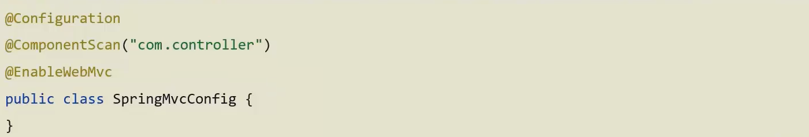

# Spring Boot Introduction


Spring Boot makes it easy to create stand-alone, production-grade Spring based Applications that you can "just run". Spring Boot takes an opinionated view of building production-ready Spring applications. Favors convention over configuration and is designed to get you up and running as quickly as possible.

<!--more-->

## Incremental Example

### 开发过程对比

+ 原生开发 SpringMVC 程序过程

   

1. 依赖最基本的 API

2. WEB 3.0 的配置类

   

3. Spring 的配置类

   

4. 开发 Controller 类

   



+ Spring boot 开发程序过程

   

1. Spring Initializr 创建项目

2. 开发 Controller 类。运行自动生成的 Application 类

   



### 程序对比

Spring 程序与 SpringBoot 程序对比

|       类 / 配置文件       |  Spring  | SpringBoot |
| :-----------------------: | :------: | :--------: |
|         pom 坐标          | 手工添加 |  勾选添加  |
|      web 3.0 配置类       | 手工制作 |     无     |
| Spring / SpringMVC 配置类 | 手工制作 |     无     |
|          控制器           | 手工制作 |  手工制作  |

### SpringBoot 项目快速启动


+ 第一步：对 Boot 项目打包，执行 Maven 构建指令 package

+ 第二步：执行启动指令

  `java -jar springboot.jar`


## SpringBoot 简介

### 概述

+ 用来简化 Spring 应用的初始搭建以及开发过程
+ Spring 程序缺点：
  + 配置繁琐
  + 依赖设置繁琐
+ SpringBoot 程序优点：
  + 自动配置
  + 起步依赖（简化依赖配置）
  + 辅助功能（内置服务器）

### 起步依赖


+ starter
  + SpringBot 中常见项目名称，定义了当前项目使用的所有项目坐标，以达到减少依赖配置的目的
+ parent
    + 所有 SpringBoot 项目要继承的项目，定义了若干个坐标版本号（依赖管理，而非依赖），以达到减少依赖冲突的目的
    + spring-boot-starter-parent（2.5.0）与spring-boot-starter-parent（2.4.6）共计 57 处坐标版本不同
+ 实际开发
    + 使用任意坐标时，仅书写GAV中的G和A，V由SpringBoot提供
    + 如发生坐标错误，再指定version（要小心版本冲突)

#### 辅助功能

+ spring-boot-starter-web

#### 启动方式

+ SpringBoot 在创建项目时，采用 jar 的打包方式
+ SpringBoot 的**引导类**是项目的入口，运行 main 方法就可以启动项目

#### 更改起步依赖

+ 使用 maven 变更起步依赖

  

+ Jetty 比 Tomcat 更轻量级，可扩展性更强（相较于 Tomcat），谷歌应用引擎 GAE 切换为 Jetty

### 基础配置

#### 配置格式

+ SpringBoot 提供了多种属性配置方式

  + application.**properties**

    `server.port=80`

  + application.**yml**

    ```yaml
    server:
    	port: 81
    ```

  + application.**yaml**

    ```yaml
    server:
    	port: 82
    ```

+ SpringBoot 配置文件加载顺序

  + application.**properties**  >  application.**yml**  >  application.**yaml**


#### yaml 语法规则

+ 大小写敏感
+ 属性层级关系使用多行描述，每行结尾使用冒号结束
+ 使用缩进表示层级关系，同层级左则对齐，只充许使用空格（不充许使用Tab键）
+ 属性值前面添加空格（属性名与属性值之间使用冒号+空格作为分隔）
+ `#` 表示注释
+ 数组数据在数据书写位置的下方使用减号作为数据开始符号，每行书写一个数据，减号与数据间空格分隔

#### yaml 数据读取

+ @Value 直接读取


+ Environment 封装后读取


+ **实体类封装属性，封装后读取**


#### 多环境启动

+ 使用 application.yml 文件多环境启动


+ 使用 properties 文件多环境启动


### 多环境启动命令格式

+ 带参数启动 SpringBoot

  `java -jar springboot.jar --spring.profiles.active=test`

  `java -jar springboot.jar --server.port=88`

  `java -jar springboot.jar --spring.profiles.active=test --server.port=88`

#### 启动加载配置顺序

启动加载配置优先级，从低到高

1. Default properties (specified by setting `SpringApplication.setDefaultProperties`).
2. [`@PropertySource`](https://docs.spring.io/spring-framework/docs/6.0.10/javadoc-api/org/springframework/context/annotation/PropertySource.html) annotations on your `@Configuration` classes. Please note that such property sources are not added to the `Environment` until the application context is being refreshed. This is too late to configure certain properties such as `logging.*` and `spring.main.*` which are read before refresh begins.
3. Config data (such as `application.properties` files).
4. A `RandomValuePropertySource` that has properties only in `random.*`.
5. OS environment variables.
6. Java System properties (`System.getProperties()`).
7. JNDI attributes from `java:comp/env`.
8. `ServletContext` init parameters.
9. `ServletConfig` init parameters.
10. Properties from `SPRING_APPLICATION_JSON` (inline JSON embedded in an environment variable or system property).
11. Command line arguments.
12. `properties` attribute on your tests. Available on [`@SpringBootTest`](https://docs.spring.io/spring-boot/docs/3.1.1/api/org/springframework/boot/test/context/SpringBootTest.html) and the [test annotations for testing a particular slice of your application](https://docs.spring.io/spring-boot/docs/current/reference/html/features.html#features.testing.spring-boot-applications.autoconfigured-tests).
13. [`@DynamicPropertySource`](https://docs.spring.io/spring-framework/docs/6.0.10/javadoc-api/org/springframework/test/context/DynamicPropertySource.html) annotations in your tests.
14. [`@TestPropertySource`](https://docs.spring.io/spring-framework/docs/6.0.10/javadoc-api/org/springframework/test/context/TestPropertySource.html) annotations on your tests.
15. [Devtools global settings properties](https://docs.spring.io/spring-boot/docs/current/reference/html/using.html#using.devtools.globalsettings) in the `$HOME/.config/spring-boot` directory when devtools is active.

### 多环境开发控制

+ Maven 主导工程，生成 jar 包
+ SpringBoot 是在 Maven 打包过程中作为一个工具
+ 版本控制 Maven 为主，SpringBoot 为辅助


#### Maven 与 SpringBoot 多环境兼容

1. Maven 中设置多环境属性

   ```xml
   <profiles>
       <profile>
           <id>dev_env</id>
           <properties>
               <profile.active>dev</profile.active>
           </properties>
           <activation>
               <activeByDefault>true</activeByDefault>
           </activation>
       </profile>
       <profile>
           <id>pro_env</id>
           <properties>
               <profile.active>pro</profile.active>
           </properties>
       </profile>
       <profile>
           <id>test_env</id>
           <properties>
               <profile.active>test</profile.active>
           </properties>
       </profile>
   </profiles>
   ```

2. SpringBoot 中引用 Maven 属性

   ```yaml
   spring:
     profiles:
       active: ${profile.active}
   ---
   spring:
     profiles: pro
   server:
     port: 80
   ---
   spring:
     profiles: dev
   server:
     port: 81
   ---
   spring:
     profiles: test
   server:
     port: 82
   ```

3. 对资源文件开启对默认占位符的解析

   ```xml
   <build>
       <plugins>
           <plugin>
               <artifactId>maven-resources-plugin</artifactId>
               <configuration>
                   <encoding>utf-8</encoding>
                   <useDefaultDelimiters>true</useDefaultDelimiters>
               </configuration>
           </plugin>
       </plugins>
   </build>
   ```

4. Maven Package 打包

####  配置文件分类

+ 问题：当使用 `java -jar springboot.jar --spring.profiles.active=test --server.port=88` 临时管理配置时，配置过多不好管理

+ SpringBoot 中四级配置文件（生效优先级从高到低）
  + 1级: 生成 JAR 包的路径 file: config/application.yml
  + 2级: 生成 JAR 包的路径 file: application.yml
  + 3级: 开发项目中路径 classpath: config/application.yml
  + 4级: 开发项目中路径 classpath: application.yml
+ 作用
  + 1级与2级作为系统打包后设置通用属性
  + 3级与4级用于系统开发阶段设置通用属性

## 整合第三方技术

> unfinished, to be continued

