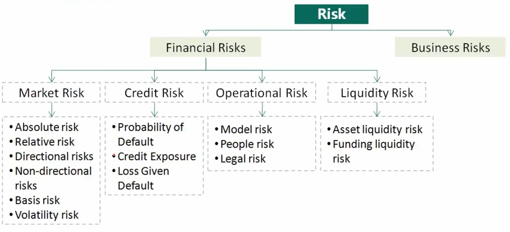

# Financial Risk Manager Introduction


The Financial Risk Manager (FRM) Certification is the true standard for educational excellence in risk management and a gateway to achieving new career heights in the risk profession.

<!--more-->

## Key Concepts

### Interest Rates

#### Required Rate of Return

  - Required rate of return / 要求回报率 / yield
  - Influenced by the `supply and demand of funds` in the market.
  - Represents the return that investors and savers need to convince them to willingly lend their money.
  - Typically associated with a specific investment.
  - Example: If I deposit my money in a bank, what would the interest rate be?
    - In this case:
    - Interest rate = Required Rate of Return = Real Risk-free Return (真实无风险收益率) + Inflation Rate (通货膨胀收益率)
  - Breaking down the required rate of return:
    - Nominal risk-free rate = real risk-free rate + expected inflation rate.
    - Required interest rate on a security = nominal risk-free rate + default risk premium + liquidity risk premium + maturity risk premium.

#### Discount Rate

  - Discount rate / 折现率
  - This is the interest rate used to `discount future payments`.
  - It is often used interchangeably with the term "interest rate".
  - Depending on the situation, "interest rate" can have different names:
    - Example 1: I deposit \$100 in a bank for one year and receive a 10% interest rate. After one year, I have 110.
      - In this scenario, the 10% interest rate is referred to as the 10% Required Rate of Return.
    - Example 2: I want to have \$10 after one year. If the interest rate is 10%, how much should I deposit in the bank? Using the formula (x+10)/(1+10%) = x, we find x = 100.
      - In this scenario, the 10% interest rate is referred to as the 10% Discount Rate.

#### Opportunity Cost

  - Opportunity cost / 机会成本
  - This can be seen as a type of interest rate. It represents the value that investors give up when they choose a particular course of action.

### Basic Calculation

#### Future Value (FV)

  + Amount to which investment grows after one or more compounding periods

#### Present Value (PV)

  + Current value of some future cash flow

  + If interests are compounded m times per year, and `invest 1 year`: 

    $$
    FV=PV(1+\frac{r}{m})^m
    $$

  + If interests are compounded m times per year, and `invest n years`:
    $$
    FV=PV(1+\frac{r}{m})^{mn}
    $$
    Where: 
  
    `m` is the compounding frequency;
  
    `r` is the nominal / quoted annual interest rate

#### Simple Interest

  + Simple Interest / 单利
  
  + Interest is compounded annually at 10% per annum
  
  + ```mermaid
    sequenceDiagram
    	Note over Start Deposit: PV = 100$
        Start Deposit->>First Year End: 10%
        Note over First Year End: 100+100*10%
        First Year End->>Second Year End: 10%
        Note over Second Year End: FV = 100+100*10%*2
    ```
  
  + 
  
    sequenceDiagram
    	Note over Start Deposit: PV = 100$
        Start Deposit->>First Year End: 10%
        Note over First Year End: 100+100*10%
        First Year End->>Second Year End: 10%
        Note over Second Year End: FV = 100+100*10%*2
  
    

#### Compound Interest

  + Compound Interest / 利滚利

  + Interest is compounded annually at 10% per annum

  + ```mermaid
    sequenceDiagram
    	Note over Start Deposit: PV = 100$
        Start Deposit->>First Year End: 10%
        Note over First Year End: 100*(1+10%)
        First Year End->>Second Year End: 10%
        Note over Second Year End: FV = 100*(1+10%)^2
    ```

  + 

    sequenceDiagram
    	Note over Start Deposit: PV = 100$
        Start Deposit->>First Year End: 10%
        Note over First Year End: 100*(1+10%)
        First Year End->>Second Year End: 10%
        Note over Second Year End: FV = 100*(1+10%)^2

    

#### Continuously Compounding:

  + Interest is compounded `m` times per year at an annual rate of `r`%, then after `n` years

$$
  FV=PV\lim_{m\rightarrow\infty}(1+\frac{r}{m})^{mn}=PVe^{nr}
$$

#### Annuity

  + Annuity / 年金
  + Annuity is a stream of `equal cash flows` that occurs at `equal intervals` over a given period
  + Classify:
    + Annuity due - 先付年金(年初支付)
    + Ordinary annuity - 后付年金(年末支付)

## Framework of FRM Program

### Outline

**PART Ⅰ**

1. Foundations of Risk Management 风险管理基础(20%)
   + 基础知识，学完其他三门基本掌握该部分知识
2. Quantitative Analysis 数量分析(20%)
   + 金融：在不确定的情况下，资产的跨期配置
   + 概率论和统计学
3. Financial Markets and Products 金融市场与金融产品(30%)⭐
   + Part Ⅰ 3/4 是二级`市场分险`的基础
   + Part Ⅰ 3/4 最好放在一起学习
4. Valuation and Risk Models 估值与风险建模(30%)⭐

**PART  Ⅱ**

1. Market Risk Measurement and Management 市场分险测量与管理(25%)
2. Credit Risk Measurement and Management 信用分险测量与管理(25%)
3. Operational and Integrated Risk Management 操作及综合风险管理(25%)
4. Risk Management and Investment Management 投资风险管理(15%)
5. Current Issues in Financial Markets 金融市场前沿话题(10%)

### PART Ⅰ

#### Foundations of Risk Management

> 1. Risk Management (Best practice)⭐
>    + Risk management and Corporate Governance Perspective
>    + Implementing Risk Appetite Frameworks
>    + Principles for Effective Data Aggregation and Risk Reporting
>    + Risk Management Failures
> 2. Capital Asset Pricing Model (Theory)⭐⭐⭐
>    + The Standard Capital Asset Pricing Model
>    + Arbitrage Pricing Theory and Multifactor Models of Risk and Return
>    + Applying the CAPM to Performance Measurement
> 3. Information Risk and Data Quality Management
> 4. Financial Disasters⭐⭐
> 5. The Credit Crisis of 2007
> 6. GARP Code of Conduct

##### Risk

+ Definition of Risk
  + Risk is defined as the unexpected variability of asset prices and/or earnings. It is a mix of danger and opportunity
+ Sources of Risk
  + `Business risk` is the risk that a firm is subjected to during daily operations and includes the risks that result from business decisions and the business environment
  + `Financial risks` are the results of a firm's financial market activities



#### Quantitative Analysis

> 1. Probability
> 2. Basic Statistics
> 3. Distributions
> 4. Hypothesis Tests and Confidence Intervals
> 5. Linear Regression
>    + Linear Regression with One Regressor
>    + Linear Regression with Multiple Regressors
> 6. Simulation Modeling⭐
> 7. Estimating Volatilities and Correlations⭐
> 8. Correlation and Copulas

#### Financial Markets and Products

> 1. Derivative Contract
>    + Structure and mechanics of OTC and exchange markets
>    + Structure, mechanics, and valuation of Derivative Contracts
>      + Forwards, Futures and Swaps
>      + Options
>    + Hedging wit derivatives
> 2. Financial Product (Fixed Income)
>    + Interest rates and measures of interest rate sensitivity
>    + Foreign exchange risk
>    + Corporate bonds
>    + Mortgage-backed securities
>    + Rating agencies

#### Valuation and Risk Models

> 1. Valuation
>    + Option valuation
>    + Fixed income valuation
> 2. Risk Models
>    + Value-at-Risk (VaR)
>    + Expected shortfall (ES)
>    + Stress testing and scenario analysis
> 3. Risk Management
>    + Hedging
>    + Country and sovereign risk models and management
>    + External and internal credit ratings
>    + Expected and unexpected losses
>    + Operational risk

### PART  Ⅱ

## Things To Know About FRM Exam


