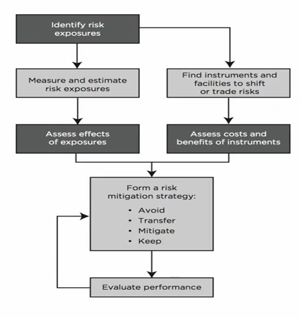
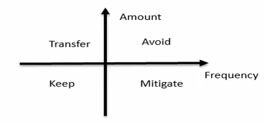
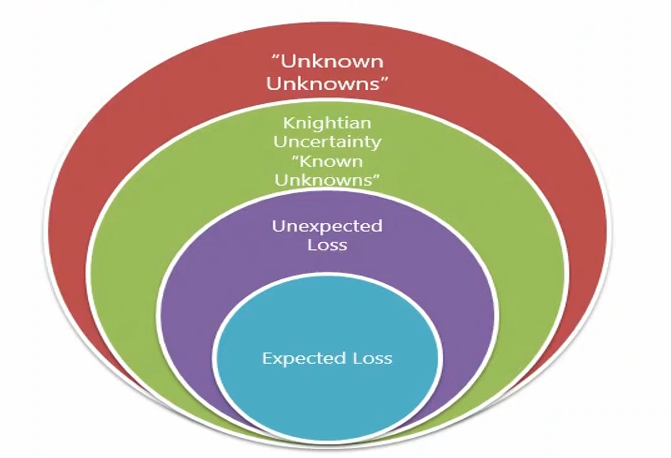
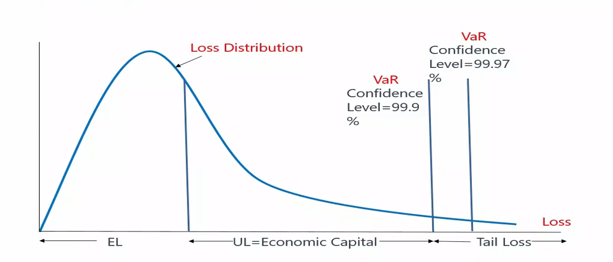
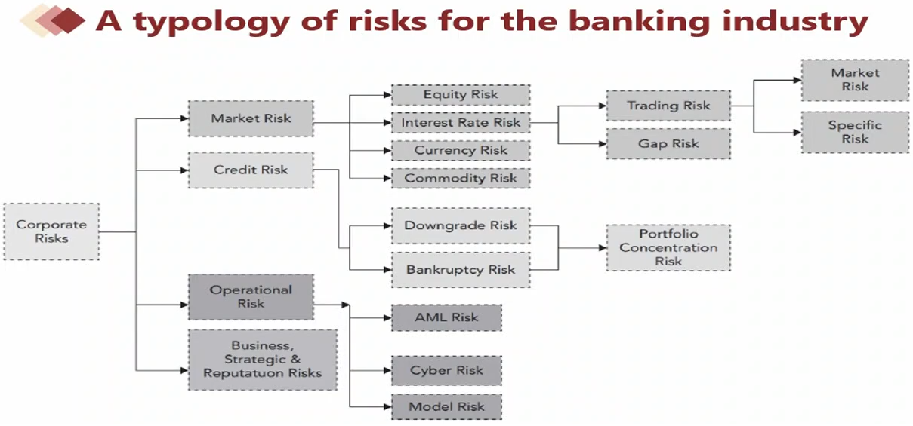
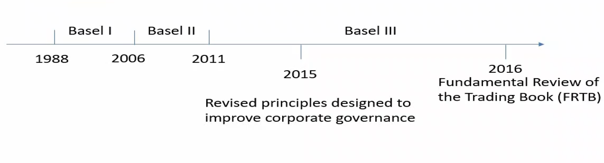

# FRM Part Ⅰ: Foundations of Risk Management

The Fundamentals of Risk Management is Chapter 1 of Part 1 for the FRM exam. This chapter primarily covers the foundational knowledge, theories and best practices related to the subject of risk management.

<!--more-->

## Basic Sense of Risks and Management
### What Is Risk?

+ **Possibility of the bad things that might happen:**
  + It exists everywhere and anytime,we will focus on the financial world.
  + But it is not always a bad thing
    + **Good risk**: Risks that have a **positive expected payoff** on a stand-alone basis.
    + **Bad risk**: Risks that can be **expected to destroy value** on a stand alone basis.
    + Banks and other financial institutions c**annot succeed without taking risks.**

### What Is Risk Management?

+ **Risk management**: how firms actively select the types and levels of risks that are appropriate for them to take.
+ **Risk management and risk taking aren't opposites, but two sides of the same coin.**
  + Together they drive all our modern economies.
  + It's all about making forward-looking choices about risk in relation to reward.

### Is Risk Management Useful?

+ **Challenges for risk management** 
  + Fail to prevent market disruptions or **accounting scandals**
  + **Derivative** markets make it easier to take on large amount of risk.
  + Sophisticated financial engineering leads to the violent implosion of-firms.
  + Only **transfer** risks to other firms
    + Risk management is a zero-sum game
  + Work to the short-term benefit.

### Risk Management Process

1. Identify the risk
2. Analyze and measure risk
3. Assess the effects of all risk, and balance between risk and reward
4. Manage the risk using different kind of tools

### Identify the risk

+ There are things we know that we know.
+ There are known unknowns... But there are also unknown unknowns.

### Analyze and measure risk

+ **Quantitative Risk Measures**
  + VaR(Value at risk)
    + Developed by Dennis Weatherstone,CEO of J.P. Morgan
    + VaR uses the loss distribution associated with a position or portfolio to estimate losses at a given level of likelihood (or confidence).
      + E.g. a one day 99% **confidence level**（置信水平） VaR of USD 1 million
+ **Qualitative Risk Measures**
  + Scenario analysis
  + Stress testing

### Tail Risk

+ Some credit portfolios, however exhibit a much moreextreme variance in their losses over `longer intervals of time`(e.g., a decade). 
+ **From the crisis lesson, we focus on the tail risk beyond confidence level which cannot be explained by VaR.**
  + *Extreme value theory*(EVT)（FRM Part2 内容） focuses on tail distribution to understand the black swans 
  + *Expected shortfall*（指所有极端值的平均数） is the EL of tail distribution

### Expected Loss(EL)

+ EL is the average loss expected to incur from a position or a portfolio. It can be estimated by historical data of a period of time. 
  + It can be treated as a predictable expense rather than a risk or
    uncertainty
+  In the case of the credit risk of a loan: 
  + EL=EAD x LGD x PD (part1 估值与风险建模 会重讲)
    + PD: Probability of default 
    + EAD: Exposure amount at default 
    + LGD: Loss given default
+ EL is often **priced into the product directly.**

### Unexpected Loss(UL)

+ On a bad day, losses can range above the expected level. **Unexpected loss is the surprising loss that above the EL in bad days.**
  + Value at risk (VaR) uses the loss distribution to estimate losses at a given level of likelihood(confidence). 
  + UL= VaR - EL (Unexpected loss is the surprising loss that above the EL in bad days)
  + **Economic capital**(usually called risk capital) is the amount of liquid -
    capital used to cover unexpected loss. 
+ **Correlation risk**,where unfavorable events happen together, will drive potential losses to unexpected levels. 
+ In practice, **concentration** makes the probability of multiple losses high for a portfolio. As a result, we need more capital to cover the UL.

### Balance Between Risk and Reward 

+ There is a natural trade-off between risk and reward: the more risk takes, the more potential reward is earned. 
+ However, there are challenges. 
  1. Conflicts between EL and UL, can be solved by **RAROC**
     + Risk adjusted return on capital(RAROC)=after-tax risk-adjusted expected return(EL is subtracted)/economic capital
  2. Correlation between risk factors is changing
  3. Conflicts of interests among different units, can be solved by **three lines of defense**：
     1. business line that generates,owns, and manages risk;
     2. risk managers implement day-to-day oversight;
     3. periodic independent oversight and assurance, such as internal audit

### Example 1

> Tail risk techniques are dealt by:
>
> - [x] A. Extreme value Theory
>
> - [ ] B. VaR Theory
>
> - [ ] C. Probably of Default Theory
>
> - [ ] D. Standard deviation

## Basic Risk Types

### Typology of Risk Exposures

1. Market Risk

> + **Market risk(市场风险) is the risk that changes in financial market prices（金融产品发生变化就是市场风险） and rates will reduce the value of a security or a portfolio.** 
>   + Equity price risk （股票价格风险）
>   + Interest rate risk （利率风险）
>   + Currency (Foreign exchange) risk （外汇风险） 
>   + Commodity price risk （大宗商品风险）
> + **Market risk is driven by:** 
>   + General market risk (systematic risk)（系统性风险）
>   + Specific risk (idiosyncratic risk)（个体风险/非系统性风险）

2. Credit Risk

> + **Credit risk**: It arises from the failure of one party to fulfill its financial obligations to another party（一方没有对另一方尽到义务）. Some examples of credit risk include
>   + A debtor fails to pay interest or principal on a loan(**bankruptcy risk**)（翻译违约风险而不是倒闭风险）
>   + An obliger or counterparty is downgraded(**downgrade risk**),indicating an increase in risk that may lead to an immediate loss in value of a credit-linked security; and 
>   + A counterparty to a market trade fails to perform (counterparty risk) including **settlement** or **Herstatt risk**. (结算风险)

3. Liquidity Risk (特别针对于银行)

> + **Funding Liquidity Risk**: a firm's ability to raise the necessary cash to roll over its debt; to meet the cash requirements,the margin requirements, and the collateral requirements; and to satisfy the need of capital withdrawals. (还钱时没钱)
> + **Market (Trading) Liquidity Risk**: an institution will not be able to execute a transaction at the prevailing market price because there is temporarily no appetite for the deal on the other side of the market. (交易需打折)

4. Operational Risk

> + Operational Risk refers to potential losses resulting from inadequate or failed internal processes, **people, and systems** or from external events.
>   + It includes **legal risk**(诉讼风险), *but excludes* **business, strategic and reputational risk.**
>     + **Legal risk**: the potential for litigation to create uncertainty for a firm.
>     + **Regulatory risk**: the uncertainty actions by governmental entity
>   + Under broad definition,it includes everything from
>     + anti-money laundering risk, (AML Risk 反洗钱)
>     + cyber risk to risks of terrorist attacks, 
>     + rogue trading, 
>     + model risk: The risk of potential indirect costs of relying on models

5. Business, Strategic and Reputation Risk

> + **Business Risk**: lies at the heart of any business and includes all the usual worries of firms, such as **customer demands,pricing decisions, supplier negotiations, and product innovation management.** (错误预估需求、错误定价，协商失败 等等导致亏损，但不能称之为 Risk，很多时候只能归类到 “Unknown Unknowns” 和 “Unknown Unknowns”)
> + **Strategic Risk**: involves making critical,long-term decisions about the firm's direction, often accompanied by major investments of capital, human resources, etc. 
> + **Reputation Risk**: the danger that a firm will suffer a sudden fall in its market standing or brand with economic consequences. (known Unknowns)

### Risk Aggregation

+ Given the many different types of risk and risk metrics, a key problem in risk management is the challenge of seeing the bigger picture, also called **risk aggregation.** 
  + One challenge occurs when one single risk factor could ultimately spill over many kinds of risks, which will increase correlations 
    + This is dangerous with UL.
  + Another challenge occurs when aggregating different risks at enterprise level. 
    + Different risks have different **characteristics**, such as loss
      distributions.

### Example 1

> Operational risk includes:
>
> - [ ] A. counterparty risk
> - [x] B. cyber risk
> - [ ] C. reputation risk
> - [ ] D. business risk

## How Do Firms Manage Financial Risk

### Risk Management Strategies

+ **Make four basic choices in risk management** 
  1. **Avoid** or undertake risk 
  2. Whether **transfer** risk to third parties 
  3. **Mitigate** risk or not 
  4. **Assume**(keep) or not assume risk
+ **Before making the choice, a risk appetite(口味) must be determined.**

### Risk Appetite

+ **Risk appetite** describes the amount and types of risk a firm is willing to accept. This is in contrast to risk capacity,which describes the maximum amount of risk a firm can absorb

+ Note
  + Capacity: 真正能力上限, 由客观事实决定
  + Risk Appetite: 最大容忍风险，董事会决定
  + Profile: Current level，由 CRO 决定

+ **Issues related with risk appetite**
  + The **board**(董事会) must characterize an appropriate "risk appetite"for the firm 
  + Be connected to a firm's overall **business strategy and capital plan**. 
  + **Clear communication throughout the firm** of the firm's risk appetite and risk position. 
  + Effective risk management program should be consistent with fundamental strategic and risk appetite choices. 
  + Risk appetites can be expressed in a number of ways,including **quantitative and qualitative**（定量和定性） statements. 
  + Banks have to choose their level of risk subject to **external constraints**

### Risk Management Tools

+ **Risk Limits**
  + Limits vary by the nature of the risk, the competitive positioning of the firm,and the span of its activities
  + Practically speaking, these limits should be designed such that the probability of exceeding them during the normal situation of business is low.
  + **Risk Limits ≠ Risk appetite**，Risk appetite >> Risk Limits
+ **Derivatives**
  + In many cases,the risk manager will decide to **transfer** a portion of a financial risk to the risk management markets (衍生产品的主要目的是为了转移风险). 
  + The use of these instruments requires firms to make key decisions based on their **specific needs**

Risk Limits:

| Limit                                                        | Nature                                                       | Example Weakness                                             |
| ------------------------------------------------------------ | ------------------------------------------------------------ | ------------------------------------------------------------ |
| Stop Loss Limits 止损点                                 | Loss threshold and associated action (e.g. close out, escalation) | Will not prevent future exposure, only limit realized losses. |
| Notional Limits 本金上限                                | Notional size of exposure                                    | Notional amount may not be strongly related to economic risk of derivative instruments, especially options |
| Risk Specific Limits 风险指标                           | Limits referencing some special feature of risk in question (e.g. liquidity ratios（流动性比例） for liquidity risk) | These limits are difficult to aggregate; may require specialized knowledge to interpret. |
| Maturity/Gap Limits 期限/缺口限制                       | Limit amount of transactions that mature or reset/ reprice in each time period | These limits reduce the risk that a large volume of transactions will need to be dealt with in a given time frame,with all the operational and liquidity risks this can bring. But they do not speak directly to price risk. |
| Concentration Limits 集中度限制                         | Limits of concentrations of various kinds(e.g.,to individual counterparties,or product type) | These limits must be set with the understanding of correlation risks. They may not capture correlation risks in stressed markets. |
| Greek Limits 特殊限制 《估值与风险建模》           | Option positions need to be limited in terms of their unique risk characteristics (e.g.,delta,gamma, vega risk | These limits suffer from all the classic model risks and calculation may be compromised at trading desk level without the right controls and independence |
| VaR                                                          | Aggregate statistical number                                 | VaR suffers from all the classic model risks and may be misinterpreted by senior management. Specifically, VaR does not indicate how bad a loss might get in an unusually stressed market |
| Stress, Sensitivity, and Scenario Analysis 压力测试（最严重） Sensitivity（强调一个风险） Scenario（强调的是一种情景，由多个风险构成） | These limits are based on exploring how bad things could get in a plausible worst-case scenario. Stress tests look at specific stresses. Sensitivity tests look at the sensitivity of a position or portfolio to changes in key variables. Scenario modeling looks at given real-world scenarios(hypothetical or historical). | Varies in sophistication. Dependent on deep knowledge of the firm's exposures and market behavior. Difficult to be sure that all the bases are covered(e.g.,there are endless possible scenarios) |

+ Gap Limits：在银行业务中
  + 吸收储蓄：一年；给出利息如 2%
  + 发放贷款：三十年；拿到利息如 5%
  + 这种“借短头长”是普遍策略，但三十年和一年的差二十九年就是风险，时间越长风险越大

Derivatives:

| Instrument Type                                             | Defining Features                                            |
| ----------------------------------------------------------- | ------------------------------------------------------------ |
| Forward 远期(指未来买卖资产，且约定了一个价格)         | It is a tailored agreement to exchange an agreed upon quantity of an asset at a pre-agreed price at some future settlement date. The asset may be delivered physically, or the contract may stipulate a cash settlement (i.e.,the difference between the agreed upon price and some specified spot or current price) |
| Futures 从 Forward 衍生出来的一种标准化合约            | It is an exchange-listed forward with standardized terms, subject to margining. |
| Swap 从 Forward 衍生出来的一系列远期                   | It is an over-the-counter(OTC) agreement to swap the cash flows(or value) associated with two different economic positions until(or at) the maturity of the contract. For example,one side to an interest rate swap might agree to pay a fixed interest rate on an agreed upon notional amount for an agreed upon period,while the other agrees to pay the variable rate. Swaps take different forms depending on the underlying market. |
| Call Option Option 叫做期权，是一种买卖的权利 看涨 | The purchaser of a call option has the right, but not the obligation,to buy the underlying asset at an agreed upon strike price,either at the maturity date(European option) or at any point during an agreed upon period(American option). |
| Put Option 看跌                                         | The purchaser of a put option has the right,but not the obligation,to self the underlying asset at the agreed upon strike price at the maturity date(European option) or at any point during an agreed upon period(American option). |
| Exotic Option 歧义                                      | There are many different options beyond the standard or plain vanilla puts and calls. These include Asian (or average price) options and basket options(based on a basket of prices). |
| Swaption swap + option                                 | It is the right, but not the obligation,to enter a swap at some future date at pre-agreed terms. |

### Hedging Philosophy

对冲 / 套期保值

+ Just because a risk can be hedged does not mean that it should be hedged Hedging is simply a tool and, like any tool, it has limitations.
  + Hedging has advantages.
  + Hedging has disadvantages. 
  + How to hedge?

#### Advantages of Hedging Risk Exposures

1. By employing risk management tools, management can better achieve the board's objectives. 
2. Hedging reduces the cost of capital and enhances the ability to finance growth. 
3. Hedging increases the debt capacity(负债率) of companies  
   + increasing interest tax deductions 
4. A firm can stabilize its cost through hedging
   + A competitive advantage 
5. Purchasing insurance is expensive

#### Disadvantages of Hedging Risk Exposures 

1. Using hedging tools cannot increase the value of the firm. 
   + Franco Modigliani and Merton Miller (M&M),laid out in 1958:the valueof a firm cannot be changed merely by means of financial transactions 
2. Active hedge may distract management from its core business. 
3. Hedging requires specific skills.  
   + A careless risk management strategy can drag a firm down even more quickly than the underlying risk. 
4. Risk management strategy has **compliance(合规) cost**, including disclosure 
5. Hedging could increase the firm's earnings variability due to the gap **between accounting earnings and economic cash flows** 
6. The problem will be amplified by poor communication.

#### How to hedge? 

+ **Static and Dynamic hedging strategies**  
  + The latter is more complex, time consuming and expensive 
+ **Hedge operational risk and financial risk** 
  + Hedging operational risk means stabilizing expenses and revenues (就是现金流 cash flow). 
  + Hedging financial risk means stabilizing assets and liabilities (就是 accounting performance).  
  + E.g. Price risk, interest rate risk and foreign exchange risk 
+ A firm may misunderstand the **type of risk** that it faces. It may map or measure the risk incorrectly, fail to notice changes in the market structure, or suffer from a rogue traders on its team.

### Example 1

> Which of the following statements regarding the amount of risk taken by a bank and the impact on the value of a bank is most likely correct? 
> - [ ] A.Banks need to take on a small amount risk in order to maximize shareholder value while satisfying the constraints imposed by bank regulators.(风险和股东价值没有一定关系)
> - [ ] B.Banks that are conservative in practice and take on less risk will always end up generating more value because they avoid incurring losses that would be associated with taking on more risk.（小风险不会带来更大的价值）
> - [x] C.Banks that are valued for their ability to provide liquid investments to their customers should take on less risk in order to maximize value （提供充足流动性可以增加银行价值）
> - [ ] D.Banks that are conservative in practice typically assume an optimal amount of risk of zero

## The Governance of Risk Management

### Introduction 

+ Corporate governance
  + The way in which companies are run. 
  + Describes the roles and responsibilities of a firm's shareholders, board of directors, and senior management, etc. 
  + Three main regulatory acts making standards of corporate governance
    + **Sarbanes-Oxley Act (安然事件 - 财务造假事件 - 法案规避财务舞弊)**
    + **The Basel Committee on Banking Supervision (BCBS)** 
    + **Dodd-Frank Act（08年次贷危机）**

### Sarbanes-Oxley Act (SOX) 

+ Came into effect on July 30,2003,creating stricter legal requirements for boards, senior management, and external/internal auditors 
+ CEO and CFO must:  
  + Ensure that reports filed with SEC（美国证监会） are accurate for publicly traded firms  
  + Affirm that disclosures provide a complete and accurate presentation of their company's financial conditions and operations.
  +  Be responsible for internal controls, including their design and maintenance
  + Review annually the effectiveness of a firm's reporting procedures and controls. 
  + Disclose the names of individuals who serve on the board audit 0 committee.

### Key Post Crisis Corporate Governance Concerns 

1. **Stakeholder Priority**  
   + Depositors, debt holders, and taxpayers have a much stronger interest in minimizing the risk of bank failure than do most shareholders, who often seem to press for short-term results. 
   + Shareholder empowerment, the usual remedy to corporate governance ills, may therefore be an inadequate solution for the banking industry's woes.
2. **Board Composition**
   + The crisis reignited a longstanding debate as to how to ensure bank boards can achieve the appropriate balance of independence, engagement, and financial industry expertise.  
   + Analyses of failed banks do not show any clear correlation between success and a predominance of either insiders or outsiders. One can note, however, that failed bank Northern Rock had several banking experts on its board.

#### The Evolution of BCBS

+ The Basel Committee on Banking Supervision (BCBS), an organization comprised of the central banks and bank supervisors from 27 jurisdictions focuses on formalizing international standards for prudential banking regulation.

#### Key Post Crisis Corporate Governance Concerns

1. **Stakeholder Priority**
   + Depositors, debt holders, and taxpayers have a much stronger interest in - minimizing the risk of bank failure than do most shareholders, who often seem to press for short-term results. 
   + Shareholder empowerment, the usual remedy to corporate governance ills, may therefore be an inadequate solution for the banking industry's woes. 
2. **Board Composition**
   + The crisis reignited a longstanding debate as to how to ensure bank boards can achieve the appropriate balance of independence, engagement, and financial industry expertise 
   + Analyses of failed banks do not show any clear correlation between success and a predominance of either insiders or outsiders. One can note, however, that failed bank Northern Rock had several banking experts on its board.
3. **Board Risk Oversight**
   + The importance of boards being proactive in risk oversight became increasingly recognized following the crisis.（事必躬亲）
4. **Risk Appetite**
   + Regulators have pushed banks to articulate a formal, board-approved risk appetite that defines a firm's willingness to undertake risk and tolerate threats to solvency. **This can be translated into an enterprise- wide setting of risk limits.**
5. **Compensation**
   + One of a board's key levers in determining risk behavior is its control over compensation（股权激励） schemes. Boards have a duty to examine how pay structures might affect risk-taking and whether risk- adjustment mechanisms capture all key long-term risks.

#### The Evolution of Dodd-Frank Act

+ In July 2010, the Dodd-Frank Act was signed into law 
+ The Dodd-Frank Act is a federal law with 2300 pages in USA that gives regulation of the financial industry

| Glass-Stegall Act                              |  \|  | Graham-Leach-Bliley Act |  \|  | Dodd-Frank Act |
| ---------------------------------------------- | :--: | :---------------------: | :--: | :------------: |
| 分业经营 （投资银行业和商业银行业要分开） | 1999 |        混业经营         | 2010 |  重回分业经营  |

#### Dodd-Frank Act

+ The Dodd-Frank Act aims to prevent another significant financial crisis by creating new financial regulatory processes that enforce transparency and accountability while implementing rules for consumer protection. 
  + Strengthening the Federal Reserve's(联邦政府) regulatory reach for systemic risk
  + Ending too-big-to-fail by creating an orderly liquidation authority -
  + Resolution plan called "living will"(生前遗嘱)
  + Helping derivatives markets(禁止自营) participants with counterparty risk -
  + The Volcker Rule
  + Protecting consumers
  + Stress testing

### Infrastructure of Risk Governance

+ **Three critical questions on infrastructure of risk governance** 
  1. Are corporate governance **best practices** related to best practice in risk management, and if so, how? 
  2. How is risk management delegated through the organization? **What**
     **roles do the executive staff and board committees undertake** in the execution and oversight of risk management?
  3. How does **risk management policy filter down** to business managers
     and how is it reflected in the way regular business is conducted?

#### 1. Best Practice of Corporate Governance

+ The board should
  + Look after the interests of **shareholders** (gatekeeper) 
  + Be responsible for the concerns of other **stakeholders** (debtholders and employees). 
  + **Oversee** executive management and alert for any **conflict** of interests between the management and stakeholders (agency problems) 
    + Clawback(要回分红) provisions 
    + Separate the role of the CEO and the chairman of the board 
  + Comprise a majority of independent members 
  + Consider introducing a CRO
+ The board plays a central role in risk management, especially in shaping and overseeing risk
  + Decide appropriate risk appetite 
  + Assess firm's risk management systems and procedures 
  + **Strive for economic performance(对应 operation risk) not accounting performance(对应 financial risk)** 
  + Ensure major transactions are consistent with the risk authorized 
  + Keep the disclosure adequate and transparent 
  + Balance the risk and rewards 
  + Take the ultimate responsibility 
  + Be trained on risk issues 
  + Establish and maintain CRO 
  + Maintain the independence of audit committee

#### 2. Corporate Governance at Board Level

+ **The board often delegates its power to some professional committees to implement risk appetite and break it down into a set of practical restrictions and limitations.**
  + Risk Management Committee(风险管理委员会，属于 Board)
    + Set risk appetite on annual basis 
    + Translate the overall risk appetite into a set of limits 
    + Approve and independently review risk levels 
    + Report back to the board on a variety of items, such as all loans and credits over a specified dollar limit. 
  + Risk Advisory Director （RAD，属于 Board）: is a member of the board who specializes in risk matters. 
+ **Compensation Committee**
  + Determine the compensation of top executives .  
  + Be aligned with the long-term interests of stakeholders, and with risk-adjusted return on capital  
  + Removal of guaranteed bonuses  
  + Stock-based compensation can encourage risk-taking
+ **Audit Committee of The Board**
  + Independently verify whether the firm is doing what it claims to be doing 
  + Check for discrepancies and infringements in regulatory, legal compliance, and risk management activities. 
  + Assess the quality of reporting, compliance, internal control, and risk management processes. 
  + Audit committee members are required to be knowledgeable, capable of independent judgement, financially literate, and have the utmost integrity.

#### 3. Corporate Governance at Management Level

+ The Role of the CRO
  + The CRO is usually a member of the risk committee and is responsible for the design of the firm's risk management program 
  + The CRO is also responsible for risk policies, analysis approaches, and methodologies,as well as the risk management infrastructure and governance inside the organization. 
  + The bank's senior risk committee delegates the power(分权) to make day-to day decisions to the CRO 
  + CRO should also report directly to the CEO, maintain a seat on the board risk committee, and have a voice in approving new financial instruments and lines of business.
    + At many banks,CROs act as a **liaison** between the board and
      management.

#### 4. Risk Appetite filters down

+ **Risk appetite and business strategy**
  
  + There needs to be an **iterative** relationship between setting risk -
    appetite and implementing business strategy 
    + Iteration starts with a concept of risk appetite **->** implementing
      business strategy **->** aggregation **->** checking back with the risk appetite framework **->** adjusting as necessary (先有 risk appetite, 然后一步一步往下级调整, 调整比较困难)
  + There are always challenges to strike balance between business 1
    opportunity and risk limits 
    + Fail to exercise the right amount of flexibility
      + Too restrictive: policemen （CRO ）
      + Too flexible: potential of large loss
  + It is now widely recognized that compensation is part of a sound risk culture. The compensation committee needs to ensure that managerial remuneration reinforces the firm's risk appetite.
  + G-20 recommendations include.
    + Deferral of certain compensation 
    + The elimination of multi-annual guaranteed bonuses
    + share-based remuneration to incentivize long-term value creation
    + Limitations on the amount of variable compensation granted to
      employees relative to total net revenues 
    + Disclosure requirements to enhance transparency 
    + Affirming the independence of the committees responsible for executive compensation oversight to ensure their alignment with performance and risk
  
  
  
  #### The Independence of Functional Units
  
  | Risk Management Committee                                    |      |                                                              |
  | :----------------------------------------------------------- | ---- | ------------------------------------------------------------ |
  | ↓ Supervise                                                  |      |                                                              |
  | **Senior Management (CRO)** + Sets business level risk tolerances + Designs and manages policy + Evaluates performance | →    | **Business Line** + Takes on and manages exposure 1 to approved risks + Implement risk policy |
  | ↑                                                            |      | ↓                                                            |
  | **Risk Management** + Monitors limits + Gives senior management independent risk assessments | ←    | **Finance & Operations** 中台 + executes risk mitigation/transfer strategies + Manages and supports analyses required for business planning |
  
  

### Example

> Which of the following statements about best practices in corporate governance and risk management is most accurate? 
>
> - [x] A.The board should keep the risk committee separate from the audit committee. 
>
> - [ ] B. The board should **ensure** that it has the firm's chief risk officer as a member of the board. 
>
> - [ ] C. The board should focus on management's actions and their impact on the interests of the firm's shareholders 
>
> - [ ] D.The board should focus on **accounting performance** instead of **economic performance** because of the importance of maintaining or enhancing the firm's stock price 

> Which of the following statements regarding the firm's risk appetite and/or its business strategy is most accurate? 
>
> - [ ] A. The firm's risk appetite does not consider its willingness to accept risk. 
>
> - [x] B. The board needs to work with management to develop the firm's overall strategic plan. 
>
> - [ ] C. Management will set the firm's risk appetite and the board will provide its approval of the strategic plan. 
>
> - [ ] D. Management should obtain the risk management team's approval once the business planning process is finalized.

> The major roles of the audit committee do not include
>
> - [ ] A. reviewing the risk management process
>
> - [x] B. preparing the annual financial report.
>
> - [ ] C. analyzing the integrity of risk governance.
>
> - [ ] D. affirming the reliability of vetting processes.

