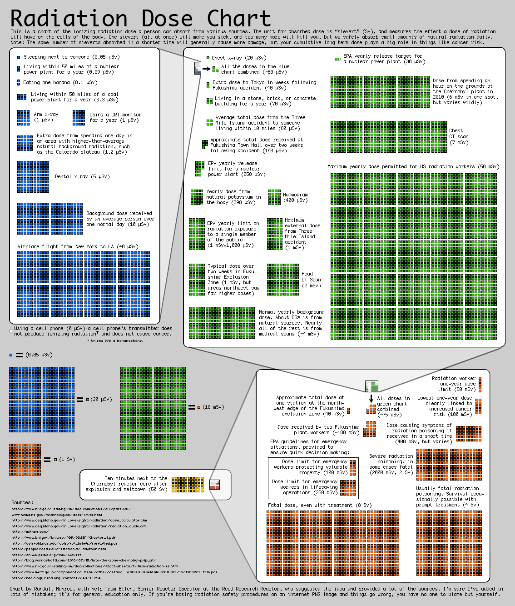

# Radiation Dose Chart

This is a chart of the ionizing radiation dose a person can absorb from various sources. The unit for absorbed dose is "sievert" (Sv), and measures the effect a dose of radiation will have on the cells of the body. One sievert (all at once) will make you sick, and too many more will kill you, but we safely absorb small amounts of natural radiation daily.

<!--more-->

> Sievert
>
> + The **sievert** (symbol: **Sv**) is a unit in the International System of Units (SI) intended to represent the stochastic health risk of ionizing radiation, which is **defined as the probability of causing radiation-induced cancer and genetic damage.**

> Unit
>
> + 1 sievert (Sv) = 1,000 millisievert (msv) = 1,000,000 microsievert (usv)

| Behavior                                                     | Radiation Dose |
| ------------------------------------------------------------ | -------------- |
| Using a cell phone                                           | 0 uSv          |
| Magnetic Resonance Imaging（MRI）                            | 0 uSv          |
| Ultrasonography                                              | 0 uSv          |
| Electrocardiogram（ECG）                                     | 0 uSv          |
| Sleeping next to someone                                     | 0.05 uSv       |
| Living within 50 miles of a nuclear powerplant for a year    | 0.09 uSv       |
| Eating one banana                                            | 0.1 uSv        |
| Living within 50 miles of a coal power plant for a year      | 0.3 uSv        |
| Arm x-ray                                                    | 1 uSv          |
| Using a CRT monitor for a year                               | 1 uSv          |
| Extra dose from spending one day in an area with higher-than-average natural background radiation, such as the Colorado plateau | 1.2 uSv        |
| Dental x-ray                                                 | 5 uSv          |
| Background dose received by an average person over one normal day | 10 uSv         |
| Chest x-ray                                                  | 20 usv         |
| EPA yearly release target for a nuclear power plant          | 30 uSv         |
| Airplane flight from New York to LA                          | 40 uSv         |
| Extra dose to Tokyo in weeks following Fukushima accident    | 40 uSv         |
| Living in a stone, brick, or concrete building for a year    | 70 uSv         |
| Average total dose from the Three Mi le Island accident to someone living within 10 miles | 80 uSv         |
| Approximate total dose received at Fukushima Town Hall over twoweeks following accident | 100 uSv        |
| EPA yearly release limit for a nuclear power plant           | 250 uSv        |
| Yearly dose from natural potassium in the body               | 390 uSv        |
| Mammogram                                                    | 400 uSv        |
| EPA yearly limit on radiation exposure to a single member of the public | 1 mSv=1000 uSv |
| Maximum external dose from Three Mile Island accident        | 1 mSv          |
| Typical dose over two weeks in Fuku- shima Exclusion Zone (1 mSv, but areas northwest saw far higher doses) | 1 mSv          |
| Head CT Scan                                                 | 2 mSv          |
| Normal yearly background dose. About 85% is from natural sources. Nearly all of the rest is from medical scans | 4 mSv          |
| Dose from spending an hour on the grounds at the Chernobyl plant in 2010 (6 mSv in one spot but varies wildly) | 6 mSv          |
| Chest CT scan                                                | 7 mSv          |
| Approximate total dose at one station at the north- west edge of the Fukushima exclusion zone | 40 mSv         |
| Maximum yearly dose permitted for US radiation workers       | 50 mSv         |
| Radiation worker one-year dose limit                         | 50 mSv         |
| Lowest one-year dose clearly linked to increased cancer risk | 100 mSv        |
| Dose received by two Fukushima plant workers                 | 180 mSv        |
| EPA quidelines for emergency situations, provided to ensure quick decision-makina: Dose limit for emergency workers protecting valuable property (100 mSv) Dose limit for emergency workers in lifesaving operations (250 mSv) |                |
| Dose causing symptoms of radiation poisoning if received in a short time | 400 mSv        |
| Severe radiation poisoning, in some cases fatal              | 2 Sv=2000 mSv  |
| Usually fatal radiation poisoning. Survival occa sionally possible with prompt treatment | 4 Sv           |
| Fatal dose, even with treatment                              | 8 Sv           |
| Ten minutes next to the Chernobyl reactor core after explosion and meltdown | 50 Sv          |

