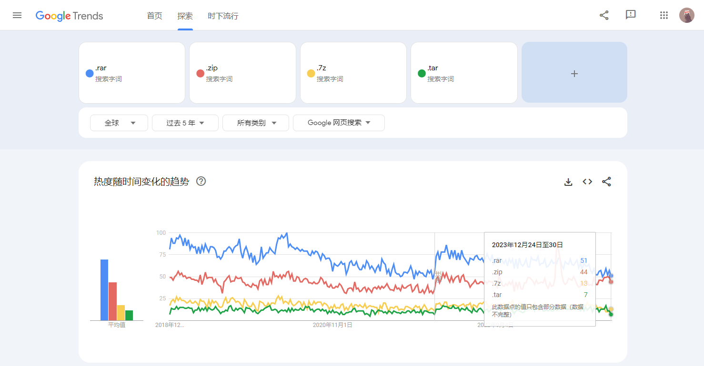
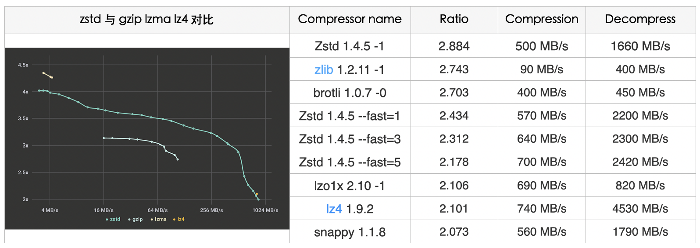

# Striking a Balance Between Speed and Compression Ratio: The Relationship Between Compression Algorithms and Formats

Some common compression formats include zip, rar, and 7z. Common compression algorithms include gzip, brotli, zstd, lz4, pigz, isa-l, and pzstd. However, what are the relationships between these? How can one strike a balance between compression speed and ratio? What is the relationship between compression algorithms and formats?

<!--more-->

## Overview

When compressing a bunch of files totaling 260MB in size using WinRAR, the compressed file was surprisingly under `8MB in RAR format, but over 90MB+ in ZIP format.` Surprisingly, RAR's compression speed was even faster. When compressing files using Java's standard library ZipOutputStream, the compressed file size and compression speed were similar to WinRAR compressing in ZIP format.

> I previously summarized the differences between various compression algorithms under the Parquet compression format:
>
> [Parquet: A Columnar File Format for Big Data Analysis](https://jerrysmd.github.io/20201215_parquet-format/)

So what are the relationship between compression algorithms and formats? How can one strike a balance between compression speed and ratio?

## Compression Formats

### Formats Popularity 

+ Popularity of Common Compression Formats: 
  + rar > zip > 7z > tar

### Formats Support Algorithms

+ Different compression formats use Different compression algorithms
  + **RAR** mainly use its o`wn proprietary RAR compression algorithm`. It also supports LZSS and PPMd
  + **Zip** supports the `DEFLATE algorithm`. It also supports BZip2, LZMA and etc.
  + **7z** supports the most types of algorithms, including LZMA, LZMA2, PPMd, BZip2, Delta Filter, Deflate etc. Its default algorithm is LZMA2.
  + **Tar** natively only supports `lossless compression`, typically using a flat file format without compression. Compression can be supported by choosing different software plugins that support Gzip/Bzip2 etc algorithms. 
  - **Gzip** solely supports the DEFLATE algorithm.

  - **Bzip2** solely supports the Bzip2 algorithm.

## Compression Algorithms

### gzip

+ Gzip is an algorithm **based on DEFLATE**, `which combines LZ77 and Huffman coding.` The purpose of DEFLATE is to replace LZW and other patented data compression algorithms because these algorithms restricted the availability of compression and other popular archivers at the time

+ We usually use the `'tar -czf'` command for packing and compressing operations, where the `'z' parameter uses gzip` for compression. The **DEFLATE** standard (RFC1951) is a widely used lossless data compression standard. Its compressed data format consists of a series of blocks corresponding to blocks of input data. Each block is compressed using the LZ77 algorithm (based on dictionary compression, representing the most probable letters with the shortest codes) and Huffman coding. The LZ77 algorithm reduces data volume by finding and replacing duplicate strings.

+ gzip file **header**:
  + A 10-byte header containing a magic number (1f 8b), compression method (e.g., 08 for DEFLATE), 1 byte of header flags, 4 bytes of timestamp, compression flags, and the operating system ID.
  + Optional additional headers including the original filename, comment field, "extra" field, and lower half of the header's CRC-32 checksum.
  + DEFLATE compressed body.
  + An 8-byte footer containing the CRC-32 checksum and the original uncompressed data.
  + `We can see that gzip is primarily based on CRC and Huffman LZ77 in the DEFLATE algorithm,` which is also the optimization target for the subsequent ISA-L library."

### Brotli

+ Alakuijala and Szabadka completed the Brotli specification between 2013 and 2016, aiming to further improve compression ratios. This data format finds extensive applications in optimizing website speeds. The formal validation of the Brotli specification was independently implemented by Mark Adler. Brotli is a data format specification for data stream compression that utilizes a specific combination of the general LZ77 lossless compression algorithm, Huffman coding, and second-order context modeling. You can refer to this paper to delve into its implementation principles.
+ Due to the inherent characteristics of language, context modeling methods can achieve better compression ratios. However, widespread adoption is challenging due to performance issues. Currently, there are two popular breakthrough algorithms:
  + ANS: Zstd, lzfse 
  + Context Modeling: Brotli, bz2

### Zstd

+ Zstd, short for Zstandard, is a rapid compression algorithm known for providing high compression ratios. Primarily implemented in the programming language C, it was released by Facebook's Yann Collet in 2016. Zstd incorporates the `Finite State Entropy (FSE) encoder`, developed by Jarek Duda based on the Asymmetric Numeral Systems (ANS) theory. This encoder **offers a compelling compromise between compression speed and ratio, effectively achieving the dual goals of high compression speeds and rates.** In fact, at its maximum compression level, Zstd reaches compression ratios comparable to lzma, lzham, and ppmx, outperforming lza or bzip2 in terms of performance.
+ Zstandard attains the `Pareto frontier`, an ideal state for resource allocation, as its decompression speed surpasses that of any other currently available algorithm, while maintaining similar or better compression ratios.
+ For smaller data, Zstd offers a specific method for loading a preset dictionary to optimize speed. This dictionary can be generated through training on target data, providing further optimization.
+ Benchmark:
  + 

+ The compression level can be specified using the `'-fast' option`, providing faster compression and decompression speeds, albeit resulting in some loss of c`ompression ratio compared to level 1`, as shown in the table above. Zstd can trade compression speed for stronger compression ratios. It offers configurable small increments where, under all settings, decompression speed remains constant, a feature shared by most LZ compression algorithms such as zlib or lzma.
+ We conducted tests using Zstd's default parameters. **The compression time of 8.471s was only 11.266% of the original, indicating an improvement of 88.733%**. The decompression time of 3.211 was only 29.83% of the original, showcasing an improvement of approximately 70.169%. Simultaneously, the **compression ratio also increased from 2.548 to 2.621.**

### Pigz

+ Mark Adler, the author of Pigz, is also a co-author of Info-ZIP's zip and unzip, GNU's gzip, and the zlib compression library. Additionally, he has contributed to the development of the PNG image format.

+ Pigz is an acronym for parallel implementation of gzip, designed to leverage multiple processors and cores. It divides the input into blocks of 128 KB, compressing each block in parallel. The checksum for each block is also computed in parallel. Its implementation directly utilizes the zlib and pthread libraries, making it easily readable and, importantly, compatible with the gzip format. Pigz uses one thread (the main thread) for decompression but can create three additional threads for reading, writing, and checksum computation, thereby potentially speeding up decompression in certain scenarios.

+ Some blogs testing Pigz's compression performance on consumer-grade PC platforms like the i7 4790K did not show significantly high speeds. However, in our real machine validation, the improvement was much more noticeable. Through our tests, its compression execution speed was only 1.768s, fully utilizing the performance of our platform's physical machine. **The total User time (sum of CPU time) was 1m30.569s, which is almost on par with the speed obtained using gzip in a single-threaded manner. The compression ratio of 2.5488 was nearly identical to the usual result obtained from 'tar -czf'.**

### ISA-L Acceleration Version

+ ISA-L is an open-source function library designed to accelerate algorithm execution on IA (Intel Architecture) for addressing computational needs in storage systems. It aims to resolve the computing demands of storage systems. ISA-L operates under the BSD-3-Clause License, allowing commercial usage.

+ If you've used SPDK (Storage Performance Development Kit) or DPDK (Data Plane Development Kit), you might have come across ISA-L. The former utilizes ISA-L's CRC segment, while the latter leverages its compression optimization. ISA-L maximizes the computational process of storage algorithms by employing efficient SIMD (Single Instruction, Multiple Data) and specialized instructions, making the most of the CPU's microarchitecture. The underlying functions in ISA-L are written using hand-optimized assembly code, focusing on various details. (It's worth noting that considering the ARM platform is commonplace now, some instructions mentioned in this article may have limited or no support on this platform.)

+ **ISA-L primarily optimizes CRC, DEFLATE, and Huffman encoding for compression algorithms. Official data suggests that ISA-L boasts a fivefold speed improvement over zlib-1**

+ Test

  + The compression optimization levels supported by ISA-L range from [0,3], where 3 represents the version with the maximum compression ratio. Taking a holistic approach, we opted for the maximum compression ratio, although the compression ratio of 2.346 is slightly lower than gzip; however, the impact is minimal. In the v2.27 release of June 2019, ISA-L introduced a multithreading feature. Consequently, in subsequent tests, employing the parameters for multithreaded concurrency showed a noticeable improvement.

  + Since our system is based on Centos7, there's a need to independently compile ISA-L's dependencies, such as nasm libraries. As a result, the installation and configuration might be somewhat complex. ISA-L supports various optimization parameters, such as IGZIP_HIST_SIZE (increasing the sliding window during compression) and LONGER_HUFFTABLES (larger Huffman encoding tables). These compilation parameters significantly enhance the library's performance.

  + `The results of the tests were quite remarkable, as it proved to be the fastest among the compared solutions, achieving a time savings of 98.09%.`

    Due to its compatibility with the gzip format, it can also be extracted using the `'tar -xf'` command. Throughout the subsequent decompression testing process, we continued to use the decompression method provided by ISA-L.

### Pzstd

+ Through the testing with Pigz, we pondered whether an excellent algorithm like Zstd could also support parallelism. To our delight, within the official repository, we stumbled upon a "treasure."

+ Pzstd is a parallel version of Zstandard implemented in C++11 (Zstd later added support for multithreading), akin to tools like Pigz. It offers compression and decompression functionalities compatible with the Zstandard format, harnessing the power of multiple CPU cores. Pzstd divides the input into equally sized blocks and independently compresses each block into Zstandard frames. These frames are then concatenated to produce the final compressed output. Pzstd also supports parallel decompression of files. When decompressing files compressed using Zstandard, Pzstd performs IO operations in one thread while conducting decompression in another thread.

## Compression Algorithm Comparison

| Compression Algorithm | Advantages                                                   | Disadvantages                                                |
| --------------------- | ------------------------------------------------------------ | ------------------------------------------------------------ |
| Brotli                | . Good for Small file processing . OK for compression and decompression speeds, but not good | . Not support gzip format . Not good for big file . Need to install Brotli lib |
| Zstd                  | . Excellent compression and decompression speeds . Simple installation dependency . Excellent compression ratio | . Not support gzip format . Need to install Zstd lib    |
| LZ4                   | . Excellent compression and decompression speeds . Simple installation dependency | . Not support gzip format . Need to install LZ4 lib . Not good for compression ratio |
| Pigz                  | . Fully compatible with gzip . Excellent compression and decompression speeds, only behind Pzstd and ISA-L . Good compatible with tar . Simple installation dependency |                                                              |
| ISA-L                 | . Fully compatible with gzip . Excellent compression and decompression speeds, only behind Pzstd . Good compatible with tar | . A little bit lower compression ratio . Required Strict Cluster Syn |
| **Pzstd**             | . Best compression and decompression speeds . Good compatible with tar . Good compression ratio | . Not support gzip format . Decompression need to install zstd |

## Summary

$$
Total Cost = Time_{compression} + \dfrac{PackageSize}{UploadSpeed} + \dfrac{PackageSize}{DownloadSpeed} + Time_{decompression}
$$

+ In the test case comparisons, the time order from fastest to slowest for compression and decompression was: `Pzstd > ISA-L > Pigz > LZ4 > Zstd > Brotli > Gzip`. **The time spent on compression and decompression accounted for the majority of the total time spent. Therefore, the alternative strategies recommended were Pzstd, ISA-L, and Pigz.**
+ Of course, this also involves the tradeoff of disk space optimization - a higher compression ratio could optimize disk space usage but negatively impact build times. However, since time is currently our primary optimization target, it is considered more important than disk costs or upload bandwidth costs. As such, a more universally adopted or default optimal compression ratio in the range of 2.3-2.6 was used. But for storage mediums with higher memory database costs, multiple factors may need to be considered more carefully. Please be aware of this.

> Source:
>
> - https://engineering.fb.com/core-data/smaller-and-faster-data-compression-with-zstandard/
> - https://engineering.fb.com/core-data/zstandard/
> - https://peazip.github.io/fast-compression-benchmark-brotli-zstandard.html
> - https://news.ycombinator.com/item?id=16227526
> - https://github.com/facebook/zstd
> - http://fastcompression.blogspot.com/2013/12/finite-state-entropy-new-breed-of.html
> - https://zlib.net/pigz/
> - https://cran.r-project.org/web/packages/brotli/vignettes/brotli-2015-09-22.pdf
> - https://bugs.python.org/issue41566
> - https://01.org/sites/default/files/documentation/isa-l_api_2.28.0.pdf
> - https://www.intel.com/content/dam/www/public/us/en/documents/white-papers/fast-crc-computation-generic-polynomials-pclmulqdq-paper.pdf

