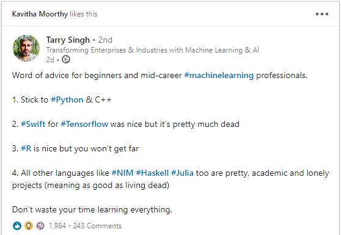

# Don't Waste Your Time Learning Everything

Motivated by this [post](https://waylonwalker.com/don-t-waste-your-time-learning-everything/?continueFlag=7f3df31b2da359a56804de8af1e39c8f) that was itself inspired by this [LinkedIn post](https://www.linkedin.com/posts/activity-6633818327070326784--Ksl). This LinkedIn post say  Stick to Python and C++, Swift for TensorFlow was nice but it's pretty much dead, and all other languages who are too pretty, academic, lonely and dying

<!--more-->

Sum up

+ Don't Waste Your Time Learning Everything
+ Companies will only pay you for your strongest skills
+ Continue learning
  + Recognize your strengths and be proud of them
  + Don't constantly focus on things you're not good at
+ Keep learning new knowledge and improve a little each day
+ Don't be overwhelmed
  - There is too much to learn in new things
  - Use "Hello World" to understand new technologies
  - Learn what you need, no need to learn everything
+ Keep your finger on new tech, but you don't need to do in-depth learning for every technology
  + Use "Hello World" to understand new technologies
  + Future technologies may fail, you won't lose out from investing too much in them
  + And these attempts may help lay the foundation for understanding later successes

