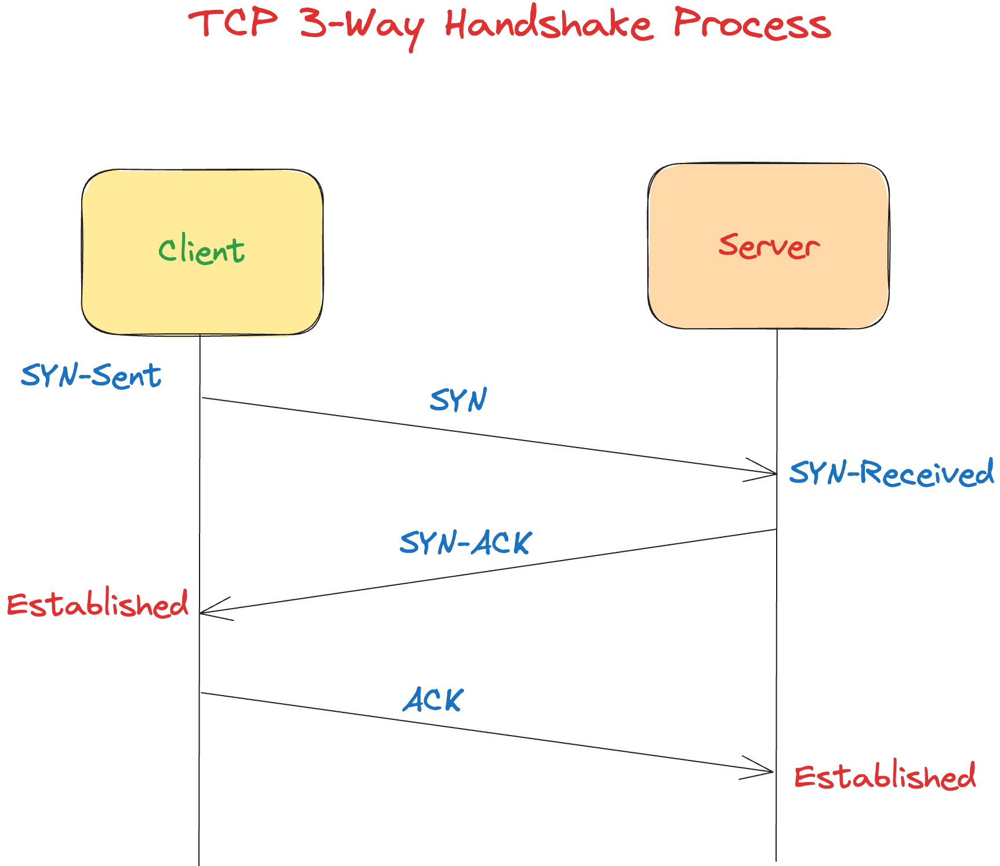
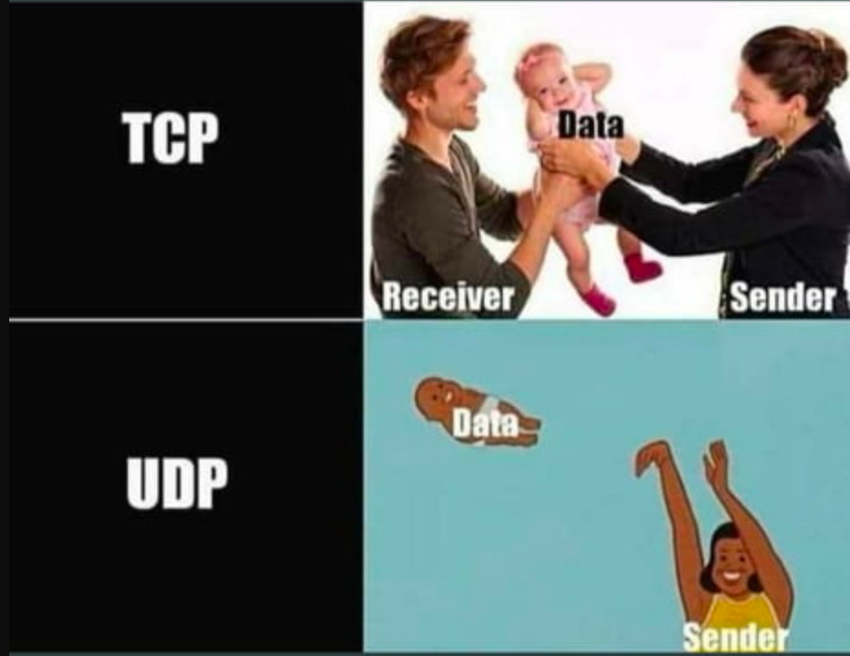
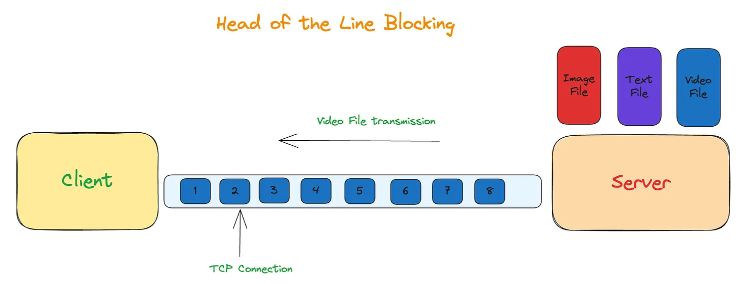
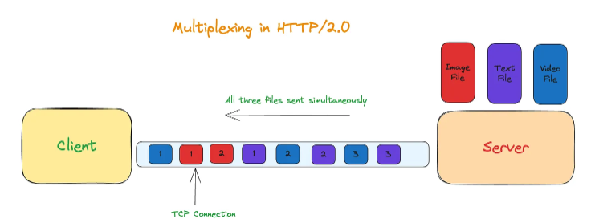
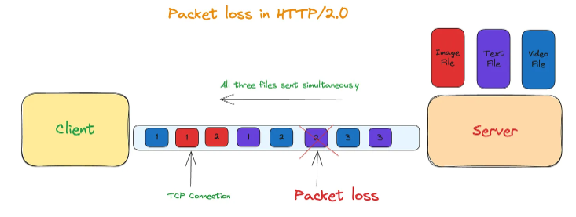
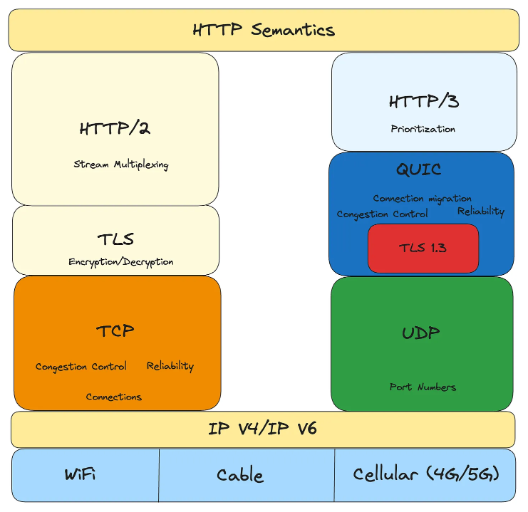
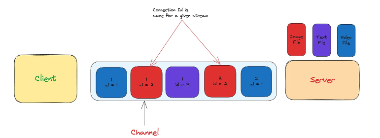

# QUIC: The Next-Gen Transport Protocol Leaving TCP Behind

In the ever-evolving world of internet technology, the need for faster, more secure, and more efficient protocols has become increasingly critical. The ubiquitous Transmission Control Protocol (TCP), which has served as the foundation of internet communication for decades, is now facing a formidable challenger - the QUIC (Quick UDP Internet Connections) protocol.

<!--more-->

## Introduction

Over the past decades, **HTTP** (Hyper Text Transfer Protocol) has been the backbone of the internet. We are able to browse the web, download files, stream movies, etc due to HTTP. The protocol has evolved over the years and witnessed major enhancements.

The HTTP protocol is an application protocol and works on top of **TCP (**Transmission Control Protocol**)**. The TCP protocol has several limitations and results in less responsive web applications.

Google developed a game changing transport protocol called QUIC to overcome TCP’s downsides. **QUIC** was standardised and added to **IETF** (Internet Engineering Task Force) few years ago.

The adoption of QUIC has grown exponentially in the last few years. Majority of the tech companies such as Google, Facebook, Pinterest, etc have started adopting HTTP/3.0 which uses QUIC at the transport level. These companies have seen significant improvements in the performance of their websites with HTTP/3.0 & QUIC.

Let’s embark on our journey to understand how QUIC will displace TCP. We will first go through few fundamental networking concepts of TCP & UDP. Later, we will look at the evolution of HTTP and how each version overcame the limitations of the previous release. We will then see what QUIC is and how it works. We will explore why QUIC is highly performant as compared to TCP.

## How do TCP and UDP work ?

TCP (**Transmission Control Protocol**) and UDP (**User Datagram Protocol**) are transport level protocols. These protocols manage the flow of internet packets to and from any electronic device. Let’s understand in detail how both the protocols work.

### TCP

**TCP** is a connection based protocol. The client establishes a connection with the server and then sends the data. TCP connection is established through a mechanism known as Three-Way Handshake. The below diagram illustrates the Three-Way Handshake process :

The process consists of three steps :-

1. SYN - The client sends a **SYN** packet to the server.
2. ACK - On receiving the **SYN**, the server sends an acknowledgement back to the client through the **ACK** packet.
3. SYN-ACK - After receiving the **ACK** packet from the server, the client finally sends the acknowledgement via **SYN-ACK** to the server.

TCP is a stateful and a reliable protocol. It guarantees delivery of all the packets from one device to another. Additionally, it allows both client and the server to use the same connection for communication.

### UDP

**UDP** is a connectionless protocol. Unlike TCP, there is no Three-Way Handshake between the client and the server. The client sends the packets to the server and doesn’t wait for server’s acknowledgement.

UDP doesn’t guarantee 100% delivery of packets. Packets can get lost and may not reach the other device. UDP isn’t reliable like TCP.

Since there is no initial handshake, UDP is much faster than TCP. For performance reasons, UDP is mostly used in streaming data applications such as music/video.

Here is a popular internet meme that takes a dig on TCP/UDP :

Till now, we have understood how TCP and UDP protocols work. Let’s now explore the HTTP protocol which is an application level protocol.

## Evolution of HTTP

The first version of HTTP was developed by [Tim Berners-Lee](https://en.wikipedia.org/wiki/Tim_Berners-Lee) at [CERN](https://en.wikipedia.org/wiki/CERN) in 1989. There have been multiple optimisations and performance improvements in the protocol since then. Most of the modern devices use ***HTTP 1.1***/***HTTP 2.0*** and ***HTTP 3.0***. Let’s walkthrough the history of HTTP and understand major changes that the protocol underwent.

### HTTP/1.0

After the initial HTTP/0.9 version, HTTP/1.0 started supporting headers, request body, txt files, etc. The clients had to create a TCP connection every time they fetched data from the server using HTTP. This resulted in significant wastage of resources for establishing the connection.

### HTTP/1.1

This protocol added support for reusing the existing TCP connection between the client and the server for fetching new data. This was implemented with the help of the HTTP header `keep-alive`.

If the client wanted to fetch 10 JavaScript files, then it would establish one connection with the server. Then, it would reuse the same connection and fetch the 10 files instead of creating a new connection for each file.

This results in reduced resource wastage and performance improvements, as it avoids creating redundant connections. However, a major downside was a problem known as *Head of the line blocking*.

The following diagram illustrates the *Head of the line blocking* problem.

Let’s understand this concept with an example. As shown in the above diagram, you have three files - image, text and video. The video file has a larger size and would take more time to transmit. Since the video file takes more time, it would block the image and text file from being sent.

### HTTP/2.0

The **HTTP 2.0** solved the *Head of the line blocking* problem by multiplexing. With the help of multiplexing, multiple files could be sent over the same TCP connection.

This resulted in performance gains and solved the Head of line blocking problem at the application level. However, at the TCP layer, in case there was a packet loss, it had to wait for packet retransmission.

The multiplexing solution didn’t work as expected in case of packet losses. In fact, HTTP 1.1 performed better than HTTP 2.0 if the packet loss was more than 5%. The *Head of the line blocking* problem transitioned from the application layer to the transport layer.

The below diagram illustrates how a single packet loss resulted in multiple streams getting delayed :

When a single packet gets lost, TCP stores the subsequent packets in it’s buffer until it receives the lost packet. TCP then uses retransmission to get the lost packet. HTTP doesn’t have visibility into TCP retransmission. As a result, different streams see a delivery delay in such cases.

## What is QUIC ?

In the past few sections, we saw that TCP has certain inherent limitations such as Three-way handshake & Head of the line blocking. These limitations can be solved by either enhancing TCP or replacing TCP with a new protocol.

Although, it’s simple to enhance TCP but TCP is present in the lowest layer of tightly coupled with the Operating system. In simple words, the code for TCP exists in the kernel layer and not in the user space. Considering the vast number of devices, implementing changes in the kernel space would require a significant amount of time to reach all users.

Hence, Google came up with a new protocol **QUIC**, which served as a replacement for TCP. Just like TCP, QUIC is also a transport level protocol. However, it resides in the user space instead of the kernel space. This makes it easy to change and enhance unlike TCP.

QUIC works on top of UDP. It overcomes the limitations of TCP by using UDP. It’s just a layer or wrapper on top of UDP. The wrapper adds features of TCP such as congestion control, packet retransmission, multiplexing etc. It internally uses UDP and adds best features from TCP on top of it.

The below image shows how QUIC fits in the networking stack :

## How does QUIC work ?

### QUIC Handshake

QUIC works on UDP & it doesn’t have to go through the Three-way handshake process. The Three-way handshake process adds an extra overhead and adds to the latency. As a result, QUIC improves the performance by reducing the connection latency.

In case of TCP, there is an additional handshake used for TLS which adds to the latency. QUIC combines the TLS handshake and QUIC handshake in a single call. It thereby optimizes the handshake process and improves the performance.

### Reliability

You might wonder “*Do packets get lost since QUIC works on UDP ?*”. The answer is No. QUIC adds reliability on top of the UDP stack. It implements packet retransmission in case it doesn’t receive the necessary packets. For eg:- If the server doesn’t receive packet no 5 from the client, the protocol will detect it and server will ask the client to resend the same packet.

### Multiplexing

Similar to TCP, QUIC also implements multiplexing. Clients can transfer multiple files at the same time using a single channel. QUIC creates an UUID for each stream (file that gets transferred). It uses the UUID to identify the stream. Multiple streams are then sent over a single channel.

The below diagram illustrates how multiplexing works in QUIC :

QUIC also solves the Head of Line blocking problem faced by TCP through it’s multiplexing. In case a stream suffers packet loss, only that stream would be impacted. The streams in QUIC are independent & don’t impact the working of each other.

### Security

Moreover, QUIC also supports TLS 1.3 (Transport level security). This guarantees the security and confidentiality of the data. TLS encrypts large parts of the QUIC protocol such as packet numbers and connection close signals.

## Why QUIC ?

- **Reduced latency** - QUIC minimizes the latency by combining the TLS handshake with the connection setup. This is also known as **0-RTT** (Zero Round Trip Time). It results in faster connection establishment and improves performance of web applications.
- **Multiplexing** - With multiplexing, QUIC can send multiple streams of data over a single channel. It greatly helps client applications which download multiple files i.e images, JavaScript, CSS, etc.
- **Connection migration** - Using QUIC, you can switch from one network interface to another (wifi to mobile data) without any glitch. This is important for mobile devices and improves the user experience.
- **Improved Security** - QUIC works on TLS 1.3, which offers better security. Additionally, it also encrypts large parts of the protocol unlike TCP with TLS, which encrypts only the HTTP payload. It is more resilient to security attacks as compared to TCP.
- **Wide support** - It has seen a rise in adoption right since it’s inception. This has further strengthened it’s effectiveness.

## Conclusion

The internet has come a long way since the inception of HTTP decades ago. The evolution of HTTP has made the online experience more efficient and responsive. With the growing demands of modern applications, we realized inherent limitations of underlying protocols such as TCP.

Google developed the game changing protocol, QUIC. It leveraged UDP and addressed all the shortcomings of TCP. Reduced latency, multiplexing, enhanced security, & connection migration are some of the striking features of QUIC. The innovations bought by QUIC have addressed problems like head of the line blocking.

Big Tech companies like Google and Facebook have seen drastic improvements in performance by adopting QUIC in HTTP/3. With the rising adoption and growing support, HTTP/3 will become a standard for internet communication. In the coming years, the internet will evolve and transition to HTTP/3 for efficiency, reliability and performance.

> Source:
>
> https://engineeringatscale.substack.com/p/how-quic-is-displacing-tcp-for-speed

