# ElasticSearch Monitoring Guide

The text covers key ElasticSearch monitoring metrics, including search performance, indexing, memory usage, and garbage collection. It provides dashboard configuration examples for clusters and indices. The text also addresses common issues like poor query and indexing performance, describing root causes, troubleshooting, and solutions. It discusses building a reliable monitoring system using Prometheus.

<!--more-->

## Key monitoring indicators

ElasticSearch provides a wide range of metrics for monitoring various issues, including:

- Search performance metrics
- Indexing performance metrics
- Memory usage and garbage collection metrics
- Host-level network system metrics
- Cluster health and node availability metrics
- Resource saturation and error metrics

### Search performance metrics

ElasticSearch queries can be divided into two types:

1. Queries by ID to retrieve documents. This allows for real-time access to recently written data. The retrieval process is:
   - Check in-memory Translog
   - Check disk-based Translog
   - Check disk-based Segments
2. Queries by query to retrieve documents. This allows for near real-time access to recently written data. The retrieval process is:
   - Check filesystem cache for Segments
   - Check disk-based Segments

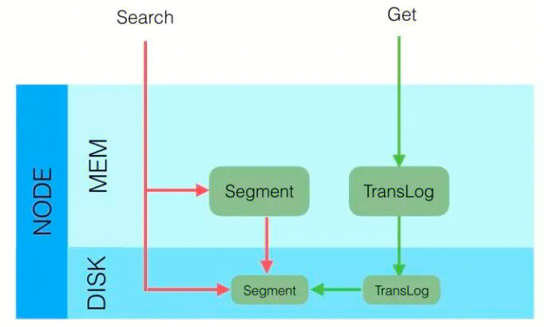

The retrieval strategies can be divided into three main categories:

1. QUERY_AND_FETCH: The query directly returns the entire document content, corresponding to querying by ID.
2. QUERY_THEN_FETCH: First, the query retrieves the relevant document IDs, and then fetches the actual documents by those IDs.
3. DFS_QUERY_THEN_FETCH: This is based on QUERY_THEN_FETCH, but with an additional scoring step.

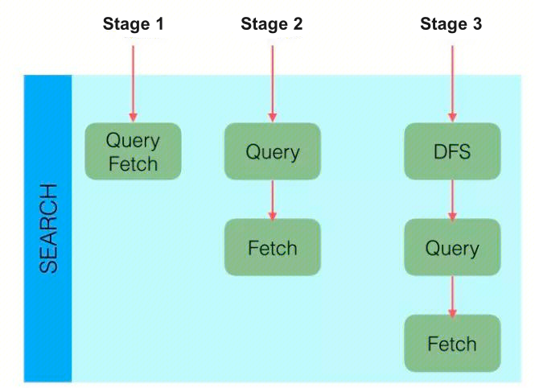

In a distributed scenario, the query process typically has two stages, using QUERY_THEN_FETCH as an example:

Query stage:

1. The client sends a search request to NODE 3, which creates an empty priority queue of size from + size.
2. NODE 3 forwards the query to each primary or replica shard of the index. Each shard executes the query locally and adds the results to its own local ordered priority queue of size from + size.
3. Each shard returns the IDs and sort values of all documents in its priority queue to the coordinating node, NODE 3, which merges these values into its own priority queue to produce a globally sorted result list.

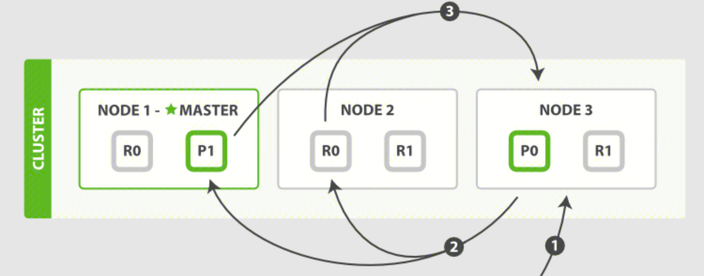

Fetch stage:

1. The coordinating node identifies which documents need to be retrieved and submits multiple GET requests to the relevant shards.
2. Each shard loads and enriches the documents, if needed, and returns them to the coordinating node.
3. Once all the documents have been retrieved, the coordinating node returns the results to the client.

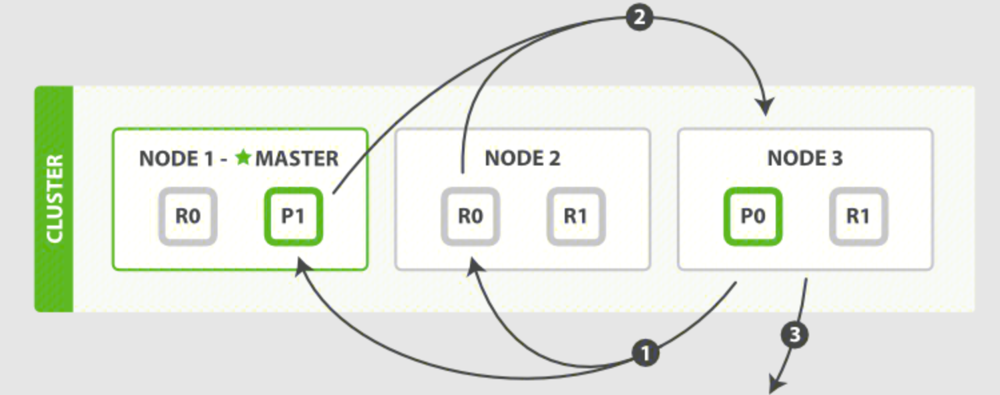

### Indexing Performance Metrics

Any node in ElasticSearch can act as the coordinating node to receive requests. When a coordinating node receives a request, it performs a series of processing steps, then uses the _routing field to find the corresponding primary shard, and forwards the request to the primary shard. After the primary shard completes the write operation, it sends the write to the replicas. The replicas then execute the write and return the response to the primary shard, which then returns the request to the coordinating node.

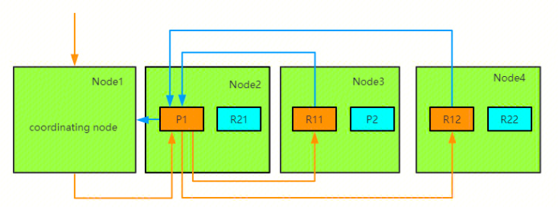

### Memory Usage and Garbage Collection Metrics

ElasticSearch is written in Java and runs on the JVM, so it utilizes both the JVM heap and the file system cache on the node. Therefore, the overall JVM garbage collection duration and frequency during ES operation are important metrics to monitor.

### Host-level Network System Metrics

The host-level resource and network usage also need to be monitored.

### Cluster Health and Node Availability Metrics

As ElasticSearch is deployed in a cluster, cluster-level metrics need to be monitored.

### Resource Saturation and Errors

ElasticSearch nodes use thread pools to manage how threads consume memory and CPU, so thread-related metrics need to be monitored.

## Monitoring Dashboards

The Prometheus monitoring service provides out-of-the-box Grafana monitoring dashboards. Based on the pre-configured dashboards, you can directly monitor the status of various important metrics for the ES cluster and quickly identify issues.
### Cluster Dashboard

The cluster dashboard provides monitoring information related to the cluster, including cluster nodes, shards, resource utilization, circuit breakers, thread pools, etc.

Cluster Overview

This monitoring provides an overview of the cluster, showing the cluster health status, number of nodes, data nodes, circuit breaker tripped count, utilization, pending cluster tasks, and the number of open file descriptors for the ES process. The cluster health is 1 for red, 5 for green, and 23 for yellow.

Shards Monitoring

Breakers Monitoring

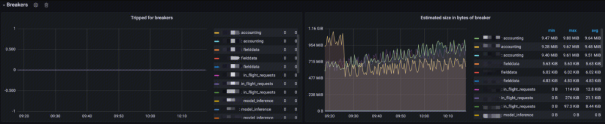

This monitoring provides the number of times various circuit breakers have tripped, as well as the memory usage of the tripped circuit breakers. You can use this monitoring to identify the types of circuit breakers that have tripped, the circuit breaker limits, the memory usage when the circuit breakers tripped, and which node the tripping occurred on.

Node Monitoring

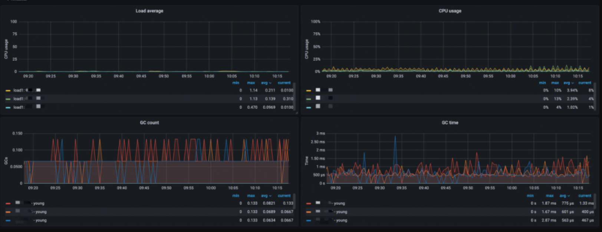

This monitoring provides information for each node, including:

- Load average: Analysis of the short-term average load on the nodes
- CPU usage: Analysis of CPU utilization
- GC count: Analysis of JVM GC runs
- GC time: Analysis of JVM GC runtime

You can use this monitoring to quickly identify and locate node resource issues.

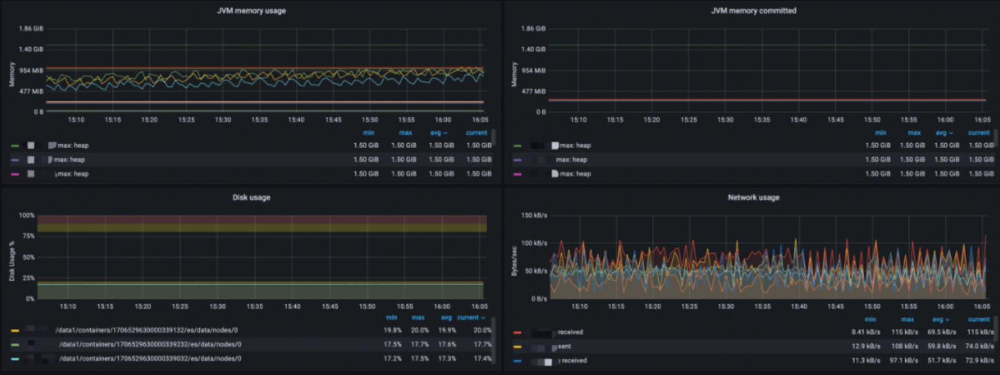

This monitoring provides:

- JVM memory usage: Analysis of JVM memory usage, memory limit, and peak memory usage
- JVM memory committed: Analysis of memory committed in different areas
- Disk usage: Analysis of data storage utilization
- Network usage: Analysis of network usage, including send and receive

Thread Pool Monitoring

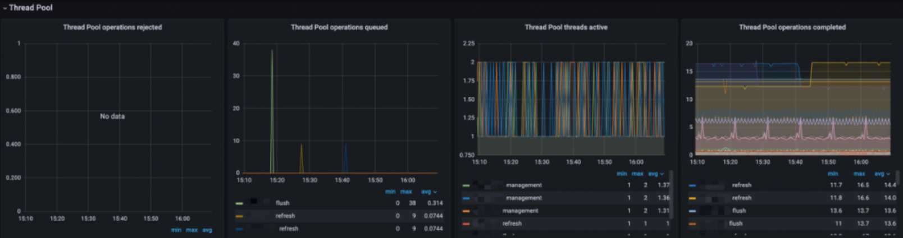

This monitoring provides information about the thread pools, including:

- Thread Pool operations rejected: Analysis of the rejection rate for different types of thread pool operations
- Thread Pool operations queued: Analysis of the queue size for different types of thread pool operations
- Thread Pool threads active: Analysis of the active thread count for different types of thread pool operations
- Thread Pool operations completed: Analysis of the completed operation count for different types of thread pool operations

### Index Dashboard

Translog

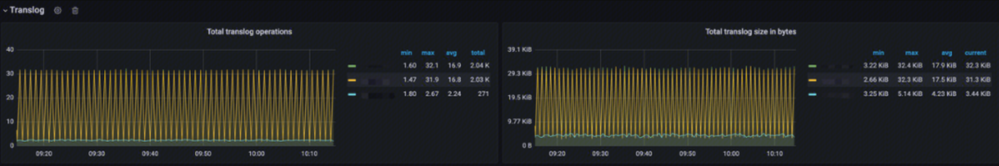

This monitoring provides Translog-related metrics:

- Total Translog Operations: Analysis of the total number of Translog operations
- Total Translog size in bytes: Analysis of the Translog memory usage trend to assess its impact on write performance

Documents

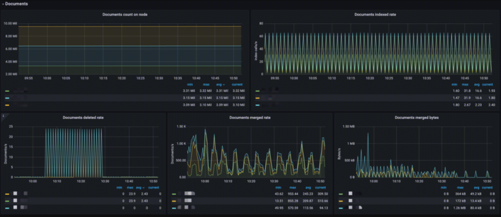

This monitoring provides:

- Documents count on node: Analysis of the number of indexed documents per node to see if the index is too large
- Documents indexed rate: Analysis of the index ingestion rate
- Documents deleted rate: Analysis of the document deletion rate
- Documents merged rate: Analysis of the document merge rate
- Documents merged bytes: Analysis of the memory usage for the index merge operation

Latency

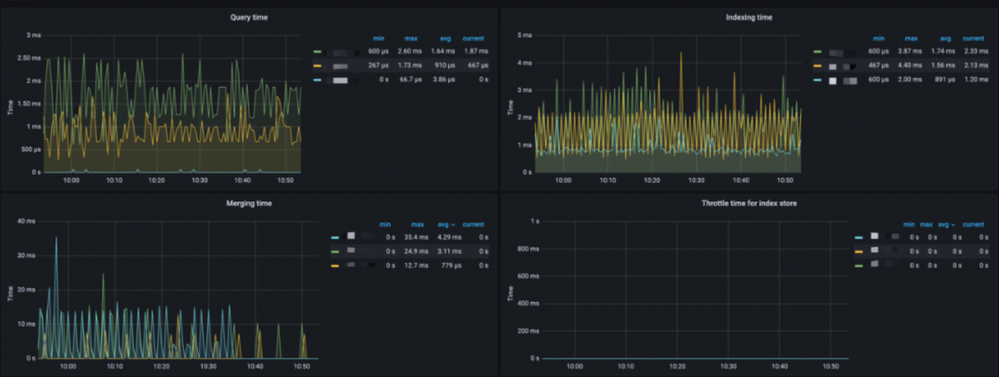

This monitoring provides:

- Query time: Analysis of the query latency
- Indexing time: Analysis of the document indexing latency
- Merging time: Analysis of the index merge operation latency
- Throttle time for index store: Analysis of the index write throttling time to assess the reasonableness of merges and writes

Total Operation Stats

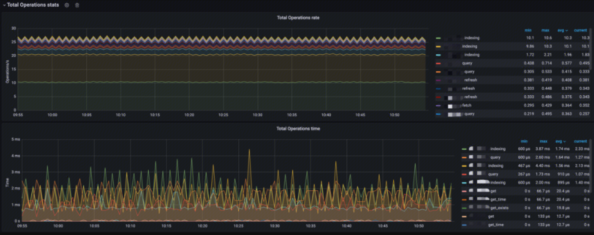

This monitoring provides:

- Total Operations rate: Analysis of the index operation rates, including indexing, querying, query fetch, merging, refresh, flush, GET (existing), GET (missing), GET, and index deletion
- Total Operations time: Analysis of the latency for the various index operations

Caches

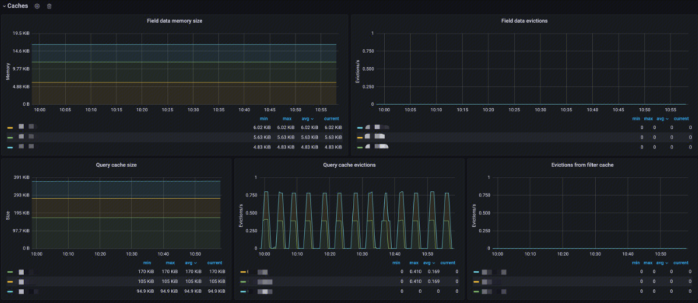

This monitoring provides:

- Field data memory size: Analysis of the Fielddata cache size
- Field data evictions: Analysis of the Fielddata cache eviction rate
- Query cache size: Analysis of the query cache size
- Query cache evictions: Analysis of the query cache eviction rate
- Evictions from filter cache: Analysis of the filter cache eviction rate

Segments

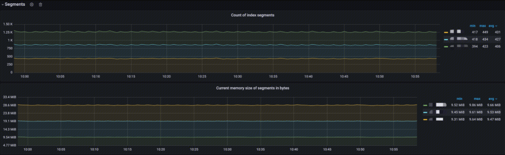

This monitoring provides:

- Documents count on node: Analysis of the number of index segments per node
- Current memory size of Segments in bytes: Analysis of the current memory usage of the index segments

## Typical Problem Scenarios

### Poor ElasticSearch Query Performance

There are many reasons why ElasticSearch query performance may degrade. You need to use the monitoring metrics to diagnose the specific symptoms and then take corresponding measures.

> High resource utilization even when inactive

Each shard consumes resources (CPU/memory). Even without index/search requests, the existence of shards will incur cluster overhead.

**Cause**: There are too many shards in the cluster, causing any query execution to appear slow.

**Diagnosis**: Check the shard monitoring in the cluster dashboard to see if there are too many shards.

**Solution**: Reduce the shard count, implement index freezing, and/or add additional nodes to achieve load balancing. Consider using the hot/warm architecture (very suitable for time-based indexes) and rollover/shrink functionality in ElasticSearch to efficiently manage shard count. It's best to perform proper capacity planning before deployment to determine the optimal shard count for each search use case.

> Large number of "rejected" threads in the thread pool

There are a large number of rejections in the thread pool, causing queries to not be executed normally.

**Cause**: The queries are directed at too many shards, exceeding the core count in the cluster. This will cause queuing in the search thread pool, leading to search rejections. Another common cause is slow disk I/O, leading to search queuing or CPU saturation in some cases.

**Diagnosis**: Check the rejected rate monitoring in the thread pool monitoring on the cluster dashboard to see if there are a large number of rejections.

**Solution**: Use a 1 primary shard: 1 replica shard (1P:1R) model when creating indexes. Using index templates is a good way to deploy this configuration when creating indexes. (ElasticSearch 7.0 or higher will default to 1P:1R). ElasticSearch 5.1 or higher supports cancellation of search tasks, which is very useful for managing slow search tasks in the task management API.

> High CPU utilization and indexing latency

The metric correlation shows that when the cluster is under heavy load, both CPU utilization and indexing latency will be high.

**Cause**: Large indexing volume can affect search performance.

**Diagnosis**: Check the CPU utilization in the node monitoring on the index dashboard, as well as the JVM CPU utilization. Then check the indexing latency in the latency alerts.

**Solution**: Increase the refresh interval (index.refresh_interval) to 30s, which can often help improve indexing performance. This ensures that shards do not have to create a new segment every 1 second by default, which increases the workload.

> Increased latency after adding replica shards

After increasing the replica shard count (e.g., from 1 to 2), you can observe an increase in query latency. If there is a large amount of data, the cached data will be evicted quickly, leading to an increase in OS page faults.

**Cause**: The file system cache does not have enough memory to cache the frequently queried portions of the index. ElasticSearch's query cache implementation uses an LRU eviction policy: when the cache fills up, it will evict the least recently used data to make way for new data.

**Diagnosis**: When the shards are increased, check the query latency in the latency monitoring on the index dashboard. If the query latency has increased, check the query cache and query cache eviction monitoring in the caches panel on the index dashboard. If the cache size is high and the eviction rate is high, this is the issue.

**Solution**: Leave at least 50% of the physical RAM for the file system cache. The more memory, the larger the cache space, especially when the cluster encounters I/O issues. Assuming the heap size is configured correctly, any remaining available physical RAM for the file system cache will greatly improve search performance. In addition to the file system cache, ElasticSearch also uses a query cache and request cache to improve search speed. All of these caches can be optimized using search request preferences to route certain search requests to the same set of shards instead of alternating between different available replicas. This will better utilize the request cache, node query cache, and file system cache.

> High utilization when sharing resources

The operating system shows sustained high CPU/disk I/O utilization. Performance improves after stopping third-party applications.

**Cause**: There is resource (CPU and/or disk I/O) contention between other processes (e.g., Logstash) and ElasticSearch itself.

**Diagnosis**: Check the CPU, disk, and network utilization monitoring on the node monitoring panel in the cluster dashboard. You will find that the utilization remains high. If you stop the third-party application, you will find that the CPU, disk, and network utilization will decrease, and the performance will improve.

**Solution**: Avoid running ElasticSearch on shared hardware with other resource-intensive applications.

### Poor ElasticSearch Indexing Performance

There are also many reasons why ElasticSearch indexing performance may degrade. The specific situation needs to be analyzed case by case.

> Insufficient hardware resources

Hardware resources are the foundation of everything, and their performance determines the performance ceiling of the cluster running on them.

**Cause**: Slow disk speed, high CPU load, and insufficient memory can lead to a decline in write performance.

**Diagnosis**: Check the CPU, disk, and network utilization monitoring on the node monitoring panel in the cluster dashboard, and find that the various indicators are persistently high.

**Solution**: Upgrade hardware, add nodes, or use faster storage devices.

Improper index settings
The number of index shards and replicas, as well as the refresh time interval, can all affect indexing performance.

**Cause**: Unreasonable index settings, such as too many shard counts, unreasonable replica counts, and inappropriate refresh intervals, can affect write performance. More shards can lead to slower writes, multiple replicas can greatly impact write throughput, and refresh operations are very costly, and too frequent refresh operations can affect overall cluster performance.

**Diagnosis**: Check the shard dashboard in the cluster dashboard to see if the shard count and replica count are too high, and judge their rationality.

**Solution**: Optimize the index settings, adjust the shard and replica count, and increase the refresh interval.

> Excessive indexing pressure

The cluster's write capacity has a limit, and the write speed cannot exceed a specific limit.

**Cause**: A large number of write requests exceed the cluster's processing capacity, leading to a decline in write performance.

**Diagnosis**: Check the Total Operations rate in the index dashboard to see the rate of various types of indexing operations, and use the Total Operations time to comprehensively judge whether the write capacity has reached its limit.

**Solution**: Mitigate the write pressure through horizontal scaling by adding nodes, optimizing the write request distribution strategy, and using asynchronous writes.

> Oversized index data

The index should have a data limit, and exceeding a certain amount will lead to a significant performance decline.

**Cause**: Excessively large indexes will lead to a decline in write performance, especially when disk space is insufficient.

**Diagnosis**: Check the document monitoring in the index dashboard to see the total number of documents, the document indexing rate, and the document deletion rate. If the document deletion rate is 0, it indicates that there is a problem with the index lifecycle management. If the document count and indexing rate are still high despite the lifecycle management, then other index issues should be considered.

**Solution**: Regularly optimize the index, use the index lifecycle management feature, or distribute the data across multiple indexes.

> Index data hotspots

In actual use, it is common for certain specific businesses to be used more frequently, resulting in a heavier index burden.

**Cause**: Concentrated writing of some hot data will cause some nodes to be overloaded, while other nodes have a lighter load.

**Diagnosis**: Check the node monitoring on the cluster dashboard to see if the various loads on some nodes are significantly higher, while the loads on the remaining nodes are lower.

**Solution**: Repartition the shards, use index aliases to migrate data, or adjust the data writing strategy.

> High utilization when sharing resources

The cause and handling are the same as for the degradation of query performance.

> Source:
>
> https://cloud.tencent.com/developer/article/2396903

