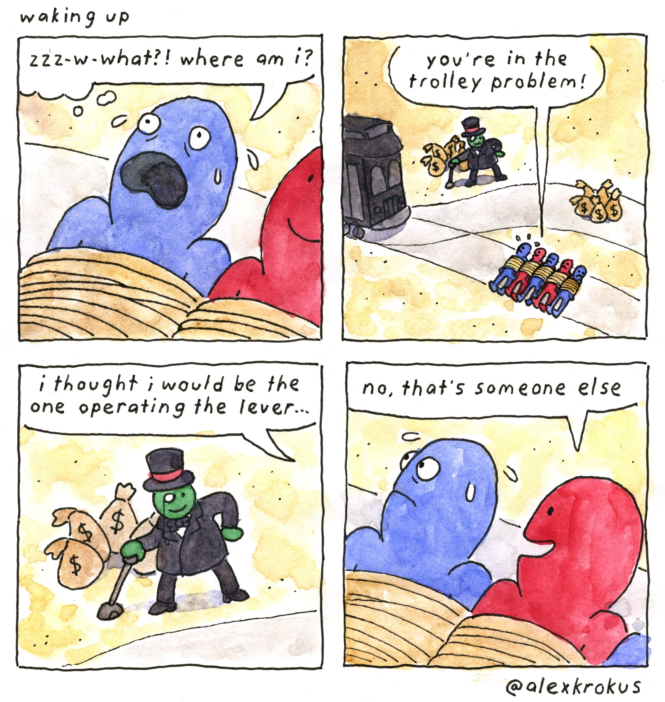

# No Country for Old Men

*No Country for Old Men* is one of my favorite movies, although I haven't read the original book. I think this title is perfectly fitting for this blog post. **The wheels of history roll forward, and the tides of time surge on.** Maintaining physical and mental health, and surpassing the changes of our era through learning, has become the best strategy for the present.

<!--more-->

---

> 历史车轮滚滚向前，时代潮流浩浩荡荡

We are entering an era without any reliable foundation, where nothing is truly firm and lasting.

------

I came across a social media post the other day, which essentially said that things that were once considered essential are no longer so, even to the point of no longer being alive. 

---

This post resonated with many people, with some even quoting the famous saying `"all that is solid melts into air."`

---

I can personally relate to this feeling. As time passes, many things that were previously considered solid and unwavering, both in the material and ideological realms, are starting to crumble and become unstable, leaving people feeling without any secure footing.

---

For example, the assumption that housing prices would always rise was something that many people took for granted in the past. This assumption formed the basis for important life decisions such as schooling, employment, marriage, and more. However, with the cooling of the real estate market, this premise has been shaken, and the lifetime savings of many have been swept away.

---

Similarly, the notion of `"mastering a certain skill and you'll be set for life"` no longer holds true. No skill or knowledge can provide the kind of constant security it once did, especially with the impact of AI. We've seen translators, artists, programmers, and language teachers all become vulnerable to job losses. Moreover, many positions once considered 'iron bowls jobs' are now facing delayed salaries, and this trend shows no signs of abating. Nowadays, I often wonder, `"Will the field I'm learning become obsolete by the time I acquire the skills?"`

---

Even many things that were once considered common knowledge are now being called into question. 

1. Pseudohistorical theories, 
2. moon landing hoaxes,
3.  the failure of evolution, 
4. and claims that the Yongle Encyclopedia inspired the West's rise

All of these were once dismissed as mere jokes and Internet memes, but are now being seriously discussed and analyzed by a growing number of people. I recall an incident where someone angrily confronted me with supposed "evidence" that turned out to be nothing more than an old social media post.

---

In short, everything seems to be in a state of flux, unanchored and adrift. There is a sense of material, cultural, and ideological instability, leaving people without anything truly solid to rely on. It feels like being lost in a vast, chaotic ball pit, with light and unstable objects flying all around, unable to find stable footing or support.

**The clearer the mind, the more one can feel the pain brought about by change. When everything has been broken down and rebuilt, perhaps what we should do is not to adapt to change, but to transcend it.**

