# Quick Start Guide to DDD: Domain-Driven Design


When a BAU project faces challenges such as large business volumes, wide industry coverage, diverse scenarios, complex customer structures, and constantly changing requirements, a project often needs to be restructured to address these issues. This article attempts to tackle the high business complexity, ever-changing requirements, and high maintenance costs encountered in system design and construction through the application of DDD.

<!--more-->

## Background

Our BAU project faces challenges such as large business volumes, wide industry coverage, diverse scenarios, complex customer structures, and constantly changing requirements. 

---

In our refactoring project, we considered using Domain-Driven Design as a technical approach during the restructuring. 

---

This article attempts to tackle the high business complexity, ever-changing requirements, and high maintenance costs encountered in system design and construction through the application of DDD.

## Basic Concepts

+ Abstraction
  1. Every role, everyone has own specific perspective. Business users, business analytics and dev... abstract the same thing into different thought patterns.
  2. In code level, code usually disconnected from the real business concepts.
+ Coupling
  1. Coupling at the code level expands the scope of modification.
  2. Coupling at the module level requires cross-module/service interaction.
  3. Coupling at the system level requires cross-team collaboration.
+ Change
  1. Business needs determine system functions.
  2. System functions must be constantly adjusted as business needs change, which involves the frequency and scope of system changes.

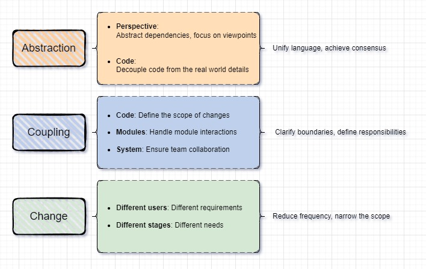

### DDD

Domain-Driven Design is one of the methods to deal with the complexity of software design. It can solve the above three problems very well, but its conceptual system is complex.

### What is a domain

A domain consists of three parts:

+ **stakeholder domain:**

  there are users in the domain

+ **problem domain:**

  users need to realize certain business value, solve certain pain points or realize certain demands

+ **solution domain:**

  corresponding solutions for pain points and demands

### What is domain-driven design

+ In using DDD, you are meant to work closely with a domain expert who explain how the real-world system works.
+ For specific businesses, users have corresponding solutions when facing business problems. These problems and solutions constitute domain knowledge, which includes processes, rules and methods of dealing with problems. 

> Taking marketing as an example, the marketing system serves four types of users: operations, sales, telemarketing personnel, and merchants.
>
> + Solve three core problems: how to issue coupons, to whom, and what to issue
> + Solution: 
>   + issue coupons through marketing activities
>   + determine who to issue to based on the target population
>   + define what to issue based on rights and interests

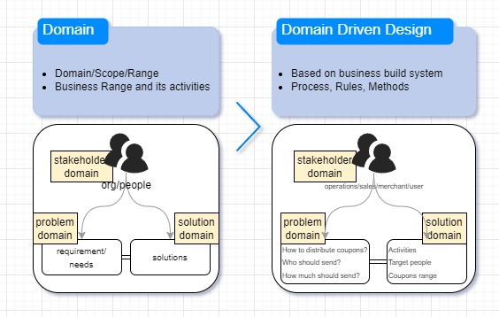

## Implementation Steps

There are three parts to implement of Domain-driven design:

+ **Strategic design:** 

  identify use cases, unify language, and define boundaries

+ **Model design:**

  the conceptual model is transformed into a class model

+ **Code architecture:**

  mapping system design to system implementation

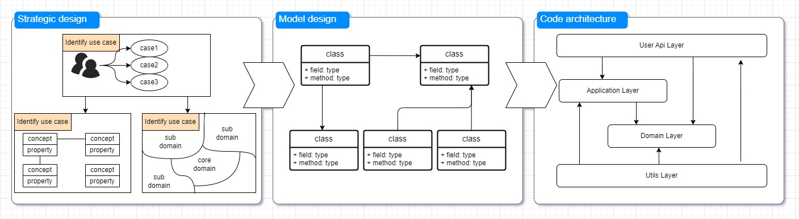

## 1 Strategic Design Practice

### 1.1 Determine use case

Before designing a strategy, first determine the use case

There are several methods:

1. Use case Diagram

   The simplest and most intuitive expression of the interaction between users and the system

2. User Story

   It is commonly used in agile development mode and describes business needs from three dimensions: Who, What and Why

3. Interactive prototype

   The page operated by the user and its operation process. Its disadvantage is that it focuses too much on user experience and ignores the underlying business logic

4. Event Storming

   Focuses on the underlying logic of the business, but has a high threshold for use and is suitable for large and complex business analysis

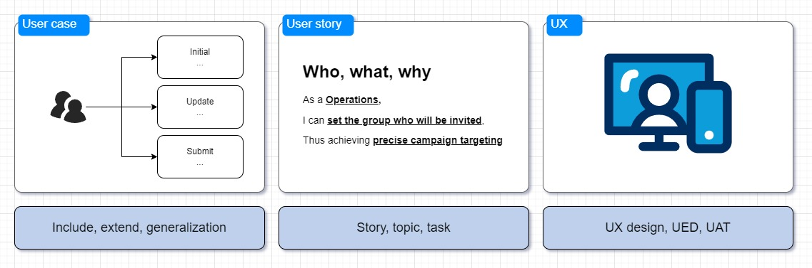

Business example:

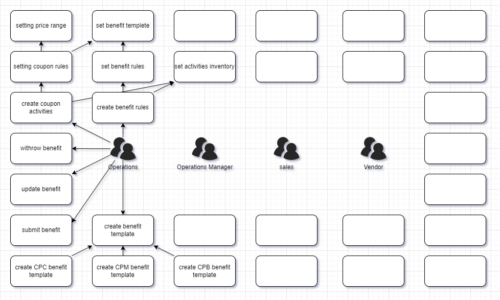

### 1.2 Unify language

After determining the business use case, next step is to unify the language

#### 1.2.1 Abstract concept

+ Extract concepts from use cases and identify the concepts (eliminate the false and retain the accurate, abstract and merge) to find concepts that truly describe that business.
+ For example, there are many ways to describe activity rules: recharge and send rules, return rules, etc. Technology may generally call them **return rules**, and business user use **return price range** to describe them

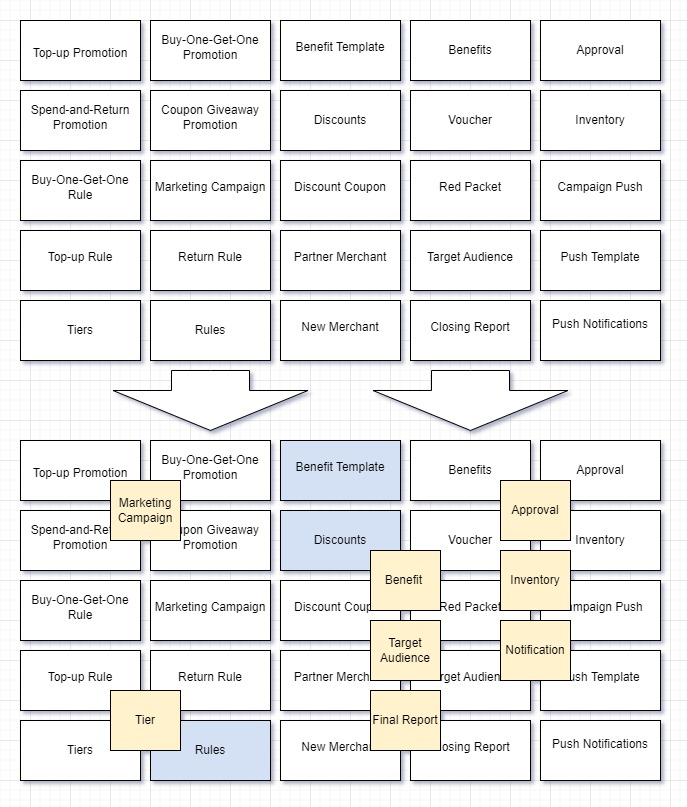

#### 1.2.2 Clarify meaning of concept

The concept consists of three parts: term and meaning

| Term            | Meaning                                                      |
| --------------- | ------------------------------------------------------------ |
| campaign        | A series of operational actions to achieve business objectives such as attracting new customers, retaining and increasing LTV |
| target audience | Merchants who can participate in marketing campaigns         |
| benefit         |                                                              |
| inventory       |                                                              |
| ...             |                                                              |


#### 1.2.3 Sort out concept relationship

Sort out the relationships between the concepts (1 to 1, many to 1, many to many) 

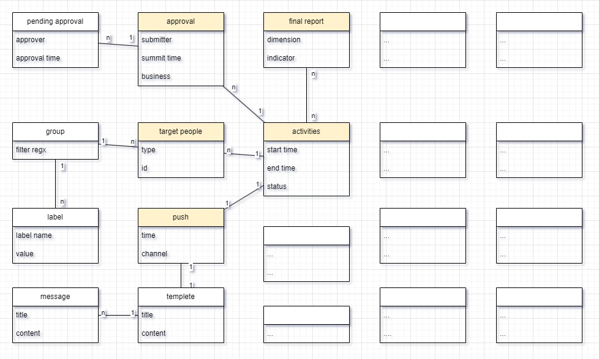

#### 1.2.4 Reach consensus  on requirements

Based on a unified language and conceptual model, the three roles of business, product and technology can more easily reach a consensus on requirements and ensure consistency in communication

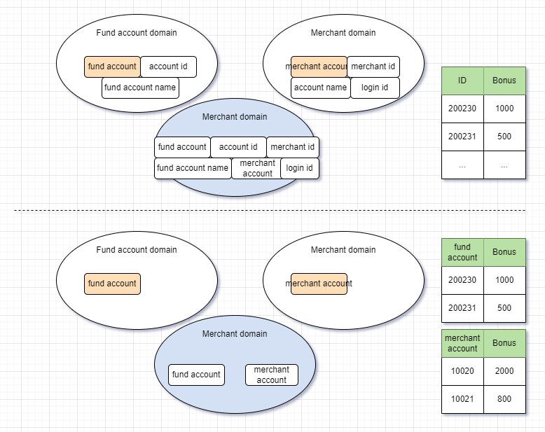

### 1.3 Sum up

The strategic model is a big network that describe the relationships and key attributes between concepts,     but is cannot be directly mapped to a code model. To map it to a code model, it needs to be disassembled and simplified.

+ **The theory of origin** believes that the essence of the world is simple, and complex problems are composed of multiple simple problems
+ **Conway's principle** believes that the system architecture is subject to the organizational communication architecture. When the system is implemented, the system boundaries must be determined first, and then the division of labor is organized according to the system boundaries. These  two principles show that we can break down complex problems into multiple simple problems  and organize the division of labor and collaboration based on team resources.

## 2 Model design

+ Strategic design obtains the conceptual model, and model design maps the conceptual model into a code model.
+ There are many programming paradigms, such as transaction scripts, table models, object-oriented, functional, etc. 
+ The best way is object-oriented implementation.

> + **Model design** 
>
>   + target: conceptual model -> code model
>
>   + program paradigms
>     + transaction scripts: start with the verb
>     + table models: between transaction script and object-oriented
>     + object-oriented: entity, value object, aggregate root, domain service functional
>
>   + Object-oriented implementation
>     + From conceptual model to object model
>     + Responsibilities determine the granularity of encapsulation
>     + Granularity of encapsulation determines the size of the aggregate root

### 2.1 From conceptual model to object model

+ First, concepts are hierarchical. When building an object model, concept hierarchies are implemented through derivation/inheritance.
+ Secondly, conceptual relationships are mapped into object relationships.
+ Finally, the attributes and behaviors of a concept can be directly transformed into the attributes and behaviors of an object; the state machine and life cycle of a concept can also be transformed into the state machine of an object.

Two types of objects: entities and value objects. The distinction between these two is whether they have a unique identity and their own state.

>+ **conceptual model -> object model**
>
>  + **Concept layering** -> Class layering: Marketing campaigns are divided into recharge bonus campaigns, consumption rebate campaigns, etc.
>
>  + **Concept relationships** -> Class relationships: Marketing campaigns include tiers and inventory.
>
>  + **Concept attributes and behaviors** -> Class attributes and behaviors: Campaigns include title, start time, end time, approval, and publishing.
>
>  + **Concept states** -> Class state machines
>
>  + **Two types of objects**: Entities (with state and unique identifier) and Value Objects (without lifecycle and unique identifier)
>
>  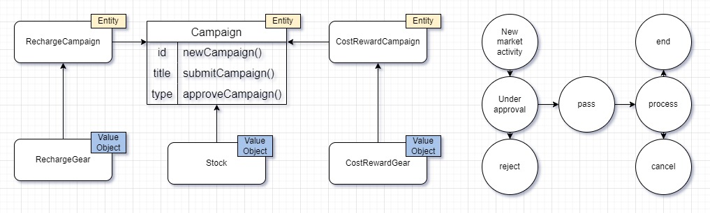


### 2.2 Business Logic Encapsulation

With the object model in place, encapsulation needs to be completed through aggregate roots. How to determine the granularity of aggregate roots? A marketing campaign includes five objects: campaign, inventory, tier, tier item, and target audience. If using a small aggregate root pattern, where each object corresponds to one aggregate root, each aggregate root becomes simple. However, from a business perspective, inventory or tiers can affect the campaign's state. For example, if inventory or tiers are modified, the campaign needs to be re-approved and go through online/offline processes. This business coupling needs to be handled technically. In this case, domain services need to be built on top of small aggregate roots to encapsulate these logics.

Another pattern is the large aggregate root. Centered around the campaign, all related concepts (campaign, inventory, tier, tier item, target audience) are encapsulated together. However, this aggregate root is more complex, affecting campaign loading (some campaigns have millions of target audiences; lazy loading can solve the problem but increases complexity).

The design of aggregate roots should follow certain principles:

1. Satisfy business consistency, data integrity, and state consistency. For instance, inventory tiers and campaign status must be consistent, and data must be complete. There should be no campaigns without tiers or inventory.
2. Technical limitations. Some entities may bring technical challenges, such as large data volumes, which can be considered separately.
3. Business logic persists; find a balance between business encapsulation and appropriate responsibility boundaries. Whether using large or small aggregate roots, business logic always exists; it's just a matter of where to place it.

> + **Business Logic Encapsulation (scope of responsibilities for object models): Aggregate Roots (granularity of encapsulation)**
>
>   - Business Consistency: Data Integrity, State Consistency
>
>   - Technical Limitations: Technical capabilities limiting encapsulation granularity
>
>   - Business Logic Persistence: Finding balance between "business encapsulation" and "appropriate responsibility boundaries"
>
>   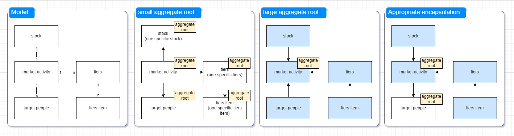

The aggregate root is already very close to code implementation. When implementing the code, there might still be a dilemma between using an **anemic model** or a **rich model**. 

**Spring MVC** typically runs in **singleton** mode, and introducing a rich model would increase the cost of understanding and technical complexity. Additionally, domain logic that is not suitable for placement within the **aggregate root** can be placed in domain services. For example, when multiple recharge bonus campaigns exist simultaneously, users can only participate in the one with the highest priority. The priority of the campaign would be marked in the recharge bonus campaign **aggregate root**, but selecting the highest priority campaign is not the responsibility of the **aggregate root**. However, it is indeed part of the domain logic. In this case, it can be implemented through a domain service.

`From conceptual model to class model to code implementation, the entire process should use a ubiquitous language.` When implementing the code, it should reflect the business meaning. For instance, in the example shown in the figure below, methods like updateStatus() on the left should be avoided as they do not reflect the business meaning (one must read the code implementation to understand what the method does). On the right side of the figure, methods like submitCampaign(), approveCampaign(), and cancelCampaign() have clear business meanings.

> - Code Implementation
>   - Anemic Model: Separation of attributes and behavior
>   - Rich Model: Encapsulation of attributes and behavior
>   - Domain Services: Logic that is not suitable to be placed inside the aggregate root
> - Key Points
>   - Code uses a ubiquitous language: class names, method names
>   - Encapsulation of business rules: CRUD → Domain Model
>
> ```java
> updateStatus(...){...}
> /*↓↓↓↓↓↓↓↓↓↓↓↓↓↓↓↓↓↓*/
> 
> // Submission Activity: Validate completeness, initiate approval process, status -> Pending Approval
> submitCampaign(...){...}
> 
> // Approval Activity: Complete approval process, notify operations, status -> Approved
> approveCampaign(...){...}
> 
> // Cancellation Activity: Trigger notification, status -> Cancelled
> cancelCampaign(...){...}
> ```

## 3 Code Implementation

After completing the model design, how should we organize the code architecture? Whether it's **Hexagonal Architecture**, **Clean Architecture**, or **Onion Architecture**, they all essentially revolve around the domain model. The application layer, infrastructure layer, and external interfaces all depend on the domain model.

> + Architectural styles: The core is the domain model, with outer layers depending on inner layers
>
> 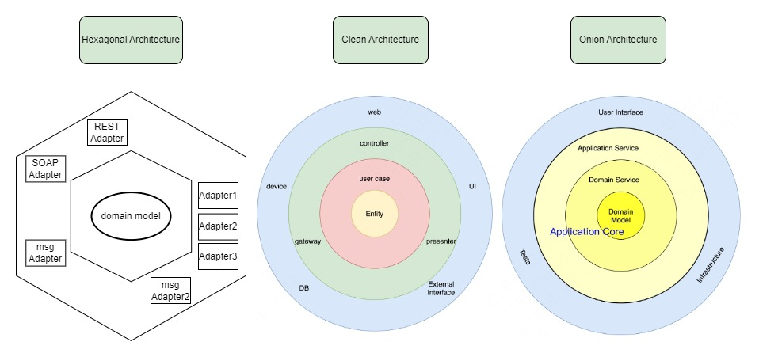
>
> + Let's consider an example of engineering practice, which is essentially the same as the three diagrams mentioned earlier. The domain layer and application layer are placed in the middle (both belong to domain logic), while the infrastructure and user interface depend on these middle layers:
>
> 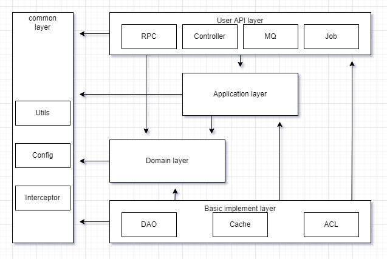

## sum up

### Core Principles

1. **Leverage Existing Practices**: Most systems we build aren't entirely new. For CRM, HR, or SCM, abundant industry practices exist. Utilize these rather than reinventing the wheel.
2. **Prioritize Ubiquitous Language**: Without it, there's no concept model. Without a concept model, a reliable code model is impossible. Don't jump to code design upon receiving requirements.
3. **DDD is Team Work**: There's no single domain expert. All team members contribute expertise. While tech teams can lead, the work must align with product and business needs.
4. **Embrace Change, Iterate Continuously**: Models are relatively stable but not immutable. Business understanding, abstraction approaches, and business changes all influence domain models. Building domain models is an ongoing process.

### Common Pitfalls

1. **Over-complicating with DDD Concepts**: Don't forcefully apply DDD concepts like aggregates, value objects, or entities in code. This increases complexity. DDD's essence is business-driven abstraction and concept modeling.
2. **Designing Domain Models from Scratch**: Domain models emerge from business abstraction, not meticulous design. Understanding and abstracting business is key.
3. **Assuming DDD Guarantees Good Models**: Knowing how to build doesn't ensure building well. However, understanding DDD can help avoid common mistakes.

Remember: Design begins with the first discussion of requirements. Ubiquitous language is part of the design process.

### Solution Domain: Four-Layer Model

1. **Functional Model**: Derived from use cases based on product requirements.
2. **Concept Model**: Further abstraction of the functional model, establishing ubiquitous language.
3. **Code Model**: Mapping of the concept model into code.
4. **Data Model**: Design of data structures for business data storage.

### Traps to Avoid

- Jumping from functional model directly to data model design (CRUD approach).
- Focusing solely on data operation workflows after seeing the functional model (transaction script trap).

### Domain Types

1. **Academic**: e.g., finance, accounting, graphics, dynamics. Requires deep understanding of the subject.
2. **Practical**: e.g., CRM, order processing. Based on business experience summaries. Refer to existing practices unless your business is unique.


> Source：
>
> + https://tech.meituan.com/2024/05/27/ddd-in-business.html
> + https://blog.cleancoder.com/uncle-bob/2012/08/13/the-clean-architecture.html
> + https://tech.meituan.com/2024/05/09/ddd-practice-trading-system.html
> + Domain-Driven Design: Tackling Complexity in the Heart of Software - Eric Evans

