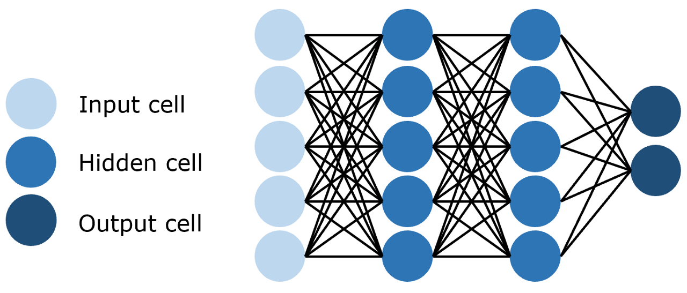
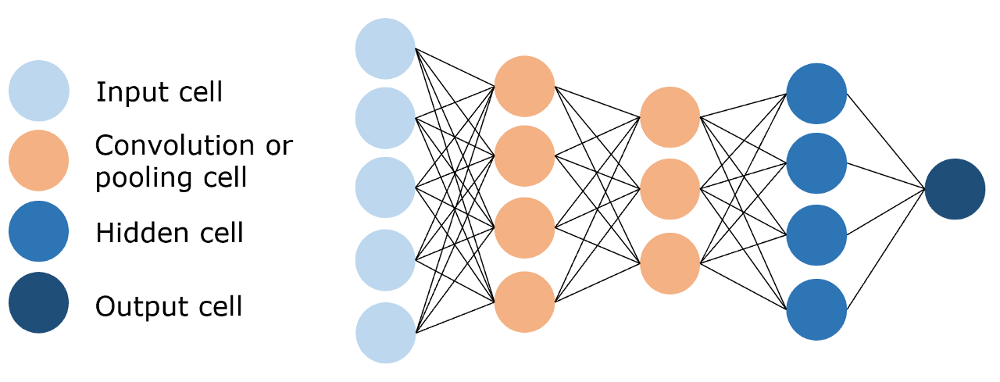
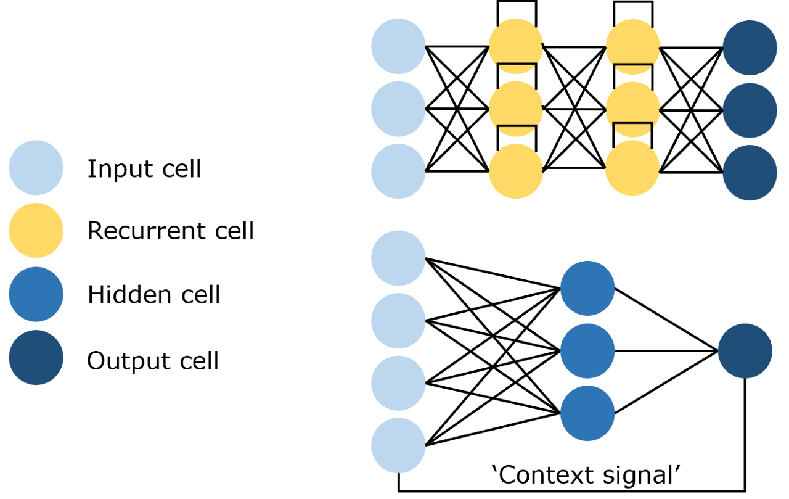
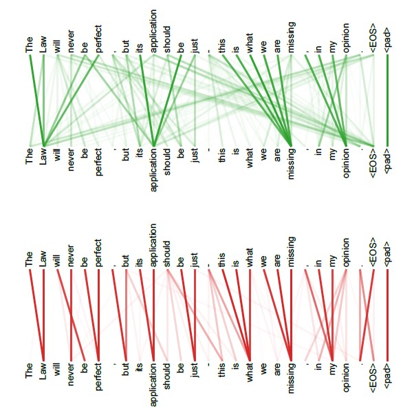

# Reading Happy-LLM Notes: Transformer

Transformer is a model architecture for natural language processing (NLP) tasks. It is a type of neural network that is designed to process sequential data, such as text. Transformer models are particularly well-suited for NLP tasks because they can handle long-range dependencies and process input sequences in parallel.
<!--more-->

## 2.1 Attention Mechanism

> Personal notes on the Transformer internals. Focus on what matters; skip the fluff.

### 2.1.1 What is Attention?

As NLP moved from statistical methods to deep learning, text representation evolved accordingly. The field shifted from vector space models and n-gram language models to neural representations like Word2Vec. From computer vision came three backbone architectures:

- **Feedforward Neural Networks (FNNs)**: fully connected layers between adjacent layers (Figure 2.1):



- **Convolutional Neural Networks (CNNs)**: convolutional layers extract features with far fewer parameters (Figure 2.2):



- **Recurrent Neural Networks (RNNs)**: recurrent connections consume historical context (Figure 2.3):



Because NLP data are sequences, RNNs long dominated sequence modeling. Before attention, LSTMs were the go-to; for instance, ELMo used bidirectional LSTMs for contextual embeddings.

Still, they suffer from two key limitations:

1. **Limited parallelism**: step-by-step recurrence underutilizes GPUs and increases wall time.
2. **Long-range dependency issues**: signals decay with distance; gating helps but doesn’t solve it.

To address this, Vaswani et al. built the Transformer—an attention-only architecture inspired by mechanisms first explored in CV—and it became the backbone of modern LLMs.

So, what is attention?

It focuses computation on the parts that matter most, rather than treating every position equally. In language, that means paying more attention to a few key tokens.

- **Core objects**: `Q` (query), `K` (key), `V` (value)
- **Outcome**: similarity(Q, K) → weights → weighted sum over `V`

Attention operates on three tensors: **Query (Q)**, **Key (K)**, and **Value (V)**. For example, querying a news article for its date: Q encodes “time/date,” while K and V span the whole text. Q–K similarity yields weights that mix V into an answer.

Formally: compute Q–K similarities, softmax to weights, then weighted-sum over V. This captures token-to-token relations.

### 2.1.2 A Deeper Look at Attention

Consider a dictionary to derive the formula. Suppose we have:

```json
{
  "apple": 10,
  "banana": 5,
  "chair": 2
}
```

Keys are K; values are V. An exact query "apple" returns 10.

If the query is a concept like "fruit", we combine values with weights.

Example weights:

```json
{
  "apple": 0.6,
  "banana": 0.4,
  "chair": 0.0
}
```

Result: `0.6 * 10 + 0.4 * 5 + 0 * 2 = 8`.

These are the attention scores. How do we compute them?

Use vector similarity—specifically, the dot product:

`v · w = Σ_i v_i w_i`

Similar words yield larger dot products.

Let query `q` and key matrix `K = [v_apple; v_banana; v_chair]`. Compute similarities:

`x = q K^T`

Apply softmax to get weights:

`softmax(x)_i = exp(x_i) / Σ_j exp(x_j)`

Finally, weight values to get the output:

`Attention(Q, K, V) = softmax(Q K^T) V`

For multiple queries `Q`:

`Attention(Q, K, V) = softmax(Q K^T) V`

Scale by `1/sqrt(d_k)` for stability when `d_k` is large:

`Attention(Q, K, V) = softmax(Q K^T / sqrt(d_k)) V`

This is the standard scaled dot-product attention.

### 2.1.3 Implementing Attention

Small, readable implementation first; optimizations later.

A minimal PyTorch implementation:

```python
def attention(query, key, value, dropout=None):
    d_k = query.size(-1)
    scores = torch.matmul(query, key.transpose(-2, -1)) / math.sqrt(d_k)
    p_attn = scores.softmax(dim=-1)
    if dropout is not None:
        p_attn = dropout(p_attn)
    return torch.matmul(p_attn, value), p_attn
```

Note: `query`, `key`, and `value` are already-projected tensors (Q, K, V). These few lines implement the core.

### 2.1.4 Self-Attention

At its core, attention compares elements across two sequences, computes pairwise similarities, and uses them to weight values—hence Q, K, and V typically originate from two sources.

In encoder–decoder attention, `Q` comes from the decoder, while `K` and `V` come from the encoder.

But in the encoder, we use a variant: **self-attention**, where `Q`, `K`, and `V` are all projections of the same input via `W_q, W_k, W_v`.

Self-attention models dependencies within a single sequence by letting each token attend to all others. In code, it’s simply passing the same tensor as Q, K, and V:

```python
# attention is the function defined above
attention(x, x, x)
```

### 2.1.5 Masked Self-Attention

Masked self-attention applies an attention mask to hide certain positions; the model ignores masked tokens during learning.

The purpose is to enforce causality: predict the next token using only history, not future context—akin to n-gram language modeling but with attention.

For a toy sequence `<BOS> I like you </EOS>`, training steps look like:

```text
Step 1: input <BOS>            → output I
Step 2: input <BOS> I          → output like
Step 3: input <BOS> I like     → output you
Step 4: input <BOS> I like you → output </EOS>
```

With enough data, this learns to model and complete arbitrary sequences.

Naively this is serial. Transformers, however, excel at parallelism—we want to train all positions simultaneously while still blocking future tokens.

To enable parallel training while preserving causality, Transformers use masked self-attention. A binary mask hides future tokens so each position can only attend to its past. For the sequence `<BOS> I like you </EOS>` with `[MASK]` denoting hidden tokens, the model sees:

```text
<BOS>  [MASK][MASK][MASK][MASK]
<BOS>  I      [MASK][MASK][MASK]
<BOS>  I      like   [MASK][MASK]
<BOS>  I      like   you    [MASK]
<BOS>  I      like   you    </EOS>
```

Each row predicts the next token from visible history, and all rows are processed in parallel.

This mask is an upper-triangular matrix matching the sequence length. With inputs of shape `(batch_size, seq_len, hidden_size)`, a mask of shape `(1, seq_len, seq_len)` broadcasts across the batch.

Implementation-wise, we generate the causal mask as follows:

```python
# Create an upper-triangular matrix to hide future positions
# First, build a (1, seq_len, seq_len) tensor filled with -inf
mask = torch.full((1, args.max_seq_len, args.max_seq_len), float("-inf"))
# Use triu to keep the strict upper triangle as -inf (above the diagonal)
mask = torch.triu(mask, diagonal=1)
```

The upper triangle is `-inf`; the lower triangle is `0`.

Apply it to the scores before the softmax:

```python
# Add the causal mask to attention scores before softmax
scores = scores + mask[:, :seqlen, :seqlen]
scores = F.softmax(scores.float(), dim=-1).type_as(xq)
```

Softmax maps `-inf` to zero weight, effectively masking future positions.

### 2.1.6 Multi-Head Attention

Why multiple heads?

- **Diversity**: different heads specialize in different patterns
- **Coverage**: richer relational structure within the same sequence

Attention supports parallel computation and long-range dependencies, but a single head tends to focus on one relation. **Multi-head attention** runs multiple attentions in parallel, each specializing in different patterns, then concatenates results for a richer representation.

Empirically, different heads capture different information layers (Figure 2.4):



Different heads highlight different dependencies within the same sentence.

Formula:

`MultiHead(Q, K, V) = Concat(head_1, ..., head_h) W_O`, where `head_i = Attention(Q W^Q_i, K W^K_i, V W^V_i)`

Naively: `n` sets of projections, `n` attentions, then concatenate.

Efficient implementations fold heads into three large projections and reshape to split heads, enabling parallel computation:

```python
import torch.nn as nn
import torch

'''Multi-head self-attention module'''
class MultiHeadAttention(nn.Module):

    def __init__(self, args: ModelArgs, is_causal=False):
        # args: configuration object
        super().__init__()
        # Hidden dimension must be divisible by the number of heads
        assert args.dim % args.n_heads == 0
        # Per-head dimension equals model_dim / num_heads
        self.head_dim = args.dim // args.n_heads
        self.n_heads = args.n_heads

        # Wq, Wk, Wv projection matrices, each of shape (n_embd, n_heads * head_dim)
        # Three combined projections are equivalent to concatenating per-head projections
        self.wq = nn.Linear(args.n_embd, self.n_heads * self.head_dim, bias=False)
        self.wk = nn.Linear(args.n_embd, self.n_heads * self.head_dim, bias=False)
        self.wv = nn.Linear(args.n_embd, self.n_heads * self.head_dim, bias=False)
        # Output projection of shape (n_heads * head_dim, dim)
        self.wo = nn.Linear(self.n_heads * self.head_dim, args.dim, bias=False)
        # Dropout for attention weights and residual path
        self.attn_dropout = nn.Dropout(args.dropout)
        self.resid_dropout = nn.Dropout(args.dropout)
        self.is_causal = is_causal

        # Create an upper-triangular causal mask for multi-head attention
        if is_causal:
            mask = torch.full((1, 1, args.max_seq_len, args.max_seq_len), float("-inf"))
            mask = torch.triu(mask, diagonal=1)
            # Register as a buffer to move with the module's device
            self.register_buffer("mask", mask)

    def forward(self, q: torch.Tensor, k: torch.Tensor, v: torch.Tensor):

        # Batch size and sequence length: [batch_size, seq_len, dim]
        bsz, seqlen, _ = q.shape

        # Compute Q, K, V via linear projections: (B, T, n_embd) -> (B, T, dim)
        xq, xk, xv = self.wq(q), self.wk(k), self.wv(v)

        # Split into heads: (B, T, n_head, head_dim) -> transpose to (B, n_head, T, head_dim)
        # Using view+transpose preserves per-head slices for attention computation
        xq = xq.view(bsz, seqlen, self.n_heads, self.head_dim)
        xk = xk.view(bsz, seqlen, self.n_heads, self.head_dim)
        xv = xv.view(bsz, seqlen, self.n_heads, self.head_dim)
        xq = xq.transpose(1, 2)
        xk = xk.transpose(1, 2)
        xv = xv.transpose(1, 2)

        # Attention: compute QK^T / sqrt(d_k) → (B, nh, T, T)
        scores = torch.matmul(xq, xk.transpose(2, 3)) / math.sqrt(self.head_dim)
        # Apply causal mask if requested (trim to sequence length)
        if self.is_causal:
            assert hasattr(self, 'mask')
            scores = scores + self.mask[:, :, :seqlen, :seqlen]
        # Softmax over keys
        scores = F.softmax(scores.float(), dim=-1).type_as(xq)
        # Dropout on attention weights
        scores = self.attn_dropout(scores)
        # Weighted sum over values → (B, nh, T, head_dim)
        output = torch.matmul(scores, xv)

        # Merge heads back: transpose to (B, T, nh, head_dim) then view to (B, T, nh*head_dim)
        # contiguous() ensures memory layout is compatible with view
        output = output.transpose(1, 2).contiguous().view(bsz, seqlen, -1)

        # Final projection back to model dimension and dropout on residual path
        output = self.wo(output)
        output = self.resid_dropout(output)
        return output
```

## 2.2 Encoder–Decoder

> A compact view of the classic Seq2Seq stack.

The core idea is simple: replace recurrence and convolution with attention and stack an encoder with a decoder, as in “Attention is All You Need.” Most pretraining paradigms later specialized this: encoder-only (BERT), decoder-only (GPT), or full encoder–decoder.

This section breaks down the encoder–decoder design through the lens of Seq2Seq.

### 2.2.1 Seq2Seq

Seq2Seq maps an input sequence `(x1, x2, …, xn)` to an output sequence `(y1, y2, …, ym)`, often with different lengths. Many tasks fit this mold: classification is `m = 1`, tagging is `m = n`.

Machine translation is the canonical example (“今天天气真好” → “Today is a good day.”). Transformer was originally proposed for translation.

The recipe: encode the source into a semantic representation, then decode into the target.

The encoder handles encoding; the decoder handles generation (Figure 2.5):


The original stacks 6 encoder layers and 6 decoder layers. The encoder’s top-layer outputs feed every decoder layer via cross-attention to produce the target sequence.

Next: the shared building blocks—FFN, LayerNorm, and residuals—then the encoder/decoder internals.

### 2.2.2 Feedforward Network (FFN)

Position-wise MLP, applied identically across time steps.

Each layer includes a position-wise feedforward network with a very simple structure:

```python
class MLP(nn.Module):
    '''Position-wise feedforward network'''
    def __init__(self, dim: int, hidden_dim: int, dropout: float):
        super().__init__()
        # First linear layer: input_dim → hidden_dim
        self.w1 = nn.Linear(dim, hidden_dim, bias=False)
        # Second linear layer: hidden_dim → input_dim
        self.w2 = nn.Linear(hidden_dim, dim, bias=False)
        # Dropout to mitigate overfitting
        self.dropout = nn.Dropout(dropout)

    def forward(self, x):
        # ReLU between two linear layers, followed by dropout
        return self.dropout(self.w2(F.relu(self.w1(x))))
```

Two linear layers with a ReLU in between, plus dropout.

### 2.2.3 Layer Normalization

LayerNorm over features per token—stable and simple.

Common normalizations include BatchNorm and LayerNorm; LayerNorm is used here.

Why normalize? To stabilize activations across depth so optimization is easier.

BatchNorm drawbacks for NLP:

- Small batch sizes yield noisy statistics
- Token/time-step variability undermines assumptions
- Train/test length mismatch complicates running stats
- Extra bookkeeping and compute per step

LayerNorm avoids these by normalizing per-sample across features.

Implementation sketch:

```python
class LayerNorm(nn.Module):
    '''Layer normalization'''
    def __init__(self, features, eps=1e-6):
        super().__init__()
        # Learnable scale and bias
        self.a_2 = nn.Parameter(torch.ones(features))
        self.b_2 = nn.Parameter(torch.zeros(features))
        self.eps = eps
    
    def forward(self, x):
        # Mean and std across the last dimension (per token)
        mean = x.mean(-1, keepdim=True) # mean: [bsz, max_len, 1]
        std = x.std(-1, keepdim=True)   # std: [bsz, max_len, 1]
        # Broadcast over the last dimension
        return self.a_2 * (x - mean) / (std + self.eps) + self.b_2
```

Note the learned scale and bias.

### 2.2.4 Residual Connections

Residuals keep gradients healthy in deep stacks.

Transformers are deep; residual connections help prevent degradation by letting each sublayer learn residuals over its input.

Encoder example:

`x = x + MultiHeadSelfAttention(LayerNorm(x))`

`output = x + FNN(LayerNorm(x))`

In code, add the input back after each sublayer:

```python
# Self-attention sublayer
h = x + self.attention.forward(self.attention_norm(x))
# Feedforward sublayer
out = h + self.feed_forward.forward(self.fnn_norm(h))
```

Here `attention_norm`/`fnn_norm` are LayerNorms; `attention` is MHA; `feed_forward` is the FFN.

### 2.2.5 Encoder

With these components, build the encoder: each encoder layer has self-attention and an FFN. First, an encoder layer:

```python
class EncoderLayer(nn.Module):
    '''Encoder layer'''
    def __init__(self, args):
        super().__init__()
        # Two LayerNorms: before attention and before MLP
        self.attention_norm = LayerNorm(args.n_embd)
        # Encoder uses non-causal self-attention
        self.attention = MultiHeadAttention(args, is_causal=False)
        self.fnn_norm = LayerNorm(args.n_embd)
        self.feed_forward = MLP(args.dim, args.dim, args.dropout)

    def forward(self, x):
        # Self-attention
        norm_x = self.attention_norm(x)
        h = x + self.attention.forward(norm_x, norm_x, norm_x)
        # Feedforward
        out = h + self.feed_forward.forward(self.fnn_norm(h))
        return out
```

Stack `N` layers and finish with a LayerNorm:

```python
class Encoder(nn.Module):
    '''Encoder block'''
    def __init__(self, args):
        super(Encoder, self).__init__() 
        # Stack N encoder layers
        self.layers = nn.ModuleList([EncoderLayer(args) for _ in range(args.n_layer)])
        self.norm = LayerNorm(args.n_embd)

    def forward(self, x):
        for layer in self.layers:
            x = layer(x)
        return self.norm(x)
```

This yields contextualized representations.

### 2.2.6 Decoder

Similarly, a decoder layer contains masked self-attention, cross-attention over encoder outputs, and an FFN:

```python
class DecoderLayer(nn.Module):
    '''Decoder layer'''
    def __init__(self, args):
        super().__init__()
        # Three LayerNorms: before masked attention, before cross-attention, before MLP
        self.attention_norm_1 = LayerNorm(args.n_embd)
        # First: masked self-attention (causal)
        self.mask_attention = MultiHeadAttention(args, is_causal=True)
        self.attention_norm_2 = LayerNorm(args.n_embd)
        # Second: encoder–decoder attention (non-causal)
        self.attention = MultiHeadAttention(args, is_causal=False)
        self.ffn_norm = LayerNorm(args.n_embd)
        # Third: MLP
        self.feed_forward = MLP(args.dim, args.dim, args.dropout)

    def forward(self, x, enc_out):
        norm_x = self.attention_norm_1(x)
        x = x + self.mask_attention.forward(norm_x, norm_x, norm_x)
        norm_x = self.attention_norm_2(x)
        h = x + self.attention.forward(norm_x, enc_out, enc_out)
        out = h + self.feed_forward.forward(self.ffn_norm(h))
        return out
```

Then build the decoder by stacking `N` such layers:

```python
class Decoder(nn.Module):
    '''Decoder'''
    def __init__(self, args):
        super(Decoder, self).__init__() 
        # Stack N decoder layers
        self.layers = nn.ModuleList([DecoderLayer(args) for _ in range(args.n_layer)])
        self.norm = LayerNorm(args.n_embd)

    def forward(self, x, enc_out):
        for layer in self.layers:
            x = layer(x, enc_out)
        return self.norm(x)
```

With encoder and decoder done, add embeddings and the final projection to complete the Transformer.

## 2.3 Building a Transformer

> Pieces assembled into a practical model.

With attention and the encoder–decoder core covered, the next step is to assemble a full model from these components.

### 2.3.1 Embeddings

- **Input**: token indices `(B, T)`
- **Output**: dense vectors `(B, T, D)`

Map token indices to dense vectors with an embedding table. A tokenizer converts text to indices (word-piece/BPE, etc.). Given input indices of shape `(batch_size, seq_len)`, the lookup returns `(batch_size, seq_len, dim)`.

In PyTorch:

```python
self.tok_embeddings = nn.Embedding(args.vocab_size, args.dim)
```

### 2.3.2 Positional Encoding

Absolute sinusoidal positions; extrapolates gracefully.

Attention is permutation-invariant, so Transformers inject order via positional encodings added to token embeddings. The original uses sinusoidal absolute encodings:

PE(pos,2i)=sin(pos/100002i/dmodel)PE(pos,2i+1)=cos(pos/100002i/dmodel)*PE*(*p**os*,2*i*)=*s**in*(*p**os*/100002*i*/*d**m**o**d**e**l*)*PE*(*p**os*,2*i*+1)=*cos*(*p**os*/100002*i*/*d**m**o**d**e**l*)

Generate a matrix of sines/cosines across positions and dimensions:

```python
import numpy as np
import matplotlib.pyplot as plt
def PositionEncoding(seq_len, d_model, n=10000):
    P = np.zeros((seq_len, d_model))
    for k in range(seq_len):
        for i in np.arange(int(d_model/2)):
            denominator = np.power(n, 2*i/d_model)
            P[k, 2*i] = np.sin(k/denominator)
            P[k, 2*i+1] = np.cos(k/denominator)
    return P

P = PositionEncoding(seq_len=4, d_model=4, n=100)
print(P)
[[ 0.          1.          0.          1.        ]
 [ 0.84147098  0.54030231  0.09983342  0.99500417]
 [ 0.90929743 -0.41614684  0.19866933  0.98006658]
 [ 0.14112001 -0.9899925   0.29552021  0.95533649]]
```

Benefits:

1. Extrapolates to longer sequences than seen in training
2. Encodes relative positions via trigonometric identities

Based on the above, here’s a position encoding module:

```python
class PositionalEncoding(nn.Module):
    '''Positional encoding module'''

    def __init__(self, args):
        super(PositionalEncoding, self).__init__()
        # Precompute sinusoidal encodings up to block_size
        pe = torch.zeros(args.block_size, args.n_embd)
        position = torch.arange(0, args.block_size).unsqueeze(1)
        # theta terms for sine/cosine frequencies
        div_term = torch.exp(
            torch.arange(0, args.n_embd, 2) * -(math.log(10000.0) / args.n_embd)
        )
        # Interleave sin/cos across even/odd channels
        pe[:, 0::2] = torch.sin(position * div_term)
        pe[:, 1::2] = torch.cos(position * div_term)
        pe = pe.unsqueeze(0)
        self.register_buffer("pe", pe)

    def forward(self, x):
        # Add positional encodings to token embeddings
        x = x + self.pe[:, : x.size(1)].requires_grad_(False)
        return x
```

### 2.3.3 A Full Transformer

- **Norming**: Pre-Norm for stability
- **Flow**: tokenizer → embedding → position → encoder/decoder → logits

Combine the components following the standard Transformer blueprint (Figure 2.7) to get a complete model:


Note: while the paper’s figure depicts Post-Norm, the reference implementation and most modern LLMs use Pre-Norm (more stable). Using Pre-Norm here.

Pipeline: tokenizer → Embedding → Positional Encoding → N encoders + N decoders (the paper used N = 6) → Linear → Softmax.

Putting the pieces together, a complete Transformer:

```python
class Transformer(nn.Module):
    '''Full model'''
    def __init__(self, args):
        super().__init__()
        # Require vocab size and maximum sequence length (block size)
        assert args.vocab_size is not None
        assert args.block_size is not None
        self.args = args
        self.transformer = nn.ModuleDict(dict(
            wte = nn.Embedding(args.vocab_size, args.n_embd),
            wpe = PositionalEncoding(args),
            drop = nn.Dropout(args.dropout),
            encoder = Encoder(args),
            decoder = Decoder(args),
        ))
        # Final linear layer to vocab size
        self.lm_head = nn.Linear(args.n_embd, args.vocab_size, bias=False)

        # Initialize all weights
        self.apply(self._init_weights)

        # Print parameter count
        print("number of parameters: %.2fM" % (self.get_num_params()/1e6,))

    '''Count parameters'''
    def get_num_params(self, non_embedding=False):
        # Optionally exclude embedding parameters
        n_params = sum(p.numel() for p in self.parameters())
        if non_embedding:
            n_params -= self.transformer.wte.weight.numel()
        return n_params

    '''Initialize weights'''
    def _init_weights(self, module):
        # Initialize Linear/Embedding with N(0, 0.02)
        if isinstance(module, nn.Linear):
            torch.nn.init.normal_(module.weight, mean=0.0, std=0.02)
            if module.bias is not None:
                torch.nn.init.zeros_(module.bias)
        elif isinstance(module, nn.Embedding):
            torch.nn.init.normal_(module.weight, mean=0.0, std=0.02)
    
    '''Forward pass'''
    def forward(self, idx, targets=None):
        # idx: (batch_size, seq_len); targets: optional labels for loss
        device = idx.device
        b, t = idx.size()
        assert t <= self.args.block_size, f"Sequence length {t} exceeds max {self.args.block_size}"

        # Embedding → positional encoding → dropout
        print("idx",idx.size())
        tok_emb = self.transformer.wte(idx)
        print("tok_emb",tok_emb.size())
        pos_emb = self.transformer.wpe(tok_emb) 
        x = self.transformer.drop(pos_emb)
        # Encoder then decoder
        print("x after wpe:",x.size())
        enc_out = self.transformer.encoder(x)
        print("enc_out:",enc_out.size())
        x = self.transformer.decoder(x, enc_out)
        print("x after decoder:",x.size())

        if targets is not None:
            # Training: compute logits and cross-entropy loss
            logits = self.lm_head(x)
            loss = F.cross_entropy(logits.view(-1, logits.size(-1)), targets.view(-1), ignore_index=-1)
        else:
            # Inference: return logits for the last time step
            logits = self.lm_head(x[:, [-1], :]) # keep time dim
            loss = None

        return logits, loss
```

Notes:

- `get_num_params`: count parameters (with/without embeddings)
- `_init_weights`: initialize parameters
- `forward`: compute logits and optional loss (cross-entropy)

