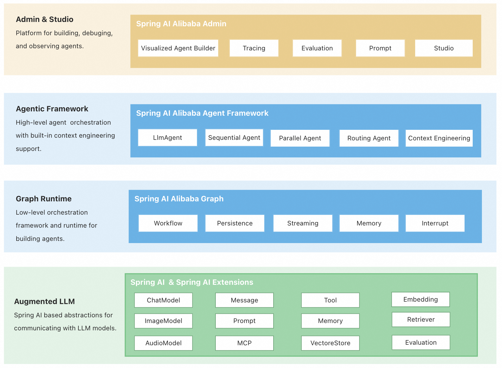
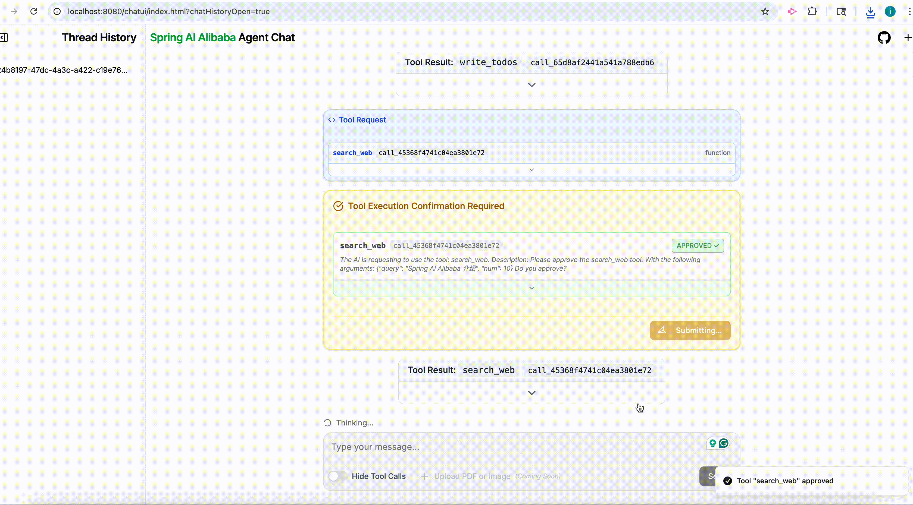
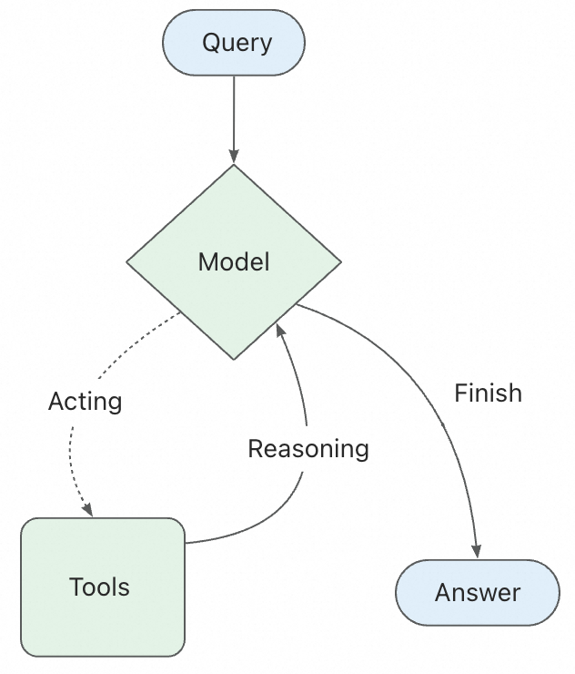
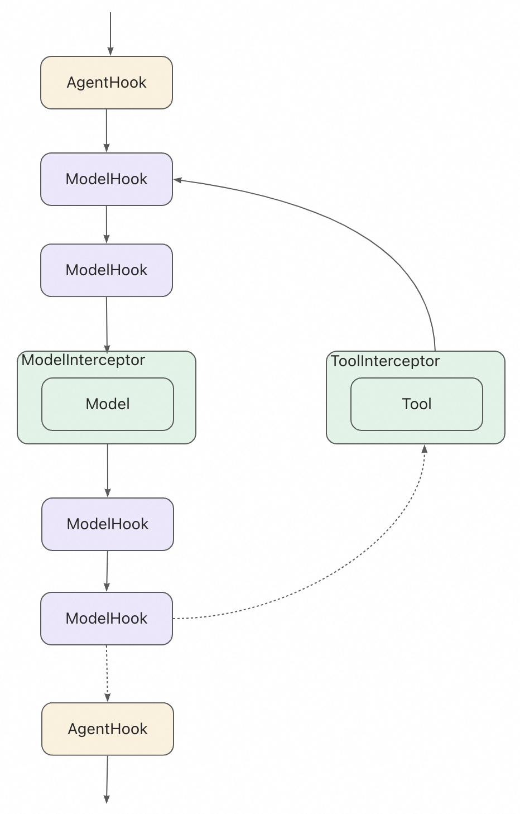

# Major Releases in Spring AI 1.1: Full-Stack Agent Development

Spring AI offers a complete ecosystem: the Admin platform for visualized management and Dify integration; the Agent Framework for rapid development with built-in workflows; and the Graph runtime for flexible, stateful multi-agent orchestration. This full-stack solution streamlines building, managing, and running sophisticated AI agents.
<!--more-->

## Architecture Overview: Three-Tier Design

1. Agent Framework: An agent development framework centered around the ReactAgent design philosophy, built-in with advanced capabilities such as automatic context engineering and Human In The Loop.
2. Graph: A lower-level workflow and multi-agent coordination framework, serving as the underlying runtime foundation for the Agent Framework. It is used to implement complex workflow orchestration while providing APIs open to users.
3. Augmented LLM: based on the underlying atomic abstractions of the Spring AI framework, it provides the fundamentals for building LLM applications.



### Quick start

```shell
git clone https://github.com/...
cd examples/chatbot
```

```xml
export AI_DASHSCOPE_API_KEY=...
```

```shell
mvn spring-boot:run
```

+ In the console output panel, open url: localhost:8080/chatui/index.html



### Create Agent

```java
@Bean
public ReactAgent chatbotReactAgent(ChatModel chatModel,
                                   ToolCallback executeShellCommand,
                                   ToolCallback executePythonCode,
                                   ToolCallback viewTextFile){
    return ReactAgent.builder()
        .name("chatbot")
        .model(chatModel)
        .instruction(INSTRUCTION)
        .tools(executeShellCommand, executePythonCode, viewTextFile)
        .build();
}
```

## Core Design Philosophy

### ReactAgent

ReactAgent beased on ReAct(Reasoning and Acting) paradigm. This means that the Agent does not merely invoke the LLM, it can also run in a loop, analyzing tasks through reasoning and then taking actions.



+ ReactAgent is defined by three core components:
  + Model: the LLM model to use, such as DashScopeChatModel
  + Tools: the tools to use, such as executeShellCommand, executePythonCode, viewTextFile
  + System Prompt: or instruction, is the initial prompt to the LLM, it defines the behavior of the Agent

### Graph (workflow)

Graph is the underlying runtime foundation for the Agent Framework, serving as a low-level workflow and multi-agent coordination framework. Through three core conceptes: State, Node, and Edge, it enables developers to implement complex workflow orchestration while providing APIs open to users.

+ The framework includes various flow-based agents that support different multi-agetn collaboration patterns:
  + Sequential Agent: a linear sequence of tasks, one after the other
  + Parallel Agent: a set of tasks that can be executed in parallel. Then merges the results using MergeStrategy
  + LlmRouting Agent: a router that can route the task to the appropriate agent based on the input and the child agents' descriptions

## Context Engineering

The biggest challenge in building agents is making them reliable. Agent failures often do not stem from insufficient LLM capabilities, but rather from failure to pass "CORRECT" context to the LLM

| Context Types     | Content you control                                          | Interception and processing mechanisms |
| ----------------- | ------------------------------------------------------------ | -------------------------------------- |
| Model context     | Instructions, message history, response formats              | Interceptor, Hook                      |
| Tool context      | The state such as short-erm and long-term memory             | Interceptor                            |
| Lifecycle Context | between model and tool calls(such as summarization, guardrails) | Hook                                   |

Spring AI provides some commonly used default Hook and Interceptor implementations:

1. Human-in-the-Loop: HumanInTheLoopHook allows the Agent to pause for high-risk operations
2. Planning: improving transparency by displaying the Agent's plan before execution
3. Model Call Limit: prevent infinite loops or excessive token usage
4. Tool Retry: retry tool calls that fail due to temporary issues
5. LLM Tool Selector: select the appropriate tool based on the input and the tool descriptions
6. LLM Tool Emulator: simulate tool outputs using LLM without actually executing the tools
7. Context Editing: edit the context between model and tool calls(such as summarization, guardrails)

## Hooks and Interceptors

Hooks and Interceptors are the core mechanisms for context engineering. They allow you to intercept and process the context between model and tool calls.

+ Hooks(AgentHook, ModelHook): insert custom logic at points in the agent or model lifecycle
+ Interceptors(ModelInterceptor, ToolInterceptor): wrap the invocation of models or tools, allowing you to intercept and modify requests/responses



## Memory and State Management

By storing these in the Graph's state, the Agent can access the complete context for a given conversation while maintaining separation between different conversations.

### Enable short-term memory

To enable session-level persistence, you simply need to specify a checkpointer when creating the Agent.

In production environments, you can easily switch to persistent storage such as RedisSaver or MongoSaver

### Context Overflow Problem caused by Memory

Retaining all conversation history is the most common approach to implementing short-term memory. However, as the conversation progresses, the context may exceed the model's maximum token limit.

Even if you are using a large model with a high token limit, it is still possible to encounter context overflow issues in long conversations. Many models get "distracted" by outdated or off-topic content. At the same time, overly long contexts can also lead to issues such as longer response times and increased costs.

In Spring AI, ReactAgent uses MESSAGE to record and pass context, which includes instructions, user inputs, model outputs, and tool calls. To address context overflow, you can implement a custom ModelInterceptor to manage the context effectively. Due to limited context windows, many applications can benefit from techniques that remove or "forget" outdated information, known as "context engineering"

### Example 1: short-term memory in tools

```java
public class UserInfoTool implements BiFunction<String, ToolContext, String> {

  @Override
  public String apply(String query, ToolContext toolContext) {
      // 从上下文中获取用户信息
      RunnableConfig config = (RunnableConfig) toolContext.getContext().get("config");
      String userId = (String) config.metadata("user_id").orElse("");

      if ("user_123".equals(userId)) {
          return "用户是 John Smith";
      } else {
          return "未知用户";
      }
  }
}

// 创建工具
ToolCallback getUserInfoTool = FunctionToolCallback
  .builder("get_user_info", new UserInfoTool())
  .description("查找用户信息")
  .inputType(String.class)
  .build();

// 使用
ReactAgent agent = ReactAgent.builder()
  .name("my_agent")
  .model(chatModel)
  .tools(getUserInfoTool)
  .saver(new MemorySaver())
  .build();

RunnableConfig config = RunnableConfig.builder()
  .threadId("1")
  .addMetadata("user_id", "user_123")
  .build();

AssistantMessage response = agent.call("获取用户信息", config);
System.out.println(response.getText());
```

### Example 2: Long-term memory in tools

```java
BiFunction<GetMemoryRequest, ToolContext, GetMemoryResponse> getMemoryFunction = (request, toolContext) -> {
    RunnableConfig config = (RunnableConfig) context.getContext().get("config");
    Store store = runnableConfig.store();
    Optional<StoreItem> itemOpt = store.getItem(request.namespace(), request.key());
    if (itemOpt.isPresent()) {
        StoreItem item = itemOpt.get();
        return new GetMemoryResponse(item.value(), item.timestamp());
    } else {
        return new GetMemoryResponse(null, null);
    }
};
```

### Example 3: Managing Long-term memory with ModelHook

```java
ModelHook memoryInterceptor = new ModelHook() {
    @Override
    public HookPosition[] getHookPositions() {
        return new HookPosition[]{HookPosition.BEFORE_MODEL_CALL, HookPosition.AFTER_MODEL_CALL};
    }
    @Override
    public CompletableFuture<Map<String, Object>> beforeModelCall(OverAllState state, RunnableConfig config) {
      Store store = config.store();
      Optional<StoreItem> itemOpt = store.getItem("User_profiles", config.threadId());
      Map<String, Object> hookData = new HashMap<>();
      if (itemOpt.isPresent()) {
        String userContext =  String.format("name: %s, age: %s, preferences: %s",
            itemOpt.get().value().get("name"),
            itemOpt.get().value().get("age"),
            itemOpt.get().value().get("preferences"));
        hookData.put("user_context", userContext);
      }
      return CompletableFuture.completedFuture(hookData);
    }
}
```

## Multi-agent

| Pattern                    | how to work                                                  | workflow                                                     | scenarios                               |
| :------------------------- | :----------------------------------------------------------- | :----------------------------------------------------------- | :-------------------------------------- |
| **Tool Calling**           | The Supervisor Agent calls other Agents as tools. 'Tool' Agents do not communicate directly with users—they only execute tasks and return results. | Centralized: All routing is done through calling Agents.     | Task scheduling, structured workflow.   |
| **Handoffs**               | The current Agent decides to transfer control to another Agent. The active Agent changes accordingly, and the user can continue to interact directly with the new Agent. | Decentralization: Agents can change who currently serves as the active Agent. | Cross-domain dialogue, expert takeover. |
| **Agent as Workflow Node** | Agent as a Node can leverage its reasoning and tool-calling capabilities to handle tasks that require multi-step reasoning | ReactAgent can be integrated as a Node into the StateGraph   | Multi-step reasoning                    |


