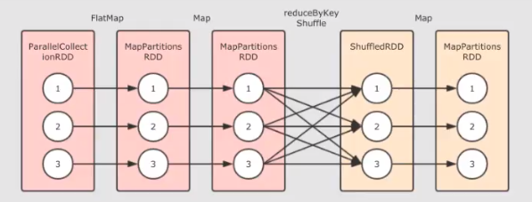
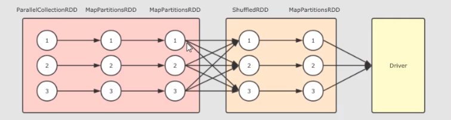
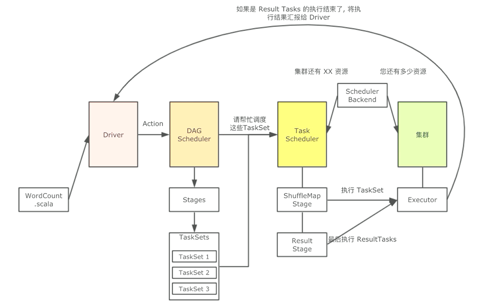

Apache Spark has its architectural foundation in the resilient distributed dataset (RDD), a read-only multiset of data items distributed over a cluster of machines, that is maintained in a fault-tolerant way. The Dataframe API was released as an abstraction on top of the RDD, followed by the Dataset API.
<!--more-->

## Spark Introduction

1 Spark Component

+ Spark提供了批处理（RDDs），结构化查询（DataFrame），流计算（SparkStreaming），机器学习（MLib），图计算（GraphX）等组件
+ 这些组件均是依托于通用的计算引擎RDDs而构建出，所以spark-core的RDDs是整个Spark的基础


2 Spark & Hadoop

|        | Hadoop                         | Spark                                      |
| ------ | ------------------------------ | ------------------------------------------ |
| 类型   | 基础平台，包含计算，存储，调度 | 分布式计算工具（主要代替Hadoop的计算功能） |
| 场景   | 大规模数据集上的批处理         | 迭代计算，交互式计算，流计算               |
| 延迟   | 大                             | 小                                         |
| 易用性 | API较为底层，算法适应性差      | API较为顶层，方便使用                      |
| 价格   | 性能要求低，便宜               | 对内存要求高，相对较贵                     |

## Spark Cluster

1 Cluster  relation


+ Driver：该进程调用Spark程序的main方法，并且启动SparkContext
+ Cluster Manager：该进程负责和外部集群工具打交道，申请或释放集群资源
+ Worker：该进程是一个守护进程，负责启动和管理Executor
+ Executor：该进程是一个JVM虚拟机，负责运行Spark Task

运行一个Spark程序大致经历如下几个步骤：

1. 启动Driver，创建SparkContext
2. Client提交程序给Drive，Drive向Cluster Manager申请集群资源
3. 资源申请完毕，在Worker中启动Executor
4. Driver将程序转化为Tasks，分发给Executor执行

2 Build Cluster

1. Download Spark
2. Upload
3. Config
4. HistoryServer
5. Distribute:  scp -r spark node02: $PWD
6. Start

3 High Availability

对于 Spark Standalone 集群来说，当Worker调度出现问题时，会自动的弹性容错，将出错的Task调度到其他Worker执行。

但对于Master来说，是会出现单点失败的，为了避免可能出现的单点失败问题，Spark提供了两种方式满足高可用

1. 使用Zookeeper实现Master的主备切换(Zookeeper是一个分布式强一致性的协调服务，Zookeeper最基本的一个保证是：如果多个节点同时创建一个ZNode)只有一个能够成功创建，这个做法的本质使用的是Zookeeper的ZAB协议，能够在分布式环境下达成一致。
2. 使用文件系统做主备切换

## Running Process

1 Spark-Shell Run

```scala
val rdd1 = sc.textFile("/data/wordcount.txt") //Hadoop默认读取hdfs路径：hdfs:///data/wordcount.txt
val rdd2 = rddflatMap(item => item.split(" "))
val rdd3 = rdd2.map(item => (item,1))
val rdd4 = rdd3.reduceByKey((curr,agg) => curr + agg)
rdd4.collect()
```


 2 Local IDEA Run

```scala
def main(args:Arrary[String]): Unit = {
    // 创建SparkContext
    val conf = new SparkConf().setMaster("local[6]").setAppName("word_count")
    val sc = new SparkContext(conf)
    
    //2. 加载文件
    //	准备文件
    //	2.读取文件
    val rdd1 = sc.testFile(path = "dataset/wordcount.txt")
    
    //3. 处理
    //	拆分为多个单词
    val rdd2 = rddflatMap(item => item.split(" "))
    //	2.把每个单词指定一个词频
    val rdd3 = rdd2.map(item => (item,1))
    //	3.聚合
    val rdd4 = rdd3.reduceByKey((curr,agg) => curr + agg)
    
    //4.得到结果
    val result = rdd4.collect()
    result.foreach(item => println(item))
}
```

3  Submit Run

1. 修改代码
   1. 去掉master设置，并修改文件路径
2. Maven打包上传
3. 在集群中运行

```shell
bin/spark -submit --class cn.demo.spark.rdd.WordCount --master spark://node01:7077 ~/original -spark-0.0.jar
```

## RDD

1 Cause of creation

**在RDD出现之前，MapReduce是比较主流的**

但多个MapReduce任务之间没有基于内存的数据共享方式，只能通过磁盘来进行共享，这种方式明显比较低效。

**RDD如何解决迭代计算非常低效的问题**

在Spark中，最终Job3从逻辑上的计算过程是：Job3 = (Job1.map).filter，整个过程是共享内存的，而不需要中间结果存放在可靠的分布式文件系统中。

2 Resilient Distributed Datasets

分布式

> RDD支持分区，可以运行在集群中

弹性

> + RDD支持高效的容错
> + RDD中的数据即可以缓存在内存中，也可以缓存在磁盘中，也可以缓存在外部存储中

数据集

> + RDD可以不保存具体数据，只保留创建自己的必备信息，例如依赖和计算函数
> + RDD也可以缓存起来，相当于存储具体数据

3 Feature

1. RDD是数据集

> RDD不仅是数据集，也是编程模型
>
> RDD的算子大致分为两类：
>
> 1. Transformation转化操作，例如：map、flatMap、filter等
> 2. Action动作操作，例如：reduce、collect、show等

1. RDD是编程模型
2. RDD相互之间有依赖关系
3. RDD是可以分区的
4. **RDD是只读的**

> RDD需要容错，可以惰性求值，可以移动计算，所以很难支持修改，显著降低问题的复杂度。


4 sparkContext

SparkContext是spark功能的主要入口。其代表与spark集群的连接，能够用来在集群上创建RDD、累加器、广播变量。每个JVM里只能存在一个处于激活状态的SparkContext，在创建新的SparkContext之前必须调用stop()来关闭之前的SparkContext。

每一个Spark应用都是一个SparkContext实例，可以理解为一个SparkContext就是一个spark application的生命周期，一旦SparkContext创建之后，就可以用这个SparkContext来创建RDD、累加器、广播变量，并且可以通过SparkContext访问Spark的服务，运行任务。spark context设置内部服务，并建立与spark执行环境的连接。

```scala
@Test
def sparkContext(): Unit = {
    //  Spark Context 编写
    // 		创建SparkConf
    val conf = new SparkConf().setMaster("local[6]").setAppName("spark_context")
    //		2.创建SparkContext
    val sc = new SparkContext(conf)
    
    //SparkContext身为大入口API，应该能够创建RDD，并且设置参数，设置Jar包
    //sc...
    
    //2. 关闭SparkContext，释放集群资源
}
```

5 Creation Way

三种RDD的创建方式

```scala
 通过本地集合创建RDD
@Test
def rddCreationLocal(): Unit = {
    val conf = new SparkConf().setMaster("local[6]").setAppName("spark_context")
    val sc = new SparkContext(conf)
    val rdd1 = sc.parallelize(Seq("Hello1", "Hello2", "Hello3"), 2)
    val rdd2 = sc.makeRDD(seq, 2) // parallelize和makeRDD区别：parallelize可以不指定分区数
}
2. 通过外部数据创建RDD
@Test
def rddCreationFiles(): Unit = {
    sc.textFile("/.../...")
    //testFile: 传入* hdfs://   file://   /.../...(这种方式分为在集群还是本地执行，在集群中读的是hdfs，本地读本地文件)
    //2.是否支持分区：支持，在hdfs中由hdfs文件的block决定
    //3.支持什么平台：支持aws和阿里云...
}
3. 通过RDD衍生新的RDD
@Test
def rddCreationFromRDD(): Unit = {
    val rdd1 = sc.parallelize(Seq(1,2,3))
    //通过在rdd上执行算子操作，会生成新的rdd
    //非原地计算：str.substr 返回新的字符串，非原地计算。字符串不可变，RDD也不可变
    val rdd2: RDD[Int] = rddmap(item => item)
}
```

## Transformation Operator

map()

```scala
@Test
def mapTest(): Unit = {
    //创建RDD
    val rdd1 = sc.parallelize(Seq(1,2,3))
    //2.执行map操作
    val rdd2 = rdd1.map(item => item * 10)
    //3.得到结果
    val result = rdd2.collect()
    result.foreach(item => println(item))
}
```

flatmap()

1. 把rdd中的数据转化成数组或集合形式
2. 把集合展开
3. 生成了多条数据

flatmap是一对多

```scala
@Test
def flatMapTest(): Unit = {
    val rdd1 = sc.parallelize(Seq("Hello a","Hello b","Hello c"))
    val rdd2 = rddf1.latMap( item => item.split(" "))
    val result = rdd2.collect()
    result.foreach(item => println(item))
    sc.stop()
}
```

reducebykey()

reduceByKey第一步先按照key分组，然后对每一组进行聚合，得到结果。

```scala
@Test
def reduceBykeyTest(): Unit = {
    //创建RDD
    val rdd1 = sc.parallelize(Seq("Hello a","Hello b","Hello c"))
    //2.处理数据
    val rdd2 = rdd1.flatMap( item => item.split(" "))
    .map( item => (item,1) )
    .reduceByKey( (curr, agg) => curr + agg)//curr是当前的总值，agg是单个item的值
    //3.得到结果
    val result = rdd2.collect()
    result.foreach(item => println(item))
    //4.关闭sc
    sc.stop() 
}
```

Q&A

1. 数据量过大，如何处理？

>集群中处理，利用集群多台计算机来并行处理


2. 如何放在集群中运行?

> 
>
> 并行计算就是同时使用多个计算资源解决一个问题，有四个要点
>
> - 解决的问题可以分解为多个可以并发计算的部分
> - 每个部分可以在不同处理器上被同时执行
> - **需要一个共享内存的机制**
> - 需要一个总体上的协作机制来进行调度

3. 如果放在集群中，如何对整个计算任务进行分解？

> 
>
> **概述**
>
> + 对于HDFS中的文件，是分为不同的Block
> + 在进行计算的时候，就可以按照Block来划分，每一个Block对应一个不同的计算单元
>
> **扩展**
>
> + RDD并没有真实的存放数据，数据是从HDFS中读取的，在计算的过程中读取即可
> + RDD至少是需要可以**分片**的，因为HDFS中的文件就是分片的，RDD可以分片也意味着可以并行计算

4. 移动数据不如移动计算是一个基础的优化，如何做到？

> 每一个计算单元需要记录其存储单元的位置，尽量调度过去

5. 集群中运行，需要多节点配合，出错的概率也更高，出错了怎么办？

> **RDD1->RDD2->RDD3这个过程中，RDD2出错了，有两种解决办法**
>
> 1. 缓存RDD2的数据，直接恢复RDD2，类似HDFS的备份机制
> 2. 记录RDD2的依赖关系，通过其父级的RDD来恢复RDD2，这种方式会少很多数据的交互和保存
>
> **如何通过父级RDD恢复？**
>
> 1. 记录RDD2的父亲是RDD1
> 2. 记录RDD2的计算函数，例如RDD2 = RDD1.map(...)等计算函数
> 3. 通过父级RDD和计算函数来恢复RDD2

6. 任务特别复杂，流程特别长，有很多RDD之间有依赖关系，如何优化？

> 上面提到了可以使用依赖关系来进行**容错**，但是如果依赖关系特别长的时候，这种方式其实也比较低效，这个时候就应该使用另外一种方式，也就是记录数据集的状态
>
> **在Spark中有两个手段可以做到**
>
> 1. 缓存
> 2. Checkpoint

map() & mapPartitions()

> mapPartitions 和 map 算子是一样的，只不过map是针对每一条数据进行转换，mapPartitions针对一整个分区的数据进行转换
>
> 所以
>
> 1. map 的 func 参数是单条数据，mapPartitions 的 func 参数是一个集合(一个分区整个所有的数据)
> 2. map 的 func 返回值也是单条数据，mapPartition 的 func 返回值是一个集合
> 3. mapPartitionWithIndex 和 mapPartition 的区别是 func 中多分区数量参数

filter()

保留满足条件的元素

sample()

filter按照规律过滤，sample则是随机采样

```scala
def sample(
    withReplacement: Boolean,	//是否重复取样
    fraction: Double,			//取样比例
    seed: Long = Utils.random.nextLong): RDD[T] = {...}
```

mapValues()

mapValue也是map，map作用于全部数据，mapValue作用于value

collection operation

交集：rdd1.intersection(rdd2)

并集：rdd1.union(rdd2)

差集：rdd1.subract(rdd2)

groupByKey() 

聚合操作：

reduceByKey ->按照key分组，然后把每一组数据reduce。reduceByKey在map端combiner能减少IO，一个分区放多个数据。

groupByKey 运算结果的格式：（k，（value1，value2）），没有减少IO

```scala
sc.parallelize(Seq(("a",1),("a",1),("b",1)))
  .groupByKey()
  .collect()
  .foreach(println(_))
```

combineByKey() 

接收三个参数：

转化数据的函数（初始函数，作用于第一条数据，用于开启整个计算）

在分区上进行聚合

把所有的分区的聚合结果聚合为最终结果

```scala
val result = rdd.combineBykey(
	createCombiner = curr => (curr,1), 
    mergeValue = (curr: (Double, Int), nextValue: Double) => (curr._1 + nextValue, curr._2 + 1)),
    mergeCombiners = (curr: (Double,Int), agg: (Double, Int)) => (curr._1 + agg._1, curr._2 + agg._2)
)
result.map(item => (item._1, item._2._1 / item._2._2))
```

foldByKey()

功能等同于reduceByKey()，增加了初始值。reduceByKey底层是combineByKey()，foldByKey()底层是aggregateByKey()。

aggregateByKey()

join()

按照相同的Key进行连接

sortBy()

排序：sortBy()，sortByKey()

coalesce()

一般涉及到分区操作的算子常见的有两个，repartition和coalesce，都可以调大或者调小分区数量

summary

所有的转化操作的算子都是惰性的，在执行时候不会调度运行求得结果，而只是生成了对应的RDD

只有在Action操作的时候，才会真的运行

## Action Operator

reduce((T, T) - U)

 对整个结果集规约，最终生成一条数据，是整个数据集的总汇

> **reduceByKey和reduce有什么区别：**
>
> 1. reduce是action算子，reduceByKey是一个转换算子
>
> 2. RDD里有一万条数据，大部分key是相同的，有10个不同的key生成10条数据
>
>    reduce生成1条数据
>
> 3. reduceByKey是按Key分组，然后把每组聚合
>
>    reduce是针对一整个数据集进行聚合
>
> 4. reduceByKey是对KV数据进行计算
>
>    reduce可针对所有类型数据
>    
> **reduce算子是一个shuffle操作吗？**
>
> 1. shuffle操作分为mapper和reducer，mapper将数据放入paritioner的函数计算，求得往哪个reducer里放
>
> 2. reduce操作没有mapper和reducer，因为reduce算子会作用于RDD中的每个分区，然后分区求得局部结果，最终汇总到Driver中求得最终结果
>
> 3. RDD有五大属性，partitioner在shuffle过程中使用
>
>    paritioner只有kv型的RDD才有

collect()

以数组的形式返回数据集中所有元素

countByKey()

count和countByKey

+ countByKey结果：Map(Key -> Key的count)

>  调用Action会生成一个job，job会运行获取结果，所以在两个job中有大量的log
>  
> 数据倾斜：解决数据倾斜的问题，需要先通过countByKey查看Key对应的数量

first()

返回第一个元素

take(N)

返回前N个元素

takeSample(withReplacement, num)

类似于sample，区别这是action，直接返回结果

withReplacement：取数据有无放回

first()

first()速度相比其他方法最快

## Data Type in RDD

RDD中存放的数据类型

+ 基本类型，String，对象
+ KV类型
+ 数字类型

## Practice

```scala
@Test
def process(): Unit = {
    //1. 创建sc对象
    val conf = new SparkConf().setMaster("local[6]").setAppName("practice")
    val sc = new SparkContext(conf)
    
    //2. 读取文件
    //1,2010,1,1,0,4,NA,NA,NA,NA,-21,43,1021,-11,NW,1.79,0,0
    val source = sc.textFile("dataset/parctive.csv")
    
    //3. 处理数据
    val resultRDD = source.map(item => ((item.split(",")(1), item.split(",")(2)),item.split(",")(6)))
    .filter(item => StringUtils.isNotEmpty(item._2) && ! item._2.equalsIgnoreCase("NA"))
    .map(item => (item._1, item._2.toInt))
    .reduceByKey((curr,agg) => curr + agg)
    .sortBy(item => item._2, ascending = false)
    
    //4. 获取结果
    resultRDD.take(10).foreach(item => println(item))
    
    //5. 关闭sc
    sc.stop()
}
```

## RDD Feature

RDD's shuffle and partition

1. RDD经常需要通过读取外部系统的数据来创建，外部存储系统往往是支持分片的。RDD需要支持分区，来和外部系统的分片一一对应
2. RDD的分区是一个并行计算的实现手段

partition function

RDD使用分区来分布式处理，当使用RDD读取数据时，会尽量在屋里上靠近数据源。比如读HDFS或Cassandra时，会尽量的保持RDD的分区和数据源的分区数，分区模式一一对应

shuffle

从mapper端到reducer端

Spark支持宽依赖的转换，例如groupByKey和reduceByKey。在这些依赖项中，计算单个分区中的记录所需的数据可以来自于父数据集的许多分区中。要执行这些转换，具有相同key的所有元组必须最终位于同一分区中，由同一任务处理。为了满足这一要求，Spark产生一个shuffle，它在集群内部传输数据，并产生一个带有一组新分区的新stage。

+ Hash base shuffle

Reduce 找到每个Mapper中对应自己哈希桶拉取数据

缺点：过多占用资源占用

+ Sort base shuffle

先按照partition ID 排序， 后按照Key的HashCode排序

partition and shuffle relation

分区主要用来实现并行计算，和shuffle没什么关系，但数据处理时，例如reduceByKey，groupByKey等聚合操作，需要把Key相同的Value拉取到一起进行计算，这个时候因为这些Key的相同的Value可能会在不同的分区，所以理解分区才能理解shuffle的根本原理

shuffle feature

+ 只有KV型的RDD才会有Shuffle操作
+ 早期版本spark的shuffle算法是 hash base shuffle，后来改为 sort base shuffle，更适合大吞吐量的场景

check partition

指定分区数

1. 通过本地集合创建的时候指定分区数

```scala
val conf = new SparkConf().setMaster("local[6]").setAppName("practice")//创建App并开启6个分区
val sc = new SparkContext(conf)
```

2. 通过读取文件创建的时候指定分区数

```scala
val rdd1 = sc.parallelize(Seq(1, 2, 3, 4, 5, 6, 7), 3)	//指定分区数3
val rdd2 = sc.testFile("hdfs://node01:8020/data/test.txt", 6)	//这里指定的是最小分区数6
```

查看方法

1. 通过WebUI查看。端口：4040
2. 通过partitions来查看。rdd1.partitions.size

重分区

coalesce(num, true)

repartitions(num)

RDD Cache

```scala
//1. 取出IP
val countRDD = source.map(item => (item.split(" ")(0), 1))
//2. 数据清洗
val cleanRDD = countRDD.filter(item => StingUtils.isNotEmpty(item._1))
//3. 统计ip的出现次数
val aggRDD = cleanRDD.reduceBykey((curr,agg) => curr + agg)
//4. 统计出现最少的ip
val leastIP = aggRDD.sortBy(item => item._2, ascending = true).first()
//5. 统计出现最多的ip
val mostIP = aggRDD.sortBy(item => item._2, ascending = false).first()

println(leastIP, mostIP)
sc.stop()
```

第一次统计job（一个Action算子）执行了两个shuffle(reduceByKey，sortByKey)

第二次统计job（一个Action算子）执行了两个shuffle(reduceByKey，sortByKey)

转换算子的作用：生成RDD，以及RDD之间的依赖关系

Action算子的作用：生成job，执行job

全局执行了四个shuffle

**使用缓存的意义：**

1. 减少shuffle操作
2. 容错，减少开销：rdd1->rdd2->rdd3，若rdd3算错会再次计算rdd1和rdd2整个流程。

**缓存API:**

cache()或persist(null/level)

```scala
//1. 处理
val countRDD = source.map(item => (item.split(" ")(0), 1))
val cleanRDD = countRDD.filter(item => StingUtils.isNotEmpty(item._1))
val aggRDD = cleanRDD.reduceBykey((curr,agg) => curr + agg)

//2. cache
aggRDD = aggRDD.cache()

//3. 两个RDD的action操作
val leastIP = aggRDD.sortBy(item => item._2, ascending = true).first()
val mostIP = aggRDD.sortBy(item => item._2, ascending = false).first()

println(leastIP, mostIP)
sc.stop()
```

```scala
//1. 处理
val countRDD = source.map(item => (item.split(" ")(0), 1))
val cleanRDD = countRDD.filter(item => StingUtils.isNotEmpty(item._1))
val aggRDD = cleanRDD.reduceBykey((curr,agg) => curr + agg)

//2. cache
aggRDD = aggRDD.persist(storageLevel.MEMORY_ONLY)

//3. 两个RDD的action操作
val leastIP = aggRDD.sortBy(item => item._2, ascending = true).first()
val mostIP = aggRDD.sortBy(item => item._2, ascending = false).first()

println(leastIP, mostIP)
sc.stop()
```

**缓存级别：**

MEMORY_ONLY: CPU效率最高

MEMORY_ONLY_SER: 更加节省空间

Checkpoint

斩断RDD的依赖链，并且将数据存储在可靠的存储引擎中，例如HDFS

HDFS的NameNode中主要职责就是维护两个文件，一个是edits，另一个是fsimage。

edits中主要存放Editlog，FsImage保存了当前系统中所有目录和文件的信息，这个FsImage其实就是一个Checkpoint。

1. 每一次修改文件的时候，都会在Edits中添加一条记录。
2. 在一定条件满足的情况下，把edits删掉添加一个新的FSimage，包含了系统当前最新的状态。好处：增加速度，提高稳定性

> **Checkpoint和Cache的区别：**
>
> Cache可以吧RDD计算出来放到内存中，但RDD的依赖链(相当于NameNode中的Edits日志)是不能丢的，若出现错误，只能重计算出来。
>
> Checkpoint把结果存放在HDFS这类存储中，就变成了可靠的数据，如果出错了，则通过复制HDFS中的文件来实现容错。

**如何使用：**

两步：

```scala
val conf = new.SparkConf().setMaster("local[6]").setAppName("debug_string")
//1. setCheckPointDir：设置保存目录，也可以设置为HDFS上的目录
sc.setCheckpointDir("checkpoint")

val interimRDD = sc.textFile("dataset/test.txt")
				.map(item => (item.split(" ")(0), 1))
				.filter(item => StringUtils.isNotBlank(item._1))
				.reduceByKey((curr, agg) => curr + agg)

//2. setCheckPoint：是一个action操作，也就是说如果调用checkpoint，则会重新计算一下RDD，然后把结果存在HDFS或者本地目录中
interimRDD.checkpoint()
interimRDD.collect().foreach(println(_))

sc.stop()
```

## Spark Running Process

```scala
//1. 创建sc对象
//2. 创建数据集
val textRDD = sc.parallelize(Seq("hadoop spark", "hadoop flume", "spark soo"))
//3. 数据处理
//	1.拆词2.赋予初始词频3.聚合4.将结果转为字符串
val splitRDD = textRDD.flatMap(_.split(" "))
val tupleRDD = splitRDD.map((_, 1))
val reduceRDD = tupleRDD.reduceByKey(_ + _)
val strRDD = reduceRDD.map(item => s"${item._1}, ${item._2}")
//4. 结果获取
strRDD.collect().foreach(item => println(_))
//5. 关闭sc
sc.stop()
```

**集群组成**

+ Node1主节点: 

> > **Master Daemon**：
> >
> > 负责管理Master节点， 协调资源的获取，以及连接Worker节点来运行Executor，是spark集群中的协调节点

+ Node2: 

> > **Worker Daemon**： 
> >
> > 也称之为Slaves，是spark集群中的计算节点，用于和Master交互和并管理Driver， 当一个spark job 提交后，会创建sparkContext，worker会启动对应的Executor
>
> > **Driver**: 
> >
> > ction算子操作获取的结果，会把结果存放在Driver中
>
> > **Executor Backend**：
> >
> > Worker用于控制Executor的启停，其实worker是通过 Executor Backend来进行控制的。 Executor Backend是一个进程（是一个JVM实例），持有一个Executor对象。
> >
> > > **Executor**
> > >
> > > > Task1   Task2   Task3

**逻辑执行图**

```scala
val textRDD = sc.parallelize(Seq("hadoop spark", "hadoop flume", "spark soo"))
val splitRDD = textRDD.flatMap(_.split(" "))
val tupleRDD = splitRDD.map((_, 1))
val reduceRDD = tupleRDD.reduceByKey(_ + _)
val strRDD = reduceRDD.map(item => s"${item._1}, ${item._2}")
println(strRDD.toDebugString)

(8) MapPartitionsRDD[4] at map at test.scala:12 []
 |  ShuffledRDD[3] at reduceByKey at test.scala:11 []
 +-(8) MapPartitionsRDD[2] at map at test.scala:10 []
    |  MapPartitionsRDD[1] at flatMap at test.scala:9 []
    |  ParallelCollectionRDD[0] at parallelize at test.scala:6 []
```



**物理执行图**

当触发Action执行的时候，这一组互相依赖的RDD要被处理，所以要转化为可运行的物理执行图，调度到集群中执行。

因为大部分RDD是不真正存放数据的，只是数据从中流转，所以不能直接在集群中运行RDD，要有一种pipeline的思想，需要将这组RDD转为Stage和Task，从而运行Task，优化整体执行速度。



小结：

+ ① -> ① -> ① 在第一个stage中，每一个这样的执行流程是一个Task，也就是在同一个Stage中的所有RDD的对应分区，在同一个Task中执行
+ Stage的划分是由Shuffle操作来确定的，有Shuffle的地方，Stage断开

**数据流动**

```scala
val sc = ...
val textRDD = sc.parallelize(Seq("Hadoop Spark", "Hadoop Flume", "Spark Squad"))
val splitRDD = textRDD.flatMap(_.split(" "))
val tupleRDD = splitRDD.map((_,1))
val reduceRDD = tupleRDD.reduceByKey(_ + _)
val strRDD = reduceRDD.map(item => s"${item._1, ${item._2}}")
strRDD.collect.foreach(item => println(item))
```

**Job和Stage的关系**

Job是一个最大的调度单位，DAGScheduler会首先创建一个Job的相关信息，然后去调度Job，但是没办法直接调度Job。

​	**为什么Job需要切分**

+ 因为job的含义是对整个RDD求值，但RDD之间可能有一些宽依赖

+ 如果遇到宽依赖的话，两个RDD之间需要进行数据拉取和复制

  那么一个RDD就必须等待它所依赖的RDD所有分区先计算完成，然后再进行拉取

+ 所以，一个Job是无法计算完整的RDD血统的

​	**Stage和Task的关系**

1. Stage中的RDD之间是窄依赖：

   窄依赖RDD理论上可以放在同一个Pipeline中执行的

2. RDD还有分区：

   一个RDD只是一个概念，而真正存放和处理数据时，都是以分区作为单位的

   Stage对应的是多个整体上的RDD，而真正的运行是需要针对RDD的分区来进行的

3. 一个Task对应一个RDD的分区：

   一个比Stage粒度更细的单元叫做Task，Stage是由Task组成的，之所以有Task这个概念，是因为Stage针对整个RDD，而计算的时候，要针对RDD的分区。

4. 总结：

   + Job>Stage>Task

   + 一个Job由多个Stage组成(这个取决有多少个宽依赖)，一个Stage由多个Task组成（这个取决有多少个分区数量

   + 而Stage中经常会有一组Task需要同时执行，所以针对每一个Task来进行调度太过频繁没有意义，所以每个Stage中的Task们会被收集起来，放入一个TaskSet集合中。

   + 一个Stage有一个TaskSet

   + TaskSet中Task的个数由Stage中的最大分区数决定



