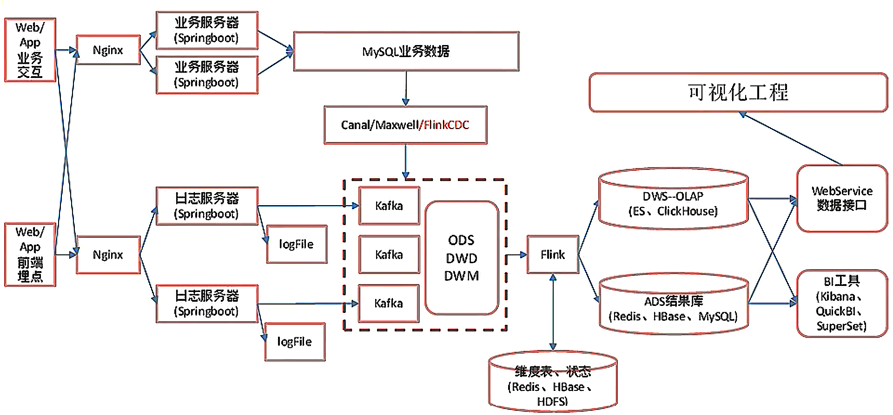

Data warehouse is a system that pulls together data derived from operational systems and external data sources within an organization for reporting and analysis. A data warehouse is a central repository of information that provides users with current and historical decision support information.

<!--more-->



## ODS 数据采集层

原始数据，日志和业务数据

### 日志数据采集

#### springboot

> springboot 好处：
>
> 1. 不需要那些繁琐重复的 xml 文件
> 2. 内嵌 Tomcat，不需要外部 Tomcat
> 3. 更方便的和各个第三方工具整合，只要维护一个配置文件即可（mysql、redis、es、dubbo、kafka）

> springboot 和 ssm 的关系
>
> springboot 整合了 springmvc，spring 等核心功能，也就是说本质还是原有的 spring，springmvc 的包，但是 springboot 单独包装了一层，用户不必直接对 springmvc，spring 等在 xml 中配置。

##### springboot分层

掌握写数据接口

+ controller层：拦截用户请求，调用Service，响应请求
+ service层：调用 DAO，处理数据
+ DAO（使用 MyBatis 时称为 Mapper 层）：获取数据
+ 持久化层：存储数据

##### SpringBoot 整合Kafka

```java
import org.springframework.stereotype.Controller;
import org.springframework.web.bind.annotation.RequestMapping;

//@Controller //注解标明 Controller
@RestController //@Controller + @ResponseBody
@Slf4j //lombok中的包
public class LoggerController{
    @RequestMapping("test2")
    public String test2(@RequestParam("name") String nn,
                       @RequestParam("age", defaultValue = "18") int age){
        return "success" + name + age;
    }
  
    @Autowired //自动注入
    private KafkaTemplate<String, String> kafkaTemplate;
  
    @RequestMapping("applog")
    public String test2(@RequestParam("param") String jsonStr){
        //sparkmall-mock：模拟生成数据模块
        //mock服务器不停的访问 http://pc_IP:8080/applog?jsonStr=* 产生原始数据
        /*1.修改SpringBoot核心配置：
        	server.port=8081
        	指定kafka代理地址，可以多个：spring.kafka.bootstrap-servers=hadoop102.9092
        	指定消息key和消息体的编解码方式：
        		spring.kafka.producer.key-serializer=org.apache.kafka.common.serialization.StringSerilizer 
        		spring.kafka.producer.value-serializer=org.apache.kafka.common.serialization.StringSerilizer*/
        /*2.Resources中添加 logback.xml 配置文件：决定如何打印、落盘、打印哪些日志 ，类似log4j
        	在注释@Slf4j后，使用log.info(jsonStr);log.warn(jsonStr);log.debug();log.error();log.trace()*/
        /*3.自动注入kafkaTemplate，producer send 数据，打开zk、kk服务
        	运行kafka消费者：bin/kafka-console-consumer.sh --bootstrap-server hadoop102:9092 --topic ods_base_log*/
        kafkaTemplate.send("ods_base_log", jsonStr);
        return "success";
    }
}
```

##### 打包集群部署，Nginx 反向代理

> 简介：
>
> 高性能的 HTTP 和 反向代理服务器，特点是占有内存少，并发能力强，在同类型的网页服务器中表现较好。

> 反向代理和正向代理：
>
> 正向代理类似一个跳板机，代理访问外部资源，如 VPN。
>
> 反向代理是指以代理服务器来接受 internet 上的连接请求，然后将请求转发给内部网络上的服务器。

> Nginx 主要应用
>
> 1. 静态网站部署：Nginx 是一个 HTTP 的 web 服务器，可以将服务器上的静态文件（如 HTML、图片等）通过 HTTP 协议返回给浏览器客户端。
> 2. 负载均衡：如数据请求发到集群中不同的机器上，常用策略：轮询、权重、备机
> 3. 静态代理：把所有静态资源的访问改为访问 Nginx 而不是 Tomcat，Nginx 更擅长静态资源的处理。

### 业务数据采集

#### Flink-CDC

##### CDC

> Change Data Capture(变更数据获取)的简称，捕获增删改。

##### CDC的种类

CDC主要分为**基于查询**和**基于Binlog**两种方式

|                          | 基于查询                 | 基于Binlog               |
| ------------------------ | ------------------------ | ------------------------ |
| 开源产品                 | Sqoop、Kafka JDBC Source | Canal、Maxwell、Debezium |
| 执行模式                 | Batch                    | Streaming                |
| 是否可以捕获所有数据变化 | 否                       | 是                       |
| 延迟性                   | 高延迟                   | 低延迟                   |
| 是否增加数据库压力       | 是                       | 否                       |

##### Flink-cdc-connectors

可以直接从 MySQL、PostgreSQL等数据库直接 **读取全量数据**和**增量变更数据**的 source 组件

| 组件       | 业务流程                                     |
| ---------- | -------------------------------------------- |
| Flink：    | MySQL -> Canal -> kafka -> Flink -> 业务处理 |
| Flink-CDC: | MySQL -> Fink-CDC -> 业务处理                |

##### Flink-cdc code

```java
public class FlinkCDC{
    public static void main(String[] args){
        //1.获取执行环境
        //1.1开启 CD 并指定后端为FS     memory fs rocksdb
        //1.2开启 checkpoint 实现断点续传
        //2.通过 flinkcsc 构建 sourcefunction 并读取数据
        //3.打印数据
        //4.启动任务
    }
}
```

##### FlinkSQL

> FlinkSQL只能做单表的监控
>
> Debezium可以做多表的监控，需要自定义反序列化器

```java
public class FlihnkCDCWithSQL{
    public staic void main(String[] args){
        //1.获取执行环境
        //2.DDL方式建表
        //3.查询数据
        //4.将动态表转化为流
        //5.启动任务
    }
}
```

##### Flink-cdc DataStream CustomerDeserialization

```java
@Override
public void deserialize(SourceRecord sourceRecord, Collector...){
    //1.创建Json对象用于存储最终数据
    //2.获取库名、表明
    //3.获取"before"数据
    //4.获取"after"数据
    //5.获取操作类型
    //6.写入JSON对象
    //7.输出数据
}
```

##### CDC Maxwell Canal 对比

|               | FlinkCDC       | Maxwell  | Canal           |
| ------------- | -------------- | -------- | --------------- |
| SQL和数据关系 | 无             | 无       | 一对一          |
| 初始化功能    | 有(多库多表)   | 有(单表) | 无              |
| 断点续传      | ck             | MySQL    | 本地磁盘        |
| 封装格式      | 自定义         | JSON     | JSON(c/s自定义) |
| 高可用        | 运行集群高可用 | 无       | 集群(ZK)        |

#### 环境搭建

| IDEA目录 | 功能                      |
| -------- | ------------------------- |
| app      | 产生各层数据的 flink 任务 |
| bean     | 数据对象                  |
| common   | 公共常量                  |
| utils    | 工具类                    |

### ODS 总结

保持数据原貌，不做任何修改

FlinkCDC:

+ DataStream / FlinkSQL 区别
+ FlinkCDC / Maxwell / Canal 区别

## DWD 明细数据层

### 日志数据写入DWD层

#### 数据流和程序流程

```
数据流：：web/app -> Nginx -> SpringBoot -> Mysql -> FlinkApp -> Kafka(ods) -> FlinkApp -> Kafka/Hbase(dwd-dim)

程序：mocklog -> Nginx -> Logger.sh -> KafkaZ(zk) -> BaseLogApp -> Kafka
```

#### 代码实现

```java
public class BaseLogApp{
public static void main(String[] args){
    //1.获取执行环境
    //2.消费 ods_base_log 主题数据创建流
    //3.将每行数据转换为JSON对象
    	//3.1发生异常，如不满足JSON格式，捕获写入侧输出流
    //4.新老用户校验，状态编辑
    	//4.1 转态编程
    jsonObjDS.keyBy(...).map(new RichMapFunction<JSONObject, JSONObject>()){
        private ValueState<String> valueState;
        @Override
        public void open(Configuration parameters) throws Exception {
            valueState = getRuntimeContext().getState(new ValueStateDescriptor<String>("value-state", String.class));
        }
        @Override
        public JSONObject map(JSONObject value) throws Excepiton {
            //获取JSON中"is_new"标记
            String isNew = value.getJSONObject("common").getString("is_new");
            //isnew做处理，旧数据不处理
            if("1".equals(isNew)){
                String state = valueState.value();
                if(state != null){
                    //修改isnew标记
                    value.getJSONObject("common").put("is_new", "0");
                }else{
                    valueState.update("1");
                }
            }
            return value;
        }
    };
    //5.分流、侧输出流  页面：主流  启动：侧输出流  曝光：侧输出流
    //6.提取侧输出流
    //7.将三个流进行打印并输出到对应的kafka主题中
}
}
```

### 业务数据写入DWD层

#### 选型

> 在实时计算中一般把维度数据写入存储容器，如 HBASE、Redis、MySQL 等。
>
> 一般把实时数据写入流中，进入dwd层，最终形成宽表。
>
> + HBASE：HBase是建立在HDFS之上,提供高可靠性的列存储，实时读写的数据库系统。它介于Nosql和关系型数据库之间，仅通过主键和主键的range来检索数据，仅支持单行事务。主要用来存储非结构化和半结构化的松散数据。
> + Redis：分布式缓存，基于内存，强调缓存，支持数据持久化，支持事务操作，NoSQL 类型的Key/vale数据库，同时支持List、Set等更丰富的类型。适合放一些频繁使用，比较热的数据，因为是放在内存中，读写速度都非常快。
> + MySQL：并发压力大，读取速度慢。

##### Phoenix & HBASE

> 功能：
>
> Phoenix是一种专门针对于Hbase 所设计的SQL on Hbase 的一个工具
> 使用SQL对Hbase进行操作
> 使用phoenix自动构建二级索引来进行快速查询和维护

> 原理：
>
> - 上层提供了SQL接口
> - 底层全部通过Hbase Java API来实现，通过构建一系列的Scan和Put来实现数据的读写
> - 功能非常丰富
> - 底层封装了大量的内置的协处理器，可以实现各种复杂的处理需求，例如二级索引等

> 优点
>
> - 支持SQL接口
> - 支持自动维护二级索引
>
> 缺点
>
> - SQL支持的语法不全面
> - Bug比较多

#### 实现动态分流方案

> + ZK存储，通过 watch 感知数据变化
> + MySQL存储，周期性的同步
> + *MySQL存储，使用广播流

#### 数据流和程序流程

```
数据流：：web/app -> Nginx -> SpringBoot -> Mysql -> FlinkApp -> Kafka(ods) -> FlinkApp -> Kafka/Hbase(dwd-dim)

程序：            mockDB -> Mysql -> FlinkCDC -> Kafka(ZK) -> BaseDBApp -> Kafka/Hbase(Phoenix, zk, hdfs)
```

#### 代码实现

```java
BaseDBApp;
        //1.获取执行环境
        //2.消费 kafka ods_base_db 主题数据创建流
        //3.将每行数据转换成JSON对象并过滤 主流
        //4.使用FlinkCDC消费配置表并处理成 广播流
        //5.连接主流和广播流
        //6.分流 处理数据 广播流数据和主流数据(根据广播流数据进行处理)
        //7.提取kafka流数据和HBASE流数据
        //8.将kafka数据写入Kafka主题，将HBASE数据写入Phoenix表
        //9.启动
```

### 维表层DIM层

| 层                                               | 业务               |
| ------------------------------------------------ | ------------------ |
| ODS / DWD / DIM                                  | 一般与业务需求无关 |
| (离线数仓是 DWS 和 DWT) / (实时数仓是 DWM / DWS) | 与业务相关性非常高 |
| ADS                                              | 等于业务需求       |

### DWD-DIM 总结

行为数据：DWD（Kafka）

1. 过滤脏数据 --> 侧输出流  脏数据率
2. 新老用户校验 -->  前台校验不准
3. 分流 --> 侧输出流  页面、启动、曝光、动作、错误
4. 写入 kafka

业务数据：DWD（Kafka）- DIM（HBASE）

1. 过滤数据  --> 删除数据
2. 读取配置表创建广播流
3. 连接主流和广播流并处理
   1. 广播流数据：
      + 解析数据，Phoenix建表
      + 写入状态广播
   2. 主流数据
      + 读取状态
      + 过滤字段
      + 分流（添加SinkTable字段）
   3. 提取Kafka和HBASE流分别对应的位置
   4. HBASE流：自定义Sink
   5. Kafka流：自定义序列化方式

