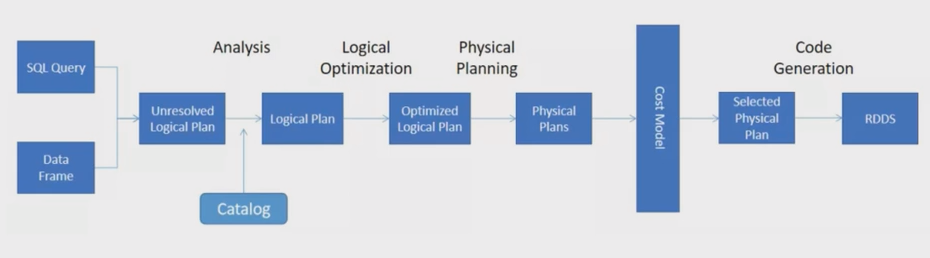
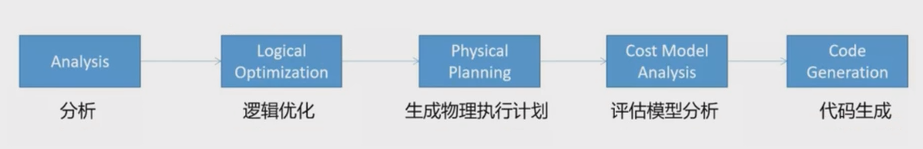
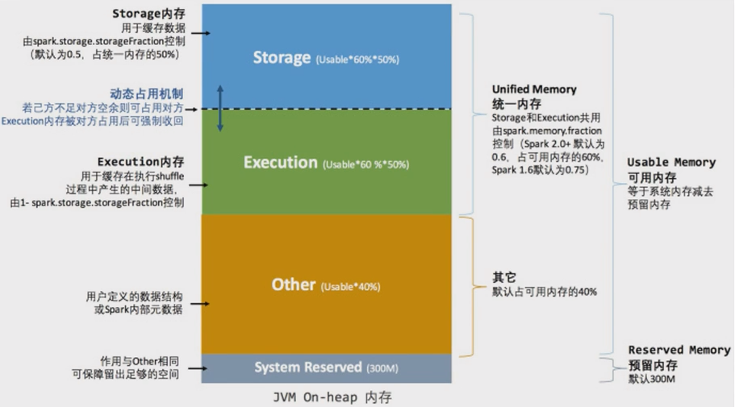

Spark SQL is the top active component in latest spark release. 46% of the resolved tickets are for Spark SQL. These enhancements benefit all the higher-level libraries, including structured streaming and MLlib, and higher level APIs, including SQL and DataFrames. Various related optimizations are added in latest release.

<!--more-->

## Explain 查看执行计划

### 语法

```scala
.explain(mode="xxx")
```

+ `explain(mode="simple")`: 只展示物理执行计划
+ `explain(mode="extended")`: 展示物理计划和逻辑执行计划
+ `"codegen"`: 展示 codegen 生成的可执行 Java 代码
+ `"cost"`: 展示优化后的逻辑执行计划以及相关的统计
+ `"formatted"`: 分隔输出，输出更易读的物理执行计划并展示每个节点的详细信息

### 执行计划处理流程





**🔴Unresolved 逻辑执行计划：== Parsed Logical Plan ==**

+ Parser 组件检查 SQL 语法是否有问题，然后生成 Unresolved 的逻辑计划，不检查表名、不检查列明

**🟠Resolved 逻辑执行计划：==Analyzed Logical Plan ==**

+ Spark 中的 Catalog 存储库来解析验证语义、列名、类型、表名等

🟡**优化后的逻辑执行计划：== Optimized Logical Plan ==**

+ Catalyst 优化器根据各种规则进行优化

**🟢物理执行计划：== Physical Plan ==**

1. `HashAggregate` 运算符表示数据聚合，一般 HashAggregate 是成对出现，第一个 HashAggregate 是将执行节点本地的数据进行局部聚合，另一个 HashAggregate 是将各个分区的数据进行聚合计算
2. `Exchange` 运算符其实就是 shuffle，表示需要在集群上移动数据。很多时候 HashAggregate 会以 Exchange 分隔开
3. `Project`运算符是 SQL 中的选择列，select name, age
4. `BroadcastHashJoin`表示通过基于广播方式进行 HashJoin
5. `LocalTableScan` 表示全表扫描本地的表

## 资源调优

### 资源规划

#### 资源设定考虑

##### 总体原则

单台服务器 128G 内存，32线程。

先设定单个 Executor 核数，根据 Yarn 配置得出每个节点最多的 Executor 数量，(Yarn 总核数 / 每个executor核数(通常为4)) = 单个节点的executor数量；

28 / 4 = 7 单个节点的executor数量；

总的 executor 数 = 单节点executor数量 * nm节点数。

##### 具体提交参数

1. executor-cores

   每个 executor 的最大核数。3 ~ 6 之间比较合理，通常为4

2. num-executors

   num-executors = 每个节点的 executor 数 * work 节点数；

   每个 node 的 executor 数 = 单节点 yarn 总核数 / 每个 executor 的最大 cpu 核数；

   32线程有28线程用在 Yarn 上；

   那么每个 node 的 executor 数 = 28 / 4 = 7；

   假设集群节点为10；

   那么 num-executors = 7 * 10 = 70。

3. executor-memory⭐

   executor-memory = Yarn 内存 / 单个节点的executor数量；

   100G(总128G, 100G 给 Yarn) / 7 = 14G; 

#### 内存设置

**一个 executor 内部**



🟢估算 Other 内存 = 自定义数据结构 * 每个 Executor 核数

🔵估算 Storage 内存 = 广播变量 + cache/Executor 数量

🟣估算 Executor 内存 = 每个 Executor 核数 * (数据集大小/并行度)

* Sparksql 并行度默认为 200，并行度即为 Task 数量

### 持久化和序列化

