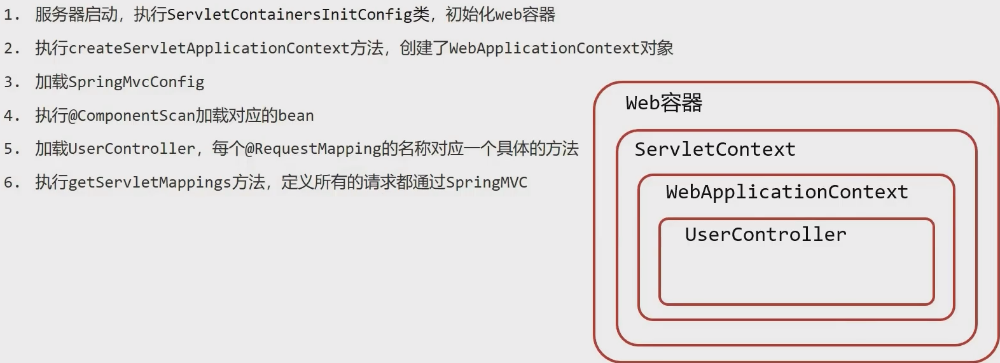
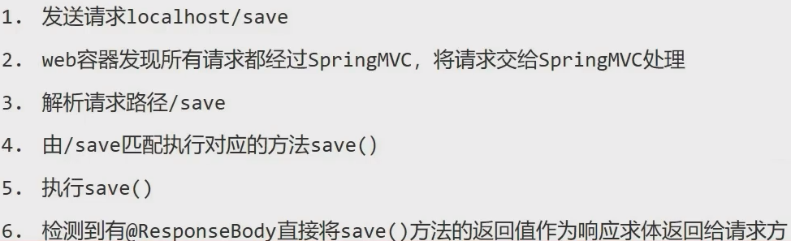
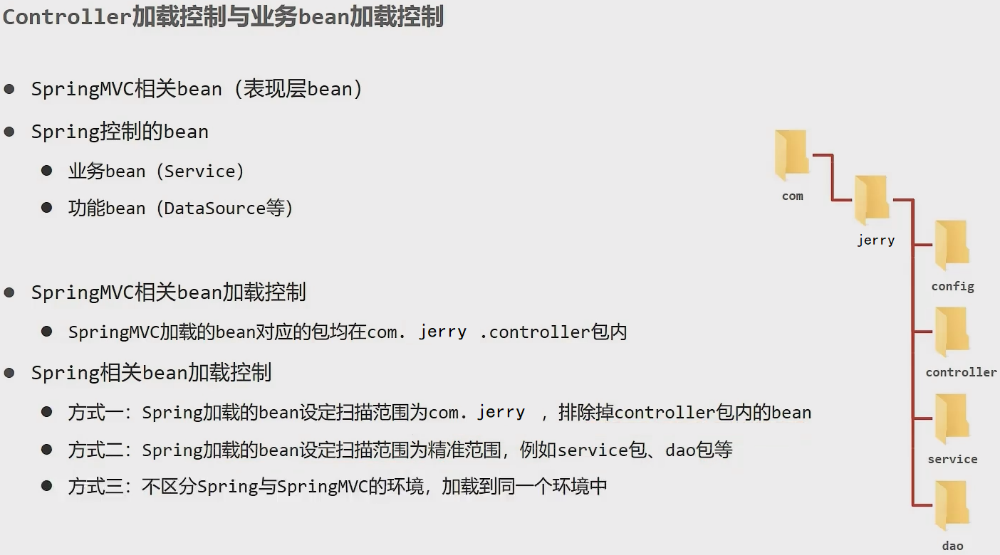

Spring MVC is a module in the Spring framework that helps you build web applications. It is a framework that helps you build web applications in a clean and modular way, by providing a structure for request handling and a model-view-controller design pattern.

<!--more-->

## SpringMVC

### 对比 Servlet

> 对比 SpringMVC 和 Servlet，实现相同的功能。
>
> 实现对 User 模块增删改查的模拟操作。 

**Servlet 实现** 

+ com.jerry.servlet.**UserSaveServlet**.java:

  ```java
  package com.jerry.servlet;
  
  import ...;
  
  @WebServlet("/user/save")
  public class UserSaveServlet extends HttpServlet{
      @Override
      protected void doGet(HttpServletRequest req, HeepServletResponse resp) throws ServletException, IOException{
          String name = req.getParameter("name");
          println("servlet save name：" + name);
          resp.setContenType("text/json;charset=utf-8");
          PrintWriter pw = resp.getWriter();
          pw.write("{'module':'servlet save'}");
      }
      @Override
      protected void doPost(HttpServletRequest req, HeepServletResponse resp) throws ServletException, IOException{
          this.doGet(req,resp);
      }
  }
  ```

+ com.jerry.servlet.**UserSelectServlet**.java: 和 Save 功能类似实现方式

+ com.jerry.servlet.**UserUpdateServlet**.java: 和 Save 功能类似实现方式

+ com.jerry.servlet.**UserDeleteServlet**.java: 和 Save 功能类似实现方式

**SpringMVC 实现** 

+ com.jerry.springmvc.UserController.java:

  ```java
  package com.jerry.springmvc;
  
  import ...;
  
  @Controller
  public class UserController{
      @RequestMapping("/save")
      @ResponseBody
      public String save(String name){
          println("springmvc save name：" + name);
      }
      @RequestMapping("/select")
      @ResponseBody
      public String select(String name){
          println("springmvc select name：" + name);
      }
      @RequestMapping("/update")
      @ResponseBody
      public String update(String name){
          println("springmvc update name：" + name);
      }
      @RequestMapping("/delete")
      @ResponseBody
      public String delete(String name){
          println("springmvc delete name：" + name);
      }
  }
  ```

### 概述

+ SpringMVC 与 Servlet 技术功能等同，都属于 web 层开发技术
+ 优点
  + 使用简单，相比 Servlet 开发便捷
  + 灵活性强

### Demo

com.jerry.controller.UserController

```java
//使用 @Controller 定义 bean
@Controller
public class UserController{
    //设置当前操作的访问路径
    @RequestMapping("/save")
    //设置当前操作的返回值
    @ResponseBody
    public String save(){
        return "{'module':'springmvc'}";
    }
}
```

工作流程分析：

+ 启动服务器初始化过程

  

+ 单词请求过程

  

### Bean 加载控制



### 请求与相应

#### 请求映射路径

+ 名称：@RequestMapping

+ 类型：方法注解 \ 类注解

+ 位置：SpringMVC 控制器方法定义上方

+ 作用：设置当前控制器方法请求访问路径，如果设置在类上统一设置当前控制器方法请求访问路径前缀

+ 范例：

  com.jerry.controller.UserController

  ```java
  @Controller
  @RequestMapping("/user")
  public class UserController{
      @RequestMapping("/save")
      @ResponseBody
      public String save(){
          return "{'module':'springmvc'}";
      }
  }
  ```

#### Get & Post

