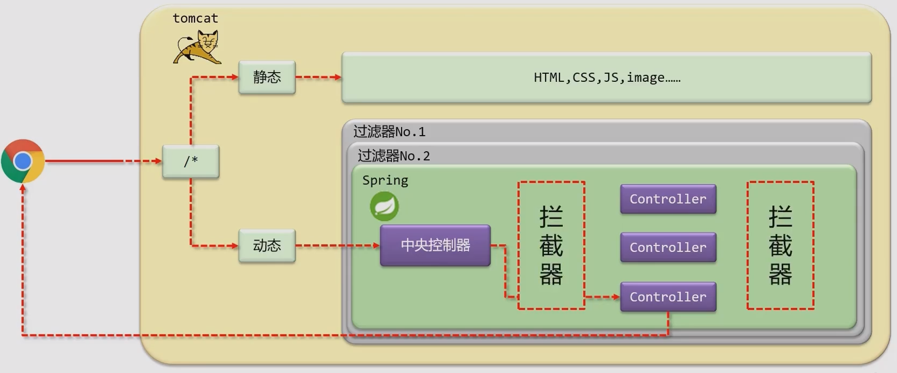

Spring MVC is a module in the Spring framework that helps you build web applications. It is a framework that helps you build web applications in a clean and modular way, by providing a structure for request handling and a model-view-controller design pattern.

<!--more-->

## SpringMVC

### 对比 Servlet

> 对比 SpringMVC 和 Servlet，实现相同的功能。
>
> 实现对 User 模块增删改查的模拟操作。 

**Servlet 实现** 

+ com.jerry.servlet.**UserSaveServlet**.java:

  ```java
  package com.jerry.servlet;
  
  import ...;
  
  @WebServlet("/user/save")
  public class UserSaveServlet extends HttpServlet{
      @Override
      protected void doGet(HttpServletRequest req, HeepServletResponse resp) throws ServletException, IOException{
          String name = req.getParameter("name");
          println("servlet save name：" + name);
          resp.setContenType("text/json;charset=utf-8");
          PrintWriter pw = resp.getWriter();
          pw.write("{'module':'servlet save'}");
      }
      @Override
      protected void doPost(HttpServletRequest req, HeepServletResponse resp) throws ServletException, IOException{
          this.doGet(req,resp);
      }
  }
  ```

+ com.jerry.servlet.**UserSelectServlet**.java: 和 Save 功能类似实现方式

+ com.jerry.servlet.**UserUpdateServlet**.java: 和 Save 功能类似实现方式

+ com.jerry.servlet.**UserDeleteServlet**.java: 和 Save 功能类似实现方式

**SpringMVC 实现** 

+ com.jerry.springmvc.UserController.java:

  ```java
  package com.jerry.springmvc;
  
  import ...;
  
  @Controller
  public class UserController{
      @RequestMapping("/save")
      @ResponseBody
      public String save(String name){
          println("springmvc save name：" + name);
      }
      @RequestMapping("/select")
      @ResponseBody
      public String select(String name){
          println("springmvc select name：" + name);
      }
      @RequestMapping("/update")
      @ResponseBody
      public String update(String name){
          println("springmvc update name：" + name);
      }
      @RequestMapping("/delete")
      @ResponseBody
      public String delete(String name){
          println("springmvc delete name：" + name);
      }
  }
  ```

### 概述

+ SpringMVC 与 Servlet 技术功能等同，都属于 web 层开发技术
+ 优点
  + 使用简单，相比 Servlet 开发便捷
  + 灵活性强

### Demo

com.jerry.controller.UserController

```java
//使用 @Controller 定义 bean
@Controller
public class UserController{
    //设置当前操作的访问路径
    @RequestMapping("/save")
    //设置当前操作的返回值
    @ResponseBody
    public String save(){
        return "{'module':'springmvc'}";
    }
}
```

工作流程分析：

+ 启动服务器初始化过程

  

+ 单词请求过程

  

### Bean 加载控制


### 请求与响应

#### 请求映射路径

+ 名称：@RequestMapping

+ 类型：方法注解 \ 类注解

+ 位置：SpringMVC 控制器方法定义上方

+ 作用：设置当前控制器方法请求访问路径，如果设置在类上统一设置当前控制器方法请求访问路径前缀

+ 范例：

  com.jerry.controller.UserController

  ```java
  @Controller
  @RequestMapping("/user")
  public class UserController{
      @RequestMapping("/save")
      @ResponseBody
      public String save(){
          return "{'module':'springmvc'}";
      }
  }
  ```

#### Get & Post

请求参数

+ 普通参数：url 地址传参，地址参数名与形参变量名相同，定义形参即可接收参数

  `http://localhost/commonParam?name=jerry&age=15`

  ```java
  @RequestMapping("/commonParam")
  @ResponseBody
  public String commonParam(String name, int age){
      sout(name);
      sout(age);
      return "'module':'common param'"
  }
  ```

+ 普通参数：请求参数名与形参变量名不同，使用 @RequestParam 绑定参数关系

  `http://localhost/commonParam?name=jerry&age=15`

  ```java
  @RequestMapping("/commonParam")
  @ResponseBody
  public String commonParam(@RequestParam("name") String userName, int age){
      sout(name);
      sout(age);
      return "'module':'common param'"
  }
  ```

+ Json 数据：请求 body 中添加 json 数据

  postman -> get -> body -> row -> JSON

  开启自动转化 json 数据的支持 **@EnableWebMvc**

  在参数前加 @RequestBody

#### 响应

+ 名称：@ResponseBody

+ 类型：方法注解

+ 位置：SpringMVC 控制器方法定义上方

+ 作用：位置当前控制器方法相应内容为当前返回值，无需解析。**设置当前控制器返回值作为响应体**

+ 样例：

  ```java
  @RequestMapping("/save")
  @ResponseBody
  public String save(){
      sout("save");
      return "'info':'springmvc'"
  }
  ```

### REST 风格

#### REST 简介

+ REST (Repesentational State Transfer)，表现形式状态转化

  + 传统风格资源描述形式：

    ​	http://localhost/user/`get`ById?id=1

    ​	http://localhost/user/`save`User

  + REST 风格描述形式：

    ​	http://localhost/user/1

    ​	http://localhost/user

+ 优点：

  + 隐藏资源的访问行为，无法通过地址得知对资源是何种操作
  + 书写简化

#### REST 风格简介

+ 按照 REST 风格访问资源时使用`行为动作`区分对资源进行何种操作

  | URL                      | 请求方式 | 对应行为  |
  | ------------------------ | -------- | --------- |
  | http://localhost/users   | GET      | 查询      |
  | http://localhost/users/1 | GET      | 查询指定  |
  | http://localhost/users   | POST     | 新增/保存 |
  | http://localhost/users   | PUT      | 修改/更新 |
  | http://localhost/users/1 | DELETE   | 删除      |

+ 根据 REST 风格对资源进行访问称为 RESTful

> 注意：
>
> + REST 是一种风格，而不是规范
> + 描述模块的名称通常使用复数

#### REST Demo

##### 项目结构

+ java
  + com.jerry
    + config
      + ServletContainersInitConfig
      + SpringMvcConfig
    + controller
      + BookController
      + UserController
    + domain

##### UserController

```java
@Controller
public class UserController{
    @RequestMapping(value = "/users", method = RequestMethod.GET)
    @ResponseBody
    public String getAll(){}
    
    @RequestMapping(value = "/users/{id}", method = RequestMethod.GET)
    @ResponseBody
    public String getById(@PathVariable Integer id){}
    
    @RequestMapping(value = "/users", method = RequestMethod.POST)
    @ResponseBody
    public String save(){}
    
    @RequestMapping(value = "/users", method = RequestMethod.PUT)
    @ResponseBody
    public String update(@RequestBody User user){}
    
    @RequestMapping(value = "/users/{id}", method = RequestMethod.DELETE)
    @ResponseBody
    public String delete(@PathVariable Integer id){}
}
```

#### 接收参数的三种方式

@RequestBody, @RequestParam, @PathVariable

+ 区别
  + @RequestBody 用于接收 json 数据
  + RequestParam 用于接收 url 地址传参或者表单传参
  + @PathVariable 用于接收路径参数，使用{参数名称}描述路径参数
+ 应用
  + 开发中，发送请求参数超过1个时，以 json 格式为主，@RequestBody 应用较广
  + 如果发送非 json 格式数据，选用 @RequestParam 接收参数
  + 使用 RESTful 进行开发，当参数数量较少时，可以采用 @PathVariable 接收请求路径变量，通常用于传递 id 值

#### REST 继续简化注解

```java
//@Controller
//@ResponseBody
@RestController
@RequestMapping("/users")
public class UserController{
    //@RequestMapping(value = "/users", method = RequestMethod.GET)
    @GetMapping
    public String getAll(){}
    
    //@RequestMapping(value = "/users/{id}", method = RequestMethod.GET)
    @GetMapping("/{id}")
    public String getById(@PathVariable Integer id){}
    
    //@RequestMapping(value = "/users", method = RequestMethod.POST)
    @PostMapping
    public String save(){}
    
    //@RequestMapping(value = "/users", method = RequestMethod.PUT)
    @PutMapping
    public String update(@RequestBody User user){}
    
    //@RequestMapping(value = "/users/{id}", method = RequestMethod.DELETE)
    @DeleteMapping("/{id}")
    public String delete(@PathVariable Integer id){}
}
```

+ @RestController
  + 类注解
  + SpringMVC 的 RESTful 开发控制器类定义上方
  + 设置当前控制器类为 RESTful 风格，等同于 @Controller 和 @ResponseBody 两个注解

+ @GetMapping, @PostMapping, @PutMapping, @DeleteMapping
  + 方法注解
  + SpringMVC 的 RESTful 开发控制器方法定义上方

#### REST Case

基于 RESTful 页面数据交互

##### 项目结构

+ java
  + com.jerry
    + config
      + ServletContainersInitConfig
      + SpringMvcConfig
      + SpringMvcSupport
    + controller
      + BookController
    + domain
      + Book
+ webapp
  + css
  + js
  + pages
  + plugins

##### BookController

BookController.java

第一步：制作 SpringMVC 控制器，并通过 PostMan 测试接口功能

```java
@RestController
@RequestMapping("/books")
public class BookController{
    @PostMapping
    public String save(@RequestBody Book book){}
    
    @GatMapping
    public List<Book> getAll(){
        List<Book> bookList = new ArrayList<Book>();
        
        Book book1 = new Book();
        book1.setType("cs");
        book1.setName("Spring");
        bookList.add(book1);
        
        Book book2 = new Book();
        book2.setType("cs");
        book2.setName("MVC");
        bookList.add(book2);
        
        return bookList;
    }
}
```

##### SpringMvcSupport

SpringMvcSupport.java

第二步：设置对静态资源的访问放行（不放行静态资源会被 SpringMVC 默认拦截）

```java
@Configuration
public class SpringMvcSupport extends WebMvcConfigurationSupport{
    @Override
    protected void addResourceHandlers(ResourceHandlerRegistry registry){
        // 当访问 /pages/* 路径的时候，走 /pages 目录下的内容
        registry.addResourceHandler("/pages/**").addResourceLocations("/pages/");
        registry.addResourceHandler("/js/**").addResourceLocations("/js/");
        registry.addResourceHandler("/css/**").addResourceLocations("/css/");
        registry.addResourceHandler("/plugins/**").addResourceLocations("/plugins/");
    }
}
```

第三步：前端页面通过异步提交访问后台控制器

## SSM 整合

### SSM 整合步骤

1. SSM 整合
   + Spring
     + SpringConfig
   + MyBatis
     + MybatisConfig
     + JdbcConfig
     + jdbc.properties
   + SpringMVC
     + ServletConfig
     + SpringMvcConfig
2. 功能模块
   + 表和实体类
   + dao （接口 + 自动代理）
     + 业务层接口测试
   + controller
     + 表现层接口测试

### SSM 整合详细步骤

+ 配置

  + SpringConfig

    ```java
    @Configuration
    @ComponentScan("com.jerry")
    @PropertySource("classpath:jdbc.properies")
    @Import({JdbcConfig.class, MybatisConfig.class})
    public class SpringConfig{}
    ```

  + JDBCConfig, jdbc.properties

    ```java
    public class JdbcConfig{
        @Value("${jdbc.driver}")
        private String driver;
        @Value("${jdbc.url}")
        private String url;
        @Value("${jdbc.username}")
        private String username;
        @Value("${jdbc.password}")
        private String password;
        @Bean
        public DataSource dataSource(){
            DruidDataSource ds = new DruidDataSource();
            ds.setDriverClassName(driver);
            ds.setUrl(url);
            ds.setUsername(userName);
            ds.setPassword(password);
            return ds;
        }
    }
    ```

  + MyBatisConfig

    ```java
    public class MybatisConfig{
        @Bean
        public SqlSessionFactoryBean sqlSessionFactory(DataSource dataSource){
            SqlSessionFactoryBean ssfb = new SqlSessionFactoryBean();
            ssfb.setTypeAliasesPackage("com.jerry.domain");
            ssfb.setDataSource(dataSource);
            return ssfb;
        }
        @Bean
        public MapperScannerConfigurer mapperScannerConfigurer(){
            MapperScannerConfigurer msc = new MapperScannerConfigurer();
            msc.setBasePackage("com.jerry.dao");
            return msc;
        }
    }
    ```

+ 模型

  + Book

    ```java
    public class Book{
        private Integer id;
        private String name;
        private String type;
        private String description;
    }
    ```

+ 数据层标准开发

  + BookDao

    ```java
    public interface BookDao{
        @Insert("insert into tbl_book(type,name,description)values(#{type},#{name},#{description})")
        void save(Book book);
        @Delete("delete from tbl_book where id = #{id}")
        void delete(Integer id);
        @Update("update tbl_book set type = #{type}, name = #{name}, description = #{description} where id = #id")
        void update(Book book);
        @Select("select * from tbl_book where id = #{id}")
        Book getById(Integer id);
    }
    ```

+ 业务层标准开发

  + BookService

    ```java
    public interface BookService{
        void save(Book book);
        void delete(Integer id);
        void update(Book book);
        List<Book> getAll();
        Book getById(Integer id);
    }
    ```

  + BookServiceImpl

    ```java
    @Service
    public class BookServiceImpl implements BookService{
        @Autowried
        private BookDao bookDao;
        public void save(Book book){bookDao.save(book);}
        public void update(Book book){bookDao.update(book);}
        public void delete(Integer id){bookDao.delete(id);}
        public Book getById(Integer id){bookDao.getById(id);}
    }
    ```

+ 测试接口

  + BookServiceTest

    ```java
    @RunWith(SpringJUnit4ClassRunner.class)
    @ContextConfiguration(classes = SpringConfig.class)
    public class BookServiceTest{
        @Autowired
        private BookService bookService;
        @Test
        public void testGetById(){
            Sout(bookService.getById(1));
        }
    }
    ```

+ 事务处理

  ```java
  public class JdbcConfig{
      @Bean
      public PlatformTransactionManager transactionManager(DataSource dataSource){
          DataSourceTransactionManager transactionManager = new DataSourceTransactionManager(dataSource);
          return transactionManager;
      }
  }
  ```

  ```java
  @Configuration
  @ComponentScan("com.jerry")
  @PropertySource("classpath:jdbc.properties")
  @Import({JdbcConfig.class,MybatisConfig.class})
  @EnableTransactionManagement
  public class SpringConfig{}
  ```

+ Spring 整合 SpringMVC

  + web 配置类

    ```java
    public class ServletContainersInitConfig extends AbstractAnnotationConfigDispatcherServletInitializer{
        protected Class<?>[] getRootConfigclasses(){
            return new Class[]{SpringConfig.class};
        }
        protected Class<?>[] getServletConfigclasses(){
            return new Class[]{SpringMvcConfig.class};
        }
        protected String[] getServletMappings(){
            return new String[]{"/"};
        }
        @Override
        protected Filter[] getServletFilters(){
            characterEncodingFilter filter = new CharacterEncodingFilter();
            filter.setEncoding("UTF-8");
            return new Filter[]{filter};
        }
    }
    ```

  + 基于 RESTful 的 Controller 开发

    ```java
    @RestController
    @RequestMapping("/books")
    public class BookController{
        @Autowired
        private BookService bookService;
        @PostMapping
        public void save(@RequestBody Book book){
            bookService.save(book);
        }
        @PutMapping
        public void update(@RequestBody Book book){
            bookService.update(book);
        }
        @DeleteMapping("/{id}")
        public void delete(@PathVariable Integer id){
            bookService.delete(book);
        }
    }
    ```


### 表现层数据封装

+ 目前程序前端可能接收到数据格式

  + 增删改：

    ```true```

  + 查单条：

    ```json
    {
        "id": 1,
        "type": "计算机理论",
        "name": "Spring book",
        "description": "Spring intro"
    }
    ```

  + 查全部

    ```json
    {
        {
        	"id": 1,
        	"type": "计算机理论",
        	"name": "Spring book",
        	"description": "Spring intro"
    	},
    	{
            "id": 1,
            "type": "计算机理论",
            "name": "Spring book",
            "description": "Spring intro"
    	}
    }
    ```

+ 结论：格式不统一，必须统一成一种格式

+ 更合理的前端接受数据格式

  + 增删改：

    ```json
    {
        "code": 20031, //代表增删改的一种操作
        "data":true
    }
    ```

  + 查单条：

    ```json
    {
        "code": 20041, //代表查询
        "data":{
            "id": 1,
        	"type": "计算机理论",
        	"name": "Spring book",
        	"description": "Spring intro"
        }
    }
    ```

    ```json
    {
        "code": 20040, //代表查询失败，比如规定只要是0结尾的code都代表失败
        "data": null,
        "msg": "数据查询失败，请重试"
    }
    ```

  + 查全部

    ```json
    {
        "code": 20041, 
        "data":[
            {
                "id": 1,
                "type": "计算机理论",
                "name": "Spring book",
                "description": "Spring intro"
            },
            {
                "id": 1,
                "type": "计算机理论",
                "name": "Spring book",
                "description": "Spring intro"
            }
        ]
    }
    ```

#### 设置统一数据返回结果类

java>com>jerry>controller>Result.java

```java
public class Result{
    private Object data;
    private Integer code;
    private String msg;
}
```

java>com>jerry>controller>Code.java

```java
public class Code{
    public static final Integer SAVE_OK = 20011;
    public static final Integer DELETE_OK = 20021;
	public static final Integer UPDATE_OK = 20031;
    public static final Integer GET_OK = 20041;
    
    public static final Integer SAVE_ERR = 20010;
    public static final Integer DELETE_ERR = 20020;
	public static final Integer UPDATE_ERR = 20030;
    public static final Integer GET_ERR = 20040;
}
```

java>com>jerry>controller>BookController.java

```java
@RestController
@RequestMapping("/books")
public class BookController{
    @Autowired
    private BookService bookService;
    @PostMapping
    public Result save(@RequestBody Book book){
        boolean flag = bookService.save(book);
        return new Result(flag ? Code.SAVE_OK:Code.SAVE_ERR, flag);
    }
    @PutMapping
    public Result update(@RequestBody Book book){
        boolean flag = bookService.update(book);
        return new Result(flag ? Code.UPDATE_OK:Code.UPDATE_ERR, flag);
    }
    @DeleteMapping("/{id}")
    public void delete(@PathVariable Integer id){
        boolean flag = bookService.delete(ID);
        return new Result(flag ? Code.DELETE_OK:Code.DELETE_ERR, flag);
    }
    @GetMapping("/{id}")
    public Book getById(@PathVariable Integer id){
        Book book = bookService.getById(id);
        Integer code = book != null ? Code.GET_Ok : GET_ERR;
        String msg = book != null ? "" : "数据查询失败，请重试";
        return new Result(code, book, msg);
    }
}
```

### 异常处理器

java>com>jerry>controller>ProjectExceptionAdvice.java

```java
@RestConstrollerAdvice
public class ProjectExceptionAdvice{
    
    @ExceptionHandler(Exception.class)
    public void doException(Exception ex){
        return new Result(666, null);
    }
}
```

### 项目异常处理方案

项目异常分类

+ 业务异常(BusinessException)
  + 规范的用户行为产生的异常
  + 不规范的用户行为操作产生的异常
+ 系统异常(SystemException)
  + 项目运行过程中可预计且无法避免的异常
+ 其他异常(Exception)
  + 编程人员未逾期到的异常

## 拦截器

### 概念

+ 拦截器（Interceptor）是一种动态拦截方法调用的机制，在 SpringMVC 中动态拦截控制器方法的执行
+ 作用：
  + 在动态请求 Controller 前或后增加一些通用性的操作，如权限控制。
  + 在指定的方法调用前后执行预先设定的代码
  + 阻止原始方法的执行



### 拦截器与过滤器区别

+ 归属不同：Filter 属于 Servlet 技术，Interceptor 属于 SpringMVC 技术
+ 拦截内容不同：Filter 对所有访问进行增强，Interceptor 仅针对对 SpringMVC 的访问进行增强
