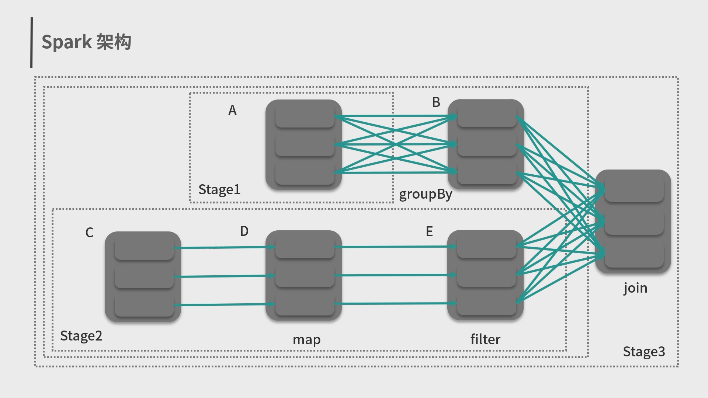

Apache Spark™ is a multi-language engine for executing data engineering, data science, and machine learning on single-node machines or clusters.

<!--more-->



This is my knowledge sharing on **how to get start with Spark Java development**.

And this is my slide:



## 1.Spark 简介

### 1. Spark 的背景


---

### 2. Spark 的核心模块

Spark 的定义：一个通用的大数据分析引擎

Spark 的核心模块：


---

### 3. Spark 的生态组件

Spark 的生态：


## 2.Spark 代码快速上手

Maven 配置：

```xml
<?xml version="1.0" encoding="UTF-8"?>
<project xmlns="http://maven.apache.org/POM/4.0.0"
         xmlns:xsi="http://www.w3.org/2001/XMLSchema-instance"
         xsi:schemaLocation="http://maven.apache.org/POM/4.0.0 http://maven.apache.org/xsd/maven-4.0.0.xsd">
    <modelVersion>4.0.0</modelVersion>

    <groupId>org.example</groupId>
    <artifactId>spark-demo</artifactId>
    <version>1.0-SNAPSHOT</version>

    <properties>
        <maven.compiler.source>8</maven.compiler.source>
        <maven.compiler.target>8</maven.compiler.target>
        <scala.version>2.13</scala.version>
        <spark.version>3.3.1</spark.version>
    </properties>

    <dependencies>
        <dependency>
            <groupId>org.apache.spark</groupId>
            <artifactId>spark-core_${scala.version}</artifactId>
            <version>${spark.version}</version>
        </dependency>

        <dependency>
            <groupId>org.apache.spark</groupId>
            <artifactId>spark-sql_${scala.version}</artifactId>
            <version>${spark.version}</version>
        </dependency>

        <dependency>
            <groupId>org.apache.spark</groupId>
            <artifactId>spark-mllib_${scala.version}</artifactId>
            <version>${spark.version}</version>
        </dependency>

        <dependency>
            <groupId>org.apache.spark</groupId>
            <artifactId>spark-graphx_${scala.version}</artifactId>
            <version>${spark.version}</version>
        </dependency>

        <dependency>
            <groupId>mysql</groupId>
            <artifactId>mysql-connector-java</artifactId>
            <version>8.0.22</version>
        </dependency>
    </dependencies>

</project>
```

### 1. 离线批处理场景

需求一: 离线批处理场景

数据来源于葡萄牙银行电话调查的结果

原始数据中的关键列：

| lname   | fname   | province | city    | age  | dur  | cam  |
| ------- | ------- | -------- | ------- | ---- | ---- | ---- |
| Santos  | Antonio | Lisbon   | Porto   | 20   | 261  | 1    |
| Silva   | Maria   | Porto    | Braga   | 57   | 149  | 1    |
| Pereira | Jorge   | Braga    | Faro    | 37   | 226  | 1    |
| Martins | Ana     | Faro     | Coimbra | 40   | 151  | 1    |
| ...     | ...     | ...      | ...     | ..   | ...  | .    |

需求一: 离线批处理场景

需求列表：

1. Spark 读取 CSV 文件
2. 过滤掉通话时间少于50秒的数据
3. 过滤掉年龄小于20的人
4. 生成完整名字，使用逗号连接姓和名字段得出
5. 生成详细地址字段，使用逗号连接州和城市字段得出
6. 根据年龄将客户分组，并统计各组客户的客户总数、通话联系的平均次数、电话联系的平均时间
7. 写入 mysql 数据库中

代码实现：

```java
import org.apache.spark.sql.*;
import org.apache.spark.sql.expressions.UserDefinedFunction;
import org.apache.spark.sql.types.DataTypes;
import java.util.Properties;
import static org.apache.spark.sql.functions.*;

public class spark01_helloworld {
    public static void main(String[] args){
        SparkSession sparkSession = new SparkSession.Builder()
                .appName("csv2db")
                .master("local[*]")
                .getOrCreate();

        Dataset<Row> bankTable = sparkSession.read()
                .format("csv")
                .option("header", "true")
                .load("C:\\Users\\JiaRui\\Desktop\\bank-additional-full.csv");

        //TODO: 1.过滤掉通话时间少于50秒的数据
        bankTable = bankTable.filter("duration >= 50");

        //TODO: 2.过滤掉年龄小于20
        bankTable.createOrReplaceTempView("bank_table");
        bankTable = sparkSession.sql("select * from bank_table where age >= 20");

        //TODO: 3.生成完整名字，使用逗号连接姓和名字段得出
        bankTable= bankTable.withColumn(
                "name",
                concat(bankTable.col("lname"), lit(", "), bankTable.col("fname"))
        );

        //TODO: 4.生成详细地址字段，使用逗号连接州和城市字段得出
        UserDefinedFunction mergeUdf = udf(
                (String x, String y) -> x + ", " + y, DataTypes.StringType
        );
        sparkSession.udf().register("merge", mergeUdf);
        bankTable = bankTable.withColumn("address",
                call_udf("merge",col("province"),col("city")));

        //TODO: 5.根据年龄将客户分组，并统计各组客户的客户总数、通话联系的平均次数、电话联系的平均时间
        Dataset<Row> reportTable = bankTable.groupBy("age")
                .agg(count("age").name("total customers"),
                        round(avg("campaign"), 2).name("avg_calls"),
                        round(avg("duration"), 2).name("avg_dur"))
                .orderBy("age");

        String url = "jdbc:mysql://172.20.121.222:3306/test";

        Properties properties = new Properties();
        properties.setProperty("dirver","com.mysql.cj.jdbc.Driver");
        properties.setProperty("user","root");
        properties.setProperty("password","123456");

        bankTable.write()
                .mode(SaveMode.Overwrite)
                .jdbc(url,"bank_table",properties);

        reportTable.write()
                .mode(SaveMode.Overwrite)
                .jdbc(url,"report_table",properties);

        sparkSession.stop();
    }
}
```


### 2. 实时流处理场景

需求二: 实时流处理场景

数据源是股票价格数据的实时数据，每分钟更新

样例数据：

> key: **000002.SZ** value: **1502126681,  22.71,  21.54,  22.32,  22.17** 

> 其中每个字段分别是股票代码、事件时间戳、现价、买入价、卖出价、成交均价。

需求列表：

1. 读取 kafka 数据
2. 记录每支股票每半个小时的最高价和最低价
3. 写入 Hbase 数据库中

代码实现：

```java
import org.apache.spark.sql.SparkSession;
import org.apache.spark.sql.streaming.Trigger;
import static org.apache.spark.sql.functions.*;

public class spark02_streaming {
    public static void main(String[] args) throws Exception {
        SparkSession sparkSession = SparkSession
                .builder()
                .master("local[*]")
                .appName("StockCCI")
                .getOrCreate();

        //分别设置window长度、容忍最大晚到时间和触发间隔
        String windowDuration = "30 minutes";
        String waterThreshold = "5 minutes";
        String triggerTime = "1 minutes";

        sparkSession.readStream()
                .format("kafka")
                .option("kafka.bootstrap.servers","broker1:port1,broker2:port2")
                .option("subcribe","stock")
                .load()
                .selectExpr(
                        "CAST(key AS STRING)",
                        "CAST(value AS STRING)".split(",")[0],
                        "CAST(value AS STRING)".split(",")[1],
                        "CAST(value AS STRING)".split(",")[2],
                        "CAST(value AS STRING)".split(",")[3],
                        "CAST(value AS STRING)".split(",")[4])
                .toDF("companyno","timestamp","price","bidprice","sellpirce","avgprice")
                .selectExpr(
                        "CAST(companyno AS STRING)",
                        "CAST(timestamp AS TIMESTAMP)",
                        "CAST(price AS DOUBLE)",
                        "CAST(bidprice AS DOUBLE)",
                        "CAST(sellpirce AS DOUBLE)",
                        "CAST(avgprice AS DOUBLE)"
                )
                //设定水位
                .withWatermark("timestamp",waterThreshold)
                .groupBy("timestamp",
                        windowDuration,
                        "companyno")
                //求出最高价和最低价
                .agg(
                        max(col("price")).as("max_price"),
                        min(col("price")).as("min_price")
                )
                .writeStream()
                .outputMode("append")
                .trigger(Trigger.ProcessingTime(triggerTime))
                .format("HBaseWriter")
                .start()
                .awaitTermination();
    }
}
```


### 3. 机器学习场景

需求三: 机器学习场景

数据源是文本和打分标签

训练数据：

| id   | text          | label |
| ---- | ------------- | ----- |
| 0L   | "a b c spark" | 1.0   |
| 1L   | "b d"         | 0.0   |
| 2L   | "spark f g h" | 1.0   |
| 3L   | "hadoop mapr" | 0.0   |

测试数据：

| id   | "text"               |
| ---- | -------------------- |
| 4L   | "spark i j"          |
| 5L   | "l m n"              |
| 6L   | "spark hadoop spark" |
| 7L   | "apache hadoop"      |

需求三: 机器学习场景

需求列表：

1. 将文档分词
2. 将分词的结果转换为词向量
3. 学习模型
4. 预测（是否为垃圾邮件）

代码实现：

```java
import org.apache.spark.ml.Pipeline;
import org.apache.spark.ml.PipelineModel;
import org.apache.spark.ml.PipelineStage;
import org.apache.spark.ml.classification.LogisticRegression;
import org.apache.spark.ml.feature.HashingTF;
import org.apache.spark.ml.feature.Tokenizer;
import org.apache.spark.sql.Dataset;
import org.apache.spark.sql.Row;
import org.apache.spark.sql.SparkSession;
import org.apache.spark.sql.types.DataTypes;
import org.apache.spark.sql.types.Metadata;
import org.apache.spark.sql.types.StructField;
import org.apache.spark.sql.types.StructType;

public class spark03_mlpipeline {
    public static void main(String[] args) {
        SparkSession sparkSession = SparkSession
                .builder()
                .master("local[*]")
                .appName("mlpipeline")
                .getOrCreate();

        Dataset<Row> training = sparkSession.read()
                .format("csv")
                .option("header", "true")
                .schema(new StructType(new StructField[] {
                        new StructField("id", DataTypes.LongType, false, Metadata.empty()),
                        new StructField("text", DataTypes.StringType, false, Metadata.empty()),
                        new StructField("label", DataTypes.DoubleType, false, Metadata.empty())
                }))
                .load("C:\\Users\\JiaRui\\Desktop\\training.csv");

        Tokenizer tokenizer = new Tokenizer()
                .setInputCol("text")
                .setOutputCol("words");

        HashingTF hashingTF = new HashingTF()
                .setNumFeatures(1000)
                .setInputCol(tokenizer.getOutputCol())
                .setOutputCol("features");

        LogisticRegression lr = new LogisticRegression()
                .setMaxIter(10)
                .setRegParam(0.001);

        Pipeline pipeline = new Pipeline()
                .setStages(new PipelineStage[]{tokenizer,hashingTF,lr});

        PipelineModel model = pipeline.fit(training);

        Dataset<Row> test = sparkSession.read()
                .format("csv")
                .option("header", "true")
                .schema(new StructType(new StructField[]{
                        new StructField("id", DataTypes.LongType, false, Metadata.empty()),
                        new StructField("text", DataTypes.StringType, false, Metadata.empty())
                }))
                .load("C:\\Users\\JiaRui\\Desktop\\test.csv");

        Dataset<Row> res = model.transform(test)
                .select("id", "text", "probability", "prediction");

        res.show();
    }
}
```


### 4. 图计算场景


需求四: 图计算场景

需求：使用 GraphX 实现了 PageRank 得分。


代码实现：

```java
import org.apache.spark.api.java.JavaRDD;
import org.apache.spark.graphx.Graph;
import org.apache.spark.graphx.lib.PageRank;
import org.apache.spark.sql.SparkSession;
import org.apache.spark.storage.StorageLevel;
import scala.Tuple2;
import scala.reflect.ClassTag;

public class spark04_grahpx {
    public static void main(String[] args) {
        SparkSession sparkSession = new SparkSession
                .Builder()
                .appName("pageRank")
                .master("local[*]")
                .getOrCreate();
        sparkSession.sparkContext().setLogLevel("WARN");

        //     URL         neighbor URL
        //     URL         neighbor URL
        //     ...
        JavaRDD<String> lines = sparkSession.read()
                .textFile("C:\\Users\\JiaRui\\Desktop\\pageRank.csv")
                .javaRDD();

        JavaRDD<Tuple2<Object, Object>> edges = lines.map(s -> {
            String[] parts = s.split("\\s+");
            return new Tuple2<>(parts[0], parts[1]);
        });

        Graph<Object, Object> graph = Graph.fromEdgeTuples(edges.rdd(),
                1,
                null,
                StorageLevel.MEMORY_AND_DISK(),
                StorageLevel.MEMORY_AND_DISK(),
                ClassTag.Any());

        Graph<Object, Object> rankedGraph = PageRank.runUntilConvergence(graph, 0.001, 0.001, ClassTag.Any(), ClassTag.Any());

        JavaRDD<Tuple2<Object, Object>> pageRankValues = rankedGraph.vertices().toJavaRDD();

        pageRankValues.foreach(x -> System.out.println(x));
    }
}
```


## 3.Spark 数据处理与分析场景


## 4.Spark 分布式计算框架和编程模型 MapReduce


## 5.Spark 弹性数据集 RDD 和结构化数据 Dataset


```java
//读取 json 文件
spark.read.json("examples/src/main/resources/people.json");
//读取 csv 文件
spark.read.csv("examples/src/main/resources/people.csv");
//读取 parquet 文件
spark.read.parquet("examples/src/main/resources/people.parquet");
//读取 orc 文件
spark.read.orc("examples/src/main/resources/people.orc");
//读取文本文件
spark.read.text("examples/src/main/resources/people.csv");
//通过 JDBC 连接外部数据库生成
spark.read.format("jdbc")
          .option("url","jdbc:driver")
          .option("user","")
          .option("password","")
          .load();
```


```java
//条件查询
df.select("age").where("name is not null and age > 10").foreach(println(_));

//分组统计
df.groupBy("age").count().foreach(println(_));

//连接操作: 
//支持 inner/cross/outer/full/full_outer/left/left_outer/cross/left_semi/left_anti等
leftDF.join(rightDF, leftDF("pid") == rightDF("fid"),"left_outer");
```


## 6.Spark抽象概念、架构与运行环境





| 基于某个运行环境初始化 SparkSession

```java
SparkSession sparkSession = new SparkSession
                .Builder()
                .appName("newApp")
                .master("yarn-client")
                .config("spark.executor.instances", "10")
                .config("spark.executor.memory", "10g")
                .getOrCreate();
```


