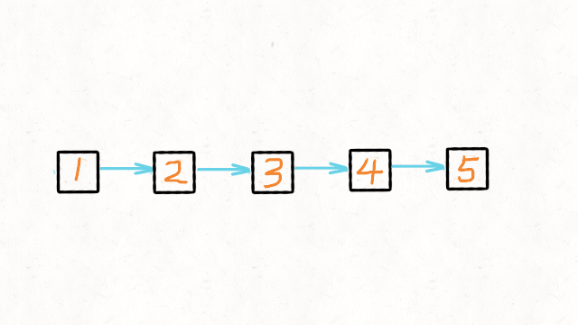

<!--more-->

## F1 - 146. LRU缓存机制

### 关键字

| 关键字                        | 对应信息                                    |
| ----------------------------- | ------------------------------------------- |
| 键值对                        |                                             |
| put 和 get 的时间复杂度为O(1) | 哈希表，而且可以通过 O(1) 时间通过键找到值  |
| 有出入顺序                    | 首先想到 栈，队列 和 链表。哈希表无固定顺序 |

### 补充

哈希链表 `LinkedHashMap` 直接满足要求

### 解题

+ 哈希表可以满足 O(1) 查找；

+ 链表有顺序之分，插入删除快，但是查找慢。

于是就有了哈希链表数据结构：


> **为什么使用双链表而不使用单链表？**
>
> 删除操作也可能发生在链表的中间位置。如果使用单链表，删除节点时需要额外找到被删除节点的前驱节点，这会增加时间复杂度。

> 哈希表中已经存了 `key`，为什么链表中还要存 `key` 和 `val` 呢，只存 `val` 不就行了？

## F2 - 206. 反转链表

### 解题

+ 方法一：双指针/三指针迭代


1. 初始化节点
   + pre 用来指向 cur 指针前一个节点。初始是 null，因为链表尾节点的下一节点是 null
   + cur 指向当前节点。初始是 head
   + tmp 用来指向 cur 节点的下一个节点。初始是 null
2. `while(cur!=null)`, tmp 指向 cur 节点的下一个节点；修改 cur.next = pre; pre 指向 cur 相当于后移一位；cur 指向 tmp 相当于后移一位

```java
class Solution {
	public ListNode reverseList(ListNode head) {
		ListNode pre = null;
		ListNode cur = head;
		ListNode tmp = null;
		while(cur!=null) {
			tmp = cur.next;
			cur.next = pre;
			pre = cur;
			cur = tmp;
		}
		return pre;
	}
}
```

+ 方法二：递归



```java
class Solution {
	public ListNode reverseList(ListNode head) {
		if(head==null || head.next==null) {
			return head;
		}
        //这里的cur就是最后一个节点
		ListNode cur = reverseList(head.next);
		head.next.next = head;
		head.next = null;
		return cur;
	}
}
```

+ 方法三：利用外部空间

先申请一个动态扩容的数组或者容器，比如 ArrayList 这样的。 然后不断遍历链表，将链表中的元素添加到这个容器中。 再利用容器自身的 API，反转整个容器，这样就达到反转的效果了。 最后同时遍历容器和链表，将链表中的值改为容器中的值。

## F3 - 3. 无重复字符的最长子串

### 关键字

| 关键字                           | 模式识别                                                     |
| -------------------------------- | ------------------------------------------------------------ |
| 重复字符（或者说`出现一次以上`） | 一旦涉及出现次数，需要用到**散列表**<br />构造子串，散列表存下标 |
| 子串                             | 涉及子串，考虑**滑动窗口**<br />- 滑动窗口就是窗口扩张和窗口收缩 |

### 解题


## F105 - 739. 每日温度

### 关键字

| 关键字                                                       | 模式识别                 |
| ------------------------------------------------------------ | ------------------------ |
| "下一个更大元素"<br />"下一个更小元素"<br />"连续子数组"<br />"某种最值" | 单调栈(通常是递增或递减) |

### 解题

+ 遍历每日温度，维护一个单调栈
  + 若栈为空或者当日温度<=栈顶温度则直接入栈
  + 反之 > 的话，说明栈顶元素的升温日找到，将栈顶元素出栈，计算两个日期相差的天数即可。
+ 栈里存日期还是存温度：要求的是升温的天数，而不是温度。所以栈中存下标而非温度

```java
class Solution {
    public int[] dailyTemperatures(int[] temperatures) {
        Deque<Integer> stack = new LinkedList<Integer>();
        int[] answer = new int[temperatures.length];
        for(int i = 0; i < temperatures.length; i++){
            while(!stack.isEmpty() && temperatures[i] > temperatures[stack.peek()]){
                int preHotDay = stack.pop();
                answer[preHotDay] =  i - preHotDay;
            }
            stack.push(i);
        }
        return answer;
    }
}
```

## F199 - 279. 完全平方数

### 关键字

| 关键字                                                 | 模式匹配 |
| ------------------------------------------------------ | -------- |
| 可以拆分成子问题解决<br />如 "从结果倒推" 的爬楼梯问题 | 动态规划 |


## 239
