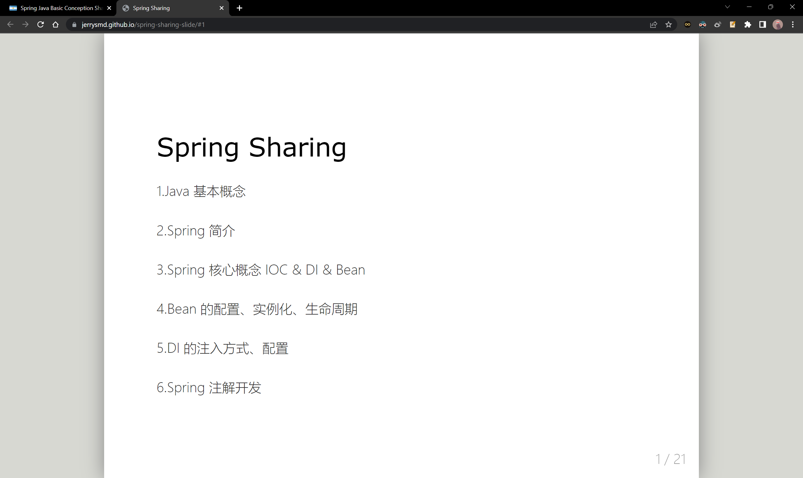
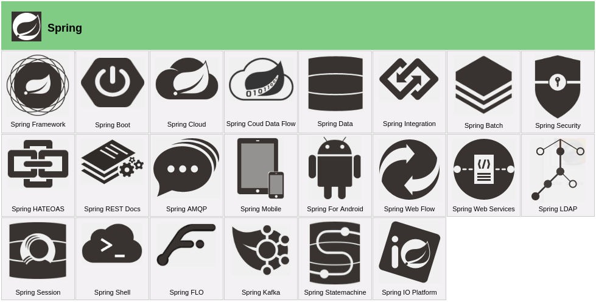
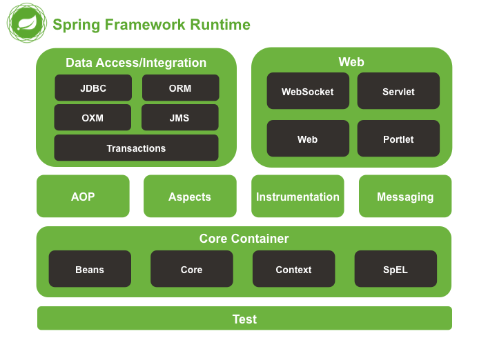

Spring makes programming Java quicker, easier, and safer. Spring’s focus on speed, simplicity, and productivity has made it the world's most popular Java framework. Spring works on microservices, reactive, cloud, web apps, serverless, event driven, and batch services.

<!--more-->



This is my <mark>Knowledge Transfer</mark> about **Java and Spring Basic Conception Sharing**.





And here is my live slide:

https://jerrysmd.github.io/spring-sharing-slide





---

# Spring Sharing

1.Java 基本概念

2.Spring 简介

3.Spring 核心概念 IOC & DI & Bean

4.Bean 的配置、实例化、生命周期

5.DI 的注入方式、配置

6.Spring 注解开发

---

## 1.Java 基本概念

**| 1.Java 基本概念**

Java 和 Python 都是<mark>面向对象</mark>编程语言，因此都有<mark>类和对象</mark>的概念

### 类

在 Java 和 Python 中，类都是通过`class`关键字定义的


Python：

```python
class Person:
    def __init__(self, name, age):
        self.name = name
        self.age = age

    def introduce(self):
        print("My name is " + self.name, end="")
        print("I am " + str(self.age) + "old.")
```


Java：

```java
public class Person {
    private String name;
    private int age;

    public Person(String name, int age) {
        this.name = name;
        this.age = age;
    }

    public void introduce() {
        System.out.print("My name is " + name);
        System.out.println("I am " + age + "old.");
    }
}
```


---

**| 1.Java 基本概念**

### 对象

在 Python 中，对象是通过类名调用构造函数创建的。在 Java 中，对象是通过 `new` 关键字创建的


Python：

```python
tom = Person("Tom", 25)
tom.introduce()
# 输出 "My name is Tom I am 25 old."
```


Java：

```java
*Person tom = new Person("Tom", 25);
tom.introduce();
// 输出 "My name is Tom I am 25 old."
```


---

**| 1.Java 基本概念**

### 继承和多态

Python 中的继承通过在类定义时指定父类来实现继承，多态在python中通过duck-typing来实现。

Java 也支持类的继承和多态，通过 extends 关键字来实现继承，通过重写方法来实现多态。 


Python：

```python
class Student(Person):
    def __init__(self, name, age, school):
        super().__init__(name, age)
        self.school = school

    def introduce(self):
        print("I am in " + self.school)
```


Java：

```java
public class Student extends Person {
    private String school;

    public Student(String name, int age, String school) {
        super(name, age);
        this.school = school;
    }

    @Override
    public void introduce() {
        System.out.println("I am in " + school);
    }
}
```


---

**| 1.Java 基本概念**

### 接口和实现

Java 中的接口和 Python 中的抽象类有相似之处，但是抽象类可以实现一些方法，而接口则不能。 接口可以被多个类实现，而抽象类只能被单一类继承

Java 中的接口负责定义一组方法，具体的方法实现由实现类来完成

```java
public interface BookDao {
    public void save();
}
```

```java
public class BookDaoImpl implements BookDao {
    
    public void save() {
        System.out.println("method");
    }
}
```


---

## 2.Spring 简介

**| 2.spring 简介** 

官网：[spring.io](https://spring.io/)

Spring 形成了一种开发的生态圈。Spring 提供了若干个项目，每个项目用于完成特定的功能




---

**| 2.spring 简介** 

spring framework 系统架构




---

## 3.Spring 核心概念 IOC & DI & Bean

**| 3.Spring 核心概念** 


业务层实现：

```java
public class ServiceImpl implements Service{
    private Dao dao = new DaoImpl();
    public void save(){
        dao.save();
    }
}
```


数据层实现：

```java
public class DaoImpl implements Dao{
    public void save(){
        System.out.println("method1");
    }
}

public class DaoImpl2 implements Dao{
    public void save(){
        System.out.println("method2");
    }
}
```


--

问题：耦合度偏高

--

解决思想：

+ 在使用对象时，在程序中不要主动使用 new 产生对象，转换为由`外部`提供对象
+ 对象的创建控制权由程序移到`外部`，这种思想称为 IoC（Inversion of Control）控制反转

**概念一：IoC（Inversion of Control）控制反转**


---

**| 3.Spring 核心概念** 

解决方案：

+ 在使用对象时，在程序中不要主动使用 new 产生对象，转换为由`外部`提供对象
+ 对象的创建控制权由程序移到`外部`，这种思想称为控制反转
+ IoC（Inversion of Control）控制反转

Spring 技术对 IoC 思想进行了实现

+ Spring 提供了一个容器，称为 <mark>IoC 容器 \ Spring 容器</mark>，用来充当 IoC 思想中的`外部`
+ 由主动 new 产生对象转化为由 IoC 容器提供对象

--

+ IoC 容器负责对象的创建、初始化等一系列工作，被创建或被管理的对象在 IoC 容器中统称为 <mark>Bean</mark>

**概念二：Spring Bean**

---

**| 3.Spring 核心概念** 


业务层实现：

```java
public class ServiceImpl implements Service{
    private Dao dao;
    public void save(){
        bookDao.save();
    }
}
```


数据层实现：

```java
public class DaoImpl implements Dao{
    public void save(){
        System.out.println("method");
    }
}
```

| ------------------------------------ IoC 容器 ------------------------------------ |
| :----------------------------------------------------------: |
|                           service                            |
|                             dao                              |


--

在容器中建立 bean 与 bean 之间的依赖关系的整个过程称为依赖注入

**概念三：DI（Dependency Injection）依赖注入**

---

**| 3.Spring 核心概念** 

目标：充分解耦

+ 使用 IoC 容器管理 bean (IoC)

+ 在 IoC 容器内将有依赖关系的 bean 进行关系绑定 (DI)

最终效果：

+ 使用对象时不仅可以直接从 IoC 容器中获取，并且获取到的 bean 已经绑定了所有的依赖关系

---

**| 3.Spring 核心概念** 

案例 demo：

IoC 问题：

+ 管理什么？（Service 和 Dao）
+ 如何将被管理的对象告知 IoC 容器？（配置）
+ 被管理的对象交给 IoC 容器，如何获取到 IoC 容器？（接口）
+ 如何从 IoC 容器中获取 bean？（接口方法）

DI 问题：

+ Service 中使用 new 形式创建的 Dao 对象是否保留？（否）
+ Service 中需要的 Dao 对象如何进入到 Service 中？（提供方法）
+ Service 与 Dao 间的关系如何描述？（配置）


---

## 4.Bean 的配置、实例化、生命周期

### | 4.Bean 的配置

| 类别     | 描述                                                         |
| -------- | :----------------------------------------------------------- |
| 名称     | bean                                                         |
| 功能     | 定义Spring核心容器管理的对象                                 |
| 格式     | ` <beans>`<br/>`<bean></bean>`<br>`</beans>`                 |
| 属性列表 | id：bean的id，使用容器可以通过id值过去对应的bean，在一个容器中id值唯一<br>class：bean的类型，即配置的bean的全路径类名 |
| 范例     | `<bean id="bookDao" class="dao.impl.BookDaoImpl"/>`<br>`<bean id="bookService" class="service.impl.BookServiceImpl"></bean>` |


---

### | 4.Bean 的实例化 

>1.提供可访问的构造方法（常用）
>
>```java
>public class BookDaoImpl implements BookDao{
>    public BookDaoImpl(){
>        print("book constructor is running");
>    }
>    public void save(){
>        print("book dao save");
>    }
>}
>```
>
>+ 配置
>
>```xml
><bean id="bookDao" class="com.jerry.dao.impl.BookDaoImpl"></bean>
>```
>


> **2.静态工厂**
>
> ```java
> public class OrderDaoFactory{
>     public static OrderDao getOrderDao(){
>         return new OrderDaoImpl();
>     }
> }
> ```
>
> + 配置
>
> ```xml
> <bean id="orderDao" class="com.jerry.factory.OrderDaoFactory" factory-method="getOrderDao"></bean>
> ```
>
> + 使用
>
> ```java
> main(){
>     UserDaoFactory userDaoFactory = new UserDaoFactory();
>     UserDao userDao = userDaoFactory.getUserDao();
>     userDao.save();
> }
> ```
>
> 


> **3.实例工厂**
>
> ```java
> public class UserDaoFactory{
>     public UserDao getUserDao(){
>         return new UserDaoImpl();
>     }
> }
> ```
>
> + 配置
>
> ```xml
> <bean id="userFactory" class="com.jerry.factory.UserDaoFactory"></bean>
> <bean id="userDao" factory-method="getUserDao" factory-bean="userFactory"></bean>
> ```
>
> 

  

> **4.FactoryBean** 
>
>   ```java
> public class UserDaoFactoryBean implements FactoryBean<UserDao>{
>     //代替原始实例工厂中创建对象的方法
>     public UserDao getObject() throws Exception{
>         return new UserDaoImpl();
>     }
>     public Class<?> getObjectType(){
>         return UserDao.class;
>     }
>     public boolean isSingleton(){
>         return true;
>     }
> }
>   ```
>
> + 配置
>
> ```xml
> <bean id="userDao" class="com.jerry.factory.UserDaoFactoryBean"></bean>
> ```
>
>   

 

---


### | 4.Bean 的生命周期

bean 的生命周期：bean 从创建到销毁的整体过程

bean 的生命周期控制方法：

+ bean 的初始化
+ bean 的销毁

--


`第一步：初始化容器`

1. 创建对象，内存分配
2. 执行构造方法
3. 执行属性注入
4. **执行 bean 初始化方法**


`第二步：使用 bean`

1. 执行业务操作

`第三步：关闭容器`

1. **执行  bean 销毁方法**


---

### | 4.Bean 的配置总结

bean 配置大全

```xml
<bean
      id="bookDao"
      name="dao bookDaoImpl daoImpl"
      class="com.example.dao.impl.BookDaoImpl"
      scope="singleton"
      init-method="init"
      destroy-method="destory"
      autowire="byType"
      factory-method="getInstance"
      factory-bean="com.example.factory.BookDaoFactory"
      lazy-init="true"
      />
```


---

## 5.DI 的注入方式、配置

### | 5.DI 的注入方式 -  之 setter 注入

+ 在 bean 中定义引用类型属性并提供可访问的 set 方法

  ```java
  public class BookServiceImpl implements BookService {
      private BookDao bookDao;
      public void setBookDao(BookDao bookDao){
          this.bookDao = bookDao;
      }
  }
  ```

+ 配置中使用 property 标签 `ref` 属性注入<mark>引用类型对象</mark>

+ 配置中使用 property 标签 `value` 属性注入<mark>简单数据类型</mark>

  ```xml
  <bean id="bookDao" class="com.jerry.dao.impl.BookDaoImpl"/>
  <bean id="bookService" class="com.jerry.service.impl.BookServiceImpl">
      <property name="bookDao" ref="bookDao"/>
      <property name="connectionNum" value="10"/>
  </bean>
  ```


---

### | 5.DI 的注入方式 -  之 构造器注入


+ 在 bean 中定义引用类型属性并提供可访问的`构造`方法

  ```java
  public class BookServiceImpl implements BookService {
      private BookDao bookDao;
      public BookServiceImpl(BookDao bookDao){
          this.bookDao = bookDao;
      }
  }
  ```

+ 配置中使用 constructor-arg 标签 `ref` 属性注入<mark>引用类型对象</mark>

+ 配置中使用 constructor-arg 标签 `value` 属性注入<mark>简单数据类型</mark>

  ```xml
  <bean id="bookDao" class="com.jerry.dao.impl.BookDaoImpl"/>
  <bean id="bookService" class="com.jerry.service.impl.BookServiceImpl">
      <constructor-arg name="bookDao" ref="bookDao"/>
      <constructor-arg name="connectionNum" value="10"/>
  </bean>
  ```


---

### | 5.DI 的配置总结

注入依赖 配置大全

```xml
<bean id="bookDao" class="com.example.dao.impl.BookDaoImpl">
    <constructor-arg name="bookDao" ref="bookDao"/>
    <constructor-arg name="msg" value="WARN"/>
    <constructor-arg index="3" value="WARN"/>
    <property name="bookDao" ref="bookDao"/>
    <property name="msg" ref="WARN"/>
    <property name="names">
        <list>
            <value>example</value>
            <ref bean="dataSource"/>
        </list>
    </property>
</bean>
```


---

## 6.Spring 注解开发


**| 6.注解**

目的：简化开发

**使用注解定义 bean：**

+ 使用 @Component("bookDao")定义bean

  ```java
  @Component("bookDao")
  public class BookDaoImpl implements BookDao {}
  
  @Component("bookService")
  public class BookServiceImpl implements BookService {}
  ```

+ 核心配置文件中通过组件扫描加载 bean

  ```xml
  <context:component-scan base-package="com.example"/>
  ```

---

### | 6.注解

**使用注释依赖注入：**

+ 使用 @Autowired 注解开启自动装配模式（按类型）

  ```java
  @Component("bookService")
  public class BookServiceImpl implements BookService {
      @Autowired
      private BookDao bookDao;
  
      @Override
      public void save(){
          System.out.println("service save running...");
          bookDao.save();
      }
  
      //public void setBookDao(BookDao bookDao) {
      //    this.bookDao = bookDao;
      //}
  }
  ```

  

---

### | 6.注解 - XML 配置对比注解配置


| 功能- - - - - - - - - - - - - - - - | XML 配置- - - - - - - - - - - - - - - - - - - - - - - -      | 注解- - - - - - - - - - - - - - - - - - - - - - - -          |
| :---------------------------------: | ------------------------------------------------------------ | ------------------------------------------------------------ |
|              定义 bean              | bean 标签<br />- id 属性<br />- class 属性                   | @Component<br />- @Controller<br />- @Service <br />- @Repository<br />@ComponentScan |
|            设置依赖注入             | setter 注入（set 方法）<br />- 引用 / 简单<br />构造器注入（构造方法）<br />- 引用 / 简单<br />自动装配 | @Autowired <br />- @Qualifier<br />@Value                    |
|           配置第三方 bean           | bean 标签<br />静态工厂、实例工厂、FactoryBean               | @Bean                                                        |
|              作用范围               | scope 属性                                                   | @Scope                                                       |
|              生命周期               | 标准接口<br />- init-method<br />- destroy-method            | @PostConstructor<br />@PreDestroy                            |

