This article delves into advanced techniques and best practices for using Maven, a popular build automation tool for Java projects. Topics covered include module development and design, dependency management, aggregation and inheritance, property management, and multi-environment configuration and deployment. Whether you're a seasoned Maven user or just getting started, this article will provide valuable insights to streamline your development process and improve your project's overall quality.

<!--more-->

## 分模块开发与设计

### 分模块开发意义

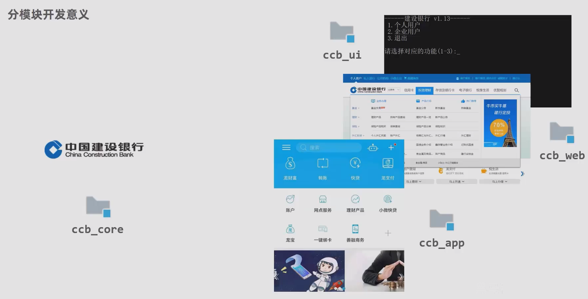

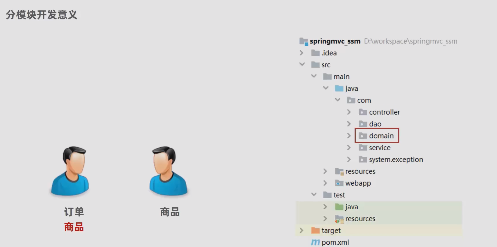

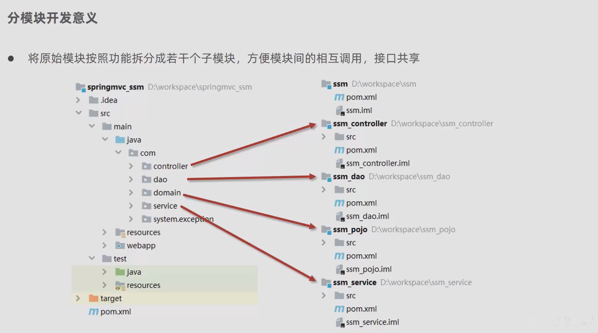

### 分模块开发与设计

#### 目前 SSM 目录

+ 📂src.main.java.com.jerry
  + 📂config
    + ☕JdbcConfig
    + ☕MyBatisConfig
    + ☕ServletConfig
    + ☕SpringConfig
    + ☕SpringMvcConfig
    + ☕SpringMvcSupport
  + 📂controller
    + ☕BookController
    + ☕Code
    + ☕ProjectExceptionAdvice
    + ☕Result
  + 📂dao
    + 📂impl
    + ☕BookDao
  + 📂domain
    + ☕Book
  + 📂exception
  + 📂service
    + 📂impl
    + ☕BookService

#### 分模块需求

业务扩张，domain 需要拆分成新的 Module

(所有的功能都可以拆分成新 Module，这里以 domain 为例)

#### 分模块步骤

1. 创建新的 Pojo Module, 并将 **SSM Module** 的 domain 文件迁移到新 **Pojo Module**

   + Pojo(Plain Old Java Object): 轻量级的 Java Bean，通常只包含私有属性、getter 和 setter 方法以及无参构造函数
   + 在 SSM 架构中，通常将 POJO 用作数据传输对象（DTO）或持久化对象（PO）
   + 与 POJO 相对应的是领域对象（domain object），也称为实体对象（entity），它代表应用程序的业务实体，通常包含业务逻辑和状态信息 

2. 此时 SSM 项目在所有用到 domain 对象的地方都报错，如：`public boolean save(Book book)`, 需要在 SSM Module 的 pom 文件中引入 Pojo Module

   + 在 SSM pom 文件中引入 Pojo 作为依赖

     ```xml
     <!--SSM pom 依赖-->
     <dependency>
         <groupId>com.jerry</groupId>
         <artifactId>pojo_module</artifactId>
         <version>1.0-SNAPSHOT</version>
     </dependency>
     ```

## 依赖管理

### 依赖传递

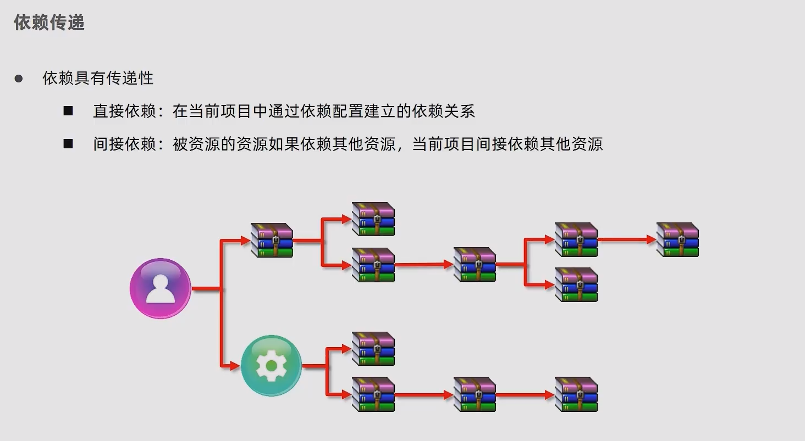

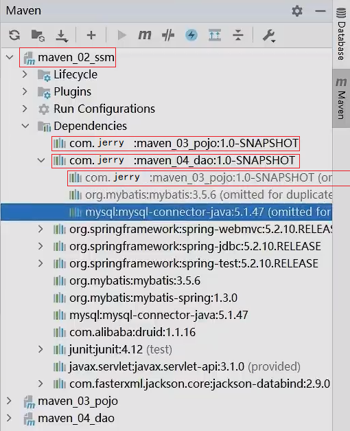

+ 目前项目中，在 SSM，Pojo 和 Dao 三个Module POM 文件中，SSM 依赖了 Pojo 和 Dao
+ 而 Dao 本身也依赖了 Pojo
+ 根据依赖传递，SSM POM 文件中可以不写 Pojo 依赖

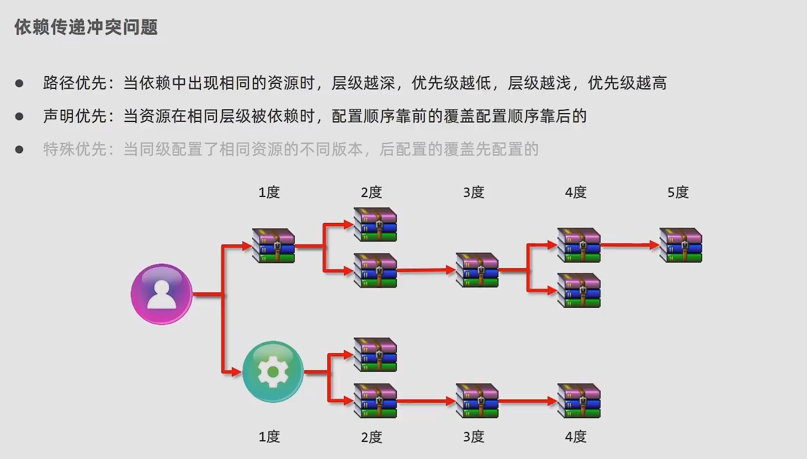

### 可选依赖

+ 可选依赖指对外隐藏当前所依赖的资源 - **不透明**

```xml
<dependency>
    <groupId>com.jerry</groupId>
    <artifactId>pojo_module</artifactId>
    <version>1.0-SNAPSHOT</version>
    <!--可选依赖是隐藏当前工程所依赖的资源，隐藏后对应资源将不具有依赖传递-->
    <optional>true</optional>
</dependency>
```

### 排除依赖

+ 排除依赖指主动断开依赖的资源，被排除的资源无需指定版本 - **不需要**

```xml
<dependency>
    <groupId>com.jerry</groupId>
    <artifactId>dao_module</artifactId>
    <version>1.0-SNAPSHOT</version>
    <!--排除依赖是隐藏当前资源对应的依赖关系-->
    <exclusions>
        <exclusion>
            <groupId>log4j</groupId>
            <artifactId>log4j</artifactId>
        </exclusion>
    </exclusions>
</dependency>
```

## 聚合与继承

### 聚合

原始 Module 之间关系，各维护各的，当 Pojo Module 更新时，其他 Module 并没有感知

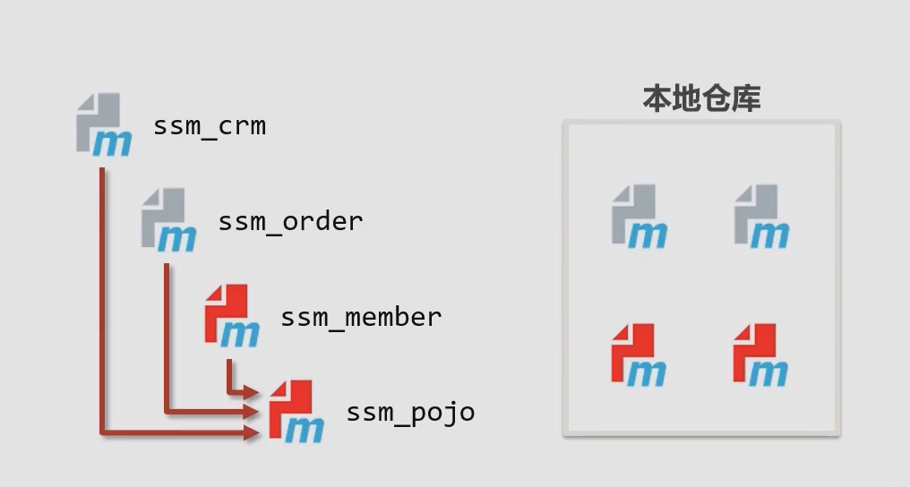

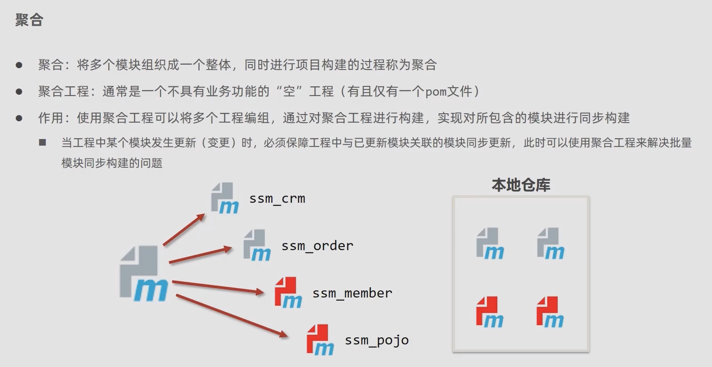

> 聚合后的 Module 结构:

+ maven_01_parent(root)
+ maven_02_ssm
+ maven_03_pojo
+ maven_04_dao

> 聚合工程的开发步骤

+ 步骤1 创建 Maven 模块，设置打包类型为 pom，(maven 工程打包方式默认为 jar, web 工程打包方式为 war)
+ 步骤2 设置当前聚合工程所包含的子模块名称

```xml
<groupId>com.jerry</groupId>
<artifactId>maven_01_parent</artifactId>
<version>1.0-SNAPSHOT</version>
<!--最大的区别的是打包方式，pom 表示这是一个聚合工程-->
<packaging>pom</packaging>

<!--设置管理的模块名称-->
<modules>
    <!--不管写什么顺序，complie 时会按照依赖顺序的 complie-->
    <module>../maven_02_ssm</module>
    <module>../maven_03_pojo</module>
    <module>../maven_04_dao</module>
</modules>
```

### 继承

+ 问题1 模块依赖重复能不能简化
+ 问题2 如何快速升级所有模块依赖版本

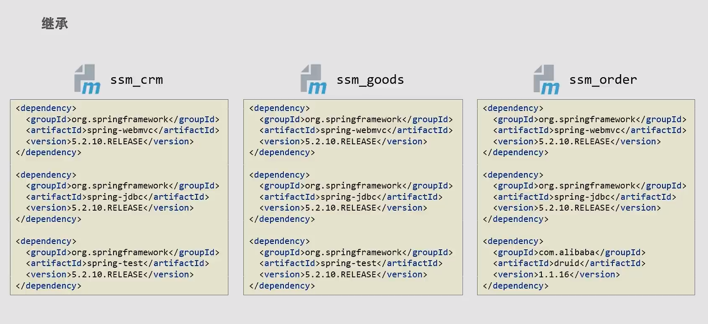

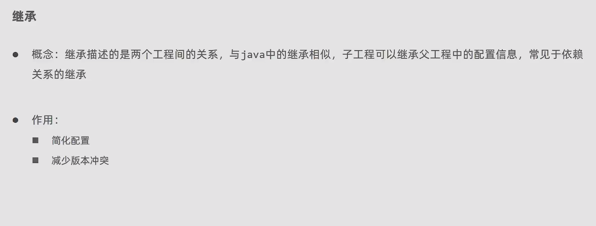

> 继承工程的开发步骤

+ 步骤1 创建 Maven 模块，设置打包类型为 pom，(maven 工程打包方式默认为 jar, web 工程打包方式为 war)

  ```xml
  <packaging>pom</packaging>
  ```

+ 步骤2 在父工程的 pom 文件中配置依赖关系（子工程将沿用父工程中的依赖关系）

  ```xml
  <dependencies>
      <dependency>
          <groupId>org.springframework</groupId>
          <artifactId>spring-webmvc</artifactId>
          <version>5.2.10.RELEASE</version>
      </dependency>
      ...
  </dependencies>
  ```

+ 步骤3 在父工程的 pom 文件中配置子工程中可选的依赖

  ```xml
  <dependencyManagement>
      <dependencies>
          <dependency>
              <groupId>com.alibaba</groupId>
              <arrifactId>druid</arrifactId>
              <version>1.1.16</version>
          </dependency>
          ...
      </dependencies>
  </dependencyManagement>
  ```

+ 步骤4 在子工程中配置当前工程所继承的父工程

  ```xml
  <parent>
      <groupId>com.jerry</groupId>
  	<artifactId>maven_01_parent</artifactId>
  	<version>1.0-SNAPSHOT</version>
      <relativePath>../maven_parent/pom.xml</relativePath>
  </parent>
  ```

+ 步骤5 在子工程中配置使用父工程中的可选依赖的坐标，（只配群组 id 和项目 id，无需提供版本，版本由父工程统一提供）

  ```xml
  <dependencies>
      <dependency>
          <groupId>com.alibaba</groupId>
          <arrifactId>druid</arrifactId>
      </dependency>
  </dependencies>
  ```

### 聚合和继承的区别

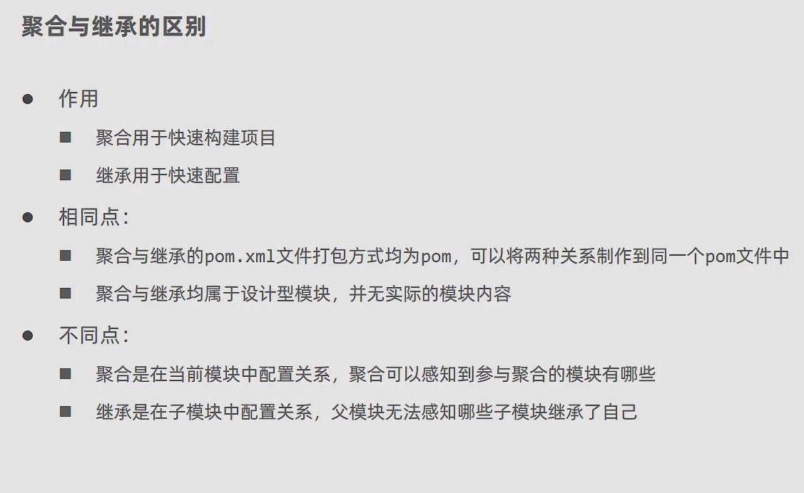

## 属性管理

## 多环境配置与应用

## 私服
