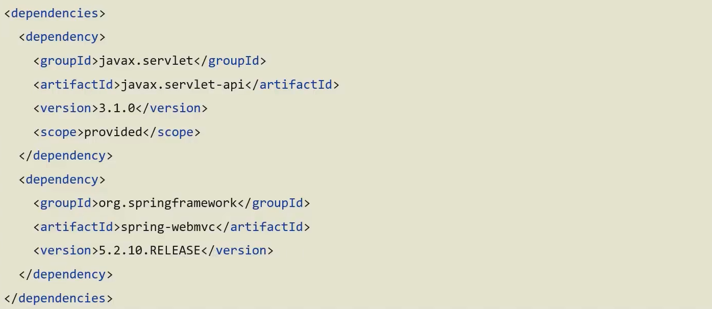
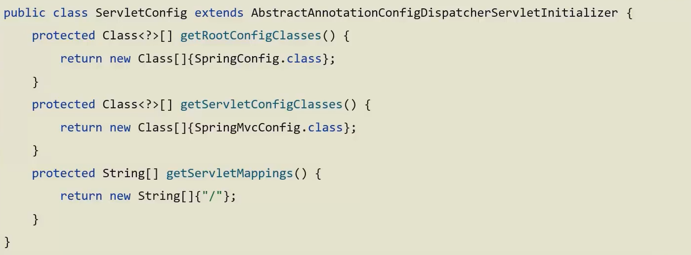
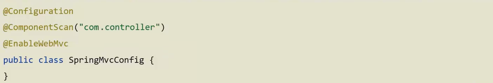
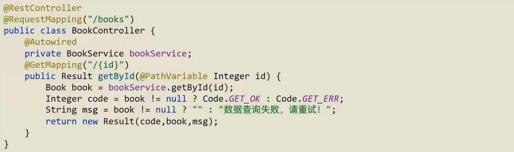
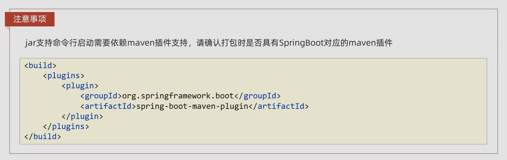

Spring Boot makes it easy to create stand-alone, production-grade Spring based Applications that you can "just run". Spring Boot takes an opinionated view of building production-ready Spring applications. Favors convention over configuration and is designed to get you up and running as quickly as possible.

<!--more-->

## Incremental Example

### 开发过程对比

+ 原生开发 SpringMVC 程序过程

   

1. 依赖最基本的 API

2. WEB 3.0 的配置类

   

3. Spring 的配置类

   

4. 开发 Controller 类

   



+ Spring boot 开发程序过程

   

1. Spring Initializr 创建项目

2. 开发 Controller 类。运行自动生成的 Application 类

   



### 程序对比

Spring 程序与 SpringBoot 程序对比

|       类 / 配置文件       |  Spring  | SpringBoot |
| :-----------------------: | :------: | :--------: |
|         pom 坐标          | 手工添加 |  勾选添加  |
|      web 3.0 配置类       | 手工制作 |     无     |
| Spring / SpringMVC 配置类 | 手工制作 |     无     |
|          控制器           | 手工制作 |  手工制作  |

### SpringBoot 项目快速启动

+ 第一步：对 Boot 项目打包，执行 Maven 构建指令 package

+ 第二步：执行启动指令

  `java -jar springboot.jar`

