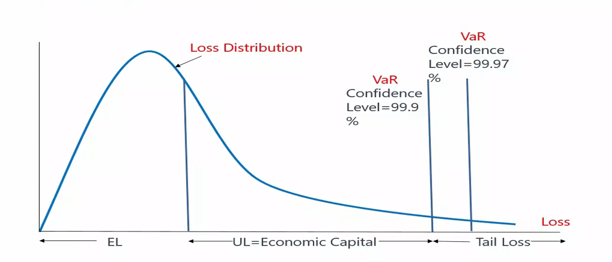
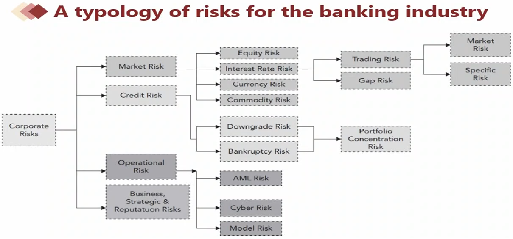

The Fundamentals of Risk Management is Chapter 1 of Part 1 for the FRM exam. This chapter primarily covers the foundational knowledge, theories and best practices related to the subject of risk management.

<!--more-->

## Basic Sense of Risks and Management
### What Is Risk?

+ **Possibility of the bad things that might happen:**
  + It exists everywhere and anytime,we will focus on the financial world.
  + But it is not always a bad thing
    + **Good risk**: Risks that have a **positive expected payoff** on a stand-alone basis.
    + **Bad risk**: Risks that can be **expected to destroy value** on a stand alone basis.
    + Banks and other financial institutions c**annot succeed without taking risks.**

### What Is Risk Management?

+ **Risk management**: how firms actively select the types and levels of risks that are appropriate for them to take.
+ **Risk management and risk taking aren't opposites, but two sides of the same coin.**
  + Together they drive all our modern economies.
  + It's all about making forward-looking choices about risk in relation to reward.

### Is Risk Management Useful?

+ **Challenges for risk management** 
  + Fail to prevent market disruptions or **accounting scandals**
  + **Derivative** markets make it easier to take on large amount of risk.
  + Sophisticated financial engineering leads to the violent implosion of-firms.
  + Only **transfer** risks to other firms
    + Risk management is a zero-sum game
  + Work to the short-term benefit.

### Risk Management Process

1. Identify the risk
2. Analyze and measure risk
3. Assess the effects of all risk, and balance between risk and reward
4. Manage the risk using different kind of tools

### Identify the risk

+ There are things we know that we know.
+ There are known unknowns... But there are also unknown unknowns.

### Analyze and measure risk

+ **Quantitative Risk Measures**
  + VaR(Value at risk)
    + Developed by Dennis Weatherstone,CEO of J.P. Morgan
    + VaR uses the loss distribution associated with a position or portfolio to estimate losses at a given level of likelihood (or confidence).
      + E.g. a one day 99% **confidence level**（置信水平） VaR of USD 1 million
+ **Qualitative Risk Measures**
  + Scenario analysis
  + Stress testing

### Tail Risk

+ Some credit portfolios, however exhibit a much moreextreme variance in their losses over `longer intervals of time`(e.g., a decade). 
+ **From the crisis lesson, we focus on the tail risk beyond confidence level which cannot be explained by VaR.**
  + *Extreme value theory*(EVT)（FRM Part2 内容） focuses on tail distribution to understand the black swans 
  + *Expected shortfall*（指所有极端值的平均数） is the EL of tail distribution

### Expected Loss(EL)

+ EL is the average loss expected to incur from a position or a portfolio. It can be estimated by historical data of a period of time. 
  + It can be treated as a predictable expense rather than a risk or
    uncertainty
+  In the case of the credit risk of a loan: 
  + EL=EAD x LGD x PD (part1 估值与风险建模 会重讲)
    + PD: Probability of default 
    + EAD: Exposure amount at default 
    + LGD: Loss given default
+ EL is often **priced into the product directly.**

### Unexpected Loss(UL)

+ On a bad day, losses can range above the expected level. **Unexpected loss is the surprising loss that above the EL in bad days.**
  + Value at risk (VaR) uses the loss distribution to estimate losses at a given level of likelihood(confidence). 
  + UL= VaR - EL (Unexpected loss is the surprising loss that above the EL in bad days)
  + **Economic capital**(usually called risk capital) is the amount of liquid -
    capital used to cover unexpected loss. 
+ **Correlation risk**,where unfavorable events happen together, will drive potential losses to unexpected levels. 
+ In practice, **concentration** makes the probability of multiple losses high for a portfolio. As a result, we need more capital to cover the UL.

### Balance Between Risk and Reward 

+ There is a natural trade-off between risk and reward: the more risk takes, the more potential reward is earned. 
+ However, there are challenges. 
  1. Conflicts between EL and UL, can be solved by **RAROC**
     + Risk adjusted return on capital(RAROC)=after-tax risk-adjusted expected return(EL is subtracted)/economic capital
  2. Correlation between risk factors is changing
  3. Conflicts of interests among different units, can be solved by **three lines of defense**：
     1. business line that generates,owns, and manages risk;
     2. risk managers implement day-to-day oversight;
     3. periodic independent oversight and assurance, such as internal audit

### Example 1

> Tail risk techniques are dealt by:
>
> - [x] A. Extreme value Theory
>
> - [ ] B. VaR Theory
>
> - [ ] C. Probably of Default Theory
>
> - [ ] D. Standard deviation

## Basic Risk Types

### Typology of Risk Exposures

1. Market Risk

> + **Market risk(市场风险) is the risk that changes in financial market prices（金融产品发生变化就是市场风险） and rates will reduce the value of a security or a portfolio.** 
>   + Equity price risk （股票价格风险）
>   + Interest rate risk （利率风险）
>   + Currency (Foreign exchange) risk （外汇风险） 
>   + Commodity price risk （大宗商品风险）
> + **Market risk is driven by:** 
>   + General market risk (systematic risk)（系统性风险）
>   + Specific risk (idiosyncratic risk)（个体风险/非系统性风险）

2. Credit Risk

> + **Credit risk**: It arises from the failure of one party to fulfill its financial obligations to another party（一方没有对另一方尽到义务）. Some examples of credit risk include
>   + A debtor fails to pay interest or principal on a loan(**bankruptcy risk**)（翻译违约风险而不是倒闭风险）
>   + An obliger or counterparty is downgraded(**downgrade risk**),indicating an increase in risk that may lead to an immediate loss in value of a credit-linked security; and 
>   + A counterparty to a market trade fails to perform (counterparty risk) including **settlement** or **Herstatt risk**. (结算风险)

3. Liquidity Risk (特别针对于银行)

> + **Funding Liquidity Risk**: a firm's ability to raise the necessary cash to roll over its debt; to meet the cash requirements,the margin requirements, and the collateral requirements; and to satisfy the need of capital withdrawals. (还钱时没钱)
> + **Market (Trading) Liquidity Risk**: an institution will not be able to execute a transaction at the prevailing market price because there is temporarily no appetite for the deal on the other side of the market. (交易需打折)

4. Operational Risk

> + Operational Risk refers to potential losses resulting from inadequate or failed internal processes, **people, and systems** or from external events.
>   + It includes **legal risk**(诉讼风险), *but excludes* **business, strategic and reputational risk.**
>     + **Legal risk**: the potential for litigation to create uncertainty for a firm.
>     + **Regulatory risk**: the uncertainty actions by governmental entity
>   + Under broad definition,it includes everything from
>     + anti-money laundering risk, (AML Risk 反洗钱)
>     + cyber risk to risks of terrorist attacks, 
>     + rogue trading, 
>     + model risk: The risk of potential indirect costs of relying on models

5. Business, Strategic and Reputation Risk

> + **Business Risk**: lies at the heart of any business and includes all the usual worries of firms, such as **customer demands,pricing decisions, supplier negotiations, and product innovation management.** (错误预估需求、错误定价，协商失败 等等导致亏损，但不能称之为 Risk，很多时候只能归类到 “Unknown Unknowns” 和 “Unknown Unknowns”)
> + **Strategic Risk**: involves making critical,long-term decisions about the firm's direction, often accompanied by major investments of capital, human resources, etc. 
> + **Reputation Risk**: the danger that a firm will suffer a sudden fall in its market standing or brand with economic consequences. (known Unknowns)

### Risk Aggregation

+ Given the many different types of risk and risk metrics, a key problem in risk management is the challenge of seeing the bigger picture, also called **risk aggregation.** 
  + One challenge occurs when one single risk factor could ultimately spill over many kinds of risks, which will increase correlations 
    + This is dangerous with UL.
  + Another challenge occurs when aggregating different risks at enterprise level. 
    + Different risks have different **characteristics**, such as loss
      distributions.

### Example 1

> Operational risk includes:
>
> - [ ] A. counterparty risk
> - [x] B. cyber risk
> - [ ] C. reputation risk
> - [ ] D. business risk

## How Do Firms Manage Financial Risk

### Risk Management Strategies

+ **Make four basic choices in risk management** 
  1. **Avoid** or undertake risk 
  2. Whether **transfer** risk to third parties 
  3. **Mitigate** risk or not 
  4. **Assume**(keep) or not assume risk
+ **Before making the choice, a risk appetite(口味) must be determined.**

### Risk Appetite

+ **Risk appetite** describes the amount and types of risk a firm is willing to accept. This is in contrast to risk capacity,which describes the maximum amount of risk a firm can absorb

+ Note
  + Capacity: 真正能力上限, 由客观事实决定
  + Risk Appetite: 最大容忍风险，董事会决定
  + Profile: Current level，由 CRO 决定

+ **Issues related with risk appetite**
  + The **board**(董事会) must characterize an appropriate "risk appetite"for the firm 
  + Be connected to a firm's overall **business strategy and capital plan**. 
  + **Clear communication throughout the firm** of the firm's risk appetite and risk position. 
  + Effective risk management program should be consistent with fundamental strategic and risk appetite choices. 
  + Risk appetites can be expressed in a number of ways,including **quantitative and qualitative**（定量和定性） statements. 
  + Banks have to choose their level of risk subject to **external constraints**

## Risk Management Tools

+ **Risk Limits**
  + Limits vary by the nature of the risk, the competitive positioning of the firm,and the span of its activities
  + Practically speaking, these limits should be designed such that the probability of exceeding them during the normal situation of business is low.
+ **Derivatives**
  + In many cases,the risk manager will decide to **transfer** a portion of a financial risk to the risk management markets. 
  + The use of these instruments requires firms to make key decisions based on their **specific needs**

Risk Limits:

| Limit                        | Nature                                                       | Example Weakness                                             |
| ---------------------------- | ------------------------------------------------------------ | ------------------------------------------------------------ |
| Stop Loss Limits 止损点 | Loss threshold and associated action (e.g. close out, escalation) | Will not prevent future exposure, only limit realized losses. |
| Notional Limits              | Notional size of exposure                                    | Notional amount may not be strongly related to economic risk of derivative instruments, especially options |
| Risk Specific Limits         | Limits referencing some special feature of risk in question (e.g. liquidity ratios for liquidity risk) | These limits are difficult to aggregate; may require specialized knowledge to interpret. |

