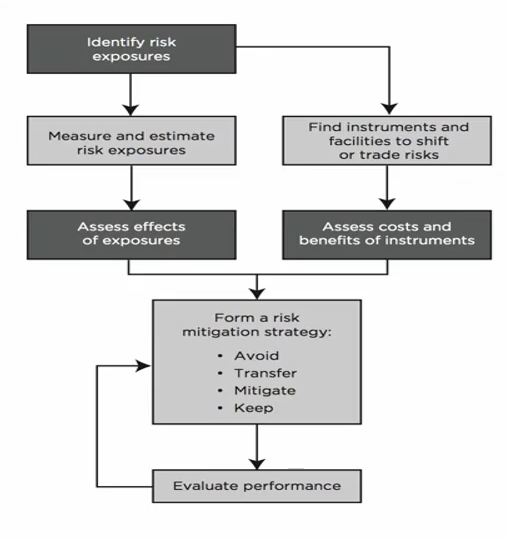
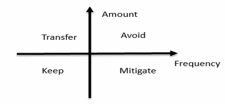
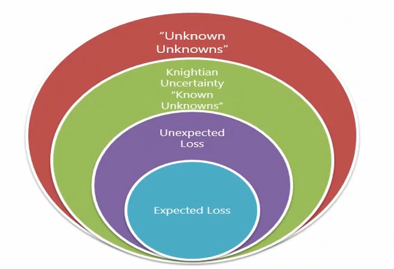

The Fundamentals of Risk Management is Chapter 1 of Part 1 for the FRM exam. This chapter primarily covers the foundational knowledge, theories and best practices related to the subject of risk management.

<!--more-->

## Basic Sense of Risks and Management
### What Is Risk?

+ **Possibility of the bad things that might happen:**
  + It exists everywhere and anytime,we will focus on the financial world.
  + But it is not always a bad thing
    + **Good risk**: Risks that have a **positive expected payoff** on a stand-alone basis.
    + **Bad risk**: Risks that can be **expected to destroy value** on a stand alone basis.
    + Banks and other financial institutions c**annot succeed without taking risks.**

### What Is Risk Management?

+ **Risk management**: how firms actively select the types and levels of risks that are appropriate for them to take.
+ **Risk management and risk taking aren't opposites, but two sides of the same coin.**
  + Together they drive all our modern economies.
  + It's all about making forward-looking choices about risk in relation to reward.

### Is Risk Management Useful?

+ **Challenges for risk management** 
  + Fail to prevent market disruptions or **accounting scandals**
  + **Derivative** markets make it easier to take on large amount of risk.
  + Sophisticated financial engineering leads to the violent implosion of-firms.
  + Only **transfer** risks to other firms
    + Risk management is a zero-sum game
  + Work to the short-term benefit.

### Risk Management Process

1. Identify the risk
2. Analyze and measure risk
3. Assess the effects of all risk, and balance between risk and reward
4. Manage the risk using different kind of tools

### Identify the risk

+ There are things we know that we know.
+ There are known unknowns... But there are also unknown unknowns.

### Analyze and measure risk

+ Quantitative Risk Measures
  + VaR(Value at risk)
    + Developed by Dennis Weatherstone,CEO of J.P.Morgan
    + VaR uses the loss distribution associated with a position or portfolio to estimate losses at a given level of likelihood (or confidence).
      + E.g. a one day 99% confidence level VaR of USD 1 million
+ Qualitative Risk Measures
  + Scenario analysis
  + Stress testing
