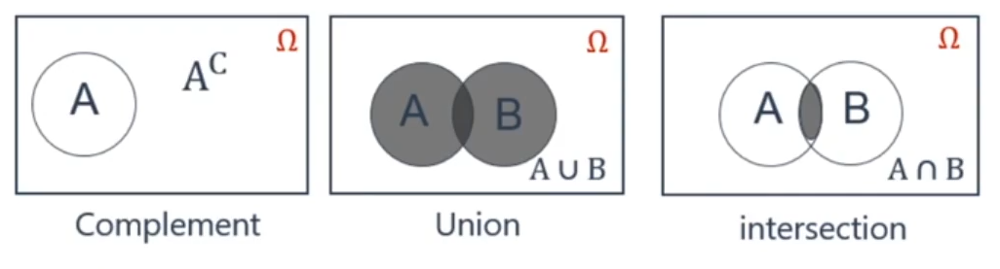

The Quantitative Analysis is Chapter 2 of Part 1 for the FRM exam. This chapter primarily covers probability and statistics, hypothesis testing and estimation, time series analysis, risk management and portfolio management, and derivatives and risk models.

<!--more-->

  ## Probability Theory

### Fundamentals of Probability

> 1. 三个概率：条件概率，非条件概率，联合概率
> 2. 三个事件：互斥事件，独立事件，条件独立事件
> 3. 两个公式：全概率，贝叶斯

+ **Random experiment** 
  + An observation or measurement process with **multiple but uncertain** outcomes 
+ **Sample Space**  
  + A set **containing all possible outcomes** of an experiment.
     E.g., the sample space of a rolling a single six-sided die is {1,2 ..., 6}. 
+ **Events**
  + Subsets of sample space , i.e., a set of outcomes and may contain one - or more of the values in the sample space , or it may even contain no elements. 
+ **Event Space**  
  
  + The event space consists of all combinations of outcomes
  
+ **Venn Diagrams**

  

  补集

  并集： P(A U B) = P(A + B) = P(A or B)

  交集：P(A ∩ B) = P(AB) = P(A and B)

+ **Mutually exclusive events**

  + Events that cannot both happen at the same time.

+ **Axioms of Probability**

  + Any event A in the event space has P(A)≥0 or Pr(A)≥0
  + The probability of all events in sample space is 1
  + If events A1 and A2 are mutually exclusive, P(A1 ∪ A2)=P(A1)+P(A2)

+ Extensions

  + The probability of an event or its complement must be 1

    $P(A∪A^c)=P(A)+P(A^C)=1$

  + The probability of the union of any two sets can be decomposed into:

    $P(A∪B)=P(A)+P(B)-P(A∩B)$

    $P(A+B)=P(A)+P(B)-P(AB)$

    $P(A or B)=P(A)+P(B)-P(A and B)$

### Conditional probability

+ **Unconditional Probability(Marginal Probability)** (非条件概率 或 边际概率：一件事发生不受其他因素影响)

  + The probability of an event without any restrictions (or lacking any prior information), commonly know as P(A)

+ **Conditional Probability**

  + The probability on condition that another event occurs first. The conditional probability of event B, conditional on Event A, is given by

    $P(B|A)=\frac{P(A ∩ B)}{P(A)}; P(A) >$

### Random Variables

### Common Univariate Random Distributions

###  Multivariate Random Variables

###  Sample Moments

## Mathematical Statistics

### Hypothesis Testing

### Linear Regression

### Regression with Multiple Explanatory Variables

### Regression Diagnostics

## Time Series

### Stationary Time Series

### Non-Stationary Time Series

### Measuring Returns,Volatility, and Correlation 

### Simulation Methods

## Machine Learning

### Machine-Learning Methods

### Machine Learning and Prediction
