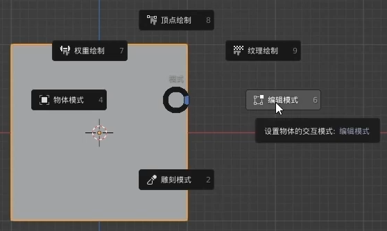
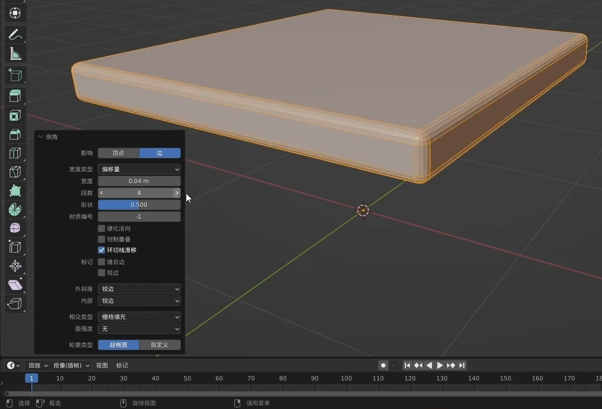
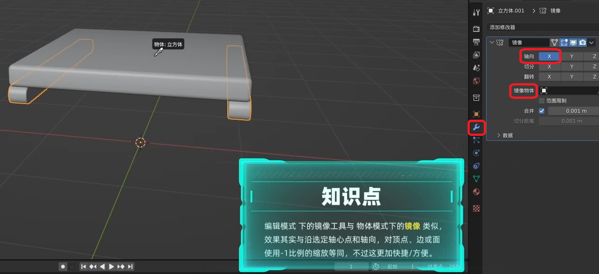
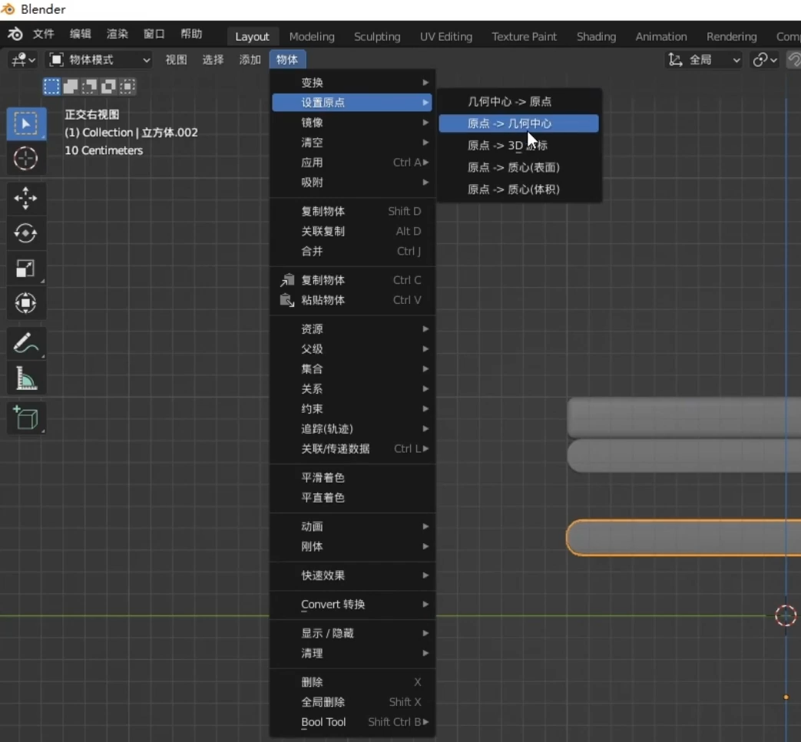

Blender is the free and open source 3D creation suite. It supports the entirety of the 3D pipeline—modeling, rigging, animation, simulation, rendering, compositing and motion tracking, even video editing and game creation.

<!--more-->

## Interface and Tool Operations

### Common Techniques

+ View Editing
  + Move view: `Shit` + `middle mouse button`
  + Rotate view: `Middle mouse button`
  + Zoom view: Scroll the `Middle mouse button`
+ View Adjusting
  + Front view:  `Numpad 1`
  + Side view: `Numpad 3`
  + Perspective view: `Numpad 5`
  + Top view: `Numpad 7`
  + Maximize display: `Numpad Solid dot` or **` + 3**
  + Independent display: `Slash`
+ Object Viewing
  + Front view:  **` + 1**
  + Side view: **` + 3**
  + Perspective view: **` + 5**
  + Top view: **` + 7**
+ Object Editing
  + Move: `G`
  + Rotate: `R`
  + Zoom: `S`
  + Based on this, click `XYZ` again to edit along the corresponding axis.

## Object Practice - Chair

+ Create Object: `Shit + A`

+ Switch to front view by pressing `Numpad 1`.
+ Enter editing mode: `Ctrl+ Tab` -> `6`

+ Transparent Display：`Alt + z` OR `activate it by clicking on the top-right corner`

+ Choose point mode and select the upper half

+ Compress this cube into a cushion: `G (Move object) + Z(Follow the Z-axis)`

+ Round the edges of the cuboid:

  1. `Ctrl+ Tab -> 6 (Enter editing mode)`

  2. `Activate Edge mode by clicking on the top-left corner`

  3. `Hold down the Shift key and left-click to select all the edges` OR `Press Alt + Shift and click on a face to perform a loop selection of edges`

  4. Rounding Operation: `Ctrl + B`+`click object`

  5. Set the Rounding attribute on the bottom-left corner

     

  6. Smooth shading: `Right-click on the object to apply Smooth shading`

+ Delete Object: `X`

+ Copy Object: `Shift + D`

+ Mirror copy：

  

+ Rotate: `R`

  

+ Scale down at the same proportion: `S`

---

Ctrl + B / Ctrl + Alt + B = 区域渲染 / 取消

Ctrl + F / 当找不到节点视图的时候 按Ctrl + F 选择任意节点即可回到节点视图

当画面平移难动的时候 按小键盘【.】键，可重置移动画面 【.】放大到当前选择物体适应视图

小键盘【5】可以切换透视正交

Ctrl + Alt + 0 将当前视角变成相机视角

Ctrl + Alt + Q 四视图

 Home将所有物体显示出来

SHIFT + TAB 打开关闭吸附功能，或者按住CTRL键进行临时开启关闭

SHIFT + S 游标 - 》到选中项

SHIFT + R 重复执行上一步 SHIT + D复制

CTRL + M 镜像

