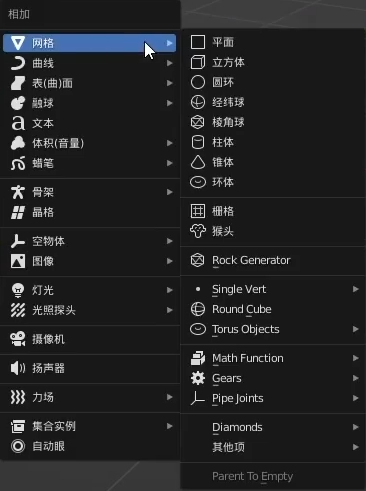

Blender is the free and open source 3D creation suite. It supports the entirety of the 3D pipeline—modeling, rigging, animation, simulation, rendering, compositing and motion tracking, even video editing and game creation.

<!--more-->

> Please take a look at my Blender project called "ImmersiveOffice" hosted on GitHub. You can find the project at the following URL: 
>
> [GitHub - archichen/ImmersiveOffice](https://github.com/archichen/ImmersiveOffice)

## Interface and Tool Operations

### Common Techniques

+ View Editing
  + Move view: `Shit` + `middle mouse button`
  + Rotate view: `Middle mouse button`
  + Zoom view: Scroll the `Middle mouse button`
+ View Adjusting
  + Front view:  `Numpad 1`
  + Side view: `Numpad 3`
  + Perspective view: `Numpad 5`
  + Top view: `Numpad 7`
  + Maximize display: `Numpad Solid dot` or **` + 3**
  + Independent display: `Slash`
+ Object Viewing
  + Front view:  **` + 1**
  + Side view: **` + 3**
  + Perspective view: **` + 5**
  + Top view: **` + 7**
+ Object Editing
  + Move: `G`
  + Rotate: `R`
  + Zoom: `S`
  + Based on this, click `XYZ` again to edit along the corresponding axis.

## Object Practice - Chair

+ Create Object: `Shit + A`

+ Switch to front view by pressing `Numpad 1`.
+ Enter editing mode: `Ctrl+ Tab` -> `6`

+ Transparent Display：`Alt + z` OR `activate it by clicking on the top-right corner`

+ Choose point mode and select the upper half

+ Compress this cube into a cushion: `G (Move object) + Z(Follow the Z-axis)`

+ Round the edges of the cuboid:

  1. `Ctrl+ Tab -> 6 (Enter editing mode)`

  2. `Activate Edge mode by clicking on the top-left corner`

  3. `Hold down the Shift key and left-click to select all the edges` OR `Press Alt + Shift and click on a face to perform a loop selection of edges`

  4. Rounding Operation: `Ctrl + B`+`click object`

  5. Set the Rounding attribute on the bottom-left corner

     

  6. Smooth shading: `Right-click on the object to apply Smooth shading`

+ Delete Object: `X`

+ Copy Object: `Shift + D`

+ Mirror copy：

  

+ Rotate: `R`

  

+ Scale down at the same proportion: `S`

## Material and Light Practice

+ Split Window: Place the mouse cursor on the top-left corner of the window border, and a crosshair cursor will appear. Dragging it will separate the view into separate windows.

To be continued...
