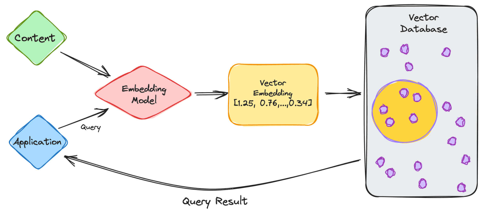
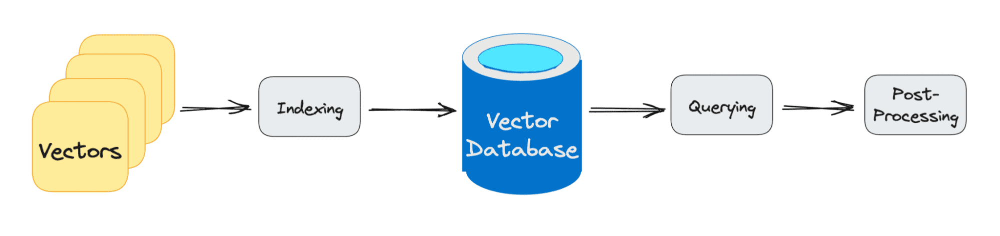

In an era where semantic search and retrieval-augmented generation (RAG) are redefining our online interactions, the backbone supporting these advancements is often overlooked: vector databases. If you're diving into applications like large language models, RAG, or any platform leveraging semantic search.

<!--more-->

## What is a Vector Database?

Let’s first define vector embedding. **Vector embedding** is a type of data representation that carries semantic information that helps AI systems get a better understanding of the data as well as being able to maintain long-term memory. With anything new you’re trying to learn, the important elements are understanding the topic and remembering it. 

**Embeddings** are generated by AI models, such as LLMs which contain a large number of features that makes their representation difficult to manage. Embedding represents the different dimensions of the data, to help AI models understand different relationships, patterns, and hidden structures. 

Vector embedding using traditional scalar-based databases is a challenge, as it cannot handle or keep up with the scale and complexity of the data. With all the complexity that comes with vector embedding, you can imagine the specialized database it requires. This is where vector databases come into play. 

**Vector databases** offer optimized storage and query capabilities for the unique structure of vector embeddings. They provide easy search, high performance, scalability, and data retrieval all by comparing values and finding similarities between one another. 

That sounds great, right? There’s a solution to dealing with the complex structure of vector embeddings. Yes, but no. Vector databases are very difficult to implement. 

Until now, vector databases were only used by tech giants that had the capabilities to not only develop them but also be able to manage them. Vector databases are expensive, therefore ensuring that they are properly calibrated is important to provide high performance. 

## How do Vector Databases work?

So now we know a little bit about vector embeddings and databases, let’s go into how it works. 

 

Let’s start with a simple example of dealing with an LLM such as ChatGPT. The model has large volumes of data with a lot of content, and they provide us with the ChatGPT application.

So let’s go through the steps.

1. As the user, you will input your query into the application.
2. Your query is then inserted into the embedding model which creates vector embeddings based on the content we want to index. 
3. The vector embedding then moves into the vector database, regarding the content that the embedding was made from. 
4. The vector database produces an output and sends it back to the user as a query result. 

When the user continues to make queries, it will go through the same embedding model to create embeddings to query that database for similar vector embeddings. The similarities between the vector embeddings are based on the original content, in which the embedding was created. 

Want to know more about how it works in the vector database? Let’s learn more.

Traditional databases work with storing strings, numbers, etc in rows and columns. When querying from traditional databases, we are querying for rows that match our query. However, vector databases work with vectors rather than strings, etc. Vector databases also apply a similarity metric which is used to help find a vector most similar to the query.

A vector database is made up of different algorithms which all aid in the Approximate Nearest Neighbor (ANN) search. This is done via hashing, graph-based search, or quantization which are assembled into a pipeline to retrieve neighbors of a queried vector. 

The results are based on how close or approximate it is to the query, therefore the main elements that are considered are accuracy and speed. If the query output is slow, the more accurate the result. 

The three main stages that a vector database query goes through are:

**1. Indexing**

As explained in the example above, once the vector embedding moves into the vector database, it then uses a variety of algorithms to map the vector embedding to data structures for faster searching. 

**2. Querying**

Once it has gone through its search, the vector database compares the queried vector to indexed vectors, applying the similarity metric to find the nearest neighbor. 

**3. Post Processing** 

Depending on the vector database you use, the vector database will post-process the final nearest neighbor to produce a final output to the query. As well as possibly re-ranking the nearest neighbors for future reference. 

## Comparison and guide

Picking a vector database can be hard. Scalability, latency, costs, and even compliance hinge on this choice. For those navigating this terrain, I've embarked on a journey to sieve through the noise and compare the leading vector databases of 2023. I’ve included the following vector databases in the comparision: Pinecone, Weviate, Milvus, Qdrant, Chroma, Elasticsearch and PGvector. The data behind the comparision comes from [ANN Benchmarks](https://ann-benchmarks.com/), the docs and internal benchmarks of each vector database and from digging in open source github repos.  

> A comparison of leading vector databases 

|                                                              | Pinecone                                   | Weaviate             | Milvus                                | Qdrant                               | Chroma                    | Elasticsearch                 | PGvector     |
| ------------------------------------------------------------ | ------------------------------------------ | -------------------- | ------------------------------------- | ------------------------------------ | ------------------------- | ----------------------------- | ------------ |
| **Is open source**                                           | ❌                                          | ✅                    | ✅                                     | ✅                                    | ✅                         | ❌                             | ✅            |
| **Self-host**                                                | ❌                                          | ✅                    | ✅                                     | ✅                                    | ✅                         | ✅                             | ✅            |
| **Cloud management**                                         | ✅                                          | ✅                    | ✅                                     | ✅                                    | ❌                         | ✅                             | (✔️)          |
| **Purpose-built for Vectors**                                | ✅                                          | ✅                    | ✅                                     | ✅                                    | ✅                         | ❌                             | ❌            |
| **Developer experience**                                     | 👍👍👍                                        | 👍👍                   | 👍👍                                    | 👍👍                                   | 👍👍                        | 👍                             | 👍            |
| **Community**                                                | Community page & events                    | 8k☆ github, 4k slack | 23k☆ github, 4k slack                 | 13k☆ github, 3k discord              | 9k☆ github, 6k discord    | 23k slack                     | 6k☆ github   |
| **Queries per second** (using text nytimes-256-angular)      | 150 *for p2, but more pods can be added    | 791                  | 2406                                  | 326                                  | ?                         | 700-100 *from various reports | 141          |
| **Latency, ms** (Recall/Percentile 95 (millis), nytimes-256-angular) | 1 *batched search, 0.99 recall, 200k SBERT | 2                    | 1                                     | 4                                    | ?                         | ?                             | 8            |
| **Supported index types**                                    | ?                                          | HNSW                 | Multiple (11 total)                   | HNSW                                 | HNSW                      | HNSW                          | HNSW/IVFFlat |
| **Hybrid Search (i.e. scalar filtering)**                    | ✅                                          | ✅                    | ✅                                     | ✅                                    | ✅                         | ✅                             | ✅            |
| **Disk index support**                                       | ✅                                          | ✅                    | ✅                                     | ✅                                    | ✅                         | ❌                             | ✅            |
| **Role-based access control**                                | ✅                                          | ❌                    | ✅                                     | ❌                                    | ❌                         | ✅                             | ❌            |
| **Dynamic segment placement vs. static data sharding**       | ?                                          | Static sharding      | Dynamic segment placement             | Static sharding                      | Dynamic segment placement | Static sharding               | -            |
| **Free hosted tier**                                         | ✅                                          | ✅                    | ✅                                     | (free self-hosted)                   | (free self-hosted)        | (free self-hosted)            | (varies)     |
| **Pricing (50k vectors @1536)**                              | $70                                        | fr. $25              | fr. $65                               | est. $9                              | Varies                    | $95                           | Varies       |
| **Pricing (20M vectors, 20M req. @768)**                     | \$227 ($2074 for high performance)         | $1536                | fr. $309 ($2291 for high performance) | fr. $281 ($820 for high performance) | Varies                    | est. $1225                    | Varies       |

## Wrapping it up

Navigating the terrain of vector databases in 2023 reveals a diverse array of options each catering to different needs. The comparison table paints a clear picture, but here's a succinct summary to aid your decision:

1. **Open-Source and hosted cloud**: If you lean towards open-source solutions, Weviate, Milvus, and Chroma emerge as top contenders. Pinecone, although not open-source, shines with its developer experience and a robust fully hosted solution.
2. **Performance**: When it comes to raw performance in queries per second, Milvus takes the lead, closely followed by Weviate and Qdrant. However, in terms of latency, Pinecone and Milvus both offer impressive sub-2ms results. If nmultiple pods are added for pinecone, then much higher QPS can be reached.
3. **Community Strength**: Milvus boasts the largest community presence, followed by Weviate and Elasticsearch. A strong community often translates to better support, enhancements, and bug fixes.
4. **Scalability, advanced features and security**: Role-based access control, a feature crucial for many enterprise applications, is found in Pinecone, Milvus, and Elasticsearch. On the scaling front, dynamic segment placement is offered by Milvus and Chroma, making them suitable for ever-evolving datasets. If you're in need of a database with a wide array of index types, Milvus' support for 11 different types is unmatched. While hybrid search is well-supported across the board, Elasticsearch does fall short in terms of disk index support.
5. **Pricing**: For startups or projects on a budget, Qdrant's estimated $9 pricing for 50k vectors is hard to beat. On the other end of the spectrum, for larger projects requiring high performance, Pinecone and Milvus offer competitive pricing tiers.

In conclusion, there's no one-size-fits-all when it comes to vector databases. The ideal choice varies based on specific project needs, budget constraints, and personal preferences. This guide offers a comprehensive lens to view the top vector databases of 2023, hoping to simplify the decision-making process for developers. My choice? I’m testing out Pinecone and Milvus in the wild, mostly because of their high performance, Milvus strong community and price flexibility at scale. 

>  **Appendix 1: explination of comparision parameters**
>
> - **Is open source**: Indicates if the software's source code is freely available to the public, allowing developers to review, modify, and distribute the software.
>
> - **Self-host**: Specifies if the database can be hosted on a user's own infrastructure rather than being dependent on a third-party cloud service.
>
> - **Cloud management**: Offers an interface for database cloud management
>
> - **Purpose-built for Vectors**: This means the database was specifically designed with vector storage and retrieval in mind, rather than being a general database with added vector capabilities.
>
> - **Developer experience**: Evaluates how user-friendly and intuitive it is for developers to work with the database, considering aspects like documentation, SDKs, and API design.
>
> - **Community**: Assesses the size and activity of the developer community around the database. A strong community often indicates good support, contributions, and the potential for continued development.
>
> - **Queries per second**: How many queries the database can handle per second using a specific dataset for benchmarking (in this case, the nytimes-256-angular dataset)
>
> - **Latency**: the delay (in milliseconds) between initiating a request and receiving a response. 95% of query latencies fall under the specified time for the nytimes-256-angular dataset.
>
> - **Supported index types**: Refers to the various indexing techniques the database supports, which can influence search speed and accuracy. Some vector databases may support multiple indexing types like HNSW, IVF, and more.
>
> - **Hybrid Search**: Determines if the database allows for combining traditional (scalar) queries with vector queries. This can be crucial for applications that need to filter results based on non-vector criteria.
>
> - **Disk index support**: Indicates if the database supports storing indexes on disk. This is essential for handling large datasets that cannot fit into memory.
>
> - **Role-based access control**: Checks if the database has security mechanisms that allow permissions to be granted to specific roles or users, enhancing data security.
>
> - **Dynamic segment placement vs. static data sharding**: Refers to how the database manages data distribution and scaling. Dynamic segment placement allows for more flexible data distribution based on real-time needs, while static data sharding divides data into predetermined segments.
>
> - **Free hosted tier**: Specifies if the database provider offers a free cloud-hosted version, allowing users to test or use the database without initial investment.
>
> - **Pricing (50k vectors @1536)** and **Pricing (20M vectors, 20M req. @768)**: Provides information on the cost associated with storing and querying specific amounts of data, giving an insight into the database's cost-effectiveness for both small and large-scale use cases.

> **Source**
>
> https://ann-benchmarks.com/
>
> https://qdrant.tech/benchmarks/
>
> https://zilliz.com/comparison

