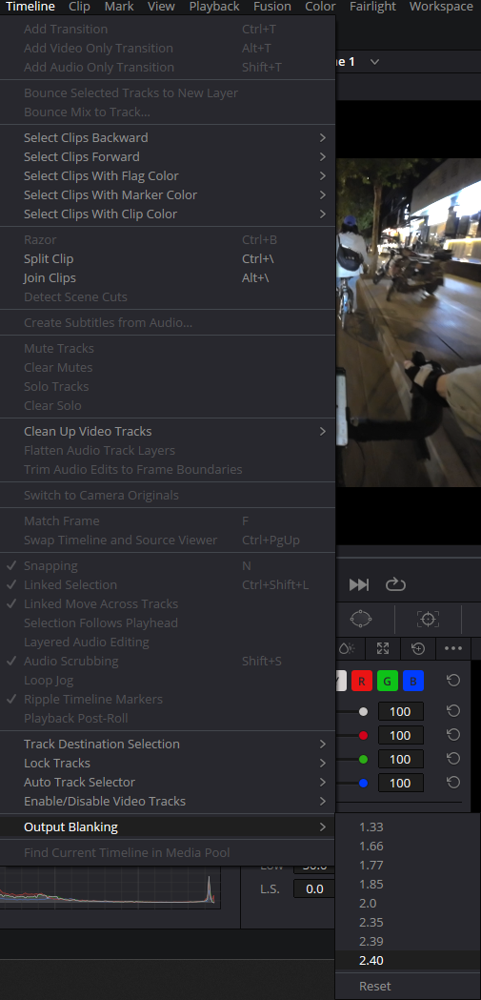

This blog post will focus on color grading in DaVinci Resolve. It will introduce DJI's D-Cinelike, D-Log color profiles, Sony camera S-Log, and explain the differences between these log formats and normal color profiles. The goal is to provide a tutorial for colorists on how to get the most out of log footage when color grading in DaVinci Resolve.

<!--more-->

## Log gamma curve

### What is Log

+ Normal Color
  + Normal color profiles apply little to no processing to the original camera footage. They preserve a standard contrast and color range suitable for direct viewing.
+ Log
  + such as D-Log (DJI's Log curve), S-Log (Sony's Log curve)
  + more extreme `gamma curves` that **dramatically compress the dynamic range, rendering a very flat, desaturated image** in camera. This allows maximum flexibility for color grading in post.
+ D-Cinelike
  + Refers to a gamma curve developed by DJI.
  + The Cinelike setting applies a `log gamma curve`, **compressing the highlights and expanding the shadows to capture a high dynamic range** while preserving more detail in the highlights and shadows

### Why normal color look better

In normal mode, the camera directly outputs images that have undergone normal contrast and color processing. **These images are more vivid and richer when displayed directly, closer to what the human eye sees.**

While in log mode, the camera is deliberately designed to **retain more of the original dynamic range information by compressing highlights and stretching shadows**, `outputting an image with low contrast and saturation`. This flattened processing can preserve an even broader range of dynamic details than normal mode.

The reason it appears gray and unsaturated is because **the log curve intentionally applies compression, sacrificing the contrast and colors of a normal image**. These flattened log files need to have contrast and color restored during post-production grading.

Therefore, the dull and unsaturated appearance in log mode is not contradictory to containing richer color information. On the contrary, the way log mode processes images can include even more color detail than normal mode, and these extra details can be reclaimed during post-production grading. This is the real advantage of log mode.

## Davinci Graph

### Wave form graph

+ The waveform graph reflects the `brightness information` of the entire image
+ Its information elements correspond one-to-one with the positions in the image
+ When you want to control skin color actually, you can use limited cursor with waveform graph

### Component graph

+ In the scope, it is divided into three parts from top to bottom: highlights, midtones, and shadows
+ Values below 0 are referred to as "`low cutoff`," indicating the presence of completely black areas in the image. 
+ Values above 1023 are referred to as "`high cutoff`," indicating the presence of completely white areas in the image.
+ In the Component graph, **a high level of red will result in a yellowish tint, a high level of green will result in a bluish tint, and a high level of blue will result in a bluish tint. Similar levels of all three components indicate a normal image.**

### Vector scope graph

+ The vector graph displays the saturation levels of each color, with the square region representing points at `75% saturation` for each color. 
+ This ensures that each color within the square range avoids becoming a *highly saturated warrior*.

## Davinci node

+ Click the clip button to switch the material to be adjusted.
  + 
+ In node area, click the right mouse button to create a new node. or `Alt + s`
  + 
  + Different nodes can do different jobs
  + Like `Edit Layer in Snapseed App` or `Edit history in Photoshop`, more nodes and a reasonable order of nodes are better
+ Rename node to manage whole process better

### Restore node

+ You can create a new node responsible for restoring the true color
+ By adjusting the curve, it is possible to restore the brightness of the video while keeping the colors within the range of 0 to 1023 on the Component graph.

### Saturation node

+ You can create a new node responsible for adjusting the `entire saturation`

+ For the adjustment of the **saturation of each color**, you can use `Hue vs Sat curves`
  + you can use `spline` to get the exact color you want to adjust

+ For the adjustment of the **saturation of different brightness**, you can use `Lum vs Sat curves`

+ In case you will be a *highly saturated warrior*, you can use vector scope graph to avoid it.

### Noise reduction node

+ You can create a new node to do the noise reduction
+ First, you move the `noise reduction` from library to node

+ There are two mode of noise reduction

| Noise reduction | What                                                    |
| --------------- | ------------------------------------------------------- |
| Temporal NR     | Combined with pre and post frame calculation processing |
| Spatial NR      | Single frame noise reduction                            |

+ Temporal NR eliminate noise jitter according front and rear frame
+ Spatial NR, like photoshop, doing NR on a single frame
+ So, you can do Spatial NR first, then Temporal NR

| NR threshold               | What                                                | Note                         |
| -------------------------- | --------------------------------------------------- | ---------------------------- |
| Luma threshold             | Specify the intensity of brightness noise reduction | White noise reduction        |
| Chroma threshold           | Specify the intensity of color noise reduction      | Color noise reduction        |
| Luma chrome same threshold |                                                     | transparence noise reduction |

### White balance node

+ You can create a new node responsible for adjusting white balance

+ In `Color Wheels` area, you can adjust overall color 
+ In `Log wheels` area, you can **adjust shadow, midtone and highlights temperature of color and  brightness separately**

### Hue node

+ This node belongs to the **personalized** color palette. Personalized adjustments based on previous basic nodes
+ You can create a new node responsible for adjusting `hue`

### Color warper node

+ You can use `Color warper` to adjust both hue and saturation
+ This is just a compilation tool, and you don't really need to use it, or it's better to use

### Vignette node

+ Add dark corners if you need

### LUT node

+ LUTs can give you some color references, making it easier for you to find a more appropriate style for your video

### Output blanking

+ Add blanking if you need movie style

> Source
>
> https://www.bilibili.com/video/BV1QA411f7WT
