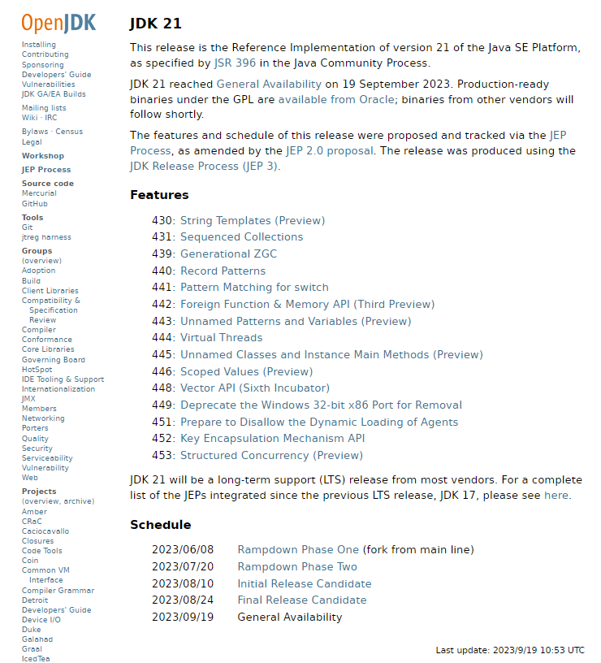
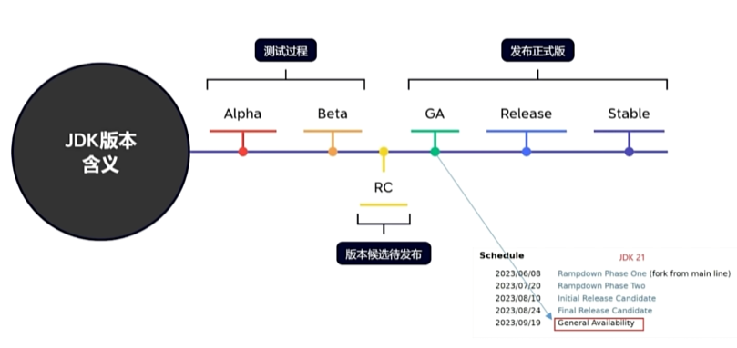
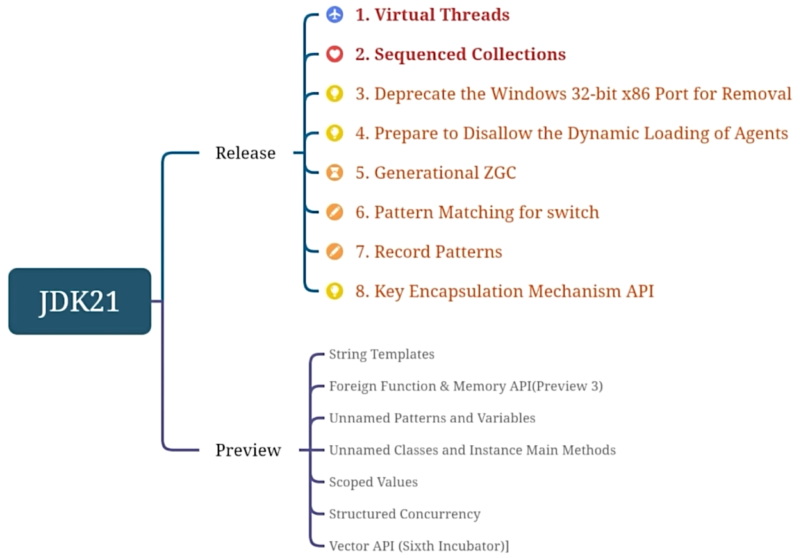
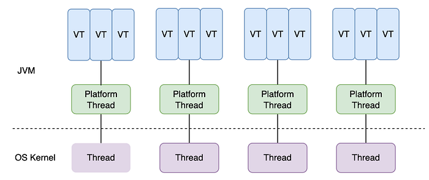
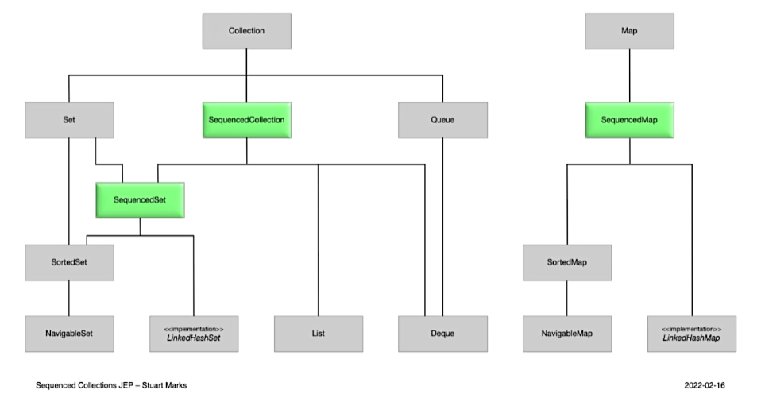
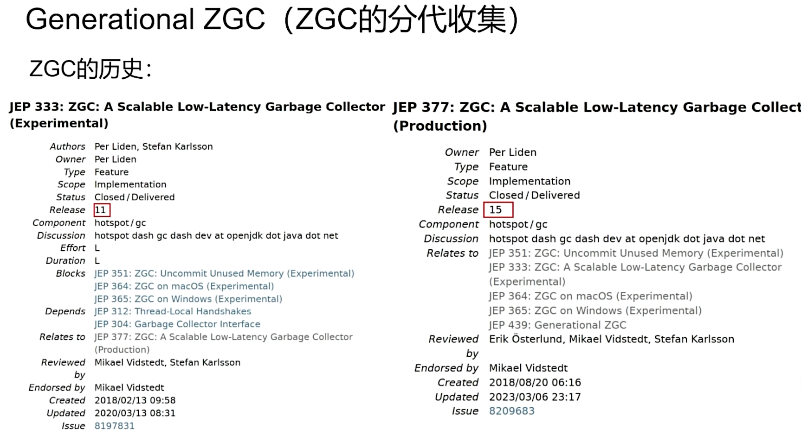
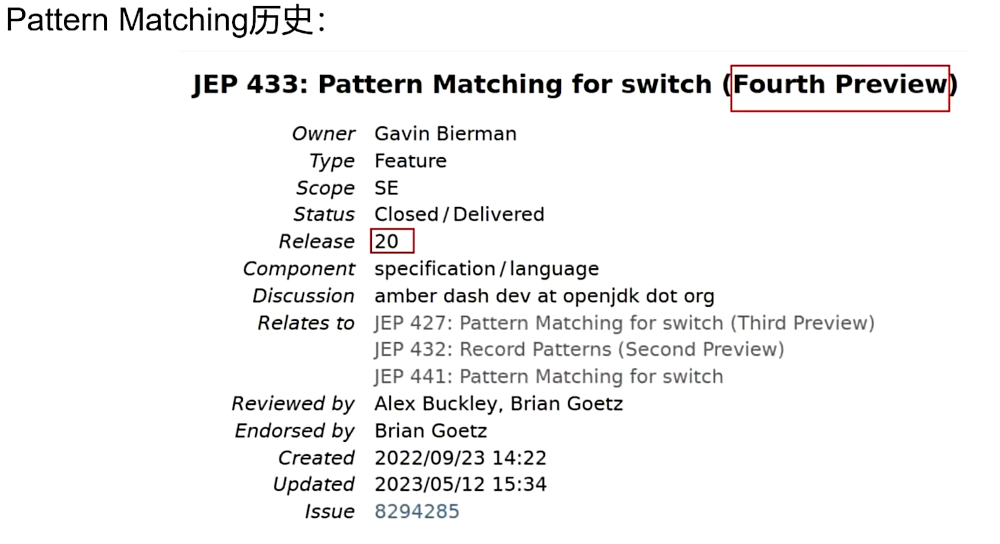

JDK 21, the latest LTS release of OpenJDK, introduces an exciting new feature called Virtual Threads. In this blog post, we will delve into the details of this feature and explore how it enhances the scalability and performance of concurrent applications.

<!--more-->

## Overview

+ From [Release Information](#release), JDK 21 will be a `long-term support (LTS)` release
+ And in 2023/09/19 JDK 21 `General Availability`
+ JDK release step: **Alpha --> Beta --> Release Candidate --> General Availability --> Release --> Stable**
+ From [Oracle Java SE Support Roadmap](#roadmap), Basically one LTS is released after every four non-LTS releases, so that **JDK 8, JDK 11 and JDK 21** are important in release history.

### Release information

<a id="release"></a>



### Oracle Java SE Support Roadmap

<a id="roadmap"></a>

| Release           | GA Date                     | Premier Support Until           | Extended Support Until | Sustaining Support |
| ----------------- | --------------------------- | ------------------------------- | ---------------------- | ------------------ |
| 8 (LTS)**         | March 2014                  | March 2022                      | December 2030*****     | Indefinite         |
| 9 - 10 (non-LTS)  | September 2017 - March 2018 | March 2018 - September 2018     | Not Available          | Indefinite         |
| 11 (LTS)          | September 2018              | September 2023                  | January 2032           | Indefinite         |
| 12 - 16 (non-LTS) | March 2019 - March 2021     | September 2019 - September 2021 | Not Available          | Indefinite         |
| 17 (LTS)          | September 2021              | September 2026****              | September 2029****     | Indefinite         |
| 18 (non-LTS)      | March 2022                  | September 2022                  | Not Available          | Indefinite         |
| 19 (non-LTS)      | September 2022              | March 2023                      | Not Available          | Indefinite         |
| 20 (non-LTS)      | March 2023                  | September 2023                  | Not Available          | Indefinite         |
| 21 (LTS)***       | September 2023              | September 2028                  | September 2031         | Indefinite         |
| 22 (non-LTS)***   | March 2024                  | September 2024                  | Not Available          | Indefinite         |
| 23 (non-LTS)***   | September 2024              | March 2025                      | Not Available          | Indefinite         |
| 24 (non-LTS)***   | March 2025                  | September 2025                  | Not Available          | Indefinite         |
| 25 (LTS)***       | September 2025              | September 2033****              | Not Available          | Indefinite         |


### Release step



### New features



## Virtual Threads

### Overview



Virtual Threads offers a more efficient and `lightweight thread model.`

Virtual threads in JDK 21 are implemented using a concept called `"continuations."` Continuations allow threads to be suspended and resumed without the need for full thread context switching, resulting in a more efficient and lightweight threading model.

Traditionally, each thread in Java corresponds to an operating system thread, **which involves significant overhead in terms of memory and context switching**. In contrast, virtual threads are **not directly mapped to OS threads. Instead, they are managed by a lightweight scheduler within the JVM.**

When a virtual thread encounters a **blocking operation, such as waiting for I/O or synchronization, it can be suspended and its state is captured as a continuation**. This continuation represents the thread's execution context, including the call stack and local variables. The virtual thread is then freed up to execute other tasks.

**Once the blocking operation completes, the virtual thread can be resumed from its captured continuation, allowing it to continue execution from the point where it was suspended. The resumption process does not involve the expensive thread context switching that occurs with traditional threads.**

By leveraging continuations and the lightweight scheduler, JDK 21's virtual threads provide a more efficient and scalable threading model, enabling developers to achieve higher levels of concurrency and responsiveness in their applications.

### Why virtual threads




flowchart LR
   Thread-cost --> CreateAndDestroy --> solution:thread-pool
   Thread-cost --> thread-switch --> solution:virutal-threads
   Thread-cost --> concurrent-value --> b[solution:virutal-threads]




+ The costs of threads include **creation, destruction, frequent switching, and concurrency overhead.**
+ The costs of creation and destruction can be solved by **Thread pool.**
+ Frequent switching and concurrency overhead can be solved by **Virtual Threads** 
  + Cause Virtual Threads in the same Thread, so there is no costs of switching
  + Also, virtual threads greatly increase the number of 'threads'


### Code

+ The code for virtual threads is basically the same as for thread pools

  ```java
  try (var executor = Executors.newVirtualThreadPerTaskExecutor()){
      IntStream.range(0, 10_000).forEach(i -> {
          executor.submit(() -> {
              Thread.sleep(Duration.ofSeconds(1));
              return i;
          });
      });
  } // executor.close() is called implicitly, and waits
  ```

## Other Features

### Sequedced Collections

Java's collections framework lacks a sequence of elements representing a defined order. There is also a lack of a unified way to operate collections

Example:

|               | First element                   | Last element              |
| ------------- | ------------------------------- | ------------------------- |
| List          | list.get(0)                     | list.get(list.size() - 1) |
| Deque         | deque.getFirst()                | deque.getLast()           |
| SortedSet     | sortedSet.first()               | sortedSet.last()          |
| LinkedHashSet | linkedHashSet.iterator().next() | //missing                 |

New Sequedced Collections:

```java
interface SequencedCollenction<E> extends Collection<E> {
    // new method
    SequencedCollection<E> reversed();
    // methods promoted from Deque
    void addFirst(E);
    void addLast(E);
    E geFirst();
    E getLast();
    E removeFirst();
    E removeLast();
}
```




### Deprecate the 32-bit x86 port for Removal

+ 64 bits are simulated by writing high 12 bits once and low 32 bits once

### Prepare to disallow the Dynamic Loading of Agents

+ Warning when the agent is dynamically loaded into a running JVM. These warnings are intended to prepare users for a future release that does not allow dynamic loading of the agent by default in order to improve integrity by default.

+ Dynamic loading agents allow developers to modify and monitor the behavior of Java applications at run time. While this is useful for debugging and performance analysis, there are also potential security risks. Malicious code may take advantage of dynamically loaded agents to perform malicious operations, such as fetching sensitive information, calculating data, and so on. Therefore, in order to strengthen the security of Java applications, it is necessary to limit the use of dynamically loaded agents


### Generational ZGC



### Pattern Matching for switch



Pattern Matching comparing:

```java
// Before Java 21
static String formatter(Object obj){
    String formatted = "unknown";
    if(obj instanceof Integer i){
        formatted = String.format("int %d", i);
    } else if (obj instanceof Long l){
        formatted = String.format("long %d", l);
    } else if (obj instanceof Double d){
        formatted = String.format("double %f", d);
    } else if (obj instanceof String s){
        formatted = String.format("String %s", s);
    }
    return formatted;
}

// In Java 21
static String formatterPatternSwitch(Object obj){
    return switch(obj){
            case Integer i -> String.format("int %d", i);
            case Long l    -> String.format("long %d", l);
            case Double d  -> String.format("double %f", d);
            case String s  -> String.format("String %s", s);
            default -> obj.toString();
    };
}
```

```java
// Before Java 21
static void test(String s){
    if(s == null){
        println("oops");
        reutrn;
    }
    switch(s){
            case "Foo", "Bar" -> println("great");
            default           -> println("OK");
    }
}

// In Java 21
static void test(String s){
    switch(s){
            case null         -> println("oops");
            case "Foo", "Bar" -> println("great");
            default           -> println("OK");
    }
}
```

### Record Patterns

```java
// In Java 21
static void printsum(Object obj){
    if(obj instanceof point(int x, int y)){
        println(x + y);
    }
}
```

### KEM

Key Encapsulation Mechanism API

```java
// Receiver side
var kpg = KeyPairGenerator.getInstance("x2551g");
var kp = kpg.generateKeyPair();
// sender side
var kem1 = KEM.getInstance("DHKEM");
var sender = kem1.newEncapsulator(kp.getpublic());
var encapsulated = sender.encapsulate();
var k1 = encapsulated.key();
// Receiver side
var kem2 = KEM.getInstanceC"DHKEM");
var receiver = kem2.newDecapsulator(kp.getprivate());
var k2 = receiver.decapsulate(encapsulated.encapsulation());
assert Arrays.equals(kl.getEncoded(), k2.getEncoded());
```

