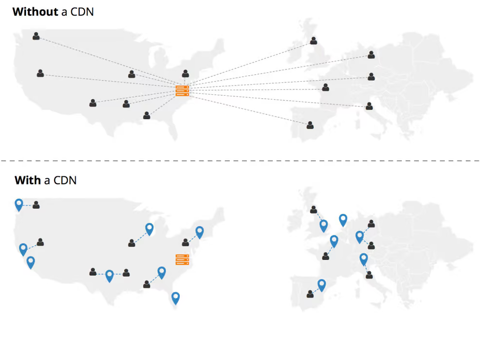
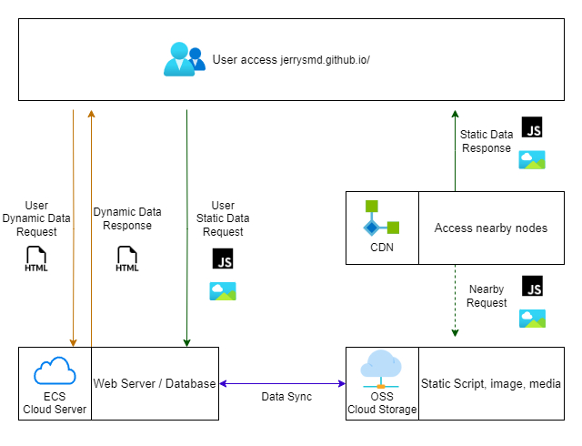
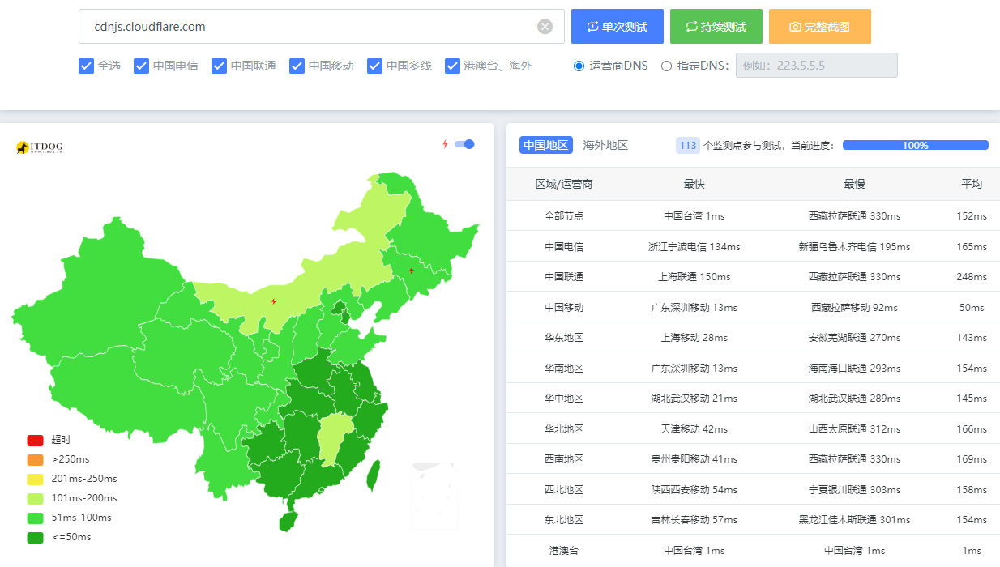
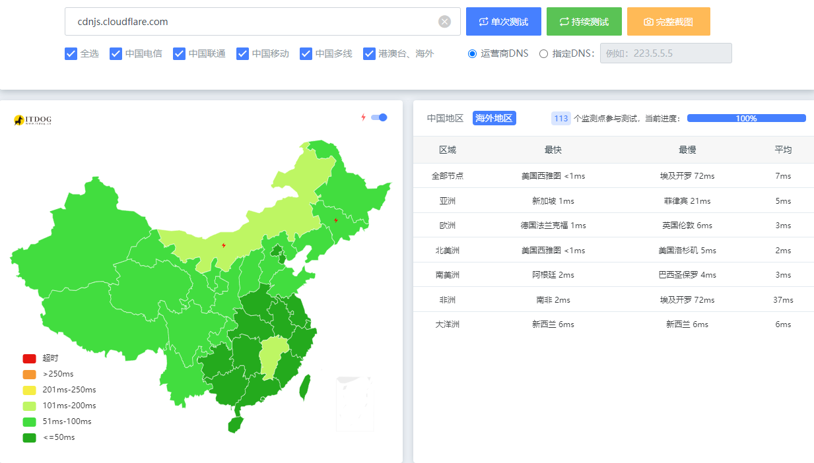

One scenario where I need a CDN is for dynamically requesting static JavaScript files on my website. Hosting these large JS files myself would significantly impact my bandwidth usage since my host charges based on traffic volume. Using a CDN helps solve this issue by distributing requests across its worldwide network of data centers. Not only does this improve access speeds by caching files closer to users, it also reduces my origin server load and bandwidth costs.

<!--more-->

> Due to network instability caused by various political events in China, I need to continuously learn about networking knowledge. 

> The CDN https://unpkg.com/ that I had always been using was blocked. This inspired me to write this article.

## What is a CDN?

**Content Delivery Network**, which refers to a content distribution network. A CDN is a content distribution network built upon the Internet. It relies on `edge servers deployed in various locations`. Through functions such as load balancing, content distribution and scheduling on the central platform, a CDN enables users to access needed content locally, reducing network congestion and improving user access response speed and hit rate. The key technologies of a CDN mainly include content storage and distribution technologies. **By storing cached content at edge servers close to end users and routing requests to the nearest edge server**, a CDN can provide content more efficiently and at a larger scale compared to a single server or data center solution. It realizes the distributed storage and parallel acceleration transmission of content, improving the response speed that users experience when accessing websites.

## How Does a CDN Work?

## CDN's Advantages

+ CDN nodes address issues with cross-carrier and cross-regional access by `greatly reducing access latency.`
+ Most requests are fulfilled at the CDN edge nodes, so the CDN takes on a traffic diversion role and **lightens the load on the origin server.**
+ It decreases the impact of "thundering herds" and `improves the stability of network access.` Bandwidth is also `saved on the backbone network`, **reducing bandwidth demand.**

## How to use CDN

- Different CDN Provider have different rules of use
  - `unpkg` CDN Provider rules: `unpkg.com/:package@:version/:file`
  - `jsdelivr` Provider rules example: `cdn.jsdelivr.net/npm/jquery@3.6.4/dist/jquery.min.js`
  - `cdnjs` Provider rules example: `cdnjs.cloudflare.com/ajax/libs/react/18.2.0/umd/react.production.min.js`
- The first way if you only want to speed up your website and all your static data in the Github
  + **jsdelivr.net**, this provider can speed up access to static resources
  + If you are using Github pages to do a personal blog, you may wish to try to change static resources to this way to access, can be a lot faster. 
  + `cdn.jsdelivr.net/gh/${UserName}/${RepoName}/${PathToResource}`

## Choosing a CDN Provider

Here are some of the CDN providers I found -`01/13/2024`

| Provider                                                   | Describe                                                     | Status             | Speed                                                        |
| ---------------------------------------------------------- | ------------------------------------------------------------ | ------------------ | ------------------------------------------------------------ |
| https://cdnjs.cloudflare.com/                              | Very well maintained, it is currently the most widely used open source CDN worldwide with very high access speeds. | online             | -Average 152ms Latency in China -Average 5ms in the whole world |
| https://www.jsdelivr.com/                                  | Popular open source CDN, well maintained with speeds slightly slower than cdnjs.cloudflare.com. | online             | -209ms -15ms                                            |
| https://unpkg.com/                                         | community maintained like jsdelivr.com, speeds on par with jsdelivr.com with great compatibility. | online             | -limited in China -4ms                                  |
| https://learn.microsoft.com/en-us/aspnet/ajax/cdn/overview | Microsoft's official CDN, not as comprehensive as the top 3 open source CDNs but very well maintained with very fast speeds. | online             | -21ms -6ms                                              |
| https://www.bootcdn.cn/                                    | A popular CDN provider in China focusing on common frameworks | online             | -26ms -209ms                                            |
| https://cdn.bytedance.com/                                 | ByteDance's CDN for open source libraries, more comprehensive resources with fast speeds within China. | online             | -28ms -186ms                                            |
| https://unpkg.zhimg.com/                                   | An open source library mirror provided by Zhongguancun Online, less coverage but very fast within China. | online             | -6ms -14ms                                              |
| https://cdnjs.com/                                         | Also a popular open source CDN but resource updates and speeds are relatively slower compared to the above. | online             | -limited in China -7ms                                  |
| https://www.staticfile.org/                                | Another notable open source CDN in China, almost comprehensive resources | No longer maintain | -6ms -10ms                                              |

So overall, cloudflare CDN Provider is a good choice

