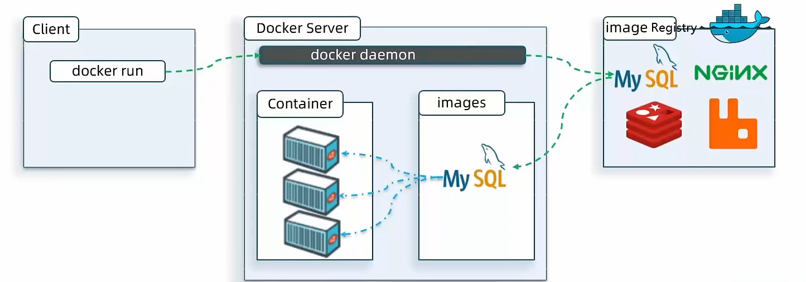
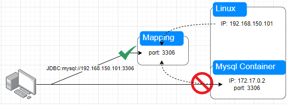
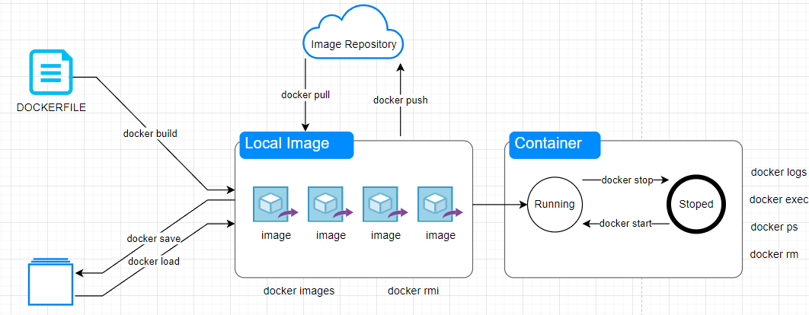
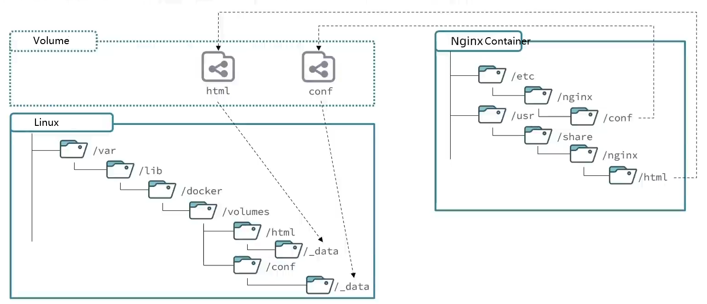
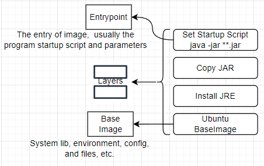
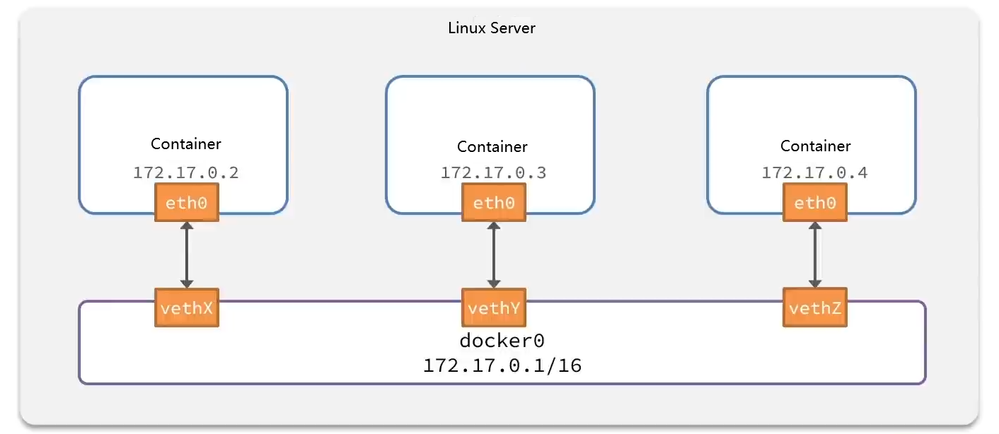

Docker takes containerization a step further by providing additional encapsulation for file systems, network interconnections, process isolation, and more. Greatly simplifies the creation and maintenance of containers, making Docker technology more lightweight and faster compared to virtual machine technology.

<!--more-->

## What is Docker


## Image & Container

The relationship between an `Image` and a `Container` is similar to the relationship between a `Class` and an `Instance` in object-oriented programming. An image is a static definition, while a container is a running instance of the image. Containers can be created, started, stopped, deleted, paused, and so on.

When we install an application with Docker, Docker automatically searches for and downloads the application `image`. An image **not only includes the application itself but also the required environment, configurations, and system libraries** for the application to run. Docker creates an **isolated environment** called a `container` when running the image.



## Registry

After the image is built, it can be easily run on the current host machine. However, if we need to use this image on other servers, we need a centralized storage and distribution service for images, and **Docker Registry** is such a service.

A `Docker Registry` can contain multiple `repositories`, and each repository can contain multiple `tags`. Each tag corresponds to an image.

In addition to using Docker Registry as a **public service**, users can also set up a **private** Docker Registry locally.

## Command Example

```shell
docker run -d \
	--name mysql \
	-p 3306:3306 \
	-e TZ=Asia/Shanghai \
	-e MYSQL_ROOT_PASSWORD \
	mysql:5.7
```

+ `docker run`: Create and Run a **Container**, `-d` means run the container in the background

+ `--name`: Name the **Container**, must be unique

+ `-p`: To set port mapping

  

+ `-e KEY=VALUE`: set environment variable

+ `[repository]:[tag]`: set the name and tag of image. If the tag is omitted, it defaults to the latest version.

## Common Commands



+ docker pull: `docker image pull [OPTIONS] NAME[:TAG|@DIGEST]`
  + Most of your images will be created on top of a base image from the Docker Hub registry. To download a particular image, or set of images (i.e., a repository), use `docker pull`.
+ docker push: `docker image push [OPTIONS] NAME[:TAG]`
  + Use docker image push to share your images to the Docker Hub registry or to a self-hosted one.
+ docker images: `docker image ls [OPTIONS] [REPOSITORY[:TAG]]`
  + The default `docker images` will show all top level images, their repository and tags, and their size.
+ docker rm:  `docker image rm [OPTIONS] IMAGE [IMAGE...]`
  + Removes (and un-tags) one or more images from the host node. If an image has multiple tags, using this command with the tag as a parameter only removes the tag. If the tag is the only one for the image, both the image and the tag are removed.
+ docker build: `docker image build [OPTIONS] PATH | URL | -`
  + The `docker build` command builds Docker images from a Dockerfile and a "context". A build's context is the set of files located in the specified `PATH` or `URL`. The build process can refer to any of the files in the context.
+ docker container ls: `docker container ls [OPTIONS]`
  + List containers
  + Aliases: `docker container list` `docker container ps` `docker ps`
+ docker container exec: `docker container exec [OPTIONS] CONTAINER COMMAND [ARG...]`
  + The `docker exec` command runs a new command in a running container. The command you specify with `docker exec` only runs while the container's primary process (`PID 1`) is running, and it isn't restarted if the container is restarted.

## Data Volume

A data `volume` is a special directory that can be used by one or multiple containers. It bypasses the UFS and provides several useful features:

- Data `volumes` can be shared and reused between containers.
- Modifications to a data `volume` take effect immediately.
- Updating a data `volume` does not affect the underlying image.
- Data `volumes` persist even if the container is deleted.



## Custom Java Image

The steps to build a Java image are as follows:

1. Prepare a Linux runtime environment.
2. Install JRE and configure environment variables.
3. Copy the JAR file(s) into the image.
4. Write a startup script.

>Add package, dependency, config, etc. Each operation will create a new `Layer`
>
>


## Layer

The order of Dockerfile instructions matters. A Docker build consists of a series of ordered build instructions. Each instruction in a Dockerfile roughly translates to an image layer. The following diagram illustrates how a Dockerfile translates into a stack of layers in a container image.


### Cached layers

When you run a build, the builder attempts to reuse layers from earlier builds. If a layer of an image is unchanged, then the builder picks it up from the build cache. If a layer has changed since the last build, that layer, and all layers that follow, must be rebuilt.

The Dockerfile from the previous section copies all project files to the container (`COPY . .`) and then downloads application dependencies in the following step (`RUN go mod download`). If you were to change any of the project files, then that would invalidate the cache for the `COPY` layer. It also invalidates the cache for all of the layers that follow.


## Dockerfile

A Dockerfile is a text document in which you define the build steps for your application.

| Instruction | Describe                                                     | Example                                                      |
| ----------- | ------------------------------------------------------------ | ------------------------------------------------------------ |
| FROM        | Set base image                                               | FROM centos:6                                                |
| ENV         | Set environment variable                                     | ENV key value                                                |
| COPY        | Copy files from local to image folder                        | COPY ./jrell.tar.gz /tmp                                     |
| RUN         | Run Linux shell, usually a install shell                     | RUN tar -zxvf /tmp/jrell.tar.gz && EXPORTS path=/tmp/jrell:$path |
| EXPOSE      | Listening port, image user can check log form this port      | EXPOSE 8080                                                  |
| ENTRYPOINT  | Application start script in Image, trig when container running | ENTRYPOINT java -jar **.jar                                  |

Example

```dockerfile
# set base image
FROM ubuntu:16.04
# set env variables
ENV JAVA_DIR=/usr/Local
# copy jdk and java package
COPY ./jdk8.tar.gz $JAVA_DIR/
COPY ./docker-demo.jar /tmp/app.jar
# install JDK
RUN cd $JAVA_DIR \ && tar -xf ./jdk8.tar.gz \
&& mv ./jdk1.8.0_144 ./java8
# set env variables
ENV JAVA_HOME=$JAVA_DIR/java8
ENV PATH=$PATH:$JAVA_HOME/bin
# java start command
ENTRYPOINT ["java", "-jar", "/app.jar"]
```

As the same we can use JDK as the base image to simplify the process

```dockerfile
FROM openjdk:11.0-jre-buster
COPY docker-demo.jar /app.jar
ENTRYPOINT ["java", "-jar", "/app.jar"]
```

## Network

By default, all `containers` are connected to a virtual bridge network in Docker using the `bridge` mode.



Containers need to be joined to a custom network in order to access each other using their container names.

| Command                   | Describe                                  |
| ------------------------- | ----------------------------------------- |
| docker network create     | create a network                          |
| docker network ls         | list all network                          |
| docker network rm         | delete network                            |
| docker network prune      | clear unused network                      |
| docker network connect    | set one container join connect network    |
| docker network disconnect | set one container join disconnect network |
| docker network inspect    | check one network details                 |

