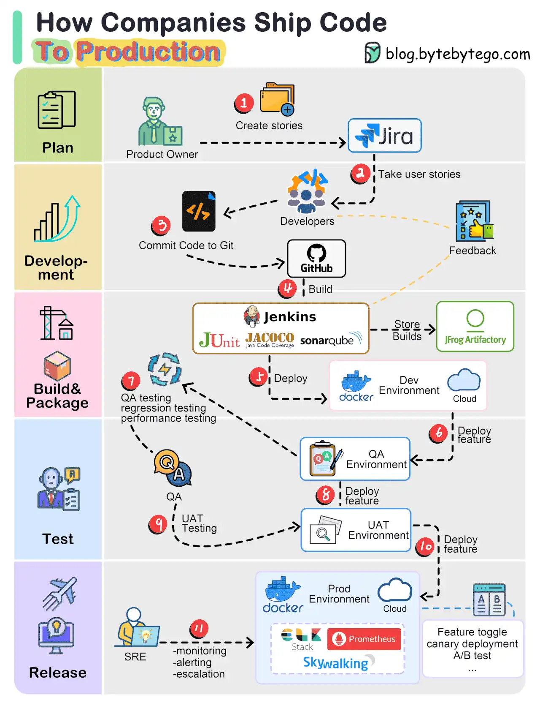
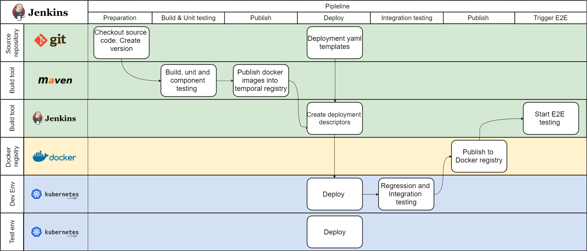
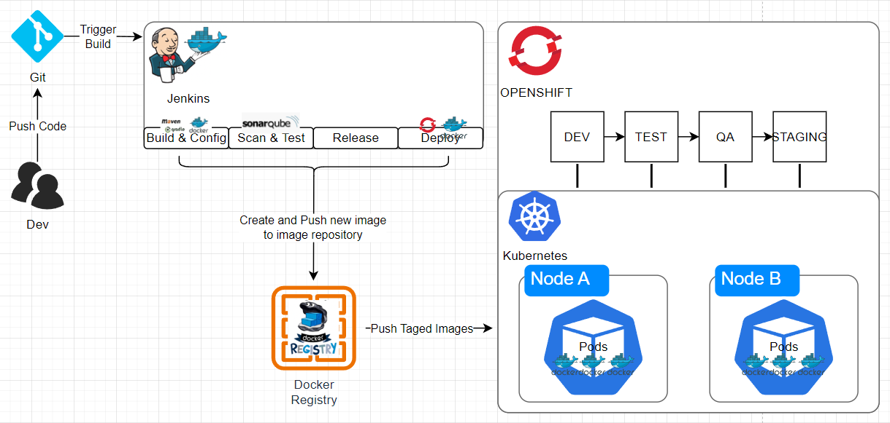

Explore the power of Jenkins and Docker for automating the deployment of your SpringBoot projects. This blog post walks through integrating these tools to create a seamless CI/CD pipeline, enabling you to build, test, and deploy your applications as containerized services with ease, enhancing your DevOps skills.

<!--more-->

## Whole Progress of Ship Code

First of all, How do companies ship code to production?

The diagram below illustrates the typical workflow.

1. The process starts with a product owner creating user stories based on requirements.
2. The dev team picks up the user stories from the backlog and puts them into a sprint for a two-week dev cycle.
3. The developers commit source code into the code repository Git.
4. A build is triggered in Jenkins. The source code must pass unit tests, code coverage threshold, and gates in SonarQube.
5. Once the build is successful, the build is stored in artifactory. Then the build is deployed into the dev environment.
6. There might be multiple dev teams working on different features. The features need to be tested independently, so they are deployed to QA1 and QA2.
7. The QA team picks up the new QA environments and performs QA testing, regression testing, and performance testing.
8. Once the QA builds pass the QA team’s verification, they are deployed to the UAT environment.
9. If the UAT testing is successful, the builds become release candidates and will be deployed to the production environment on schedule.
10. SRE (Site Reliability Engineering) team is responsible for prod monitoring.

## Pipeline for a Single Microservice

From a team standpoint, the pipeline must allow them to be able to quickly build, test and deploy the microservice without disrupting other teams or destabilizing the application as a whole.

Here is a typical high-level workflow that many small development teams use to promote their work from one namespace (ie. project in OpenShift) to another

## Automated deployment Process

In addition, OpenShift has extensive support for Jenkins and provides an out-of-the-box containerized Jenkins template that you can quickly deploy.

OpenShift’s pipeline build strategy uses *pipelines* for execution by the Jenkins pipeline plugin. Pipeline workflows are defined in a Jenkinsfile, either embedded directly in the build configuration or supplied in a Git repository and referenced by the build configuration.

Here is a typical pipeline for a single containerized microservice

1. Developer makes code changes and commits code to the local git repo
2. Push code changes into the “develop” branch where a trigger has been set up to kick off an automated build.
3. Unit and component tests are performed during the build procedure.
4. Static code analysis is also performed to pass the source code quality gate.
5. Build artifacts are published into an artifact repository, such as Nexus or Artifactory
6. Build image is pushed to image repo
7. Jenkins deploys the image to “Dev” namespace (called “Project” in OpenShift) where any automated test cases are kicked off. Developers are also able to perform manual/ad-hoc testing as well (teams often use tools such as postman)
8. If test cases pass, image is tagged and Jenkins promotes (deploys tagged image) to the Integration project (i.e. namespace) for integration testing. Trigger integration with other microservices.
9. If integration tests pass, image is tagged again and publish into a production image repository for deployment to staging or prod.
