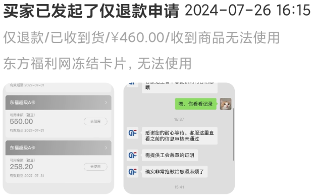
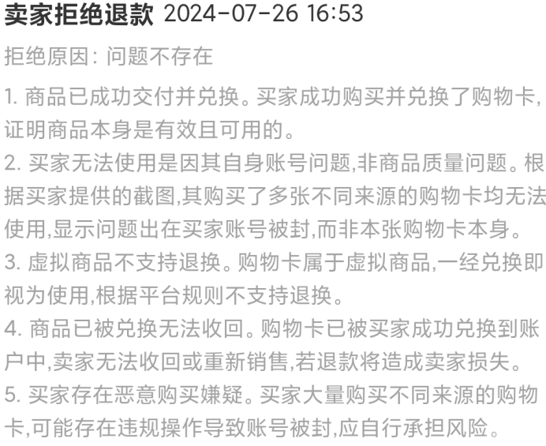
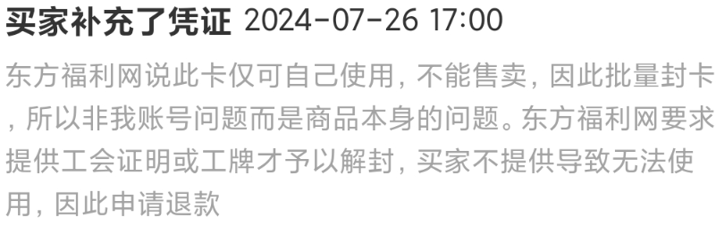
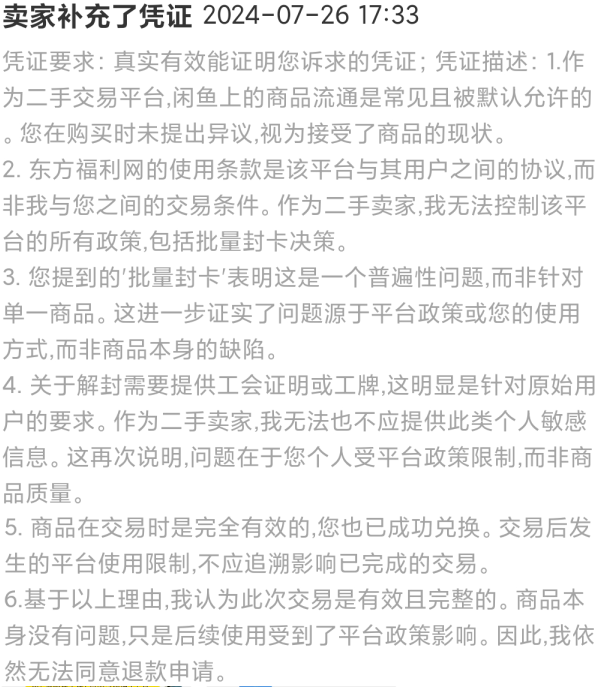
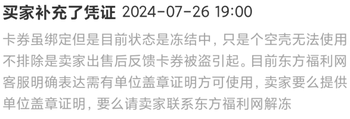
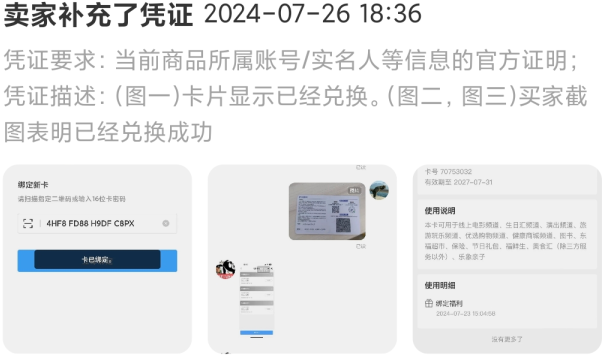
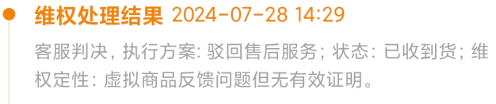

记录第一次在闲鱼上弄出交易纠纷

<!--more-->

---

妹想到在闲鱼上卖个超市卡也能搞出戏来。

作为卖家的我出掉了一张超市卡，以往这种公司发的超市卡通常只有卡贩子收，所以我交易的时候看到买家也不会多想。

将卡密刮开后拍照发给了买家。过了一天后买家告诉我超市卡被封，买家要求**仅退款**。

我虽说正在读《民法典100讲》但面对突如其来的 drama 还是有点不知所措。其中的难点在于我无法证明我发货后没有操作过卡密。如果买家咬定是我发货后用卡密做了什么手脚我也无法自证。一时间六子切腹取粉的画面欻欻刷过。

好在买家没按照这个思路走，而且他提供的封号截图可以证明出:"卡片兑换成功了，但是在兑换后账号被封了"。

我直接对 Claude 描述了我的处境, 于是就有了以下的辩论：

###### Round 1

| 买家:  |                                                              |
| :----------------------------------------------------------- | -----------------------------------------------------------: |
|                                                              | 我:  |

###### Round 2

| 买家:  |                                                              |
| :----------------------------------------------------------- | -----------------------------------------------------------: |
|                                                              | 我:  |

###### Round 3

| 买家:  |                                                              |
| :----------------------------------------------------------- | -----------------------------------------------------------: |
|                                                              | 我:  |

## 纠纷结果

