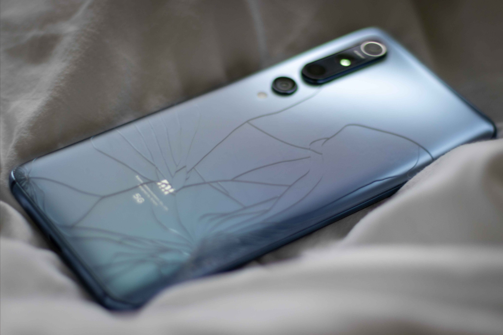
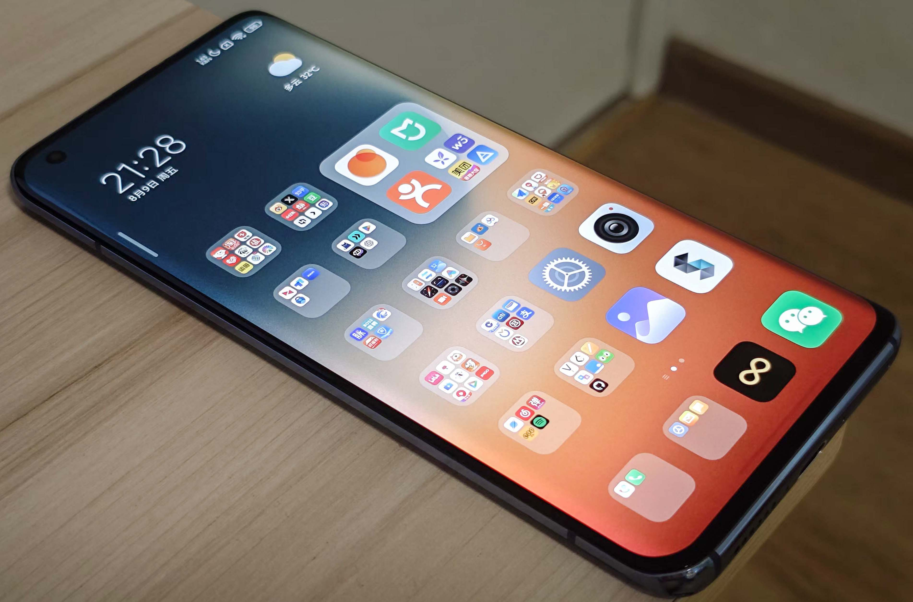
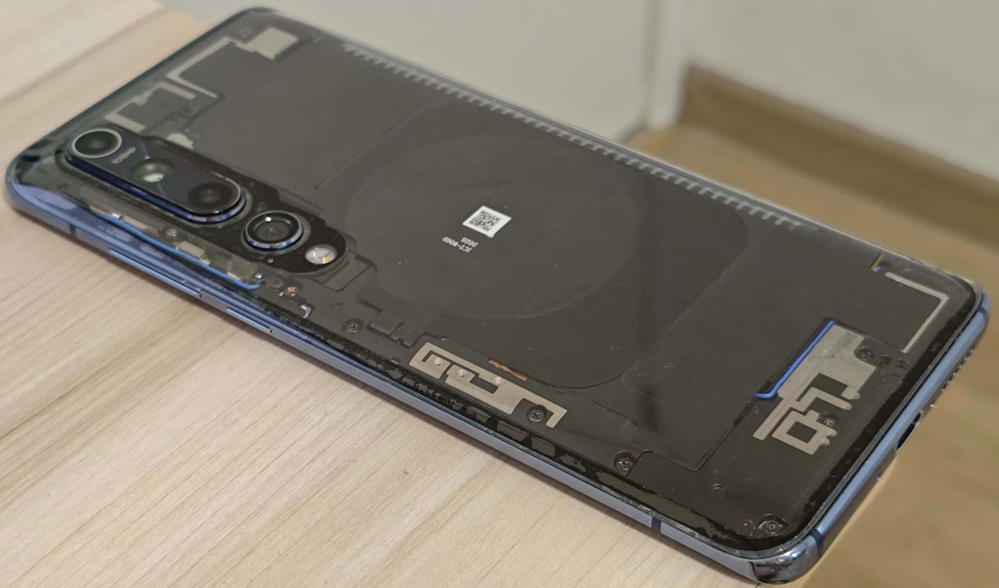
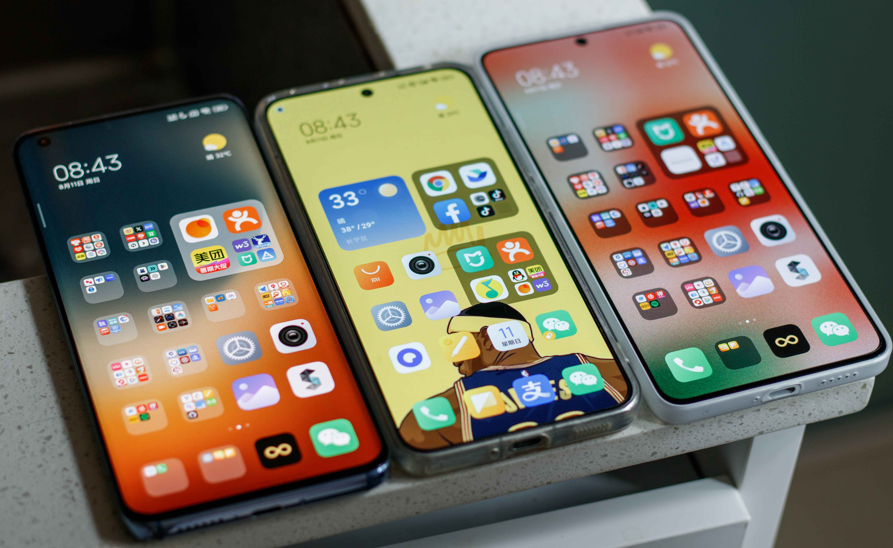

<!--more-->

在“海鲜市场”挂了一个月的小米10终于售出。这台手机我自行更换了透明后盖，心里清楚它不会很快卖掉，所以也做好了长时间等待的准备。

---

昨天突然接到一个女生的下单，还要求自提手机。我看到她的IP显示在广西，而她却告诉我不是她本人来拿货，这让我有些疑惑，于是处于慎重我选了天山派出所作为提货地点。

---

到了约定时间，昏暗的路灯下，一个外卖小哥出现了。我上前确认他是否来取手机，心中的疑惑更深——难道这位买家找了个外卖小哥验机，再让他帮忙发货回去？小哥把他自己的手机从外卖箱中拿出来，屏幕闪烁着，很明显是摔坏了。接着他端详了我的手机半天，然后接到一个女生的电话，小哥操着方言说到：“手机没有问题，你点下收货吧。”

---

这时我才恍然大悟，原来是小哥的手机摔坏了，他的女朋友远在广西，从他所在的上海附近找了一部二手机。

---

我的 小米10 是 2021 年买的，那一年我在“海鲜市场”淘过四部手机，最满意的就是这台。E6曲面屏、双1216扬声器、一亿像素摄像头，国风雅灰玻璃后盖，再加上"那一年"的 MIUI 系统。

---

即使到了现在，尽管人们对屏幕形态的认知经历了螺旋上升式的变化，以及“频闪”这一或真或假的新概念的出现，这依然是一部不错的手机

---

而在这个故事里，这些所谓的参数似乎并没有那么重要。

---

也许买家最终选择购买，仅仅是因为在“海鲜市场”的距离排序里，我的手机离她男朋友“最近”。

---

