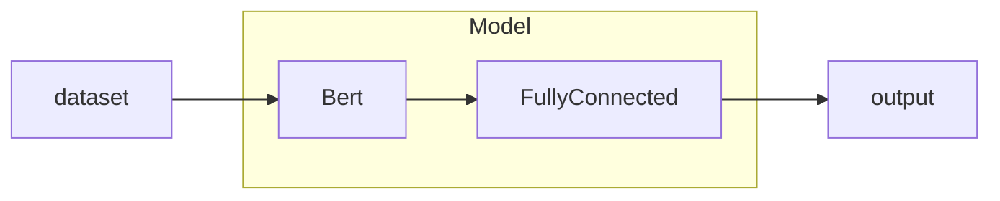

This guide provides a practical introduction to the Hugging Face ecosystem. You'll learn how to find and use models via the API, work with key components like Transformers and Tokenizers, and grasp the fundamentals of fine-tuning. Finally, we cover designing, training, and evaluating custom models for downstream tasks.

<!--more-->

## Hugging face intro

The paltform where the machine learning community collaborates on models, datasets, and applications.

Hugging Face provide `transformers` library, which is using to load and use pre-trained models. It also provides `datasets` library, which is used to load datasets. The `tokenizers` library is used to tokenize text data.

```bash
pip install transformers datasets tokenizers
```

## Models categories

The models are categorized into different types.

#### Task

+ Text Generation: GPT, BERT, T5, etc.
+ Any-to-Any: Translation, Summarization, etc.
+ Image-Text-to-Text: CLIP, BLIP, etc.
+ Text-to-Video: VideoGPT, etc.

#### Parameters

+ < 1B: gpt2
+ 1B - 6B: whisper-large-v3
+ 6B - 12B: qwen2
+ 12B - 32B: DeepSeek-R1-Distill-Qwen-14B
+ 32B - 128B: LLaMA-2-70B
+ 128B - 500B: DeepSeek-V2.5
+ \> 500B: DeepSeek-R1

#### Libraries

+ Pytorch: The primary deep learning framework, offering flexibility for building and training most Hugging Face models.
+ TensorFlow: A powerful, production-ready framework also supported by Hugging Face for building and deploying models.
+ JAX: A high-performance framework for cutting-edge research and fast model training on modern hardware accelerators.
+ Transformers: The core library providing a unified interface to thousands of pretrained models for various tasks.
+ Diffusers: A specialized library providing easy access to state-of-the-art models for image and audio generation.

#### Apps

+ vLLM: A versatile language model supporting a wide range of tasks, including text generation and understanding.
+ TGI: A framework for building and deploying text generation models with a focus on efficiency and scalability.
+ llama.cpp: A lightweight implementation of LLaMA models for efficient inference on various devices.

#### Inference Providers

+ Cerebras: A provider offering high-performance inference solutions for large language models.
+ Novita: A platform specializing in efficient inference for various machine learning models.
+ Nebius AI: A provider focused on scalable and efficient inference solutions for AI applications.

#### Licenses

+ apache-2.0: A permissive license allowing for wide usage and modification, commonly used in open-source projects.
+ mit: A simple and permissive license allowing for free use, modification, and distribution.
+ openrail: A license designed to promote open collaboration and sharing of AI models and datasets.
+ cc-by-nc-4.0: A Creative Commons license allowing for non-commercial use, requiring attribution to the original creator.

## Hugging Face API

### Online request hf directly

```python
import requests
API_URL = "https://api-inference.huggingface.co/models/gpt2"
API_TOKEN = "*"
headers = {"Authorization": f"Bearer {API_TOKEN}"}

def query(payload):
    response = requests.post(API_URL, headers=headers, json=payload)
    return response.json()
```

### Offline use

#### Download

```python
from transformers import AutoModel, AutoTokenizer
model_name = "bert-base-uncased"
cache_dir = "model/bert-base-uncased"

model = AutoModel.from_pretrained(model_name, cache_dir = cache_dir)
tokenizer = AutoTokenizer.from_pretrained(model_name, cache_dir = cache_dir)
```

Model in local structure:

```bash
- bert-base-uncased
  ├ blobs
  ├ refs
  ┗ snapshots
    ┗ (base64)
      ├ config.json
      ├ model.safetensors
      ├ tokenizer.json
      ├ tokenizer_config.json
      ┗ vocab.txt
```

- **config.json:** Defines the model's architecture and hyperparameters, like hidden size and number of attention heads.
- **model.safetensors:** Contains the model's trained weights in a secure and efficient format for fast loading.
- **tokenizer.json:** A single file that holds all the necessary tokenizer information, including vocabulary and rules.
- **tokenizer_config.json:** Specifies tokenizer settings, like whether to lowercase text, and special token information.
- **vocab.txt:** Lists the vocabulary of the tokenizer, mapping each token to a unique ID.

## Transformers Library

### text-generation

```python
from transformers import AutoModelForCausalLM, AutoTokenizer, pipeline
model_dir = r"/path"

model = AutoModelForCausalLM.from_pretrained(model_dir)
tokenizer = AutoTokenizer.from_pretrained(model_dir)

pipe = pipeline("text-generation", model=model, tokenizer=tokenizer, device="cuda")
output = pipe("Hello, I'm a language model,", max_length=50, num_return_sequences=1)
print(output[0]['generated_text'])
```

#### Tuning parameters

```python
#...
output = pipe("Hello, I'm a language model,", # prompt, as the initial text, text-generation based on this
             max_length=50, # maximum length of the generated text, 50 tokens
             num_return_sequences=1, # number of generated sequences to return, 1 sequence
             truncation=True, # truncate the input text if it exceeds the model's maximum length
             temperature=0.7, # controls randomness in generation, lower values make output more deterministic. Higher values (e.g., 1.0) make it more random.
             top_k=50, # limits the sampling to the top k most probable tokens, reducing randomness and focusing on high-probability tokens. top_k=50 means only the top 50 tokens are considered.
             top_p=0.95, # nucleus sampling, considers the smallest set of tokens whose
             clean_up_tokenization_spaces=False, # whether to clean up spaces in tokenization, False means no cleanup
```

### text-classification

```python
from transformers import AutoModelForSequenceClassification, AutoTokenizer, pipeline

model_dir = r"/path/to/your/model"
model = AutoModelForSequenceClassification.from_pretrained(model_dir)
tokenizer = AutoTokenizer.from_pretrained(model_dir)

pipe = pipeline("text-classification", model=model, tokenizer=tokenizer, device="cuda")
output = pipe("This is a great movie!", truncation=True, max_length=512)

# output
# [{'label': 'POSITIVE', 'score': 0.9998}]
```

### question answering

```python
from transformers import pipeline
pipe = pipeline("question-answering", model="distilbert-base-cased-distilled-squad", device="cuda")
result = pipe({
    'question': 'What is the capital of France?',
    'context': 'Paris is the capital of France.'
})
```

## Tokenizer

### vocab

BERT tokenizer uses a vocabulary transform the text into tokens. The vocabulary includes all the tokens that the model can understand. Each token is mapped to a unique ID, which is used as input to the model.

### text to tokens

Using the tokenizer to convert text into tokens and then convert to index IDs. This step need to make sure the length of text and special tokens are same as the model's input requirements.


```python
from transformers import BertTokenizer

tokenizer = BertTokenizer.from_pretrained("bert-base-uncased")

sentences = ["Hello, how are you?", "I am fine, thank you!"]
encode_output = tokenizer.batch_encode_plus(
    batch_text_or_text_pairs=[sentences[0], sentences[1]],
    add_special_tokens=True,  # Add [CLS] and [SEP] tokens
    truncation=True,  # Truncate sentences to the model's max length
    padding="max_length",  # Pad sentences to the max length
    max_length=128,  # Set the maximum length for padding/truncation
    return_tensors=None # Available options: "pt" (PyTorch), "tf" (TensorFlow), "np" (NumPy)
    return_attention_mask=True,  # Return attention masks for the input tokens
    return_token_type_ids=True,  # Return token type IDs for distinguishing sentences in pairs
    return_special_tokens_mask=True,  # Return a mask indicating special tokens
    return_offsets_mapping=True,  # Return offsets for each token in the original text
    return_length=True,  # Return the length of each encoded sentence
)
for k, v in encode_output.items():
    print(f"{k}: {v}")
print(tokenizer.decode(encode_output['input_ids'][0]))
```

### add tokens

```python
from transformers import BertTokenizer
tokenizer = BertTokenizer.from_pretrained("bert-base-uncased")
new_tokens = ["[NEW_TOKEN1]", "[NEW_TOKEN2]"]
num_added_tokens = tokenizer.add_tokens(new_tokens)
print(f"Added {num_added_tokens} new tokens.")
print(f"New vocabulary size: {len(tokenizer)}")

encode_output = tokenizer.encode(
  text="This is a NEW_TOKEN1 example.",
  text_pair=None,  # No second text input
  truncation=True,
  padding="max_length",
  max_length=128,
  add_special_tokens=True,
  return_tensors=None)
print(f"Encoded output: {encode_output}")
print(f"Decoded text: {tokenizer.decode(encode_output)}")
```

## Fine-tuning

### concepts and workflow

`Fine-tuning` means base on the pre-trained models, train the models to adapt to specific downstream tasks. **BERT** model, as an example, through pre-training to learn general language representations, and then fine-tuning on specific tasks like **sentiment analysis** and named **entity recognition**. In the fine-tuning process, the `pre-trained level of the model is locked`, and only the task-specific layers are trained. This approach allows the model to leverage the knowledge learned during pre-training while adapting to the specific requirements of the downstream task.

### Load dataset

Dataset of Sentiment analysis task includes text data and corresponding labels indicating sentiment (e.g., positive or negative). Using Hugging Face's `datasets` library, you can easily load and preprocess datasets for training and evaluation. 

```python
# offline load dataset
from datasets import load_dataset
dataset = load_dataset('csv', data_files='path/to/your/dataset.csv')
print(dataset)
```

```python
# CustomDataset.py
from torch.utils.data import Dataset
from datasets import load_from_disk
class CustomDataset(Dataset):
    def __init__(self, dataset_path):
        self.dataset = load_from_disk(dataset_path)
    def __len__(self): # get the length of the dataset
        return len(self.dataset)
    def __getitem__(self, idx): # specified operation for dataset
        return self.dataset[idx]['text'], self.dataset[idx]['label']
dataset = CustomDataset('path/to/your/dataset')
for data in dataset:
    print(data)  # Each data is a tuple (text, label)
```

### Downstream tasks design

Befor fine-tuning, you need to design the downstream tasks. This includes one or more full-connected layers, which are used to adapt the pre-trained model to the specific task. 

```python
# network.py
from transformers import BertModel
import torch
# Define the device for model training
DEVICE = torch.device("cuda" if torch.cuda.is_available() else "cpu")
pretrained = BertModel.from_pretrained("bert-base-uncased").to(DEVICE)
# Define downstream task model
class DownstreamTaskModel(torch.nn.Module):
    # Initialize the model with a pre-trained BERT model and a classifier layer
    def __init__(self, pretrained_model, num_labels):
        super(DownstreamTaskModel, self).__init__()
        self.bert = pretrained_model
        self.fc = torch.nn.Linear(self.bert.config.hidden_size, num_labels)

    def forward(self, input_ids, attention_mask=None, token_type_ids=None):
        # Only the downstream task model will be trained, upstream model do not need to be trained(locked)
        with torch.no_grad():
            output = pretrained(input_ids=input_ids, attention_mask=attention_mask, token_type_ids=token_type_ids)
        # Downstream training
        output = self.fc(output.last_hidden_state[:, 0])  # Use the [CLS] token representation
        return output.softmax(dim=1)  # Apply softmax to get probabilities
```



### Custom Model training

```python
import torch
from CustomDataset import MyDataset
from torch.utils.data import DataLoader
from network import Model
from transformers import BertTokenizer, AdamW

# Define devices
DEVICE = torch.device("cuda" if torch.cuda.is_available() else "cpu")
EPOCHS = 100 # training times

tokenizer = BertTokenizer.from_pretrained("bert-base-uncased")
# Encode the dataset
def collate_fn(data):
  sentences, labels = [i[0] for i in data], [i[1] for i in data]
  data = tokenizer.batch_encode_plus(
    batch_text_or_text_pairs=sentences,
    truncation=True,
    padding="max_length",
    max_length="128,
    return_tensors="pt",  # Return PyTorch tensors
    return_length=True,  # Return the length of each encoded sentence
  )
  input_ids = data['input_ids']
  attention_mask = data['attention_mask']
  token_type_ids = data.get('token_type_ids', None)  # Optional, used
  label = torch.LongTensor(labels)  # Convert labels to tensor
  return input_ids, attention_mask, token_type_ids, label
# Create dataset
train_dataset = MyDataset("train")
# Create DataLoader
train_loader = DataLoader(
  dataset=train_dataset,
  batch_size=32,  # Batch size for every load
  shuffle=True,  # Shuffle the dataset for each epoch
  drop_last=True,  # Drop the last incomplete batch
  collate_fn=collate_fn  # Custom collate function for batching
)

if __name__ == "__main__":
    model = Model().to(DEVICE)  # Initialize the model
    optimizer = AdamW(model.parameters(), lr=5e-4)  # Optimizer for training
    loss_fn = torch.nn.CrossEntropyLoss()  # Loss function for classification
    for epoch in range(EPOCHS):
        for i, (input_ids, attention_mask, token_type_ids, labels) in enumerate(train_loader):
            input_ids = input_ids.to(DEVICE)
            attention_mask = attention_mask.to(DEVICE)
            token_type_ids = token_type_ids.to(DEVICE) 
            labels = labels.to(DEVICE)
            # Forward computation
            outputs = model(input_ids=input_ids, attention_mask=attention_mask, token_type_ids=token_type_ids)
            # Calculate loss
            loss = loss_fn(outputs, labels)
            # optimization steps
            optimizer.zero_grad()  # 1.lear gradients
            loss.backward()  # 2.Backpropagation
            optimizer.step()  # 3.Update model parameters
            if i % 5 == 0:  # Print loss every 5 batches
                print(f"Epoch [{epoch+1}/{EPOCHS}], Step [{i+1}/{len(train_loader)}], Loss: {loss.item():.4f}")
                accuracy = (outputs.argmax(dim=1) == labels).sum().item() / len(labels)
                print(f"Accuracy: {accuracy:.4f}")

```

### Save the model

After training the model, you can save the model parameters and configuration to a file. This allows you to load the model later for inference or further training.

```python
# Save the model
torch.save(model.state_dict(), "sentiment_analysis_model.pt")
# Load the model
model = Model()
model.load_state_dict(torch.load("sentiment_analysis_model.pt"))
model.eval()  # Set the model to evaluation mode
```

### Evaluate the model

Accuracy is a common metric for evaluating classification models. It measures the proportion of correct predictions made by the model compared to the total number of predictions.

The test of model is similar to the training process, but without the optimization steps. You can use the same dataset and DataLoader, but set the model to evaluation mode and disable gradient calculation.

```python
#...
if __name__ == "__main__":
    model = Model().to(DEVICE)  # Initialize the model
    model.load_state_dict(torch.load("params/2bert.pt"))  # Load the trained model parameters
    model.eval()  # Set the model to evaluation mode
    correct = 0
    total = 0
    with torch.no_grad():  # Disable gradient calculation for evaluation
        for input_ids, attention_mask, token_type_ids, labels in train_loader:
            input_ids = input_ids.to(DEVICE)
            attention_mask = attention_mask.to(DEVICE)
            token_type_ids = token_type_ids.to(DEVICE)
            labels = labels.to(DEVICE)
            outputs = model(input_ids=input_ids, attention_mask=attention_mask, token_type_ids=token_type_ids)
            _, predicted = torch.max(outputs.data, 1)  # Get the predicted class
            total += labels.size(0)  # Update total count
            correct += (predicted == labels).sum().item()  # Count correct predictions
    accuracy = correct / total  # Calculate accuracy
    print(f"Accuracy: {accuracy:.4f}")
```