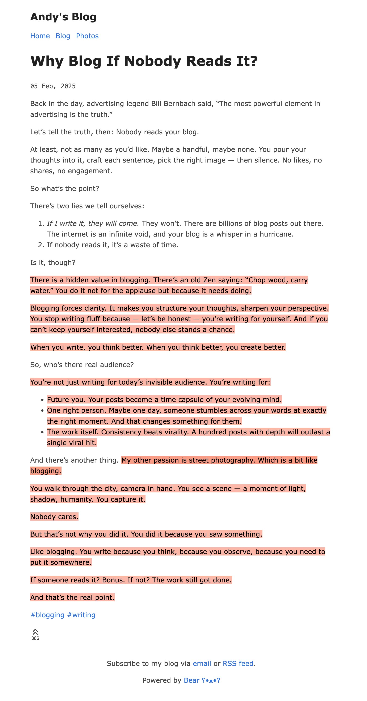

If you look at 'usefulness' from a conventional viewpoint, certain knowledge might appear useless for the time being, maybe pursued simply out of curiosity. Yet, later in life, you may discover that very knowledge becomes useful, perhaps even vitally important.

<!--more-->

---

Sources:

+ ~~https://andysblog.uk/why-blog-if-nobody-reads-it/~~
+ https://mp.weixin.qq.com/s/7n2HcUaANewb3aIkE5n_LQ

---

When I was reading *Zen and the Art of Motorcycle Maintenance*

I found it puzzling why knowledge could cause pain, why the lack of ambition in people around you made you feel even worse, and why bad situations often tend to become even worse when encountered. 

These two articles provided some answers

+ All that is useless is useful
+ Gain benefit from suffering, instead of letting bad things deteriorate further.

The key point is to seek meaning *in the process* of doing them, rather than dismissing them outright.

I particularly liked the description in the section about the camera,

> You walk through the city, camera in hand. You see a scene - a moment of light,
shadow, humanity. You capture it.

>
> Nobody cares.

>
> But that's not why you did it. You did it because you saw something.

>
> Like blogging. You write because you think, because you observe, because you need to
put it somewhere.

>
> If someone reads it? Bonus. If not? The work still got done.

>
> And that's the real point.

**You are what you observe/think/write/practice/feel...**

> No idea why the first article is missing, here is the article screenshot
>
> 

