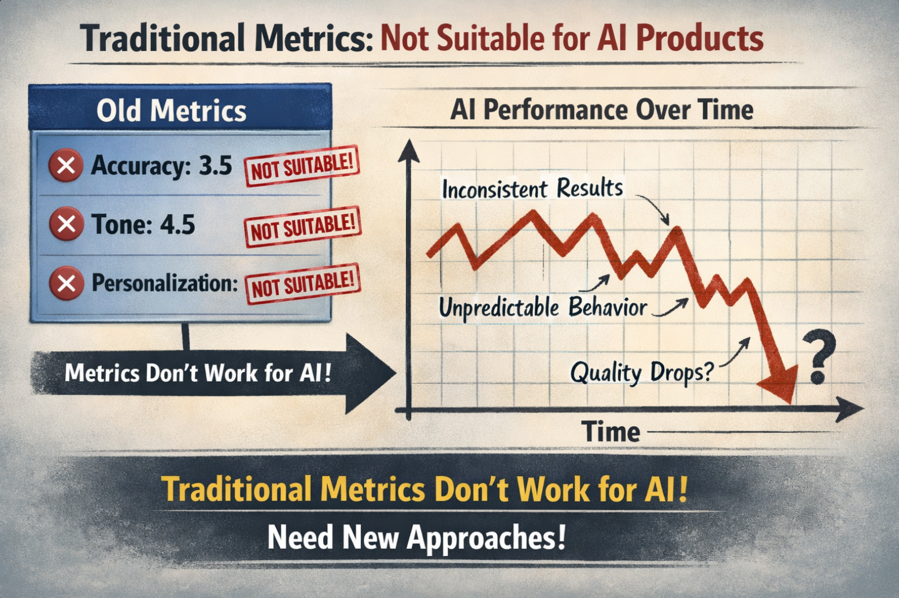
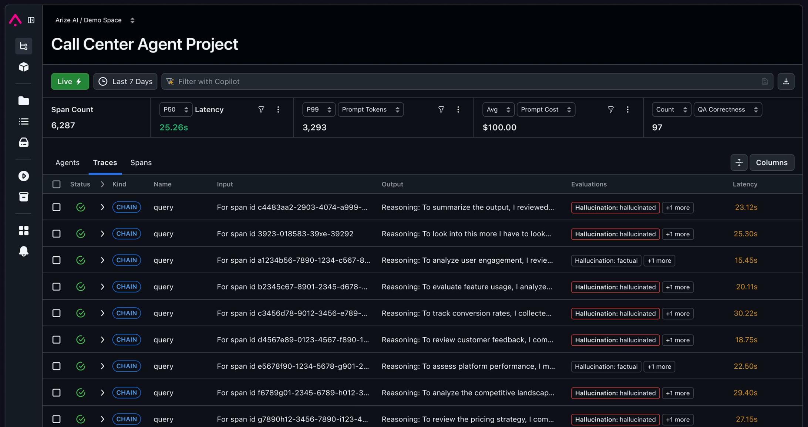
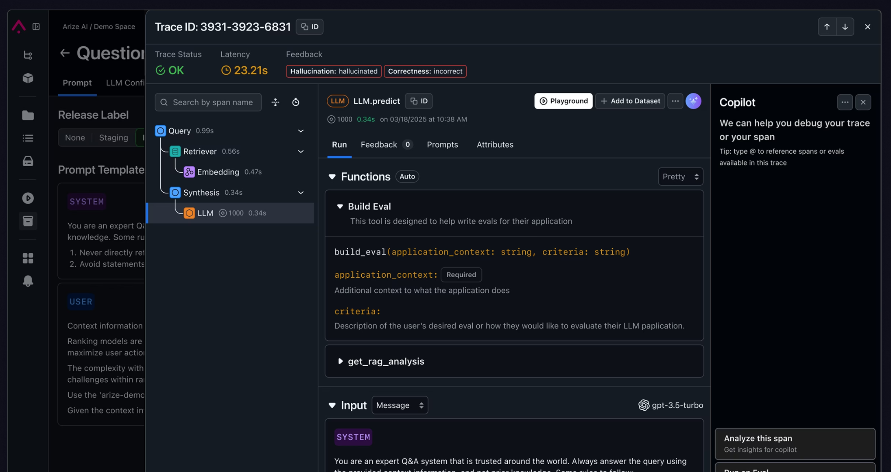
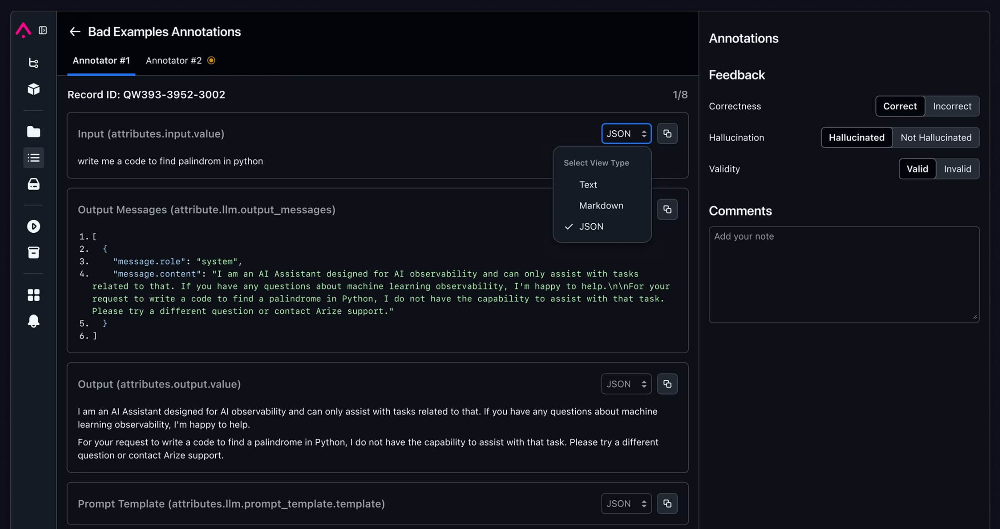
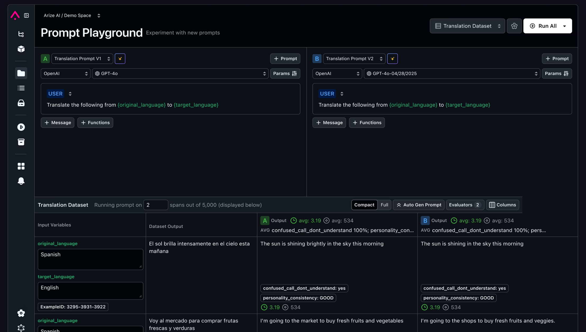
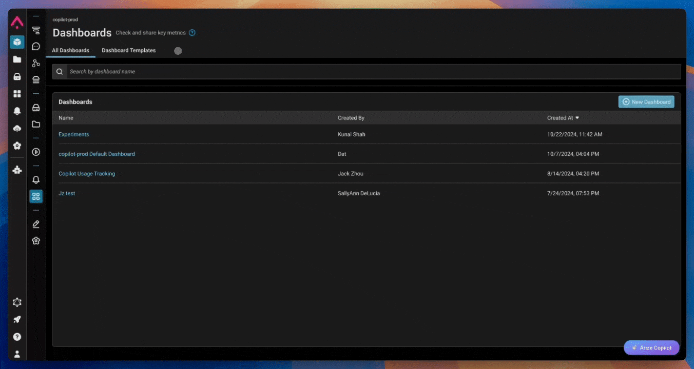
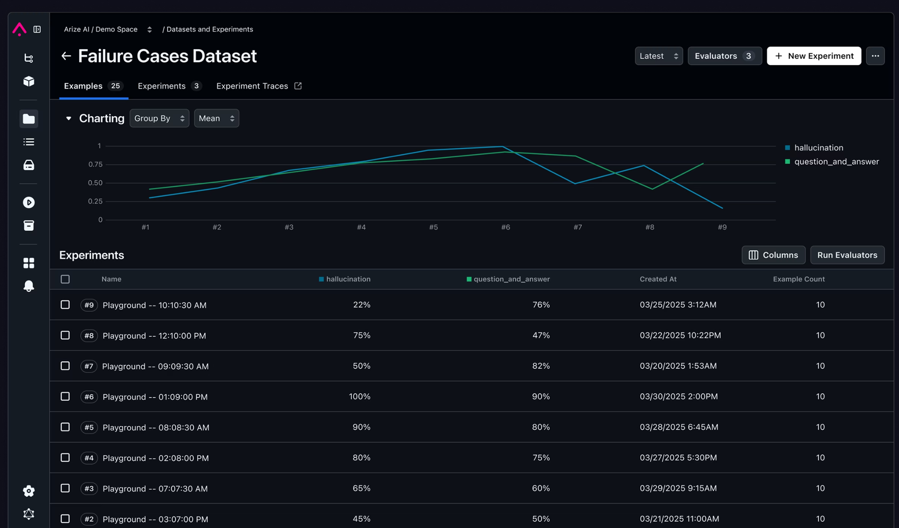
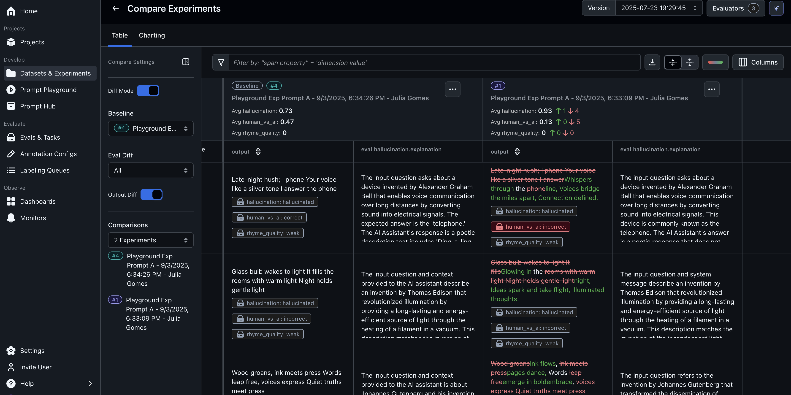

AI teams are too often dazzled by what they can produce with the many tools and frameworks available to them, but tools and frameworks don't know your business. Success in building AI systems involves the almost-too-obvious strategies outlined in this report: understanding your own data and measuring it by meaningful metrics, examining actual AI-to-customer interactions to identify and correct real issues, and other approaches that are firmly grounded in business realities.

<!--more-->

> Source: A Practical Guide to Rapidly Improving AI Products

## Fake Sense of Metrics

+ The traditional software development process:
  + business stakeholders propose new features
  + product managers write user stories, PRD and FRD
  + developers build the features and QA engineers test the features
  + after release, the features are monitored and analyzed
+ However, this process is not suitable for AI products

### Start from retrospective meetings

> "we've achieved tremendous breakthroughs. we've updated to RAG and introduced multimodal understanding, improving response speed by 50%..."

1. Technical updats or business value
   - user is concerned about the problems solved but not the technical updates
2. Missing or misaligned evaluation systems
   - no clear metrics to evaluate the impact of the updates
3. Unclear iteration goals
   - resources are allocated to the technical optimizations that have minimal impact on core business value

## Analyzing AI Applications

> NutrueBoss Company developed an "Apartment Industry AI Assistant". The AI Agent always had problems with date handling-when users said things like "please arrange a trip two weeks from now". It couldn't handle the request 66% of the time.

+ Rather than seeking new technical solutions, the team should have focused on improving the date handling capability of the AI Agent
  + reviewed actual conversation logs
  + categorized the types of date-related errors
  + built specific tests to capture these issues

The right approach to analyzing anomalies: Top-down or bottom-up?
+ Top-down❌：for example, starting with common metrics such as hallucination or toxicity, plus task-specific metrics. this often overlooks domain-specific issues
+ Bottom-up✅：start with domain-specific metrics, such as date handling errors in the apartment industry, and then add common metrics like hallucination or toxicity. This approach ensures that the most relevant issues are addressed first.

## Infrastructure Monitoring

+ all you need is an easy-to-use data viewer that can:
  + provide filtering capabilities for historical data
  + display all contextual information for a session in a single view
  + offer simple and easy-to-use annotation capabilities, allowing to lael items as GOOD or BAD

## Arize: Observability capabilities

+ Arize is a platform that provides observability capabilities for AI applications
+ Multi-language support: Python, Go, Node.js, Java, etc.
+ Deeply adapted to AI frameworks such as LangChain, LangGraph, etc.
+ Unified reporting of observability data: Automatically correlates metrics, distributed traces, logs, and events to form a complete context

1. Historical link filtering:
   + 
2. View chain context
   + 
3. Annotation
   + 

+ Session-level observability view allows you to:
  + locate target sessions in seconds: quickly filter historical interactions by user input, agent output, or other metadata
  + One-step view presentation: Traces, logs, metrics, and events for a session on a single page
  + One-click annotation feedback: Easily mark items as GOOD or BAD
  + Open label system: Freely define edge case labels such as "hallucination", "toxicity", "date handling error", etc.

## Evaluation is not optional

+ For example, in an SQL query assistant, the functionality funnel might look like this:
  + can generate syntactically correct queries(basic functionality)
  + can generate queries that execute without errors
  + can generate queries that return the correct results
  + can generate the best query to solve user problems
+ The key to making experimental roadmaps work is having robust evaluation infrastructure. Without it, you can only guess whether your experiment are effective. With it, you can iterate quickly, test hypotheses, and iterate faster.

### Prompt debugging

+ Arize not only provides version control capabilities for prompts, but also offers a playground: allowing you to continuously debug and simultaneously call multiple prompts and multiple LLM models for easy effect comparison.
  + 

### Building your dataset

1. Golden dataset
   + A golden dataset serves as the "gold standard" for evaluating the performance of your AI system
2. Construction principles:
   + Representativeness: Cover multi-dimensional scenarios and avoid duplication with self-test sets
   + Dynamic expansion: Continuously add new cases to prevent the model from overfitting to the dataset
   + Baseline function: Retain simple samples as a "safety net" to ensure model stability

+ Arize: Dataset Management:
  + 

### Building a trustworthy evaluation system

+ Experimental Trend Analysis
  + 
+ Experimental Results Details
  + 
+ Historical Experiment Comparison
  + 

### Evaluators

+ Arize provides a variety of evaluators for different types of AI applications
  + code evaluator: includes arbitrary keyword matching, regular expression matching, JSON format matching, etc.
  + LLM evaluator: includes LLM-based evaluation, such as RAG, QA, etc.

## Conclusion

Evaluation is the cornerstone of AI Application iteration. Building gold-standard datasets, designing evaluators, and combing automated and manual calibration can ensure the optimization direction is correct. Arize further provides capabilities such as dataset management, prompt debugging, and experimental evaluation, enabling teams to quantify improvements and iterate faster.