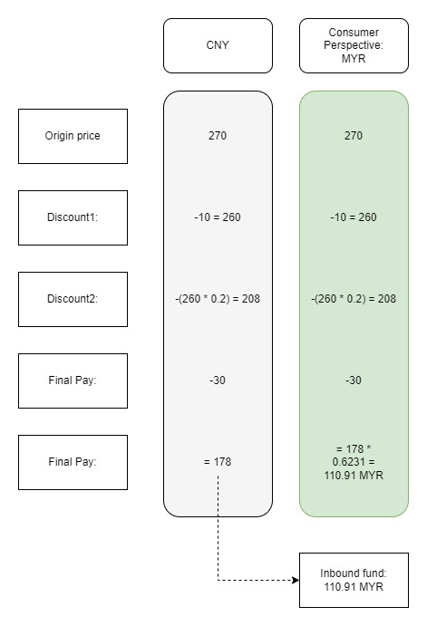
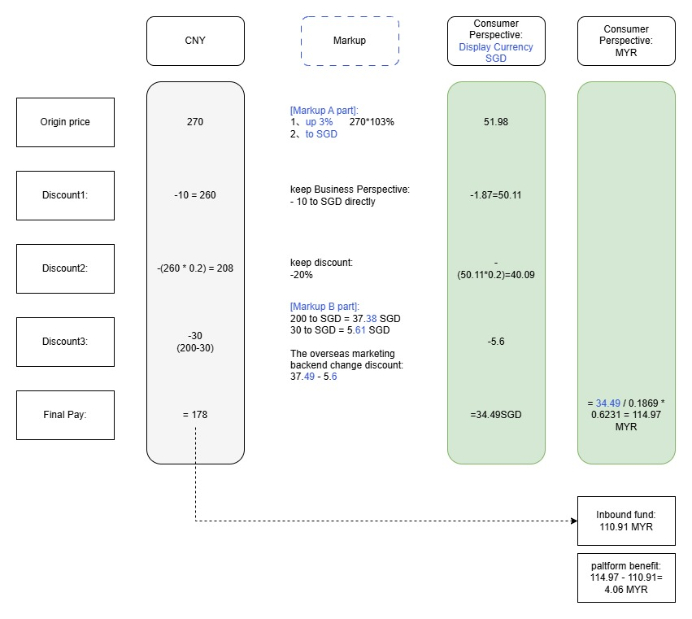
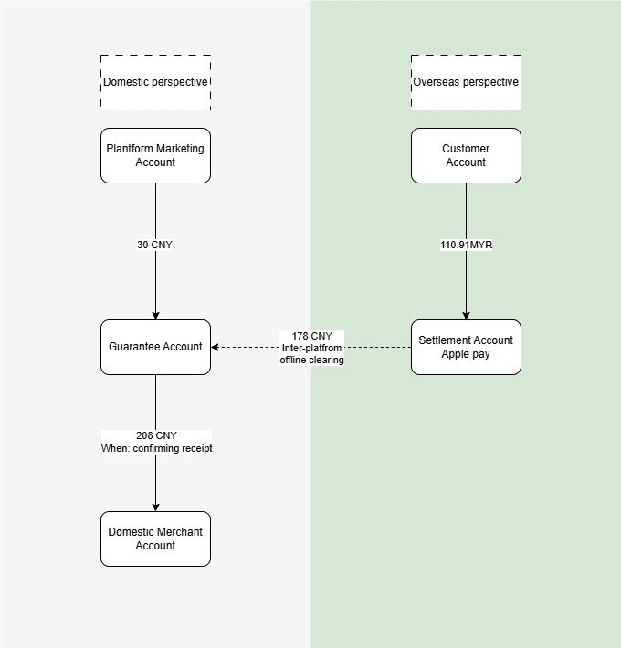
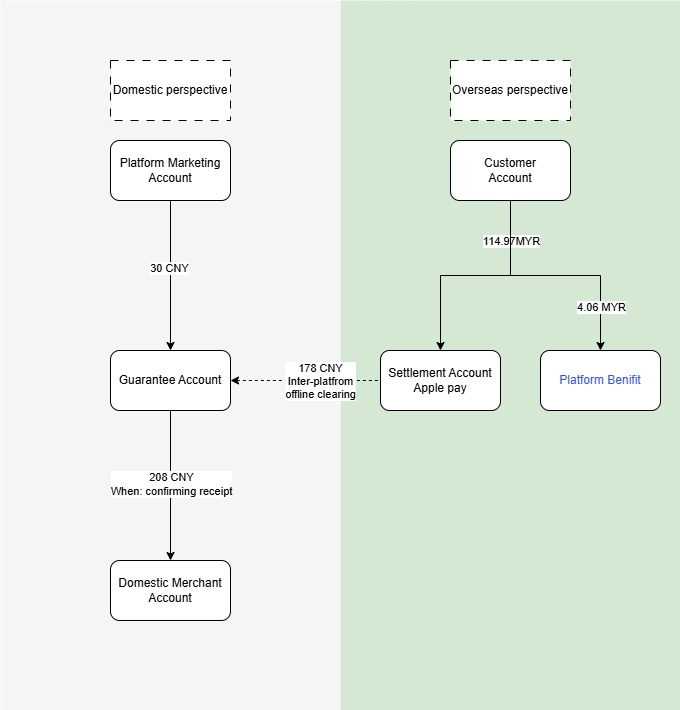
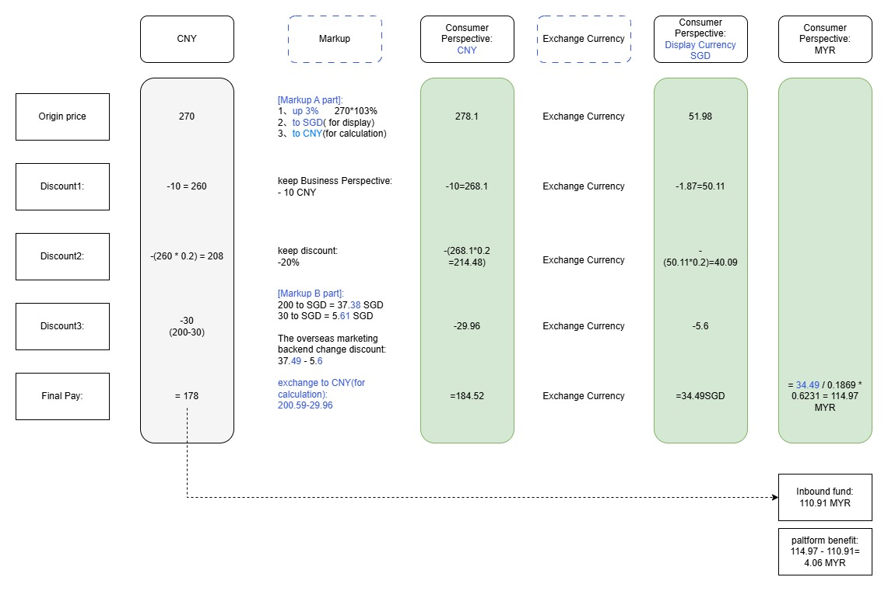

The currency internationalization project spans multiple core domains including transactions, marketing, and funds, involving complex pricing systems and fund flow designs. Particularly under the differentiated pricing strategy from B/C perspectives, the design approach to ensure consistency in discount calculations and data integrity across multiple order views is worth careful consideration
<!--more-->

## What is currency internationalization

|                 | CNY      |                                        |                  | SGD      |                                |                  |
| --------------- | -------- | -------------------------------------- | ---------------- | -------- | ------------------------------ | ---------------- |
|                 | Subtotal | Discount                               | Payment required | Subtotal | Discount                       | Payment required |
| Order Placement | 218      | 27(platform12%)+20(product20.01-20)=47 | 171              | 40.6     | 5(platform12%)+3(product4-3)=8 | 32.6 MYR(103.39) |
| Shopping Cart   |          | -47                                    | 171              |          | -19%                           | 32.6             |
| Order           |          | 27(platform12%)+20(product20.01-20)=47 | 171              |          | 5(platform12%)+3(product4-3)=8 | 32.6             |
| Home            |          |                                        | 171              |          | -19%                           | 32.6             |
| Search          |          | platform12%                            | 171              |          | -19%                           | 32.6             |
| Product Details | 218      | 27(platform12%)+20(product20.01-20)=47 | 171              | 40.6     | 5(platform12%)+3(product4-3)=8 | 32.6             |

The foreign currency amounts based on their location.

However, it's not direct conversion from CNY to foreign currency. Because there is an important requirement: product prices for consumers need to be expressed with a markup. For example, 270 CNY is not expressed as the equivalent 49.84 SGD, but rather as the marked-up 50.98 SGD. The end goal is for consumers to pay slightly more while merchants receive the same amount, with the difference serving as platform income for platform. This can be usually understood as "price inflation". Similarly, discount thresholds and discount amounts are adjusted accordingly.

+ Why the markup?
  + For marketing purposes, we need to round prices to make them more localized, rather than directly converting exchange rates resulting in strange local currency expressions like 21.44
  + Consumer economics research has shown that odd-number pricing works better - pricing at $9.99 performs better in sales than rounding up to $10.00
  + The product made in China have obvious price advantages in various overseas locations. Through appropriate price increases, we can boost platform revenue and commercialization rates, allowing for more marketing investment subsidies to improve transaction conversion

Platform still operating with merchants' pricing in CNY, currency conversion is performed to obtain currency, and overseas cash register links are built to support consumers paying in foreign currencies.

Under the current markup setting, the newly added "currency expression" cannot be directly obtained through CNY conversion, meaning there are actually two sets of prices for one transaction.

### Related terms

| Concepts                 | Definition                                                   |
| ------------------------ | ------------------------------------------------------------ |
| FCY                      | Foreign Currency                                             |
| Payment Currency         | serves as the actual currency used at checkout               |
| Display Currency         | Each overseas site has a default currency, which serves as the marketing currency for that subsite, replacing the original CNY expression used overseas |
| Gold Standard Promotions | From a cash flow perspective, promotions can be divided into gold standard promotions and non-gold standard promotions. Gold standard promotions generate actual cash flows during fulfillment, typically funded by the platform; whereas non-gold standard promotions usually involve sellers voluntarily offering discounts to consumers, without underlying actual ash flows |

## Fund Calculation and Cash Flow Design in Multi-Currency Pricing Systems

Based on the markup/profit-and-loss settings, we need to consider how to calculate the currency + P&L, how funds drive operations, how to carry P&L, and how information flows should be recorded, among which fund calculation and cash flow are inseparable

+ Take a simple case as an example:
  + A user on the Singapore site(display currency SGD) sets up to pay using MRY
  + Price information: Original product price 270 CNY, offer one fixed price 260 CNY, offer two 20% discount, offer three spend over 200 get 30 off(funded by platform)
+ In simple terms:
  + Fixed price 260. 260 - (260 * 20%) - 30 = 178 CNY
  + The actual payment amount of 178 CNY serves as the acquiring amount for Apple Pay protocol payment, corresponding to the inbound funds of 178 CNY in the fund flow(ignoring overseas payment processing fees and other expense items)

### Initial Price Beautification

|                     | Original Version                      | Price Beautification                    |
| ------------------- | ------------------------------------- | --------------------------------------- |
| Calculation Formula |  |  |
| Cash Flow           |              |              |

### Challenge 1: Difficulty of foreign currency calculation

Most e-commerce system calculates prices in USD/EUR/SGD/CNY, and these calculation logics are scattered in countless places. Taking marketing alone as an example, different promotions have different calculation rules and allocation logic. At the same time, there are currently 300+ overseas overseas marketing tols, with each type of tool corresponding to different marketing. This leads to the first constraint: price calculations from the consumer perspective cannot use foreign currency, they must also use e-commerce system's native currency.

Specifically, Use CNY, which represents the equivalent value of the equivalent value of the currency, for calculations. After the calculations are completed, if expression is needed, convert back to equivalent foreign currency.

Current version, Consumers' perspective calculated using CNY:

### Challenge 2: Discount Depreciation

Suppose there is an additional discount four, which can reduce 180CNY

+ Business perspective pre-applied discount reduced to 178 CNY < Discount Four 180 CNY, therefore Discount Four experiences devaluation and only offsets 178 CNY
+ Customer perspective pre-applied discount reduced to 184.52CNY > Discount Four 180 CNY, therefore Discount Four does not devalue, 180 CNY full amount offset

At this point, discounts may be calculated from a single perspective only, or they may be calculated from both perspectives but with different discount amounts.

### Only solution: Overseas funding

To shift platform discount funding overseas, the system must reconcile the C-perspective with the B-perspective. The platform will use a Profit&Loss account to bridge the 0.04CNY gap, ensuring the merchant receives the full settlement. To prevent duplicate fund instructions, "gold-standard" discounts must be excluded from B-perspective system calculations. This integrates dual-perspective logic into a single funding stream. Success requires avoiding mixed funding and progressive merchant discounts to prevent financial inconsistencies.

### Challenge 3: Resolving exchange rate conversion discrepancies

+ Currency conversion rounding residuals (tail differences) create discrepancies between the consumer-paid amount and the merchant's expected settlement during the CNY-SGD-MYR transitions.
+ Solution: The platform utilizes a centralized Profit & Loss account as a buffer to absorb these minor variances. By anchoring the merchant's revenue to the original CNY base price and letting the P&L account "cover" the fractional gaps, the system ensures financial reconciliation. This prevents merchant dissatisfaction caused by "disappearing cents" while maintaining a seamless, multi-currency display for the consumer.