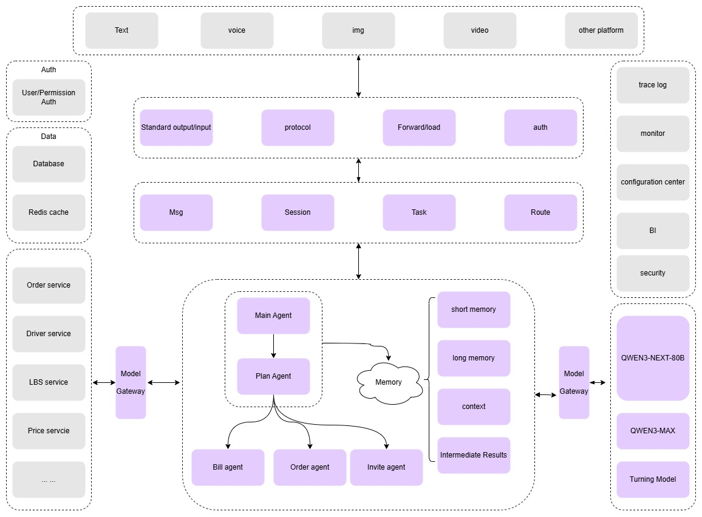

This project adopts an intelligent Agent platform architecture designed for the transportation domain, achieving a one-step travel service experience through AI that enables multi-end access, natural language interaction, and automatic task execution.
<!--more-->
## Overall Architecture

+ Centered on "user travel needs", the system reaches users through multiple access channels, utilizing **"independent intelligent agents"** and **"sub-intelligent agents"** to provide differentiated service capabilities. At its foundation, it relies on the **Qwen** general large model and **Whale** deployment business fine-tuned models, combined with core technologies such as **RAG, context engineering, and workflows**, to build powerful **intent understanding** and task execution capabilities. Meanwhile, the system integrates shared basic service tools including **transportation capacity, transactions, strategies, LBS, risk control, and marketing**, supporting cross-system calls and implementing unified model management and elastic scheduling through a model gateway.
+ Ultimately forming a highly available, scalable, and reusable intelligent travel service platform. The architecture diagram is as follows:



1. Access Channel Layer: Supports multi-end access including app, WeChat, mini-programs, and voice assistants, providing users with convenient entry points.
2. Business Scenario Layer: Focuses on various travel scenarios such as ride-hailing, car rental, and public transportation, delivering targeted services.
3. Application Capability Layer: Integrating intent recognition, slot extraction, context engineering, knowledge base RAG, workflow SOP, and Agent orchestration to provide robust application capabilities.
4. Foundation Model Layer: Provides underlying large model support, including general large models and business fine-tuned models.
5. Shared Basic Services and Data Infrastructure Layer: Offering essential services such as transportation capacity, transactions, strategies, LBS, risk control, and marketing, along with data storage and processing capabilities.

## Core Processes

### Access Interaction

+ Components: Input Access Layer + Output Layer
+ Core Responsibilities:
  - Uniformly process multi-end user inputs and standardize the generation of final responses, achieving a bidirectional interaction loop between the system and users.

### Semantic Understanding

+ Instant context: business information, user input. The core content includes: user information, session ID, full-link ID, original Query.
+ Short-term memory: user's current session information. The core purpose of short-term memory is to record the key information of the current session, including: user intent, slot information, context information, etc.
+ Long-term memory: user's historical interaction information. The core purpose of long-term memory is to store the user's historical interaction information, including: historical orders, preferences, feedback, etc.
+ RAG: Build a category-standard question-similar question system, recall relevant intents based on user input, and provide support for intent recognition and slot extraction.

### Slot Extraction and Clarification

+ Extract structured business parameters to support task execution.
+ Focus on accurately extracting structured business parameters from user input, ensuring the integrity and correctness of information for subsequent task execution.

### Task Execution

+ Task Distribution: Route to corresponding processing path based on recognized user intent and extracted slots.
+ Sub-Agent Collaboration: For complex tasks, coordinate multiple sub-agents to complete the task.

## Business Evaluation

### Evaluation Dataset Design

```json
{
  "sample_id": "unique_sample_identifier",
  "input": "User's natural language query or command",
  "context": ["String", ...],//multi-round conversation context
  "expected_output": "The ideal response or action expected from the system",
  "expected_actions": [
    {
      "api": "create_order",
      "parameters": {
        "pickup_location": "Location A",
        "dropoff_location": "Location B",
        "ride_type": "Standard"
      }
    }
  ],
  "metadata": {
    "domain": "ride-hailing",
    "subtask": "order_creation | order_cancellation | fare_estimation | driver_tracking",
    "difficulty_level": "easy | medium | hard",
    "user_attributes": {
      "user_id": "unique_user_identifier",
      "user_preferences": {
        "preferred_ride_type": "Luxury",
        "frequent_routes": ["Location A to Location B", ...]
      }
    }
  }
}
```
### Storage and Access

+ Storage Location: Excel + OSS online logs + database
+ Version Control: Configuration center
+ Access Interface: RESTful API

### Execution Process

1. Task Scheduler: supports manual triggering, scheduled tasks, and A/B testing.
2. Result Aggregator: collects and organizes execution results.
3. Root Cause Analyzer: analyzes failure reasons and provides improvement suggestions.

### Evaluation Results

+ Intent Recognition Accuracy: 90% (where order placement accuracy is 99%, recall rate is 86%, and F1-score is 92%)
+ Slot Recognition Accuracy: 93%
