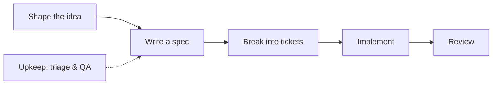

---

title: "Why I Dropped GSD and Superpowers for Matt Pocock's Skills"

# subtitle: "GPT-5 and Opus 5 plan well enough that mandatory pipelines became the bottleneck—not the safety net."

date: 2026-08-12T11:30:00+08:00
draft: false

tags: ["AI", "Agent", "Skills", "Cursor", "LLM"]
categories: ["Technology"]

hiddenFromHomePage: false
hiddenFromSearch: false

toc:
  enable: true
math:
  enable: false
lightgallery: true
license: ""
---
I adopted **Get Shit Done (GSD)** and **Superpowers** when coding agents still needed guardrails. They worked—until GPT-5.x and Claude Opus 5.x arrived. The guardrails started **capping** what the model could do, and the **default workflow** no longer matched how I actually work. I migrated to Matt Pocock skills: small, opt-in prompts that add discipline when I need it—not a mandatory pipeline on every message.
<!--more-->

## What GSD and Superpowers were built to fix

Two problems dominated early agent coding in 2024 and 2025:

1. **Context rot** — quality degrades as the conversation fills up.
2. **Undisciplined improvisation** — agents skip tests, skip planning, and ship plausible-looking garbage.

Two popular frameworks attacked those problems from different angles.

### Get Shit Done (GSD)

[GSD](https://gsd-build-get-shit-done.mintlify.app/introduction) is a spec-driven, phase-based orchestration system. Instead of one long chat, you run commands like `/gsd:new-project`, `/gsd:plan-phase`, and `/gsd:execute-phase`. Each phase gets a fresh context window. Project state lives on disk in a `.planning/` directory—requirements, research, plans, verification notes. Independent tasks can run in parallel "waves."

GSD's bet: **isolate context, persist state to disk, orchestrate sub-agents per phase.**

### Superpowers

[Superpowers](https://github.com/obra/superpowers) (widely bundled with Cursor) constrains the **development process** itself. Its entry skill literally requires invoking a relevant skill *before any response*—including clarifying questions. The flagship flow enforces brainstorming, written plans, TDD, subagent delegation, and verification checkpoints.

Superpowers' bet: **if the process is mandatory, the output gets disciplined.**

Both frameworks were reasonable responses to weaker models and messy agent behavior. I used both seriously. And then frontier models changed the tradeoff.

## Why GPT-5.x and Opus 5.x changed the equation

I'm not claiming models are perfect. They still hallucinate, still miss edge cases, still need human judgment. But GPT-5.x and Claude Opus 5.x are materially better at things these frameworks were compensating for:


| Capability                  | Weaker models (2024–early 2025) | GPT-5.x / Opus 5.x (2026)                       |
| --------------------------- | ------------------------------- | ----------------------------------------------- |
| Planning inside one session | Often lost the thread           | Holds a coherent plan across tool calls         |
| Test discipline             | Skipped unless forced           | Follows red-green-refactor when asked           |
| Context management          | Rot set in quickly              | Better at summarizing, prioritizing, recovering |
| Tool use                    | Fragile                         | Reliable enough for day-to-day feature work     |


When the model already plans, tests, and recovers well, **mandatory orchestration stops being a safety net and starts being a tax**.

That's the thesis: not "frameworks are stupid," but "the marginal value of heavy frameworks dropped below their marginal cost—*for the work I do, on the models I use today*."

## What broke for me

Two failure modes pushed me off GSD and Superpowers.

### 1. Frameworks limited the model's capabilities

Both systems wrap the agent in process contracts that run *before* and *around* the work:

- Superpowers blocks even simple exploration until a skill is invoked.
- GSD routes small changes through phase planning, `.planning/` artifacts, and execution waves.

On GPT-5.x and Opus 5.x, that wrapping often **prevented the model from taking the shortest correct path**. I'd watch the agent propose a clean fix, then get pulled into generating planning documents, spawning subagents, or re-deriving context the model already had.

The frameworks were designed to prevent the model from improvising badly. On new models, they also prevented it from improvising **well**.

### 2. Wrong default for my work

GSD shines on **marathon projects**: multi-day efforts, parallel workstreams, crash recovery from disk state. Superpowers shines when a team **needs forced TDD** and rigid subagent delegation.

Most of my day-to-day work isn't that. It's a feature slice, a bugfix, a refactor, a blog post, a design question. For that shape of work, the default pipeline was **over-scoped**:

- A one-session bugfix shouldn't need `/gsd:plan-phase`.
- A clarifying question shouldn't need a skill invocation gate.
- A spec I already discussed in chat shouldn't need a seven-phase Superpowers ceremony.

The frameworks optimized for the worst case and charged me on every task.

## Matt Pocock's skills: opt-in discipline

[Matt Pocock's skill system](https://www.aihero.dev/skills) takes the opposite default: **the model works normally until you invoke a skill**.

Matt describes it as "a practical skill system for engineers who want to use AI without giving up their standards." That matches my experience. Skills are composable recipes—`/grill-me` when I need sharper thinking, `/tdd` when I want test-first implementation, `/triage` when the issue backlog is messy.

The v1.0 release claimed a **63% token reduction** versus earlier skill designs—skills got smaller and more focused. v1.2 added Claude Code plugin support and skills like `/wait-what` for verbosity control. The system keeps evolving, but the core idea stays stable: **invoke discipline, don't mandate it**.

Install editable skills into your project:

```bash
npx skills@latest add mattpocock/skills
```

Update later with:

```bash
npx skills update
```

For Claude Code, there's also a managed plugin:

```bash
claude plugins install mattpocock-skills
```

Source repo: [github.com/mattpocock/skills](https://github.com/mattpocock/skills)

## Setup once: `/setup-matt-pocock-skills`

Before the engineering skills work together, run `/setup-matt-pocock-skills` once per repo. It configures:

- **Issue tracker** — GitHub, GitLab, local markdown under `.scratch/`, or a custom workflow
- **Triage labels** — `needs-triage`, `ready-for-agent`, etc.
- **Domain docs** — where `CONTEXT.md` and ADRs live

This replaces the implicit conventions GSD encodes in `.planning/` with **explicit, editable project docs** under `docs/agents/`. You change them when your team changes—no framework migration required.

## The main flow: idea → ship

Matt organizes skills into a spine. You don't run every step every time; you enter where you need to.




| Stage            | Skill(s)                                                                     | When to use                                                      |
| ---------------- | ---------------------------------------------------------------------------- | ---------------------------------------------------------------- |
| **Shape**        | `/grill-me`, `/grill-with-docs`, `/domain-model`, `/wayfinder`, `/prototype` | The problem is fuzzy; you need decisions before code             |
| **Specify**      | `/to-spec`                                                                   | You've discussed enough; publish a PRD/spec to the issue tracker |
| **Plan tickets** | `/to-tickets`                                                                | Break a spec into tracer-bullet issues with blocking edges       |
| **Implement**    | `/implement`, `/tdd`                                                         | Build against a spec or ticket; TDD when tests matter            |
| **Review**       | `/code-review`                                                               | Compare diff against standards and the originating spec          |
| **Upkeep**       | `/triage`, `/qa`                                                             | Keep the backlog agent-ready                                     |


**Wayfinder** deserves a special mention. It's Matt's answer to *large* uncertain work—but unlike GSD, it charts **decision tickets** on your issue tracker instead of dumping everything into `.planning/`. You resolve one decision per session until the route is clear. That's orchestration when you **choose** it.

## Daily drivers: the six I actually use

These are the skills called out on [aihero.dev/skills](https://www.aihero.dev/skills) and the ones I reach for most.

### `/grill-me`

A relentless interview—one question at a time, with recommended answers—until your plan is sharp. I used it to structure *this* blog post before writing. Trigger phrases: "grill me," `/grill-me`.

**Use when:** you're about to commit to a design and want holes poked in it.

### `/grill-with-docs`

Same grilling energy, but it writes **ADRs and glossary entries** as decisions land. Pairs with `/domain-model`.

**Use when:** the conversation should leave durable docs behind.

### `/domain-model`

Builds and sharpens `CONTEXT.md`, ADRs, and ubiquitous language. Other skills read this vocabulary; this skill **maintains** it.

**Use when:** terminology is ambiguous or architectural decisions need recording.

### `/tdd`

Red-green-refactor, integration tests at agreed seams, verification before claiming done. This is Superpowers' TDD discipline—**without** the surrounding mandatory pipeline.

**Use when:** correctness matters more than speed; mention "test-first" or "red-green-refactor."

### `/triage`

Moves issues (and optionally external PRs) through a triage state machine: categorize, verify, grill if needed, write agent-ready briefs with the `ready-for-agent` label.

**Use when:** the backlog is a pile of vague tickets and agents keep starting the wrong work.

### `/to-spec` and `/to-tickets`

- `/to-spec` — synthesize the current conversation into a spec on the issue tracker (no re-interview).
- `/to-tickets` — break a spec into small, ordered, blocking-linked tickets.

**Use when:** you've aligned in chat and need durable, agent-executable artifacts.

## When GSD and Superpowers still make sense

I'm not arguing these frameworks are obsolete in absolute terms. They're **misaligned as defaults** for GPT-5.x / Opus 5.x day-to-day work—but still win in specific conditions.

**Still reach for GSD when:**

- The project spans **multiple days or phases** and context rot is a real risk
- You need **crash-recoverable state** on disk with phase handoffs
- You're running **parallel execution waves** across independent workstreams

**Still reach for Superpowers when:**

- The team lacks TDD discipline and needs a **forced** process contract
- You delegate heavily to subagents and want **rigid checkpoints** on every task

**My default today:** Matt Pocock skills. I invoke `/tdd`, `/wayfinder`, or `/grill-me` when the task demands discipline—not on every message.

## Appendix: full skill reference

Every skill in the [Matt Pocock catalog](https://www.aihero.dev/skills), grouped by role. Invoke with `/skill-name` (exact names depend on your installer mapping).

### Getting started


| Skill                      | Purpose                                                              |
| -------------------------- | -------------------------------------------------------------------- |
| `setup-matt-pocock-skills` | One-time repo setup: issue tracker, triage labels, domain doc layout |
| `ask-matt`                 | Router—asks which skill or flow fits your situation                  |


### Main flow (idea → ship)


| Skill             | Purpose                                                               |
| ----------------- | --------------------------------------------------------------------- |
| `grill-me`        | Interview to sharpen a plan or design                                 |
| `grill-with-docs` | Grilling that produces ADRs and glossary entries                      |
| `domain-modeling` | Maintain `CONTEXT.md`, ADRs, ubiquitous language                      |
| `wayfinder`       | Map large uncertain work as decision tickets on the issue tracker     |
| `prototype`       | Throwaway prototype to answer a design question                       |
| `to-spec`         | Publish a spec/PRD to the issue tracker from current context          |
| `to-tickets`      | Break a spec into tracer-bullet tickets with blocking edges           |
| `implement`       | Implement from a spec or tickets; uses TDD and code-review at the end |
| `tdd`             | Test-driven development at agreed seams                               |
| `code-review`     | Parallel review: repo standards vs. spec fidelity                     |


### Shaping & design


| Skill                           | Purpose                                                                    |
| ------------------------------- | -------------------------------------------------------------------------- |
| `design-an-interface`           | Generate multiple radically different module interface designs             |
| `codebase-design`               | Vocabulary for deep modules, seams, testability                            |
| `improve-codebase-architecture` | Scan for deepening opportunities; visual HTML report + grilling            |
| `ubiquitous-language`           | Extract a DDD glossary from conversation; save to `UBIQUITOUS_LANGUAGE.md` |
| `research`                      | Investigate a question against primary sources; save findings in-repo      |


### Upkeep


| Skill                   | Purpose                                                        |
| ----------------------- | -------------------------------------------------------------- |
| `triage`                | Issue/PR state machine: categorize, verify, write agent briefs |
| `qa`                    | Conversational QA session that files issues on the tracker     |
| `request-refactor-plan` | Interview-driven refactor plan, filed as an issue              |


### Debugging & git


| Skill                       | Purpose                                                   |
| --------------------------- | --------------------------------------------------------- |
| `diagnosing-bugs`           | Systematic loop for hard bugs and performance regressions |
| `resolving-merge-conflicts` | Resolve an in-progress merge or rebase conflict           |


### Handoff & delegation


| Skill            | Purpose                                                        |
| ---------------- | -------------------------------------------------------------- |
| `handoff`        | Compact conversation into a handoff document for another agent |
| `claude-handoff` | Hand off to a fresh background Claude agent immediately        |


### Writing & content


| Skill                  | Purpose                                                    |
| ---------------------- | ---------------------------------------------------------- |
| `writing-fragments`    | Mine raw material; no structure yet                        |
| `writing-beats`        | Assemble material into a journey of beats                  |
| `writing-shape`        | Shape raw material into an article, paragraph by paragraph |
| `edit-article`         | Restructure and tighten an article draft                   |
| `writing-great-skills` | Reference for authoring skills well                        |


### Productivity & setup utilities


| Skill                        | Purpose                                                              |
| ---------------------------- | -------------------------------------------------------------------- |
| `teach`                      | Teach a skill or concept within the workspace                        |
| `loop-me`                    | Grill about specs for workflows you want to build                    |
| `to-questionnaire`           | Turn an unresolved decision into a questionnaire for someone else    |
| `wizard`                     | Interactive bash wizard for manual procedures (API keys, migrations) |
| `setup-pre-commit`           | Husky + lint-staged + typecheck + tests                              |
| `setup-ts-deep-modules`      | Wire dependency-cruiser for deep TypeScript modules                  |
| `git-guardrails-claude-code` | Claude Code hooks blocking destructive git commands                  |
| `scaffold-exercises`         | Scaffold exercise directories for courses                            |
| `migrate-to-shoehorn`        | Migrate test `as` assertions to @total-typescript/shoehorn           |
| `obsidian-vault`             | Search, create, and manage Obsidian notes                            |


## Closing thought

GSD and Superpowers were right for their moment: weaker models, messy agents, marathon projects, teams that needed process enforced. GPT-5.x and Claude Opus 5.x didn't make discipline irrelevant—they made **mandatory discipline** a worse default.

Matt Pocock's skills match how I work now: trust the model for ordinary tasks, invoke a skill when the stakes or ambiguity demand it. Less ceremony, same standards—on my terms.

If you're still running a full GSD phase plan for every bugfix, try one week with `/grill-me` for design questions and `/tdd` for implementation. You might find the guardrails were holding the model back—not you.

---

**Further reading**

- [AI Skills for Real Engineers](https://www.aihero.dev/skills) — official catalog and install instructions
- [5 agent skills I use every day](https://www.aihero.dev/5-agent-skills-i-use-every-day) — Matt's daily-driver picks
- [Make codebases AI agents love](https://www.aihero.dev/how-to-make-codebases-ai-agents-love) — principles for agent-friendly repos
- [Superpowers, GSD, and GSTACK compared](https://www.pulumi.com/blog/claude-code-orchestration-frameworks/) — neutral framework overview

