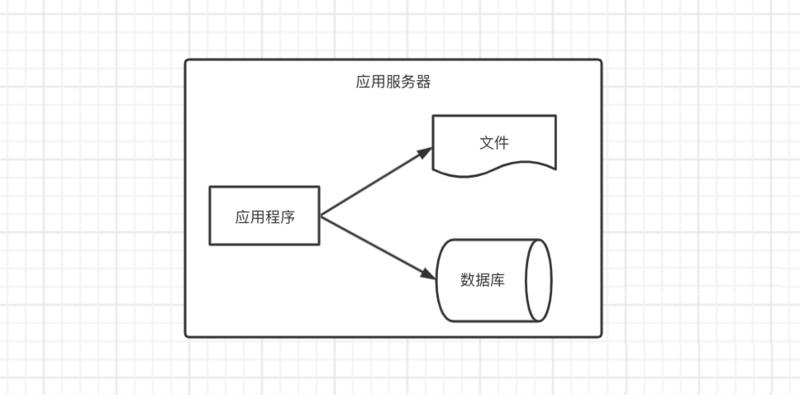
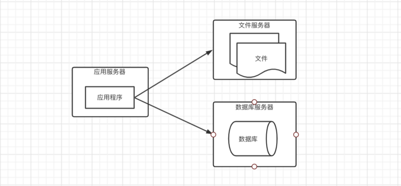
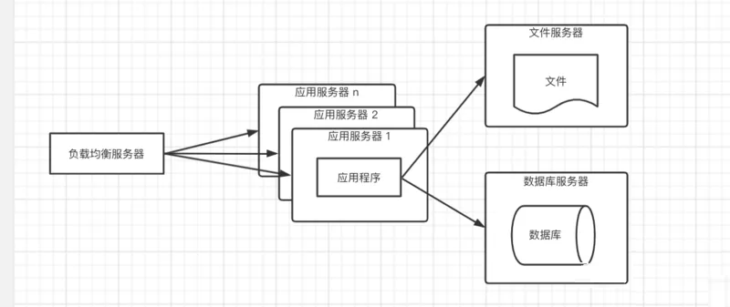
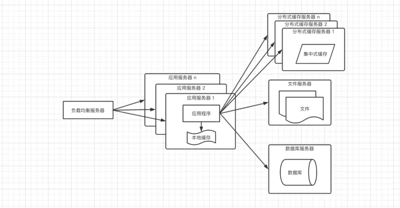
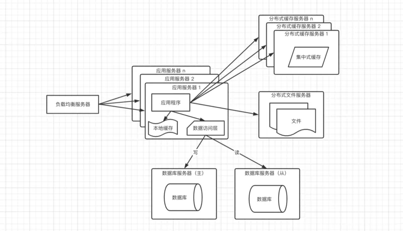
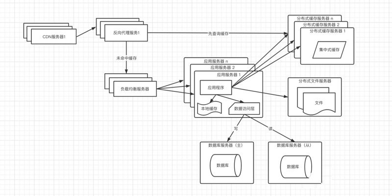
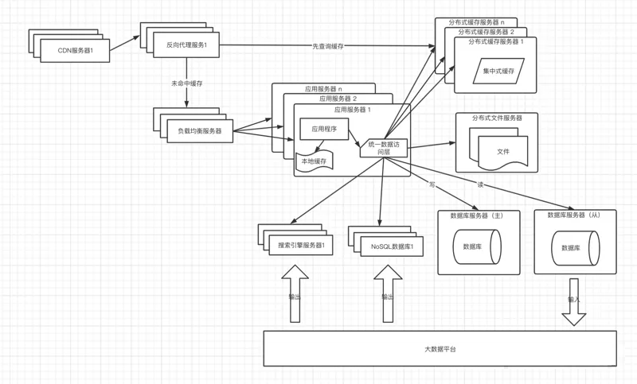
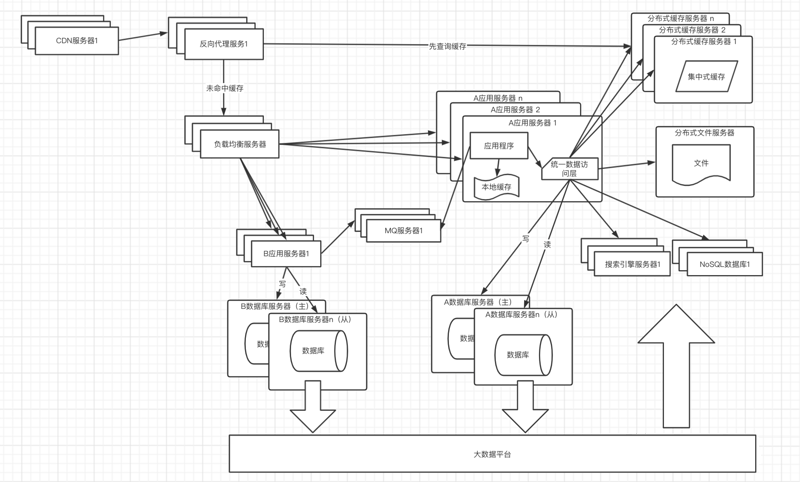

# The Development of App Architecture

The features of large applications: high availability, high concurrency and big data. High availability: system need to provide service without interruption. High concurrency: still stable under the big access. Big data: store and manage big data well.
<!--more-->

## 简单的架构

开始数据量少，所以只需一台服务器

应用程序、文件、数据库往往都部署在一台服务器上，应用程序部署在Tomcat服务器上，数据库可以使用MySQL

## 应用于数据服务分隔

随着业务越来越复杂，访问量越来越大，导致性能越来越差，存储空间严重不足，这时我们考虑把服务器增加到三台。分离出应用服务器、数据库服务器、文件服务器。

- 应用服务器需要处理大量的访问，所以需要性能更好的CPU
- 数据库服务器需要存储大量的数据以及快速的检索，所以需磁盘的检索速度较快以及存储空间大
- 文件服务器需要存储上传的文件，需要更大的磁盘；现在通常情况下会选择第三方的存储服务

## 应用服务器集群

在高并发、大流量的情况下，一台服务器是肯定处理不过来的，这个时候增加服务器，部署集群提供服务，来分担每台服务器的压力。部署集群的另一个好处是可伸缩性。比如双十一增加服务器分摊流量，双十一过后再减少服务器。

如果应用服务器是Tomcat，那么可以部署一个Tomcat的集群，外部在部署一个负载均衡器，可以采用随机、轮询或者一致性哈希算法达将用户的请求分发到不同应用服务集群；通常选择的免费的负载均衡是nginx。在这种架构下，应用服务器的负载将不会是整个应用的瓶颈点；

虽然应用程序的处理速度在这种架构下提升了许多，但是又会暴露一个问题，数据库的压力大大增大，导致访问响应延迟，影响整个应用的性能。这种架构还有个问题，通常应用是有状态的，需要记录用户的登录信息，如果每次用户的请求都是随机路由到后端的应用服务器，那么用户的会话将会丢失；解决这个问题两个方案：

- 采用一致性hash把用户的请求路由到同一个Tomcat，如果有一台服务器跪了，那么这台服务器上面的用户信息将会丢失
- Tomcat集群之间通过配置session复制，达到共享，此方案效率较低

## 缓存

根据二八原则，80%的的业务都是集中访问20%的数据，这20%的数据通常称为热点数据，但是这20%的数据占用的内存也不会小，如果每个应用服务器都存放一份，有些浪费存储空间，所以这时候需要考虑加入分布式缓存服务器（常用的是Redis）；当引入了分布式缓存服务器，再来看上面那个方案的问题，就可以解决了，把用户的会话存放到缓存服务器，不仅可以防止用户数据丢失，效率也不低；架构图如下：

由于分布式缓存服务器毕竟存放在远程，需要经过网络，所以取数据还是要花一点时间；本地缓存访问速度更快，但是内存空间有限，并且还会出现和应用程序争抢资源；所以这种架构搭配了分布式缓存和本地缓存，本地缓存存放少量常用热点数据，当本地缓存中没有命中时在去集中式缓存取

在引进缓存之后，数据库的访问压力可以的一定的缓解

## 数据库读写分离

虽然在加入了缓存之后，部分数据可以直接走缓存，不需要访问数据库，但是任然会有一些请求，会访问数据库，比如：缓存失效，缓存未命中；当流量大的时候，数据库的访问量也不小。这时候我们需要考虑搭建数据库集群，读写分离

当应用服务器有写操作时，访问主库，当应用程序有读操作时，访问从库；大多数的应用都是读的操作远远大于写的操作，所以可以配置数据库一主多从来分担数据库的压力；为了让应用程序对应主库和从库无感知，通常需要引入一些读写分离的框架做一个统一的数据访问模块。

这种架构通常需要警惕的一个问题是主从延迟，当在高并发的场景下，主库刚写成功，数据库还未成功同步完从库，这时候另一个请求进入读取数据发现不存在；解放方案是在应用程序中高并发的场景下设置强制走主库查询

## 反向代理和CDN

假如随着业务的不断扩大，全国各地都会使用到我们的应用，由于各地区的网络情况不同，所以有的人请求响应速度快，有的人请求响应速度慢，这会严重的影响到用户的体验。为了提高响应速度需要引入反向代理和CDN；CDN和反向代理都是采用的缓存，目的：

- 尽可能快的把数据呈现给用户
- 减轻后端服务器的压力

架构图如下：

CDN: 部署在网络提供商的机房，当用户来访问的时候，从距离用户最近的服务器返回数据，尽快呈现给用户；通常情况下在CDN中缓存的是静态资源（html,js,css），达到动静分离；但是有时候遇到了某些数据访问量特别大的时候，后端会生成静态资源放入到CDN，比如：商城的首页，每个用户进入都需要访问的页面，如果每次请求都进入到后端，那么服务器的压力肯定不小，这种情况下会把首页生成静态的文件缓存到cdn和反向代理服务器

反向代理：部署在应用的中心机房，通常也是缓存的静态资源，当用户通过CDN未请求到需要的数据时，先进入反向代理服务器，如果有缓存用户访问的数据，那么直接返回给用户；这里也有特殊情况，对于有些场景下的热点数据，在这里根据用户的请求去分布式缓存服务器中获取，能拿到就直接返回。

这种架构已经把缓存做到了4级

- 第一级：CDN 缓存静态资源
- 第二级：反向代理缓存静态资源以及部分热点数据
- 第三级：应用服务器的本地缓存
- 第四级：分布式缓存服务器

通常情况下经过了这4级缓存，能够进入到数据库的请求也不多了，很好的释放了数据库的压力

## 搜索引擎和NoSQL

随着业务的不断扩大，对于数据的存储和查询的需求也越来越复杂，通常情况我们需要引入非关系型数据库，比如搜索引擎和NoSQL数据库

有时候我们的查询场景很复杂，需要查询很多数据表，经过一系列的计算才能完成，这时候可以考虑通过数据同步工具（比如canal）拉去数据到大数据平台，使用批处理框架离线计算，把输出的结果存放到搜索引擎或者NoSQL数据库中，应用程序直接查询计算的结果返回给用户。也有可能我们需要汇总多个表的数据做一张宽表，方便应用程序查询

由于引入的数据存储方式增多，为了减轻应用程序的管理多个数据源的麻烦，需要封装统一数据访问模块，如果使用的时Java，可以考虑spring-data

## 业务纵向拆分

互联网公司通常的宗旨是小步迭代试错快跑，当业务发展到足够大，对于单体应用想要达到这个宗旨是有难度的，随着业务的发展，应用程序越来越大，研发、维护、发布的成本也越来越大，这时候就需要考虑根据业务把单体应用拆分为多个服务，服务之间可以通过RPC远程调用和消息队列来一起完成用户的请求。

由于业务的拆分，通常情况下也会相应的对数据库进行拆分，达到一个服务对应一个数据库的理想状态

引入MQ的好处：

- 提高系统的可用性：当消费服务器发送故障时，消息还在消息队列中，数据不会丢失
- 加快请求的响应：当用户请求到达服务器后，把请求中可以异步处理的数据放入到MQ，让系统逐一消费，不需要用户等待，加快了响应速度
- 削峰填谷：当大量请求都同时进入到系统之后，会全部放入到消息队列，系统逐一消费，不会对系统造成很大的冲击

## 总结

还有一个情况未谈及到，就是数据库的水平拆分，这也是数据库拆分的最后手段，只有当单表数据特别大，不能满足业务的需要才使用。使用最多的还是进行数据库的业务纵向拆分，把数据库中不同业务的数据放到不同的物理服务器上。

应用当前到底选择什么架构，一定要根据实际业务的需求进行灵活的选择，驱动技术架构发展的主要动力还是在于业务的发展，不要为了技术而技术。

